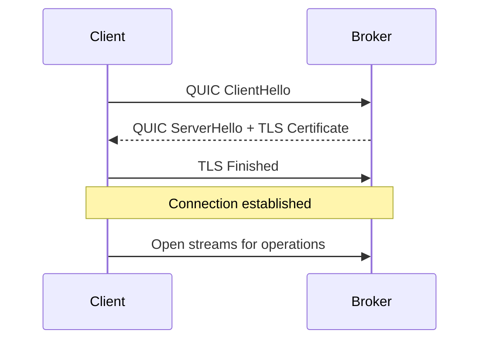
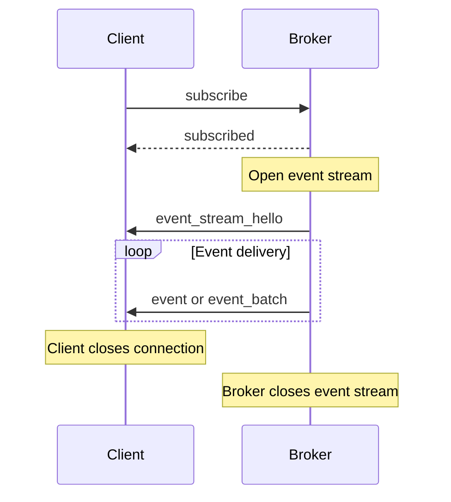

The broker's data-plane API: what each operation does on the wire, what it
returns, and how it fails. Message shapes are shown as JSON control messages;
the binary framing that carries the hot paths is in the
[wire protocol](/architecture/wire-protocol/).

## Connection Model

### QUIC Connection Lifecycle

Clients establish QUIC connections to the broker over TLS 1.3:



**Default broker endpoint**: `0.0.0.0:5000` (configurable via `quic_bind`)

The connection uses TLS 1.3, and the client always verifies the broker's
certificate. There is no switch to turn verification off.

### Connection Pooling

For optimal performance, clients should maintain connection pools:

```rust
// Rust client example
use felix_client::{Client, ClientConfig};
use std::net::SocketAddr;

let quinn = quinn::ClientConfig::with_platform_verifier();
let config = ClientConfig {
    event_conn_pool: 8,      // Pool for pub/sub operations
    cache_conn_pool: 8,      // Pool for cache operations
    ..ClientConfig::optimized_defaults(quinn)
};

let addr: SocketAddr = "127.0.0.1:5000".parse()?;
let client = Client::connect(addr, "localhost", config).await?;
```

Connection setup costs a TLS handshake, so the client keeps long-lived
pools and the hot paths never pay it. Pool sizes are workload-dependent;
start with the defaults and resize off a measurement.

## Authentication (Felix Tokens)

Brokers require a tenant-scoped Felix token for authorization. Tokens are obtained from the control plane using an upstream OIDC JWT.

**End-to-end flow**:
1. Obtain an OIDC token from your identity provider.
2. Exchange it for a Felix token via the control plane.
3. Connect to the broker and present `tenant_id + felix_token` in the auth frame.

**Broker validation**:
- Verifies the token signature using tenant JWKS from the control plane.
- Checks `iss = felix-auth`, `aud = felix-broker`, `exp/nbf`, and `tid` matches the connection tenant.
- Parses `perms` once and enforces per operation using wildcard matching.

If authentication fails, the broker rejects the connection or returns an unauthorized error for the operation.

## Publish Operations

The JSON `publish` and `publish_batch` messages below are the compatibility
path. Current clients publish with binary frames and fall back to JSON only
against a broker that did not advertise the frame they need. The binary forms
also carry a routing key, a request id for acks, and an idempotent producer's
sequence. See [Binary PublishBatch](https://github.com/GetFelix/felix/blob/main/docs/protocol.md#binary-publishbatch)
and the keyed, acked and idempotent variants after it in `docs/protocol.md`.

### Single Message Publish

Publish a single message to a stream.

**Request**:

```json
{
  "type": "publish",
  "tenant_id": "string",
  "namespace": "string",
  "stream": "string",
  "payload": "base64-encoded-bytes",
  "key": "base64-encoded-bytes",
  "request_id": 1,
  "ack": "none" | "per_message"
}
```

**Parameters**:

| Parameter | Type | Required | Description |
|-----------|------|----------|-------------|
| `tenant_id` | string | Yes | Tenant identifier (must exist in broker) |
| `namespace` | string | Yes | Namespace within tenant |
| `stream` | string | Yes | Target stream name |
| `payload` | base64 | Yes | Message payload (base64-encoded binary) |
| `key` | base64 | No | Routing key; picks the shard on a sharded stream |
| `request_id` | u64 | With an ack | Echoed in the answer |
| `ack` | enum | No | Acknowledgement mode (default: `none`) |

With `ack: "none"` the broker sends nothing back. With `per_message` it answers
once the publish is committed, or with the reason it was refused:

```json
{ "type": "publish_ok", "request_id": 1 }
```

```json
{
  "type": "publish_error",
  "request_id": 1,
  "message": "stream not found: tenant=acme namespace=prod stream=events",
  "code": "not_found",
  "retry": "retry_after",
  "detail": null
}
```

`code`, `retry` and `detail` are sent only to a client that offered
`FEATURE_ERROR_CODES`. See [Error Handling](#error-handling).

**Example usage**:

```rust
use felix_client::{Client, ClientConfig};
use felix_client::AckMode;
use std::net::SocketAddr;

let quinn = quinn::ClientConfig::with_platform_verifier();
let config = ClientConfig::optimized_defaults(quinn);
let addr: SocketAddr = "127.0.0.1:5000".parse()?;
let client = Client::connect(addr, "localhost", config).await?;
let publisher = client.publisher().await?;

// Fire-and-forget publish
publisher
    .publish("acme", "prod", "events", b"Hello Felix".to_vec(), AckMode::None)
    .await?;

// With acknowledgement
publisher
    .publish(
        "acme",
        "prod",
        "events",
        b"Important message".to_vec(),
        AckMode::PerMessage,
    )
    .await?;
```

Every message costs a frame of its own, so batch when throughput matters.
Measured numbers are on the [Benchmarks](/features/benchmarks/) page.

### Batch Publish

Publish multiple messages in a single operation.

**Request**:

```json
{
  "type": "publish_batch",
  "tenant_id": "string",
  "namespace": "string",
  "stream": "string",
  "payloads": ["base64-1", "base64-2", "base64-n"],
  "ack": "none" | "per_batch"
}
```

**Parameters**:

| Parameter | Type | Required | Description |
|-----------|------|----------|-------------|
| `tenant_id` | string | Yes | Tenant identifier |
| `namespace` | string | Yes | Namespace within tenant |
| `stream` | string | Yes | Target stream name |
| `payloads` | array | Yes | Array of base64-encoded payloads |
| `ack` | enum | No | Acknowledgement mode (default: `none`) |

With `ack: "per_batch"` and a `request_id`, the answer is one `publish_ok` or
`publish_error` for the whole batch, shaped as above.

**Example usage**:

```rust
let messages = vec![
    b"Event 1".to_vec(),
    b"Event 2".to_vec(),
    b"Event 3".to_vec(),
];

use felix_client::AckMode;
let publisher = client.publisher().await?;
publisher
    .publish_batch("acme", "prod", "events", messages, AckMode::PerBatch)
    .await?;
```

Larger batches raise throughput and add latency. See
[Benchmarks](/features/benchmarks/) for measured trade-offs.

### Binary Batch Publish

For maximum throughput, use binary encoding.

**Frame flags**: Set bit 0 (`flags | 0x0001`)

**Binary format**:

```
[tenant_len: u16][tenant_id: bytes]
[namespace_len: u16][namespace: bytes]
[stream_len: u16][stream: bytes]
[count: u32]
[payload_1_len: u32][payload_1: bytes]
[payload_2_len: u32][payload_2: bytes]
...
```

**Example** (Rust client handles encoding automatically):

```rust
// Encode a batch directly as binary
let messages = vec![large_payload_1, large_payload_2, /* ... */];
let publisher = client.publisher().await?;
publisher
    .publish_batch_binary("acme", "prod", "stream", &messages)
    .await?;
```

The Rust client uses this frame for every publish once the broker advertises
it, so `publish` and `publish_batch` already take this path.

### Publish Pipeline Configuration

Broker-side tuning for publish pipeline:

```yaml
# Broker config.yml
pub_workers_per_conn: 4        # Workers per connection
pub_queue_depth: 64             # Publish queue bound
publish_queue_wait_timeout_ms: 2000  # Queue full timeout
```

**Worker sizing**:

```
pub_workers_per_conn ≤ active_publish_streams
```

Over-sizing workers creates contention without benefit.

## Subscribe Operations

### Creating a Subscription

Subscribe to a stream to receive events.

**Request**:

```json
{
  "type": "subscribe",
  "tenant_id": "string",
  "namespace": "string",
  "stream": "string",
  "subscription_id": 7,
  "start": "latest" | "earliest" | { "offset": 1200 },
  "shard": 0
}
```

`start` defaults to `latest`. `earliest` means the oldest record retained, and
`{"offset": n}` resumes at offset `n` on a durable stream. `shard` defaults to 0,
and a subscription reads one shard. An offset the broker cannot serve is
answered with `subscribe_cursor_error` (`too_old` or `in_future`) instead of a
silent restart at the tail.

**Response**:

```json
{ "type": "subscribed", "subscription_id": 7, "start_offset": 1200, "live_offset": 1350 }
```

`start_offset` is the first offset delivered and `live_offset` is the stream's
tail when the subscriber was registered. Both are sent only for a subscribe with
a `start`, on a durable stream, to a client that negotiated
`FLAG_EVENT_BATCH_OFFSETS`.

**Broker behavior**:

1. Broker validates tenant/namespace/stream
2. Broker sends `subscribed` on control stream
3. Broker opens new unidirectional stream for events
4. Broker sends `event_stream_hello` as first frame on event stream
5. Broker begins streaming events

**Example usage**:

```rust
let mut subscription = client.subscribe("acme", "prod", "events").await?;

// Receive events
while let Some(event) = subscription.next_event().await? {
    println!("Received: {:?}", event.payload);
}
```

### Receiving Events

Events arrive on a dedicated unidirectional stream per subscription.

**Event frame**:

```json
{
  "type": "event",
  "tenant_id": "acme",
  "namespace": "prod",
  "stream": "events",
  "payload": "base64-encoded-bytes",
  "offset": 1200
}
```

`offset` is present on durable streams only.

**Event batch frame**:

```json
{
  "type": "event_batch",
  "tenant_id": "acme",
  "namespace": "prod",
  "stream": "events",
  "payloads": ["base64-1", "base64-2", "base64-n"]
}
```

In practice events arrive in binary batches. With `FLAG_EVENT_BATCH_OFFSETS`
negotiated, each batch starts with a `base_offset`, and event `i` sits at
`base_offset + i`. A gap between batches means the subscriber's queue dropped
events. With `FLAG_EVENT_BATCH_SKIPPED` as well, a batch also carries
`skipped_before`, the count of offsets before it that hold no event, so a gap
can be told apart from a record that was never an event. See
[Event batch offsets](https://github.com/GetFelix/felix/blob/main/docs/protocol.md#event-batch-offsets).

#### Who published an event

A subscriber that offers `FLAG_EVENT_BATCH_PUBLISHER` (`0x2000`) is told the
principal that published each batch: the `sub` of the token the broker
accepted the write from. A consumer that offers `FEATURE_GROUP_PUBLISHER` gets
the same value as `publisher` on each group record. Nobody else's frames
change.

It proves that the broker accepted the write from a connection authenticated
as that principal, with permission to publish to the stream. It does not say
who wrote the payload's contents. An in-memory stream reports the publishing
connection's principal. A durable stream reports what it stored with the
record, so live delivery, replay from any offset, a promoted replica and a
consumer group agree, and it stores one only once enabled: by finalizing the
`publisher_principal` fleet feature in a cluster, or with
`FELIX_RECORD_PUBLISHERS=true` on a single broker. See
[Event batch publisher](https://github.com/GetFelix/felix/blob/main/docs/protocol.md#event-batch-publisher).

**Event stream lifecycle**:



### Subscription Configuration

Client-side configuration:

```rust
let quinn = quinn::ClientConfig::with_platform_verifier();
let config = ClientConfig {
    event_conn_pool: 8,              // Connection pool size
    event_router_max_pending: 1024,  // Max pending events in client router
    ..ClientConfig::optimized_defaults(quinn)
};
```

Broker-side configuration:

```yaml
subscriber_queue_capacity: 512       # Per-subscriber broker-core buffer
subscriber_writer_lanes: 4           # Outbound writer lanes
subscriber_lane_queue_depth: 64      # Per-lane queue depth
max_subscriber_writer_lanes: 8       # Safety clamp
subscriber_lane_shard: auto          # auto|subscriber_id_hash|connection_id_hash|round_robin_pin
event_batch_max_events: 64           # Max events per batch
event_batch_max_bytes: 65536         # Max batch size (64 KB)
event_batch_max_delay_us: 250        # Max batching delay under load (250 µs)
```

**Batching trade-offs**:

| Parameter | Effect on Latency | Effect on Throughput |
|-----------|-------------------|---------------------|
| Increase `max_events` | Higher | Higher |
| Increase `max_delay_us` | Higher | Higher |
| Decrease `max_events` | Lower | Lower |
| Decrease `max_delay_us` | Lower | Lower |

### Multiple Subscriptions

Clients can maintain multiple concurrent subscriptions:

```rust
// Subscribe to multiple streams
let mut sub1 = client.subscribe("acme", "prod", "orders").await?;
let mut sub2 = client.subscribe("acme", "prod", "inventory").await?;
let mut sub3 = client.subscribe("acme", "staging", "logs").await?;

// Process events from all subscriptions concurrently
tokio::select! {
    Ok(Some(event)) = sub1.next_event() => handle_order(event),
    Ok(Some(event)) = sub2.next_event() => handle_inventory(event),
    Ok(Some(event)) = sub3.next_event() => handle_log(event),
}
```

Each subscription gets:
- Independent event stream
- Independent buffer
- Independent flow control

### Subscription Isolation

Slow subscribers don't affect fast subscribers:

```rust
// Fast subscriber
let mut fast_sub = client.subscribe("acme", "prod", "stream").await?;
tokio::spawn(async move {
    while let Ok(Some(event)) = fast_sub.next_event().await {
        process_quickly(event).await;  // ~1ms processing
    }
});

// Slow subscriber
let mut slow_sub = client.subscribe("acme", "prod", "stream").await?;
tokio::spawn(async move {
    while let Ok(Some(event)) = slow_sub.next_event().await {
        process_slowly(event).await;  // ~100ms processing
    }
});

// Fast subscriber continues at full rate even if slow subscriber falls behind
```

## Cache Operations

### Cache Put

Store a key-value pair with optional TTL.

**Request**:

```json
{
  "type": "cache_put",
  "tenant_id": "acme",
  "namespace": "prod",
  "cache": "sessions",
  "request_id": 1,
  "key": "string",
  "value": "base64-encoded-bytes",
  "ttl_ms": number | null
}
```

**Parameters**:

| Parameter | Type | Required | Description |
|-----------|------|----------|-------------|
| `tenant_id`, `namespace`, `cache` | string | Yes | Which cache |
| `request_id` | u64 | Yes | Client-provided correlation ID |
| `key` | string | Yes | Cache key |
| `value` | base64 | Yes | Value to store (base64-encoded) |
| `ttl_ms` | number | No | Time-to-live in milliseconds (null = no expiration) |

**Response**:

```json
{ "type": "cache_ok", "request_id": 1 }
```

**Example usage**:

```rust
// Store session with 1-hour TTL
use bytes::Bytes;
client
    .cache_put(
        "acme",
        "prod",
        "sessions",
        session_id,
        Bytes::from(session_data),
        Some(3600_000),
    )
    .await?;

// Store config without expiration
client
    .cache_put(
        "acme",
        "prod",
        "config",
        "app-settings",
        Bytes::from(config_data),
        None,
    )
    .await?;
```

Measured latency and throughput are on the
[Benchmarks](/features/benchmarks/) page.

### Cache Get

Retrieve a value from the cache.

**Request**:

```json
{
  "type": "cache_get",
  "request_id": "unique-id",
  "key": "string"
}
```

**Response**:

```json
{
  "type": "cache_value",
  "request_id": "unique-id",
  "key": "string",
  "value": "base64-encoded-bytes" | null
}
```

**Value is null when**:
- Key doesn't exist
- Key has expired (TTL elapsed)
- Key was evicted under memory pressure

**Example usage**:

```rust
match client.cache_get("acme", "prod", "sessions", session_id).await? {
    Some(session_data) => validate_session(session_data)?,
    None => anyhow::bail!("session expired or unknown"),
}
```

On a replicated `Quorum` cache, the broker confirms it still leads the shard
before answering a get. `FELIX_QUORUM_READS` picks how: `majority` (the default)
runs a round its replicas answer, and `lease` trusts the lease instead. Before
the fleet has finalized `lease_free_reads`, every read uses the lease.

### Cache Delete

Remove a key, and find out whether it was there.

**Request**:

```json
{
  "type": "cache_delete",
  "request_id": "unique-id",
  "tenant_id": "acme",
  "namespace": "prod",
  "cache": "sessions",
  "key": "string"
}
```

**Response**: a `cache_value` carrying **the value that was removed**, or a null
value if the key was not there. A caller can tell a delete that did something
from one that did not.

Sent only to a broker that advertised `FEATURE_CACHE_DELETE`. A delete is an
append like a put: it writes a tombstone record carrying the key, and compaction
reclaims it along with the superseded values later.

```rust
match client.cache_delete("acme", "prod", "sessions", session_id).await? {
    Some(removed) => audit_log(session_id, removed),
    None => { /* already gone, or never there */ }
}
```

### Cache Request Pipelining

Cache streams support pipelining multiple requests:

```rust
// Three requests in flight at once on the client's cache streams
let (val1, val2, val3) = tokio::join!(
    client.cache_get("acme", "prod", "config", "key1"),
    client.cache_get("acme", "prod", "config", "key2"),
    client.cache_get("acme", "prod", "config", "key3"),
);
```

Pipelining hides the round trip, so concurrent requests finish sooner than
the same requests sent one after another.

**Request_id requirement**:

Each request must have a unique `request_id` within a stream. The broker may respond out of order; clients use `request_id` to correlate responses.

### Cache Stream Pooling

For high-concurrency cache workloads, use stream pooling:

```yaml
# Client config
cache_conn_pool: 8                # Number of connections
cache_streams_per_conn: 4         # Streams per connection
# Total concurrent cache operations: 8 × 4 = 32
```

More streams allow more requests in flight. See
[Benchmarks](/features/benchmarks/) for measured numbers.

### Cache Configuration

Broker-side cache tuning. Cache requests arrive on the same listener as
publishes, so the receive windows are the publish ones:

```yaml
pub_conn_recv_window: 16777216       # 16 MiB per connection
pub_stream_recv_window: 16777216     # 16 MiB per stream
cache_send_window: 268435456         # 256 MiB send window
```

## Consumer Group Operations

The third way to read a stream. Where `subscribe` pushes every record to every
subscriber, a **consumer group** hands each record to one consumer and takes it
back if nobody says it was handled. See
[Queues](/features/queues/) for the semantics.

Every request below goes **only to the broker that leads the shard**, and only
to one that advertised `FEATURE_CONSUMER_GROUP`. A poll is refused rather than
forwarded: relaying would put the claim and the acknowledgement on different
brokers, and a queue's whole promise is that one consumer holds a record at a
time.

They travel on the control stream.

### Group Poll

Claim records to work on.

**Request**:

```json
{
  "type": "group_poll",
  "tenant_id": "acme", "namespace": "prod", "stream": "jobs",
  "shard": 0, "group": "fulfilment",
  "max_records": 32, "wait_ms": 5000,
  "request_id": 1
}
```

**Response**:

```json
{
  "type": "group_records",
  "records": [{ "offset": 41, "payload": "base64-encoded-bytes", "attempts": 1 }],
  "request_id": 1
}
```

`wait_ms` is how long the broker may hold the request open waiting for work, so
an idle consumer costs one open request rather than a round trip per attempt.
The broker caps it at `FELIX_GROUP_MAX_WAIT_MS`. An empty `records` after the
wait means nothing was available, and is not an error. That includes a group at its in-flight cap (`FELIX_GROUP_MAX_IN_FLIGHT`): it gets
nothing more until some of what it holds is acknowledged, handed back or lapses.

`attempts` counts deliveries including this one, so `1` is a first attempt and
anything higher is a redelivery. Absent means the broker did not report it,
which is *not* the same as a first attempt.

### Group Ack / Nack

```json
{ "type": "group_ack",  "tenant_id": "acme", "namespace": "prod", "stream": "jobs",
  "shard": 0, "group": "fulfilment", "offset": 41, "request_id": 2 }
{ "type": "group_nack", "...": "same shape" }
```

An **ack** finishes a record. A **nack** hands it back for immediate
redelivery, rather than waiting out the visibility timeout.

A record that is neither is redelivered once
`FELIX_GROUP_VISIBILITY_TIMEOUT_MS` (30s) lapses. The group's cursor advances
only over a **contiguous run** of acks: acknowledging offset 42 while 41 is
still in flight leaves the cursor at 41, which is what makes it safe to restart
from.

What a group has handed out is kept in memory. After a move or a failover, or
once an idle group's state is dropped, the new state still takes an ack or
nack for a claim made before it: anything below the log tail it first saw.
An offset written after that and not yet handed out is answered `stale_claim`
(retryable): nothing was applied and the record comes round.

### Dead Letters

Past `FELIX_GROUP_MAX_ATTEMPTS` (5) a record is dead-lettered, so one poison
record cannot stall the queue behind it.

```json
{ "type": "group_dead_letters", "...": "scope", "request_id": 3 }
{ "type": "group_dead_letter_list", "offsets": [37], "request_id": 3 }
{ "type": "group_discard", "...": "scope", "offset": 37, "request_id": 4 }
{ "type": "group_redrive", "...": "scope", "offset": 37, "request_id": 5 }
```

Sent only to a broker that advertised `FEATURE_GROUP_DEAD_LETTERS`, a separate
bit from `FEATURE_CONSUMER_GROUP`.

A dead letter is a pointer to the record, not a copy of it. The record is still in the stream's
log at that offset, readable by an ordinary replay. `group_discard` drops it
from the list; `group_redrive` puts it back in play.

**Example**:

```rust
let records = client
    .group_poll_wait("acme", "prod", "jobs", 0, "fulfilment", 32, Duration::from_secs(5))
    .await?;

for record in records {
    match handle(&record.payload) {
        Ok(()) => client.group_ack("acme", "prod", "jobs", 0, "fulfilment", record.offset).await?,
        Err(_) => client.group_nack("acme", "prod", "jobs", 0, "fulfilment", record.offset).await?,
    }
}
```

### Requirements

Consumer groups need **durable storage**. A broker started without
`FELIX_DURABLE_STORAGE_DIR` serves no groups and does not advertise the feature.
A group that forgot its position on restart would redeliver everything it had
already finished, which is worse than not offering queues at all.

## Cluster Operations

A broker in a cluster supports the four messages below that a standalone one
does not, each gated by a feature bit it advertises during the handshake. A
client must not send one to a broker that did not advertise it. Unless both
sides negotiated `FEATURE_UNSUPPORTED`, an unrecognised message type closes the
stream, so probing costs the connection.

### Topology

```json
{ "type": "topology" }
{ "type": "topology_view", "brokers": [{ "node_id": "broker-1", "addr": "..." }] }
```

Which brokers a client may connect to. Gated by `FEATURE_TOPOLOGY`. An empty
list is not an error. It means the cluster has told this broker of no
client-reachable address, which is the normal answer on a single node.

### Redirects

```json
{ "type": "not_leader", "node_id": "broker-2", "addr": "...", "generation": 7 }
```

A **subscribe** sent to a broker that does not own the shard is answered with
this, naming the one that does. Gated by `FEATURE_REDIRECT`, and sent only to a
client that offered the bit. Everyone else gets an ordinary `error`, because a
client that cannot decode `not_leader` must not be sent one.

The client should reconnect to the named broker. A **publish** to the wrong
broker is *forwarded* instead and needs nothing from the client.

### Stream Shards

```json
{ "type": "stream_shards", "tenant_id": "acme", "namespace": "prod",
  "stream": "orders", "request_id": 1 }
{ "type": "stream_shards_view", "shards": 4, "request_id": 1,
  "routing": "jump_hash" }
```

How many shards a stream was placed with, and how it maps routing keys onto
them. Gated by `FEATURE_STREAM_SHARDS`. `routing` is sent only for a stream
created with jump-hash routing; absent means `modulo`. A client that computes
a key's shard itself must use the stream's own mapping.

A subscription reads **one shard**, so a client consuming a whole stream needs
this to know how many to open; nothing else on the wire says. `0` means the
broker knows nothing of that stream. It does not mean one shard: a client that
rounded it up would read shard 0 and call it the stream.

### Cache Shards

```json
{ "type": "cache_shards", "tenant_id": "acme", "namespace": "prod",
  "cache": "sessions", "request_id": 2 }
{ "type": "cache_shards_view", "shards": 4, "request_id": 2 }
```

How many shards a cache was placed with. Gated by `FEATURE_CACHE_SHARDS`.

A prefix watch reads **one shard**, so watching a prefix across a whole cache
means one `cache_watch` per shard. `0` means the broker knows nothing of that
cache.

### Shard Owners

```json
{ "type": "shard_owners", "tenant_id": "acme", "namespace": "prod",
  "name": "orders", "kind": "stream", "request_id": 3 }
{ "type": "shard_owners_view", "request_id": 3, "owners": [
  { "shard": 0, "node_id": "broker-2", "addr": "10.0.0.6:5000", "generation": 4 },
  { "shard": 1, "generation": 0, "unavailable": "not_assigned" } ] }
```

Which broker owns each shard of a stream or cache (`kind` is `stream` or
`cache`). Gated by `FEATURE_SHARD_OWNERS`. A shard nobody can serve right now
has no `node_id` and says why in `unavailable`. A broker not in a cluster
answers one shard with no `node_id`. `Client::shard_owners` asks it.

`ClusterClient::subscribe_sharded` does all of this for you: it asks, opens one
subscription per shard, and follows each shard's own redirect.

## Other Messages

The control stream carries more than this page walks through. Each is
specified in [`docs/protocol.md`](https://github.com/GetFelix/felix/blob/main/docs/protocol.md):

| Message | What it does |
| --- | --- |
| `auth` / `auth_ok` | The first round trip on every control stream. The client offers `client_flags` and features, and the broker answers with `server_flags`, `server_features` and, when granted, a `publish_window`. |
| `subscribe_cursor_error` | A subscribe asked for an offset the broker cannot serve: `too_old` (retention removed it) or `in_future`. |
| `shard_moved` | The last frame on a subscription's or cache watch's event stream when its shard moved, with where to resume. Sent only with `FEATURE_SHARD_MOVED`. |
| `subscription_lagged` | The last frame on a durable-stream subscription whose queue on the broker dropped records, with the offset to resume from. Sent only with `FEATURE_SUBSCRIPTION_LAGGED`. |
| `cache_watch` | Watch a cache key or prefix: current values, then every change. |
| `counter_add` / `counter_get` | Add to and read a cache's counters. |
| `producer_init` / `publish_idempotent` | Take a producer id and publish numbered batches that land once when re-sent. |
| `unsupported` | The answer to a request type the broker does not know, when both sides negotiated `FEATURE_UNSUPPORTED`. |

## HTTP Endpoints

Besides QUIC, each broker serves plain HTTP on its metrics listener
(`FELIX_BROKER_METRICS_BIND`, `0.0.0.0:8080` by default): `/metrics`, `/live`,
`/ready`, `/replication/halted` (see
[Observability](/features/observability/)) and the one below. The
listener has no authentication, so everything on it is read-only.

### Backup Offsets

```bash
curl -s http://broker-1:8080/backup/offsets | jq
```

```json
{
  "node_id": "broker-1",
  "shards": [
    { "tenant_id": "t1", "namespace": "ns", "name": "orders", "shard": 0,
      "kind": "stream", "generation": 7,
      "logs": { "records": 918233, "group_cursors": 12, "group_dead_letters": 0 } },
    { "tenant_id": "t1", "namespace": "ns", "name": "prices", "shard": 0,
      "kind": "cache", "generation": 3,
      "logs": { "records": 44120, "counters": 310 } }
  ],
  "skipped": [
    { "tenant_id": "t1", "namespace": "ns", "name": "orders", "shard": 3,
      "kind": "stream", "reason": "settling" }
  ]
}
```

Every shard this broker leads, with the committed offset of each of its logs:
one past the last record a reader may see. For a `Quorum` shard that is the
quorum mark, never past what the leader itself has made durable; for anything
else, what the leader has acknowledged. A log the broker does not keep for that
shard is left out. The group and dead-letter offsets are read before the
records', so neither names a record past the records offset. `generation` is
the leadership the offsets belong to.

A shard this broker leads but has no committed answer for is under `skipped`,
with a `reason`: `settling` (just taken, no quorum mark yet), `refused` (it
no longer serves the shard, or its lease lapsed on a shard whose readers still
need it; with `lease_free_reads` finalized a replicated `Quorum` shard does
not), `moved` (its leadership changed
while it was read), `error` (with a `detail`), or `not_durable` (an in-memory
stream, with nothing on disk to back up). All but the last are worth asking
again shortly. A broker with no cluster leads nothing and answers with empty
lists.

`felix-controlplane admin backup-point` is what reads this; see
[Backup and restore](/deployment/backup-and-restore/).

## Error Handling

### Error Response Format

```json
{
  "type": "error",
  "message": "Descriptive error message",
  "code": "shard_unavailable",
  "retry": "retry",
  "detail": { "reason": "not_ready" }
}
```

`code`, `retry` and `detail` are sent only to a client that offered
`FEATURE_ERROR_CODES` in `auth`; other clients get `type` and `message` alone.
A publish is `not_found` only when its stream does not exist; one refused
because its shard cannot be served right now is `shard_unavailable`, with the
reason in `detail`, and is safe to retry.
`publish_error` carries the same fields next to its `request_id`. The `retry`
class says whether the request may have been applied (`outcome_unknown`) or
certainly was not (`retry`, `retry_after`, `redirect`), and an unknown `code`
must be tolerated. The full table is in `docs/protocol.md` under "Error codes".

### Common Errors

**Unknown stream**:

```json
{
  "type": "publish_error",
  "request_id": 1,
  "message": "stream not found: tenant=acme namespace=prod stream=events",
  "code": "not_found",
  "retry": "retry_after"
}
```

The stream does not exist on this broker. Brokers learn streams from the
control plane, so a stream created a moment ago can answer this until the
broker's next sync. Retry after a short wait, and check the stream exists if it
persists.

**Publish queue full**:

```json
{
  "type": "error",
  "message": "publish queue full; retry in 10 ms",
  "code": "overloaded",
  "retry": "retry_after",
  "detail": { "reason": "publish_queue_full", "retry_after_ms": 10 }
}
```

**Resolution**: The broker's publish queue had no room for this tenant, and
nothing was queued; retry after the suggested wait. Persistent refusals mean the
broker is overloaded, or this tenant is sending more than its share: check
`felix_tenant_publish_queue_full_total` by tenant, reduce the publish rate, or
raise `pub_queue_depth`.

**Authorization failure**:

```json
{
  "type": "publish_error",
  "request_id": 1,
  "message": "forbidden",
  "code": "forbidden",
  "retry": "fatal"
}
```

Publish, subscribe and cache operations each check a permission against the
tenant-scoped token. A **forwarded** publish is authorized twice (at the broker
the client reached and again at the shard's owner), so routing does not launder
a credential.

### Connection Errors

QUIC connection errors are surfaced as connection-level failures:

- **Certificate validation failure**: TLS handshake error
- **Connection timeout**: No response within the QUIC idle timeout (6 s by
  default, `FELIX_MAX_IDLE_TIMEOUT_MS`)
- **Connection reset**: Broker restart or network issue

**Retry logic**:

Branch on the error's retry class. A `BrokerError` is recovered from the
`anyhow::Error` with `downcast_ref`. Only `retry`, `retry_after` and `redirect`
say nothing was applied. `outcome_unknown` may have landed, so re-sending it is
safe only through an idempotent producer.

```rust
use felix_client::{BrokerError, Client, RetryClass};
use felix_client::AckMode;
use std::time::Duration;

async fn publish_with_retry(client: &Client, data: &[u8], retries: u32) -> anyhow::Result<()> {
    let publisher = client.publisher().await?;
    for attempt in 0..retries {
        let err = match publisher
            .publish("acme", "prod", "events", data.to_vec(), AckMode::PerMessage)
            .await
        {
            Ok(()) => return Ok(()),
            Err(err) => err,
        };
        match err.downcast_ref::<BrokerError>().map(|e| e.retry) {
            Some(RetryClass::Retry | RetryClass::RetryAfter) => {
                tokio::time::sleep(Duration::from_millis(100 * 2u64.pow(attempt))).await;
            }
            _ => return Err(err),
        }
    }
    anyhow::bail!("gave up after {retries} attempts")
}
```

## Performance Tuning

### Publish Performance

**Maximize throughput**:

```yaml
# Broker config
pub_workers_per_conn: 8
pub_queue_depth: 256
pub_inflight_bytes: 268435456
event_batch_max_events: 256
event_batch_max_delay_us: 2000
```

```rust
// Client: scale publish throughput via pools and sharding
use felix_client::PublishSharding;

let quinn = quinn::ClientConfig::with_platform_verifier();
let config = ClientConfig {
    publish_conn_pool: 8,
    publish_streams_per_conn: 4,
    publish_sharding: PublishSharding::HashStream,
    ..ClientConfig::optimized_defaults(quinn)
};
```

**Minimize latency**:

```yaml
# Broker config
pub_workers_per_conn: 2
event_batch_max_events: 8
event_batch_max_delay_us: 100
```

```rust
// Client: publish immediately
let publisher = client.publisher().await?;
publisher
    .publish("acme", "prod", "events", data.to_vec(), AckMode::PerMessage)
    .await?;
```

### Subscribe Performance

**High fanout tuning**:

```yaml
subscriber_queue_capacity: 4096   # Larger per-subscriber burst buffer
subscriber_writer_lanes: 4        # Start with 4, benchmark before increasing
subscriber_lane_shard: auto
fanout_batch_size: 128            # Batch fanout operations
event_batch_max_events: 128       # Larger event batches
```

**Low latency tuning**:

```yaml
subscriber_queue_capacity: 64
subscriber_writer_lanes: 2
subscriber_lane_shard: auto
event_batch_max_events: 8
event_batch_max_delay_us: 100
```

### Cache Performance

**High concurrency**:

```yaml
cache_conn_pool: 16
cache_streams_per_conn: 8
# Total: 128 concurrent operations
```

**Low latency**:

```yaml
cache_conn_pool: 4
cache_streams_per_conn: 2
cache_conn_recv_window: 134217728  # Smaller windows for lower memory
```

Change these knobs based on measurements. High queue depth means too few workers; contention
means too many; dropped events mean buffers too small for the workload's
bursts; high memory means the opposite. Broker telemetry and client metrics
(see [Observability](/features/observability/)) tell you which.
