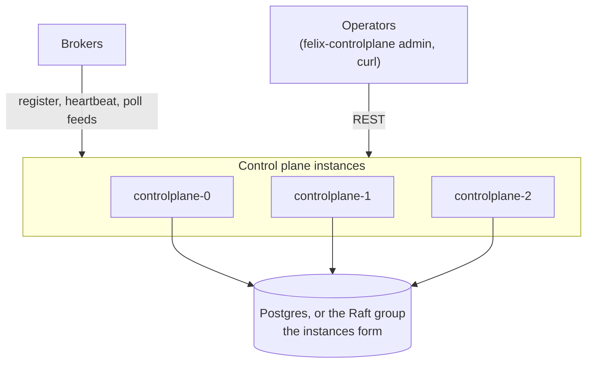

The control plane holds the cluster's metadata (tenants, namespaces,
streams, caches and nodes) behind a REST API, decides shard placement, and
publishes the assignment feed brokers follow. It is never on the data path.
This page documents its endpoints and how brokers and operators use them.

Every route is plain HTTP and JSON under `/v1`. The control plane also serves
its OpenAPI document at `/v1/openapi.json` and a Swagger UI at `/docs`.

## Authentication and Token Exchange (HTTP)

Felix uses upstream OIDC JWTs for authentication and exchanges them for tenant-scoped Felix tokens. Brokers validate Felix tokens locally.

### POST /v1/tenants/{tenant_id}/token/exchange

Exchange an upstream OIDC token for a Felix token.

**Request**:

```http
POST /v1/tenants/{tenant_id}/token/exchange
Authorization: Bearer <oidc_jwt>
Content-Type: application/json

{
  "requested": ["stream.publish", "stream.subscribe", "cache.read"],
  "resources": ["namespace:t1/payments", "stream:t1/payments/orders/*"]
}
```

**Response**:

```json
{
  "felix_token": "<jwt>",
  "expires_in": 900,
  "token_type": "Bearer",
  "refresh_token": "<opaque>",
  "refresh_expires_in": 2592000
}
```

`requested` and `resources` narrow the permissions RBAC grants and never widen
them. If nothing is left, the exchange returns `403`. `audience` picks who the
token is for: `felix-broker` (the default) or `felix-controlplane` for this
API. A token is accepted by one of the two, never both.

### POST /v1/tenants/{tenant_id}/token/refresh

Trade a refresh token for a new Felix token without going back to the IdP.

```http
POST /v1/tenants/{tenant_id}/token/refresh
Content-Type: application/json

{ "refresh_token": "<opaque>" }
```

The answer has the same shape as the exchange's. A refresh token is single-use:
each refresh returns its replacement. It lasts `FELIX_REFRESH_TOKEN_TTL_SECONDS`
(30 days by default). The token keeps the audience its exchange chose, and
naming a different `audience` is a `400`.

### Configuring Allowed IdPs

IdP allowlists are stored per tenant in the control plane database (`idp_issuers` table) and can be managed via the admin HTTP endpoints below (or directly in the store for tests/dev).

Required fields:
- `issuer` (iss)
- `audiences` (allowed `aud` values)
- `subject_claim` (default `sub`)
- optional `groups_claim`
- either `discovery_url` or `jwks_url`

### Admin API: IdP Issuers

IdP issuer admin endpoints require `tenant.manage` on `tenant:{tenant_id}`.
That is enough to add an issuer no other tenant trusts. Changing an existing
issuer's keys (`jwks_url`, `discovery_url`), `audiences` or `claim_mappings`,
registering an issuer another tenant already trusts, and deleting an issuer
also need `tenant.manage:cluster:*`, because those settings decide which
principals and groups the issuer's tokens become.

Create or update an issuer for a tenant:

```http
POST /v1/tenants/{tenant_id}/idp-issuers
Content-Type: application/json

{
  "issuer": "https://login.microsoftonline.com/<tenant>/v2.0",
  "audiences": ["api://felix-controlplane"],
  "discovery_url": null,
  "jwks_url": null,
  "claim_mappings": {
    "subject_claim": "sub",
    "groups_claim": "groups"
  }
}
```

Discovery and JWKS URLs must be `https` (plain `http` only on a loopback host,
unless `FELIX_CONTROLPLANE_OIDC_ALLOW_INSECURE_HTTP=true`), and the issuer must
not contain `#`.

Delete an issuer:

```http
DELETE /v1/tenants/{tenant_id}/idp-issuers/{issuer}
```

### Admin API: RBAC

RBAC endpoints are split by capability:

- `GET /v1/tenants/{tenant_id}/rbac/policies` -> requires `rbac.view`
- `GET /v1/tenants/{tenant_id}/rbac/groupings` -> requires `rbac.view`
- `POST /v1/tenants/{tenant_id}/rbac/policies` -> requires `rbac.policy.manage`
- `POST /v1/tenants/{tenant_id}/rbac/groupings` -> requires `rbac.assignment.manage`
- `DELETE /v1/tenants/{tenant_id}/rbac/policies` -> requires `rbac.policy.manage`
  (body: the rule, as for `POST`; `404` if absent)
- `DELETE /v1/tenants/{tenant_id}/rbac/groupings` -> requires `rbac.assignment.manage`
  (body: the grouping, as for `POST`; `404` if absent)

### Admin API: Refresh-token revocation and signing keys

Both require `tenant.manage` on `tenant:{tenant_id}`.

- `POST /v1/tenants/{tenant_id}/refresh-tokens/revoke` with
  `{"principal_id": "..."}` ends every refresh chain the principal holds.
- `GET /v1/tenants/{tenant_id}/signing-keys` lists the current key and the
  keys that only verify.
- `POST /v1/tenants/{tenant_id}/signing-keys` stages a new key: published, not
  signing.
- `POST /v1/tenants/{tenant_id}/signing-keys/{kid}/activate` makes it sign.
- `DELETE /v1/tenants/{tenant_id}/signing-keys/{kid}` retires a key that no
  longer signs (`409` for the current one).

The waits between the steps are in the auth design doc's rotation section.

Every admin endpoint needs a token minted with `"audience": "felix-controlplane"`.

Scope is enforced server-side. Callers can only mutate rules/assignments within
their own RBAC scope (tenant/namespace/stream/cache).

Canonical object grammar for RBAC policy payloads:
- `tenant:{tenant_id}`
- `namespace:{tenant_id}/{namespace}` or `namespace:{tenant_id}/*`
- `stream:{tenant_id}/{namespace}/{stream}` or `stream:{tenant_id}/{namespace}/*`
- `cache:{tenant_id}/{namespace}/{cache}` or `cache:{tenant_id}/{namespace}/*`
- `cluster:*`, the cluster itself; see [Cluster membership](#cluster-membership)

Rejected on write:
- `tenant:*`
- non-tenant-scoped wildcards such as `stream:*/*`
- `cluster:*` from any tenant-scoped caller, since no tenant scope contains it

### Cluster membership

`GET /v1/nodes` lists registered brokers; `GET /v1/nodes/{node_id}` fetches one.
Both require `node.view:cluster:*`.

```http
GET /v1/nodes?lifecycle=live&region=us-west-2&label=rack%3Da1
Authorization: Bearer <felix-token>
```

Filters intersect, and repeating `label` requires all of them. Each entry pairs
the node record with why it is or is not a placement candidate. `routable`
says whether brokers may still send it requests for the shards it leads: true
for a live or draining node whose heartbeat is inside the window.

```json
{ "items": [ { "node": { "node_id": "broker-1", "spec": { "advertise_addr": "10.0.0.4:7000", "region": "us-west-2" },
                         "status": { "lifecycle": "live", "incarnation": 3 } },
               "placement": { "eligible": false, "routable": false, "heartbeat_age_ms": 41200,
                              "reasons": ["last heartbeat was 41200ms ago, past the 15000ms timeout; expiry has not run yet"] } } ] }
```

A node's `spec` may also carry `client_addr`, the `host:port` Felix clients
connect to, and `kafka_addr`, the `host:port` Kafka clients are told to connect
to (present only on a broker running the Kafka listener; a hostname is
allowed, an IPv6 host must be bracketed). Both are omitted when unset.
It may also carry `zone`, the failure domain the broker registered from
`FELIX_NODE_ZONE`; placement spreads each shard's copies across zones. A broker
that sends none has no `zone` and is placed as if alone in its own. The zone
is read at registration only, so changing it means restarting the broker.

A node's `status` also carries `features`, the fleet features the broker
reported when it registered (omitted when none). `GET /v1/fleet/features`,
with the same permission, answers with the ones every live or draining broker
supports and the ones an operator has enabled:

```json
{ "supported": ["generation_start", "jump_hash_routing", "lease_free_reads", "majority_ack"],
  "enabled": [], "serving_nodes": 3 }
```

This build implements four features: `generation_start`, `majority_ack`,
`lease_free_reads` and `jump_hash_routing`.

Support turns nothing on. `POST /v1/fleet/features/{feature}/finalize`
(`node.manage:cluster:*`) enables a feature, and is refused with 409 unless
every live or draining broker supports it. With `?dry_run=true` it changes
nothing and answers whether it would be accepted:

```json
{ "feature": "jump_hash_routing", "dry_run": true, "enabled": false,
  "would_enable": false, "lacking": ["broker-3"], "serving_nodes": 3 }
```

Finalizing is one-way: after it, a broker that registers without the feature
is refused with 409 naming it. `felix-controlplane admin features` and
`admin features finalize <feature> [--dry-run]` drive the same routes. See
[Upgrades and compatibility](/felix/deployment/upgrades/).

`cluster:*` sits outside the tenant hierarchy and no tenant scope contains it,
so a tenant admin cannot grant themselves cluster access. The tenant comes from
the token's own `tid` claim rather than a path segment, and only selects which
signing keys to verify against.

`POST /v1/nodes/{node_id}/drain` marks a broker as leaving: it keeps serving,
and placement moves every shard it leads to brokers that are staying, one
handoff at a time. A shard being moved shows its destination as `successor`
and, once the leader has been told to stop, `"state": "draining"`.

`PATCH /v1/nodes/{node_id}` changes `region`, `labels` or `capacity`, and moves
`lifecycle` between `live` and `draining`. `{"lifecycle": "live"}` cancels a
drain. Nothing observed is patchable: a `down` or `left` broker is revived only
by registering, so a patch cannot claim a silent broker is alive.

`POST /v1/nodes/{node_id}/deregister` marks a broker `left`. Its heartbeats
stop renewing its lease, but what it leads is not handed on until the lease it
already holds has run out: placement treats it as draining until its last
heartbeat is older than the expiry timeout plus the regrant margin.

`DELETE /v1/nodes/{node_id}` removes a broker's record. It needs `node.manage`
on `cluster:*`, and is refused (409) while the broker is `live` or `draining`
or while any shard names it as leader or replica. See
[Adding, draining and removing brokers](/felix/deployment/scaling/).

The registration, heartbeat, drain, deregister and patch endpoints require
`node.manage` over the node being changed. A broker's credential is scoped to
`node:{its own id}`, so it cannot act for another broker; an operator holding
`cluster:*` can manage the whole fleet. Registration authorises the identity in
the request body, so a broker cannot claim a name its credential does not
cover.

### Shard moves and placement

What an operator uses to steer shard moves; the walk-through is
[Moving shards by hand](/felix/deployment/moving-shards/), and
`felix-controlplane admin` is a command-line client of these endpoints. Reads
take `node.view:cluster:*`; the rest take `node.manage:cluster:*`.

| Endpoint | What it does |
| --- | --- |
| `GET /v1/shard-moves` | moves and follower replacements in progress, and whether placement is paused |
| `GET /v1/placement/plan` | what the next placement pass would write, without writing it |
| `GET /v1/placement/replication` | each shard's copies on serving brokers (`current_replicas`) against its replication factor (`desired_replicas`), the members whose broker is not serving, the members whose leader has stopped shipping to them (`halted`: `node_id`, `reason`, `generation`, `since_millis`), and the copy being added by a restore; `?under_replicated=true` lists only the shards that are short |
| `POST /v1/shard-moves` | start moving a shard's leadership to a node |
| `DELETE /v1/shard-moves/{tenant_id}/{namespace}/{name}/{shard}` | cancel a shard's move; `?kind=cache` for a cache shard |
| `POST /v1/placement/pause`, `POST /v1/placement/resume` | stop and restart placement's own moves |
| `POST /v1/placement/abandon/{tenant_id}/{namespace}/{name}/{shard}` | give up a stranded durable shard's log and place the shard afresh. **This loses data**: records only the old leader held are gone, acknowledged ones included. 409 `not_stranded` if the leader is serving or a replica can take over |

```http
POST /v1/shard-moves
Authorization: Bearer <felix-token>
Content-Type: application/json

{ "tenant_id": "t1", "namespace": "ns", "stream": "orders", "shard": 0, "destination": "broker-3" }
```

```json
{ "step": "stage",
  "assignment": { "tenant_id": "t1", "namespace": "ns", "stream": "orders", "shard": 0, "kind": "stream",
                  "leader": "broker-1", "replicas": ["broker-3"], "generation": 12, "state": "active",
                  "successor": "broker-3", "move_started_at_millis": 1790000000000, "move_reason": "operator" } }
```

With `"dry_run": true` in the request the move is decided and answered but
not started, and the response carries `"dry_run": true`. When any broker the
shard may use reports a zone, the response also carries `zones_before` and
`zones_after`: the zones the shard's live copies span now and are expected to
span once the move cuts over, counting a broker without a zone as one of its
own. A move that narrows the spread is started anyway and logged as a
warning; see [Zones](https://github.com/GetFelix/felix/blob/main/docs/control-plane.md#zones).

A start is refused where placement would not make the move: 404
`unknown_shard` or `unknown_node`, or 409 `destination_not_live`,
`already_leader`, `at_capacity`, `already_moving`, `leader_unavailable` or
`move_limit`. A cancel answers `cancel` before the fence and `retake` after
it, when the leader that stopped serves again at a new generation; with no
move in progress it is 409 `not_moving`.

`GET /v1/shard-moves` lists each move's `step` (`staged`, `fenced`,
`replacing`, `restoring`), `reason` (`drain`, `balance`, `operator`,
`replace`, `restore`), start
time, and from the leader's latest report `lag_records`, `caught_up` and
`drained`. `GET /v1/placement/plan` lists each shard the next pass would act
on with its `action` (`place`, a move step, `waiting` or `unplaceable`) and
the assignment it would write or the reason it cannot.

### Tenants, namespaces, streams and caches

Every resource endpoint takes a Felix bearer token, checked before anything
else. A tenant that does not exist has no signing keys, so a request against
it answers `401` whatever the token says. A `404` would reveal whether the
tenant exists.

| Endpoint | Requires |
| --- | --- |
| `GET`/`POST /v1/tenants`, `DELETE /v1/tenants/{id}` | `tenant.manage:cluster:*` |
| `/v1/tenants/{t}/namespaces[/{ns}]` | `ns.manage` over `namespace:{t}/{ns}`, from a `t` token |
| `/v1/tenants/{t}/namespaces/{ns}/streams[/{s}]` | `stream.manage` over `stream:{t}/{ns}/{s}`, from a `t` token |
| `/v1/tenants/{t}/namespaces/{ns}/caches[/{c}]` | `cache.manage` over `cache:{t}/{ns}/{c}`, from a `t` token |
| `/v1/{tenants,namespaces,streams,caches}/{snapshot,changes}` | `node.view:cluster:*` |

```http
POST /v1/tenants/t1/namespaces/payments/streams
Authorization: Bearer <felix-token with stream.manage over stream:t1/payments/orders>
Content-Type: application/json

{ "stream": "orders", "kind": "Stream", "shards": 1, "replication_factor": 1,
  "retention": { "max_age_seconds": null, "max_size_bytes": null },
  "consistency": "Leader", "delivery": "AtLeastOnce", "durable": true }
```

`retention` bounds a durable stream's logs on every broker that holds one:
`max_size_bytes` per shard log, `max_age_seconds` by the newest record of each
segment. A bound left `null` is the broker's own (`FELIX_DURABLE_RETENTION_BYTES`,
`FELIX_DURABLE_RETENTION_SECONDS`), zero is refused, and a `PATCH` takes effect
without restarting a broker.

A stream may also name a `region`, such as `"region": "eu-west-1"`, and is
then placed only on brokers in that region or in one the control plane's
`FELIX_REGION_BRIDGES` bridges it to. That variable takes comma-separated
`source>dest` pairs, such as `eu-west-1>us-east-1`, and each pair allows one
direction only. The region is fixed at creation, an empty
one is refused with `400`, and omitting it places the stream anywhere. An
operator move to a broker outside the allowed regions is refused with `409`
and code `region_not_allowed`.

A stream also records how routing keys map to its shards, fixed at creation.
Omitted, `routing` is `"jump_hash"` (jump consistent hashing, which would move
only about `1/n` of the keys were a stream grown to `n` shards) once the fleet has
finalized `jump_hash_routing`, and `"modulo"` before. `"routing": "modulo"`
always works; `"routing": "jump_hash"` before the finalize is refused with
`409`. Finalizing never changes an existing stream, so no live stream's keys
move. Stream answers and shard assignments omit `routing` when it is
`modulo`.

A cache takes `consistency` the same way, `"Leader"` when omitted. Under
`"Quorum"`, puts, deletes and counter adds are acknowledged only once a
majority of the shard's replicas hold them. How gets confirm the leader is set
by the broker's `FELIX_QUORUM_READS`.

```http
POST /v1/tenants/t1/namespaces/payments/caches
Content-Type: application/json

{ "cache": "sessions", "display_name": "Sessions", "shards": 4,
  "replication_factor": 3, "consistency": "Quorum" }
```

A tenant admin's token already carries the manage actions: exchange expands
`tenant.manage:tenant:t1` to `ns.manage:namespace:t1/*`,
`stream.manage:stream:t1/*/*` and `cache.manage:cache:t1/*/*`. Listings return
only what the caller could manage.

Listings are paged. `limit` is 1 to 10000, default 1000; a response with more
to come carries `next_cursor`, which goes back as `cursor` for the next page.
This applies to tenants, namespaces, streams, caches, `/v1/nodes` and
`/v1/shard-assignments`. The RBAC policy and grouping listings answer with the
full bare array when neither parameter is given, and with
`{ "items": [...], "next_cursor": ... }` when either is.

```http
GET /v1/tenants/t1/namespaces/payments/streams?limit=100&cursor=InMyIg
```

The tenant catalog (which tenants exist) is cluster metadata, so creating,
listing and deleting tenants takes the same kind of operator credential as
managing the fleet, and deleting is operator-only even for the tenant's own
admin. The feeds are what brokers seed from, and take the broker's own
credential (`FELIX_NODE_TOKEN`), the same one that reads the shard-assignment
watch. An operator credential comes out of bootstrap the same way a broker's
does: a policy granting the cluster actions to a role, and an exchange.

### Internal Bootstrap API (Day-0)

Used once per tenant to seed auth before any admin tokens exist. Disabled by default and bound to a separate internal address when enabled; the listener can additionally require mTLS (see [Security](/felix/features/security/#bootstrap-mode-day-0)).

```http
POST /internal/bootstrap/tenants/{tenant_id}/initialize
X-Felix-Bootstrap-Token: <secret>
Content-Type: application/json

{
  "display_name": "Tenant One",
  "idp_issuers": [...],
  "initial_admin_principals": ["p:alice"]
}
```

Initialization is atomic and exactly-once per tenant, across every
control-plane instance: exactly one concurrent call wins and returns `200`
with the tenant's signing-key id; every other returns
`409 already_initialized`. A failed call leaves the tenant retryable, because the
bootstrapped flag only commits together with a complete seed.

| Status | Meaning |
| --- | --- |
| `200` | This call performed the initialization; the response carries `kid` and the tenant JWKS URL |
| `400` | Validation failed (empty display name, no admin principals, blank issuer) |
| `401` | Missing or wrong `X-Felix-Bootstrap-Token` |
| `404` | Bootstrap is not enabled on this control plane |
| `409` | The tenant is already initialized, by an earlier call or a concurrent one that won |

### GET /v1/tenants/{tenant_id}/.well-known/jwks.json

Fetch tenant signing keys (public JWKS) used by brokers to verify Felix tokens.

**Response**:

```json
{
  "keys": [
    {
      "kty": "OKP",
      "kid": "k1",
      "alg": "EdDSA",
      "use": "sig",
      "crv": "Ed25519",
      "x": "..."
    }
  ]
}
```

### Other endpoints

The endpoints not covered above:

| Endpoint | What it does | Requires |
| --- | --- | --- |
| `PATCH /v1/tenants/{t}/namespaces/{ns}/streams/{s}` | change `retention`, `consistency`, `delivery` or `durable`; every field is optional | `stream.manage` |
| `PATCH /v1/tenants/{t}/namespaces/{ns}/caches/{c}` | change `display_name` | `cache.manage` |
| `POST /v1/nodes` | register a broker; the answer carries the heartbeat interval, the expiry timeout and the enabled fleet features | `node.manage` over the node |
| `POST /v1/nodes/{node_id}/heartbeat` | renew a broker's liveness; the body is `{"incarnation": n}` from its last registration | `node.manage` over the node |
| `POST /v1/nodes/{node_id}/replica-status` | a leader reports which replicas hold each shard it leads, which failover reads to pick a successor; 409 if any shard's report was refused | `node.manage` over the node |
| `GET /v1/shard-assignments` | list shard assignments, paged | `node.view:cluster:*` |
| `GET /v1/shard-assignments/{snapshot,changes}` | the assignment feed brokers follow | `node.view:cluster:*` |
| `GET /v1/regions`, `GET /v1/regions/{region_id}` | the region this control plane serves (`FELIX_REGION_ID`, default `local`) | none |
| `GET /v1/system/info` | region, API version and feature flags | none |
| `GET /v1/system/live` | 200 while the process runs | none |
| `GET /v1/system/ready`, `GET /v1/system/health` | 200 when the instance can serve metadata, 503 `not_ready` otherwise | none |
| `GET /v1/openapi.json`, `/docs` | the OpenAPI document and a Swagger UI for it | none |

Errors share one body: `{"code": "...", "message": "...", "request_id": ...}`.

## Storage backends

The control plane keeps its metadata in one of three backends, chosen with
`FELIX_CONTROLPLANE_STORAGE_BACKEND`. The API is the same on all of them.

- `memory` is the default. It keeps everything in the process and loses it on
  restart, so it is for tests and local runs.
- `postgres` keeps the metadata in a shared database. The instances are
  stateless and don't know about each other, so you run several against one
  highly available database. Each answers `/v1/system/ready` only when it can
  reach a database whose schema matches its build.
- `raft` keeps the metadata in an openraft group embedded in the instances
  (`FELIX_RAFT_NODE_ID`, `FELIX_RAFT_DATA_DIR`, `FELIX_RAFT_PEERS`). Writes go
  through the Raft leader, and a follower forwards the writes it receives. The
  group survives losing a minority of its members without losing an
  acknowledged write, and there is no external database. See
  [Metadata Raft](/felix/architecture/metadata-raft/).



Stream payloads and cache entries are not control-plane data. Brokers keep
them in their own logs and replicate them between themselves.

## How brokers follow the metadata

A broker registers with `POST /v1/nodes` at startup, then heartbeats every
`FELIX_NODE_HEARTBEAT_INTERVAL_MS` (5 s by default). A broker silent for
`FELIX_NODE_EXPIRY_TIMEOUT_MS` (15 s by default) is marked `down`, and must
register again when its next heartbeat answer says so.

Metadata reaches brokers through snapshot and changes feeds, one pair per
resource: tenants, namespaces, streams, caches and shard assignments. Each
change carries a `seq`, an `op` (`created`, `updated` or `deleted`), the key,
and the resource as it now stands:

```http
GET /v1/streams/changes?since=41
Authorization: Bearer <FELIX_NODE_TOKEN>
```

```json
{ "items": [ { "seq": 42, "op": "created",
               "key": { "tenant_id": "t1", "namespace": "payments", "stream": "orders" },
               "stream": { "tenant_id": "t1", "namespace": "payments", "stream": "orders", "...": "..." } } ],
  "next_seq": 43 }
```

A broker loads each snapshot once, then asks for changes since the last `seq`
it applied. It polls the tenant, namespace, stream and cache feeds every
`FELIX_CONTROLPLANE_SYNC_INTERVAL_MS` (2 s by default), so a new stream can take
that long to reach every broker. The shard-assignment feed is a long poll:
`wait_ms` (at most 25000) holds the request open until a change lands, so a
leadership change reaches brokers without waiting for the next poll.

The control plane is not on the data path, so publishes and subscriptions
never wait on it. A broker that can't reach it keeps the metadata it last saw.
New streams and placement changes reach it once it can reach the control plane
again.

## Consistency

A write is acknowledged once the backend has it: committed in Postgres, or
committed by a majority of the Raft group. On Raft, reads are answered by the
instance that receives them, so a follower can be a moment behind the leader.
Brokers see changes later still, by up to the poll interval above.

Audit records are written for bootstrap only: every initialization attempt,
accepted or rejected, is logged with the tenant and the outcome. Other
operations are traced but not audit-logged.

## Running it well

On Raft, run an odd number of instances (3 or 5) so the group keeps a
majority through a failure, give them persistent volumes, and keep them off
the broker nodes so data-plane load can't starve consensus. On Postgres, run
two or more instances and make the database itself highly available. The
workload is metadata only and light. Disruption budgets, failover drills and
the Postgres-to-Raft migration are in
[Control-plane HA](/felix/deployment/control-plane-ha/).
