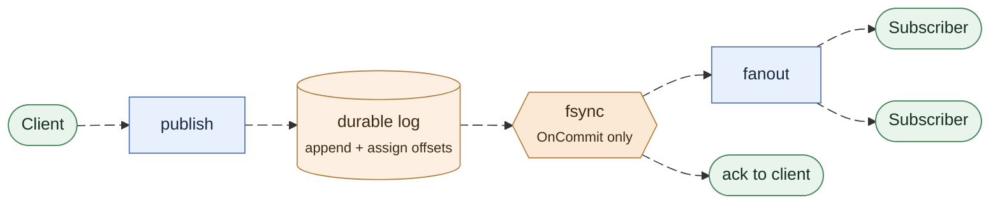
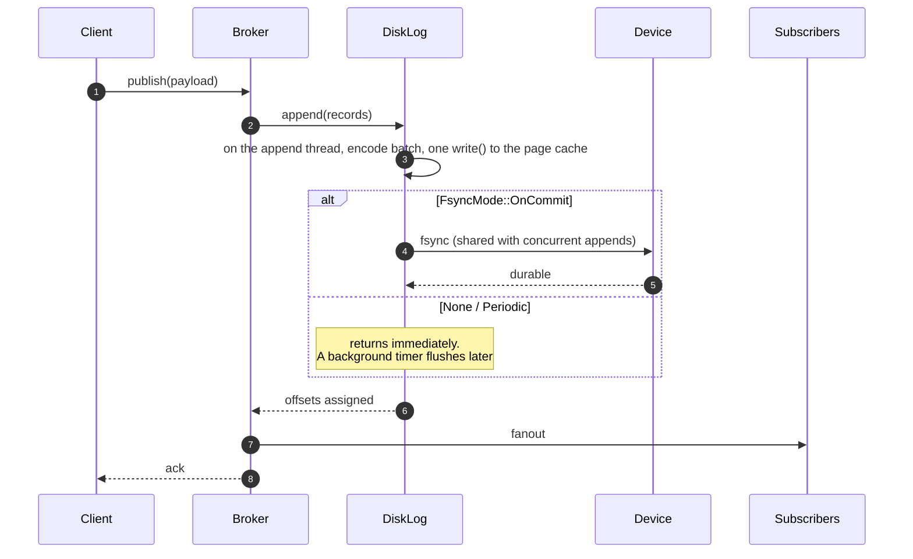
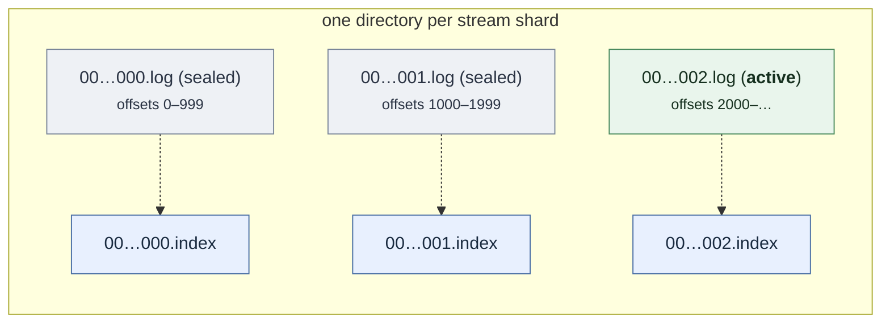
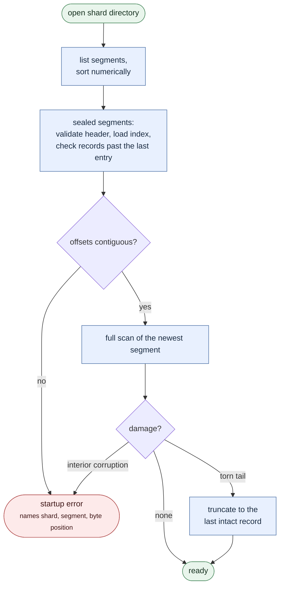
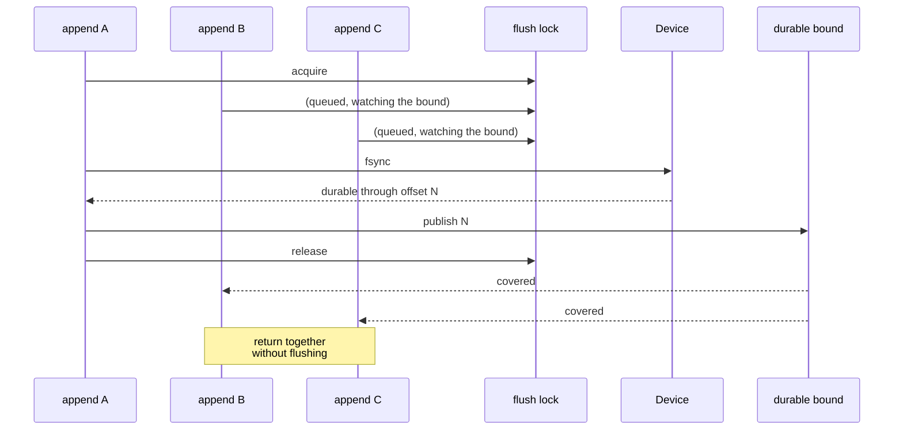

A stream registered with `durable: true` writes every publish to a segmented,
checksummed, crash-safe log before the publish is fanned out or acknowledged.
This page covers what that guarantees, how it is built, and what it costs.

## The guarantee

> A record that a durable publish acknowledged is readable after a restart,
> within the window the configured fsync policy allows.

The window is **zero** for `OnCommit`, **one interval** for `Periodic`, and
**undefined** for `None`.

Durability is opt-in. A broker started without `FELIX_DURABLE_STORAGE_DIR` is
in-memory only, and a stream the control plane marks durable is *rejected at
registration* rather than silently downgraded to a guarantee the broker cannot
keep.

Durability is immutable while a stream is registered. Remove and recreate a
stream to change it between ephemeral and durable; this explicitly invalidates
old handles and prevents durable offsets from diverging from existing in-memory
cursors.

## Ordering: append, then fanout, then ack



Nothing downstream of the log observes a record before it is durable: fanout
and the acknowledgement both wait for the flush, not the append. The same path,
step by step:



The append comes first on purpose. A record delivered to subscribers and
acknowledged to the publisher but lost in a crash is a silent hole in a log that
consumers believe they have read. Writing first turns a storage failure into a
failed publish, which the publisher can retry. A storage error can never produce
a success acknowledgement.

### Where the write runs

The `write()` into the page cache usually takes microseconds, but once Linux
throttles a process that dirties pages faster than the device takes them, it
blocks for up to hundreds of milliseconds. So no Tokio worker makes it. Each
log has an append thread, and every append runs there in offset order while
the publisher awaits the result. The write runs with the segment lock
released, so readers and flushes never wait on the disk behind it, and a flush
takes its bound on the same thread, behind the appends already queued, so
group commit covers all of them.

## Durability policies

| Mode | Flush trigger | Acknowledged when | Loss window |
| --- | --- | --- | --- |
| `none` | seal, shutdown | bytes reach the page cache | unbounded |
| `periodic { interval }` | background timer | bytes reach the page cache | one interval |
| `on_commit` | the append itself | bytes reach the device | none |

`none` is not "no durability": data survives a *process* crash, because the page
cache belongs to the kernel. It does not survive a machine crash or power loss.

`periodic` is the default. It is the only policy whose cost is invisible on the
append path while still bounding loss.

## On-disk layout



### Appending, and reading back


Each record carries its own length, logical offset, timestamp and a CRC-32 over
its header and payload. The length comes first and is covered by the checksum, so
a reader can step to the next record without decoding the current one's payload.
That keeps index rebuilds and recovery scans cheap.

Index files are pure accelerators. An entry is emitted for a segment's first
record and thereafter every `index_spacing_bytes` (4 KiB by default), so the
index is **sparse**: it says roughly where to start, and the forward scan over
real records is what actually answers the read.

That is also why they carry no checksums and are never trusted. An entry is only
ever a starting position for a scan that re-validates what it finds, so a
missing, short, or stale index costs a rebuild rather than a wrong answer. It is
also why a freshly written index can safely skip its fsync.

A new replication leader also writes a generation-start record into the log
(see the [format specification](/architecture/storage-format/)). It takes
an offset like any other record. `read_range` returns it, but only replication
reads the log that way (`StreamLog::read_log_from`), because it ships and
compares the log exactly as stored. Subscribers and every other reader go
through `StreamLog::read_from`, which skips these records, so they see a gap
of one offset where each one sits.

### Sealing, rolling, and retention


A shard's log is one **active** segment plus any number of **sealed** ones.
Rollover is decided *before* a write, from the projected size, so one append is
always one `write` call and a batch never spans two segments. Sealing syncs the
data and the index, then trims the preallocated tail so the file on disk is
exactly its contents.

The active segment reserves blocks ahead of its writes without changing the
file's size. It starts with 1 MiB and doubles the reservation each time its
records pass half of it, up to the segment size, so an idle stream holds 1 MiB
per shard rather than a whole segment. The extension runs off the append path
and is best effort: a failed one is logged and later writes allocate their own
blocks.

Retention deletes whole sealed segments from the head only. It never deletes a
partial segment or the active one, so a log always retains at least what
was written since its last roll. `base_offset` then advances, and a read below
it is `Trimmed { requested, oldest }` rather than an empty answer, so a
resuming subscriber can tell "those records existed and are gone" from
"nothing here yet".

The segments go oldest first, with a directory sync after each unlink, so a
power loss partway through a sweep leaves a longer log rather than a gap that
recovery would refuse.

Cache and counter logs are trimmed the same way, by compaction rather than by
a bound. A background pass seals the active segment, copies each record still
live below it to the tail (a put of the same value, or a counter checkpoint),
flushes, and deletes the sealed segments below the seal point, oldest first.
No record is rewritten, a crash anywhere in the pass replays to the same state,
and no write waits for it: the pass is paced by its own I/O budget,
`FELIX_STORAGE_COMPACTION_BYTES_PER_SEC`. A cache's pass then writes its key
index to `keys.idx`, so the next open replays only the log past it; one that
does not match the log is ignored (see
[the storage format](/architecture/storage-format/#keysidx-a-caches-key-index)).

A shard with `<shard>.compacting` or `<shard>.retired` siblings, left by a
directory-swap compaction that stopped partway, is settled on open: a missing
shard directory is restored from `<shard>.retired`, and leftover siblings are
deleted.

The full byte layout, versioning rules, and corruption verdicts are in the
[Durable Segment Format specification](/architecture/storage-format/).

## Resuming a subscription

Records that survive a restart are only useful if a reconnecting client can say
where it got to. A subscriber asks for a start position (`latest`, `earliest`,
or an exact offset), and every delivered event
carries its offset, so the client has something to checkpoint.

The hard part is joining history to live delivery without losing a record in
between, and the ordering that does it is not the obvious one.


Registering first pins the live edge. Everything below it is a closed range that
nothing can grow, so the disk read that follows cannot race a publish. Do it
the other way around and the window between the two steps has nobody listening
in it.

## Recovery



Four properties hold:

1. **A torn tail is repaired.** A crash mid-append leaves a partial record at the
   end of the newest segment. It was never acknowledged under any policy, so it
   is truncated away. A log whose only segment never got its header, because
   the disk filled while the log was being created, starts again empty.
2. **Committed data is never silently discarded.** Corruption anywhere else is a
   startup error naming the shard, segment and byte position. Refusing to start
   beats losing acknowledged records quietly.
3. **Recovery is idempotent.** Reopening an already recovered log changes
   nothing, so a crash *during* recovery is safe.
4. **Indexes are derived.** A missing or stale index is rebuilt, and the rebuilt
   index is byte-identical to one written during append.

Startup cost is bounded: the active segment is always scanned in full, sealed
segments only past their last index entry. Every read verifies the checksum of
every record it returns, so bit rot in cold data is still caught, though when it
is read rather than at boot. Set `FELIX_DURABLE_VERIFY_ALL_ON_OPEN=true` to trade
startup time for eager detection.

Anything that deletes segments does it one synced unlink at a time, in an
order that keeps the chain whole. Retention and compaction go oldest first.
Replication's truncation and reset go newest first, and a reset creates its
new segment only once the old ones are gone. A power loss partway through
leaves a longer log, never a gap. Recovery refuses to open a log with a gap at
the head; the manual fix is in `docs/durable-storage.md`, under "A gap at the
head left by an older build".

Idempotent producers' sequences are part of what an open rebuilds. Each record
a producer writes carries its producer id and sequence, and a broker derives
every producer's place from its own log before the shard takes a write: from
the snapshot saved at the last rollover, plus the active segment the scan above
already read. That is also why a promoted replica or a move's destination
answers a producer's re-send: it derives the same state from the records it
was shipped.

## What durability costs

Measured on an Apple Mac Studio (M4 Max, 16 CPUs), APFS on internal NVMe,
128-byte payloads. Latencies are per `append` call.

| Policy | Batch | Concurrency | Records/s | p50 | p999 |
| --- | ---: | ---: | ---: | ---: | ---: |
| `none` | 1 | 1 | 571,898 | 1µs | 5µs |
| `periodic` | 1 | 1 | 492,106 | 1µs | 7µs |
| `periodic` | 16 | 1 | 2,671,267 | 3µs | 8µs |
| `on_commit` | 1 | 1 | 253 | 3.99ms | 10.7ms |
| `on_commit` | 1 | 64 | 14,387 | 4.07ms | 9.2ms |
| `on_commit` | 16 | 64 | 185,905 | 4.96ms | 9.2ms |

`on_commit` latency is a hardware constant. p50 is ~4ms in every row, which is
one APFS device flush. No software makes a single durable commit faster than the
device.

Throughput still scales with concurrency because of group commit. An
`fsync` flushes the whole file, so one flush can satisfy every append waiting on
it. 253 → 14,387 records/second from concurrency 1 → 64 is a 57× gain from the
same code path, and batching on top reaches 185,905.


The lock protocol behind that picture (who flushes, and what the others find
when they wake):



The others wait on the lock and on the durable bound at once, so one flush
wakes them all together rather than one after another through the lock.

The full matrix, the regression budget, and the reasoning behind each
optimisation are in
[the performance document](https://github.com/GetFelix/felix/blob/main/docs/storage-performance.md).

## Configuration

| Variable | Default | Meaning |
| --- | --- | --- |
| `FELIX_DURABLE_STORAGE_DIR` | unset | Root directory; setting it enables durable streams |
| `FELIX_DURABLE_FSYNC_MODE` | `periodic` | `none` \| `periodic` \| `on_commit` |
| `FELIX_DURABLE_FSYNC_INTERVAL_MS` | `250` | Interval for `periodic` |
| `FELIX_DURABLE_SEGMENT_BYTES` | `268435456` | Rollover size |
| `FELIX_DURABLE_INDEX_SPACING_BYTES` | `4096` | Sparse index interval |
| `FELIX_DURABLE_MAX_RECORDS_PER_READ` | `10000` | Record cap on one range read |
| `FELIX_DURABLE_PREALLOCATE` | `true` | Reserve segment blocks ahead of the writes: 1 MiB at creation, doubling as the segment fills |
| `FELIX_DURABLE_VERIFY_ALL_ON_OPEN` | `false` | Checksum every segment at startup |
| `FELIX_DURABLE_REPAIR_CHECKSUM_TAIL` | `false` | Truncate a complete trailing record that fails its checksum (see below) |
| `FELIX_STORAGE_COMPACTION_BYTES_PER_SEC` | `67108864` | I/O budget for cache and counter compaction; `0` is unlimited |

Invalid combinations fail at startup, not at the first publish.

```sh
FELIX_DURABLE_STORAGE_DIR=/var/lib/felix/streams \
FELIX_DURABLE_FSYNC_MODE=on_commit \
  cargo run --release -p felix-broker-service --bin felix-broker
```

## Observability

| Metric | Answers |
| --- | --- |
| `felix_storage_append_duration_seconds` | how long a durable publish takes end to end |
| `felix_storage_sync_duration_seconds` | how much of that is the device |
| `felix_storage_sync_batch_appends` | group-commit fan-in in records per flush; near 1 under single-record load means no batching |
| `felix_storage_unsynced_bytes` | data a crash would lose right now |
| `felix_storage_sync_failures_total` | non-zero means acknowledged durability is in doubt |
| `felix_storage_full_total` | writes and log creations refused because the disk or quota was full; none of them wrote anything |
| `felix_storage_recovery_truncated_bytes` | bytes discarded from a torn tail |
| `felix_storage_producer_state_rebuilt_total` | opens or truncations that read sealed segments to rebuild idempotent producers' state, because the snapshot was missing or out of date |

The first two together tell you whether durability is the bottleneck. If sync
dominates append, the fsync policy is the cost.

## See it work

```sh
cargo run --release -p felix-broker-service --bin durable-restart-demo
```

Publishes to one durable and one non-durable stream, drops the broker with no
graceful shutdown, boots a second broker over the same directory, and reads both
back. It checks its own results, so a regression makes it fail instead of
printing wrong numbers.

## Limits today

- **Retention is off by default.** A stream's own `retention` bounds its shard
  logs, and a bound it leaves unset comes from `FELIX_DURABLE_RETENTION_BYTES`
  or `FELIX_DURABLE_RETENTION_SECONDS`. A patch takes effect without a restart.
- **Offload, but no cold reads.** With `FELIX_DURABLE_OFFLOAD_DIR` set, a
  stream log's sealed segments are copied to that directory, checked by size
  and CRC-32, and recorded in a per-shard `offload.manifest` before retention
  may delete them. A crash at any step leaves the local segment or a recorded
  copy. Nothing reads the copies yet, so a read below the local head is still
  `Trimmed`, and the only backend is a local directory. See
  `docs/durable-storage.md`, "Tiered storage: offload".
- **Single node.** This page describes one broker's storage; replication
  across brokers is layered on top of it, and `seal`'s checksum and
  `read_range`'s bounded paging exist to serve that.
