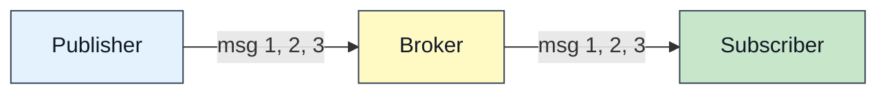
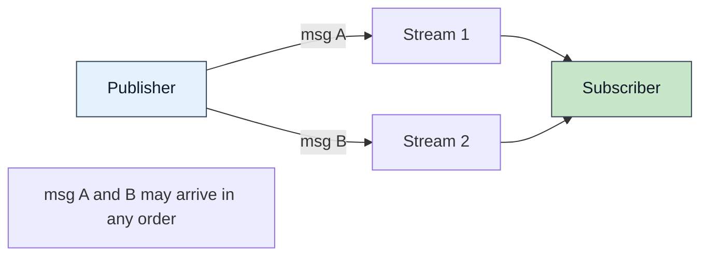
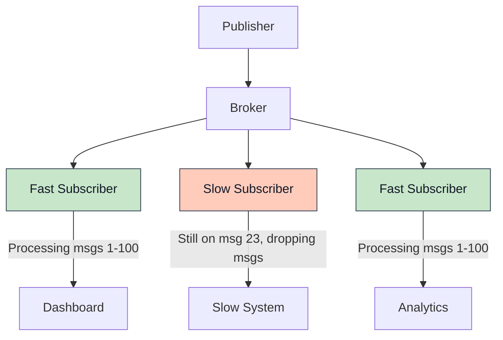
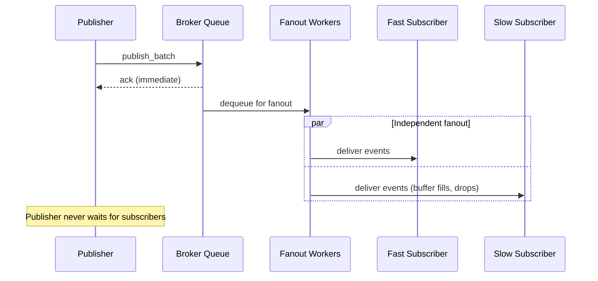
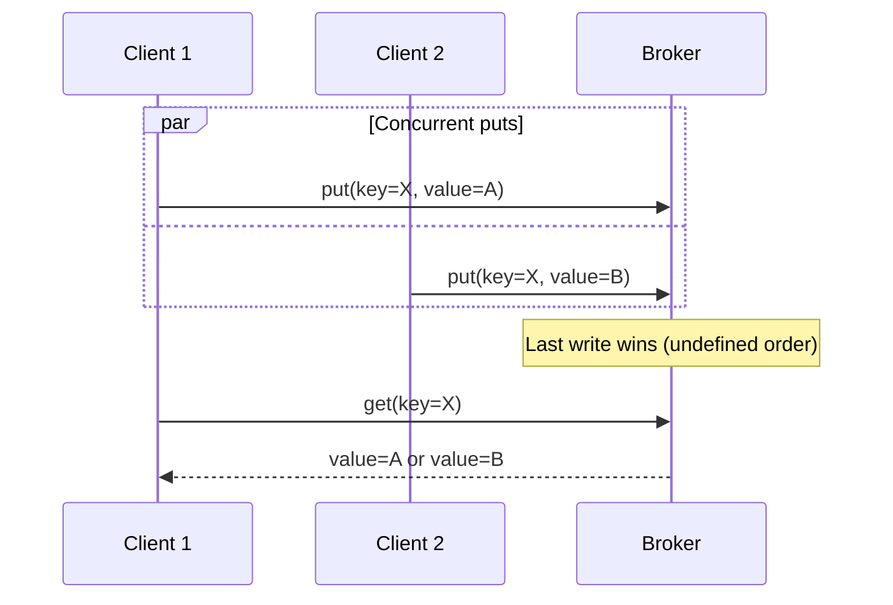
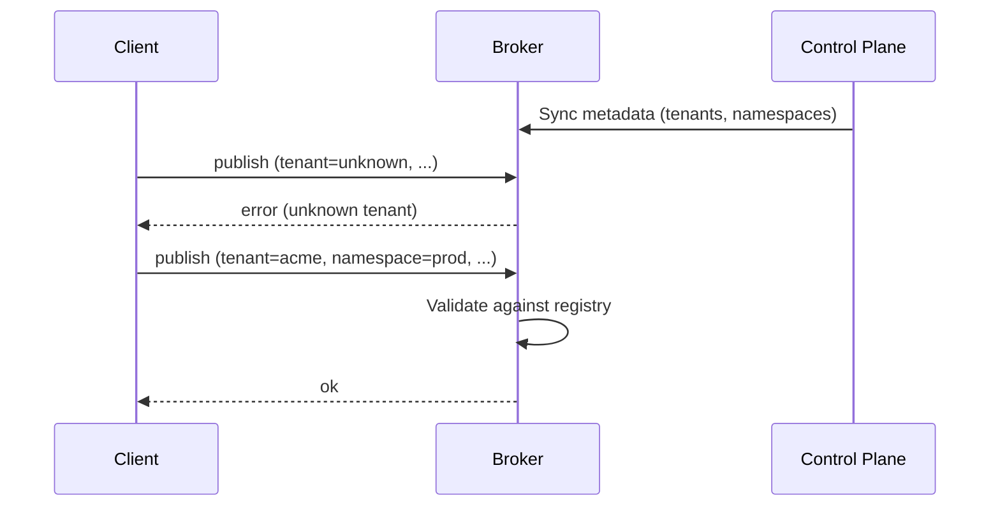

What Felix promises about delivery, ordering, durability, and consistency, and what it does not. Applications should rely on what is written here and nothing stronger.

:::note[What is built and what is not]
This page describes behaviour that exists and behaviour that is planned. Where
they differ it says which. The [status table](/getting-started/what-felix-is-for/)
is the authority per capability, and [Projections](/architecture/projections/)
carries the test behind each claim about a semantic.
:::
## Pub/Sub Delivery Semantics

### Delivery Guarantees

A stream's guarantee follows from how it is registered.

**An ephemeral stream is at-most-once.** This is the default:

- Messages are delivered to subscribers zero or one time
- No retries or redelivery
- No acknowledgements from subscribers
- Slow subscribers may drop messages without notification. A durable stream's
  subscription is told: it ends at the first drop with the offset to resume from

**A durable stream is at-least-once.** Every record is written to disk before
the publish is acknowledged, and a subscriber replays from any retained offset,
so a record survives a broker restart and can be read again. A stream declared
`Quorum` waits for a majority of its replicas before acknowledging, so the
record also survives losing the broker that accepted it.

**A consumer group is at-least-once, and redelivers.** A record handed to a
consumer that does not answer is handed to another once the visibility timeout
lapses. See [Projections](/architecture/projections/).

At-most-once is appropriate for:
- Real-time signals where latest value matters most
- High-frequency metrics and telemetry
- Workloads where occasional loss is acceptable
- Applications that implement their own deduplication

:::caution[Message Loss Scenarios]
Messages can be lost when:
- Subscriber falls behind buffer capacity
- Network partition between broker and subscriber
- Subscriber disconnects without draining buffer
- Broker restarts, for **ephemeral** streams. A stream registered with
  `durable: true` persists each record before acknowledging it, and replays it
  after a restart; see [Durable Storage](/architecture/durable-storage/).
:::
**Example at-most-once workload**:

```rust
// Real-time sensor data where latest reading matters most
let mut subscription = client.subscribe("acme", "sensors", "temperature").await?;

while let Some(event) = subscription.next_event().await? {
    // Process latest temperature reading
    // If we miss a reading, the next one will arrive soon
    update_dashboard(event.payload);
}
```

### At-least-once, and why there is no third guarantee

At-least-once is implemented in two ways, both described above: replay a
durable stream from a checkpointed offset, or consume through a **consumer
group**, which requires an acknowledgement per record, redelivers anything
unanswered once its visibility timeout lapses, and dead-letters a record that has
been attempted too many times.

**Idempotent producers are implemented; exactly-once delivery is not.** A
producer takes an id from the broker and numbers its batches, and a batch
re-sent after a lost acknowledgement lands once: the shard's leader answers a
sequence it already holds rather than appending it again. That closes the
ambiguous-outcome gap on the publish side (`ClusterClient::idempotent_producer`,
negotiated as `FEATURE_IDEMPOTENT_PRODUCER`). On a durable stream the
sequences are stored in the log with the records and replicated with them, so a
re-send is answered the same way after a failover, a planned move or a restart;
on an in-memory stream they last as long as the leader. It does not make delivery
exactly-once: a consumer can still see a record twice on redelivery, and
end-to-end exactly-once would also need transactional coordination across the
log and the consumer's own state, and deduplication on receive. Deduplication
has to live in the application regardless, because only the application knows
what makes two records the same. Deduplicate there, keyed on
something the record carries.

:::caution[Three fields on a stream are declared and not enforced]
`kind` is the one most likely to mislead: creating a stream with `kind: Queue`
does not make it a queue, and does not stop it being subscribed to normally.
Consumer groups work over any durable stream. `retention` is decided by the
broker-wide `FELIX_DURABLE_RETENTION_*` settings instead. The control plane
stores `delivery` (`AtMostOnce` or `AtLeastOnce`), but no broker code reads it:
what a consumer gets depends on whether it reads through a plain subscription
or a consumer group.
:::

### Consistency: how many brokers must hold it

A durable stream is replicated to a set of brokers: one leader and its
replicas. `consistency` on the stream decides **how many of them must hold a
record before the publisher is told it is safe.**

![The same publish under two consistency levels. Under Leader, the shard's leader writes the record durably and acknowledges immediately; the replicas receive their copies afterwards, and the acknowledgement did not wait for them. Under Quorum, the leader writes durably, ships the record to both replicas, and acknowledges only once a majority of the replica set holds it, so the acknowledgement arrives later. A bar beneath each row shows the time until the client is told, and the Quorum bar is more than twice as long.](/diagrams/quorum-ack.svg)

**`Leader`** is the default. The leader writes the record to its own log,
durably, and answers. Replication still happens; the acknowledgement simply
does not wait for it. One round trip.

With the broker's default `ack_on_commit: false`, that answer goes out when the
publish is queued, before the write. A record acknowledged that way is lost if
the leader crashes before writing it, or if a pause outlasts the leader's lease:
the write is then refused, because another broker may lead the shard by then.
Near the end of the lease the broker waits for the write anyway, so a lapse
comes back as `shard_unavailable`, and a loss after an ack is counted in
`felix_broker_acked_publishes_dropped_total`. For an acknowledgement that
means the record is on disk, set `ack_on_commit: true` or use `Quorum`.

An ack sent on enqueue does not make the record readable yet either. A history
read, a replay or a consumer-group poll sent right after it can miss the record
until it is written. A client that has to read what it was told is acknowledged
can ask for commit acks on its own connections (`ack_on_commit: true` in its
`ClientConfig`) without changing the broker's default.

Under **`Quorum`**, the leader writes durably, ships the record to its replicas
concurrently, and answers once a **majority of the replica set, counting
itself**, holds it. On a set of three that is two, so one unreachable replica
costs nothing. The leader waits for enough of them, not all.

`Quorum` does *not* change how the record is stored. The record is written the same way, to the
same log, with the same fsync policy. What changes is what the acknowledgement
**means**:

> A `Quorum` acknowledgement survives losing the leader. A `Leader`
> acknowledgement is a promise only that one broker can keep.

#### How `Quorum` is enforced

The rule depends on which fleet features an operator has finalized (see
[Upgrades](/deployment/upgrades/) for the runbooks).

**By default**, the replication driver reports to the control plane which
replicas hold each record, and the quorum mark that releases an acknowledgement
moves only after that report has landed. The leader also re-checks its lease
before it answers. The ordering closes the one interleaving a model check of
the promotion protocol (`task tla:check`) finds and no injected fault reaches:
a leader that acknowledges a write and dies before the control plane learns
who holds it. `FelixShard.tla` explores 5.38M distinct states of this design
without a violation. With the ordering removed it loses an acknowledged record
in a second.

**With `majority_ack` finalized** (it needs `generation_start` too), a `Quorum`
stream acknowledges a write once a majority of its replicas has answered that
it holds it at the leader's generation. Neither the report nor the lease is on
the path, and a promoted leader fences a majority and takes the furthest log
before it serves. A leader cut off from the control plane keeps acknowledging
what its followers hold. `Leader` streams and caches keep the report and the
lease.

**With `lease_free_reads` finalized** as well, a get or counter get on a
replicated `Quorum` cache confirms leadership with a round instead of the
lease; [Cache Semantics](#consistency-model) describes it. Subscriptions,
replay, Kafka fetches and cache watches on a replicated `Quorum` shard no
longer stop when the lease lapses: they only ever see the committed mark, which
a replaced leader cannot overstate. They end when the broker learns it was
replaced (a replica refuses it for a newer leader) or when no majority has
confirmed it for a lease duration. A consumer-group poll, ack, nack or
dead-letter change on such a shard is confirmed by the same round before it is
acknowledged, so a replaced coordinator cannot acknowledge one. A cache write the owner's storage refuses is
answered as an error and never acknowledged, so a read cannot miss a write it
was told succeeded.

#### What each one costs

`Quorum` costs latency, and it costs availability at the other end: a stream
that cannot reach a majority **stops accepting writes** rather than accepting
ones it might not keep. A publish with no reachable majority is refused, and a
refusal means *"this cannot be vouched for"* rather than *"this did not
happen"*: the record may well have landed on the leader. Retry through an
idempotent producer, which re-sends under the same sequence and cannot land
it twice.

Losing the leader does not stop a `Quorum` stream the same way. A follower that
holds every record up to the quorum mark holds everything a client was told is
stored, so it may be promoted even when the leader died holding newer records no
follower had yet. Those were never acknowledged, and an idempotent producer
sends them again to the new leader.

`Leader` is one round trip instead of two, and it moves the moment you find out.
If the leader dies holding a record nothing else has, the control plane will not
promote a replica, because promoting one would open the shard **without** that
record and no reader could tell. The shard is left unavailable until the old
leader returns with its disk.

So the trade is mostly about timing, not safety. Both refuse to lose a
record acknowledged after it was written (for `Leader`, with `ack_on_commit`
on); they differ in **when you learn there is a problem**:
`Quorum` at publish time, while you still hold the record, or `Leader` at
failover time, when the only copy is on a broker that is gone.

[`task cluster:consistency`](/demos/cluster-consistency/) runs
this: the same fault put to both, on a real three-node cluster.

**What a reader sees of a `Quorum` stream.** A consumer group and a Kafka
consumer read only up to the shard's quorum mark, the committed high-water
mark: a record past it can be lost at failover and its offset reused by the
next leader. A `Leader` stream's readers see everything durable on the leader.
Plain subscriptions are gated the same way: live delivery waits for
the mark, the replay ring holds only committed records (after a restart too,
and a follower that drops a dead leader's uncommitted records drops them from
the ring as well), and history for a resumed subscription is read up to the
mark.

### Message Ordering

**Within a shard**: a key always maps to the same shard, and a shard is one log on one leader, so ordering holds per shard.



**Guarantees**:
- Messages from a single publisher to one shard arrive in send order
- A single subscriber sees messages in the order they were enqueued
- Order is preserved through batching and fanout

**Across streams**: No ordering guarantees.



**Example**:

```rust
// Publish to two streams
use felix_client::AckMode;
let publisher = client.publisher().await?;
publisher
    .publish("acme", "prod", "user-login", login_event, AckMode::None)
    .await?;
publisher
    .publish("acme", "prod", "audit-log", audit_event, AckMode::None)
    .await?;

// Subscribers to user-login and audit-log may see events in any relative order
```

**Ordering within batches**:

```rust
// Batch publish preserves order within the batch
use felix_client::AckMode;
let publisher = client.publisher().await?;
let messages = vec![msg1, msg2, msg3];
publisher
    .publish_batch("acme", "prod", "orders", messages, AckMode::PerBatch)
    .await?;

// Subscribers will see msg1, msg2, msg3 in that order
```

### Fanout Fairness

Felix enforces **subscriber isolation**: slow subscribers never block fast subscribers.



**Isolation mechanism**:

Each subscription has its own bounded queue and its own QUIC stream.

**Buffer behavior**:

- Each subscriber has `subscriber_queue_capacity` buffer slots (default: 512)
- When buffer fills, new events are **dropped for that subscriber only**
- Other subscribers continue receiving events normally
- On a durable stream a drop ends the subscription. The broker delivers what was queued before it, then sends `subscription_lagged` with the first dropped offset, without waiting for another publish; felix-client returns it from `next_event` as a `SubscriptionLagged` error, and does the same for drops in its own queue. A client that did not offer `FEATURE_SUBSCRIPTION_LAGGED` keeps its subscription and can still *detect* a drop, because delivered records carry log offsets and a jump between consecutive offsets is a drop. The exception is a promoted leader's generation-start record, which takes an offset and is never delivered; the event after it reports it in `skipped_before`, so the jump is not mistaken for a drop.
- An in-memory stream's drops are not announced: it has no offsets to resume from.

**Configuration**:

```yaml
# Broker config
subscriber_queue_capacity: 512  # Per-subscriber buffer size
subscriber_writer_lanes: 4
subscriber_lane_shard: auto
```

A larger buffer tolerates more bursty subscribers, trading memory for burst
tolerance:

```yaml
subscriber_queue_capacity: 4096
```

:::tip[Sizing Buffer Depth]
Choose `subscriber_queue_capacity` based on:
- Expected subscriber processing latency variance
- Memory budget (depth × average event size × subscriber count)
- Tolerance for temporary slowdowns

For latency-sensitive workloads with consistent throughput: 512-1024
For bursty workloads with high fanout: 2048-4096
:::
### Publisher Backpressure

**Publisher behavior**: Publishing never blocks on subscriber speed.



**Publisher queue**:

Publishers write to a bounded queue with configurable depth:

```yaml
pub_queue_depth: 64  # Queue slots guaranteed per tenant
publish_queue_wait_timeout_ms: 2000  # How long a commit-acked publish waits for room
```

The queue is shared between tenants by deficit round robin, and every tenant
is guaranteed `pub_queue_depth` slots, so one tenant's burst fills its own
share first. When there is no room for a tenant:
- An enqueue-acked publish is answered at once with `overloaded`
  (`detail.reason = "publish_queue_full"`), which is retryable: nothing was queued
- A commit-acked publish waits up to `publish_queue_wait_timeout_ms`, then is
  answered the same way
- A fire-and-forget publish is shed (or waits, with `pub_ingress_wait`)
- Each is counted in `felix_tenant_publish_queue_full_total{tenant,action}`

**Tuning publish pipeline**:

```yaml
# Increase parallelism
pub_workers_per_conn: 4

# Increase buffer (trades latency for burst tolerance)
pub_queue_depth: 256

# Faster timeout for fail-fast behavior
publish_queue_wait_timeout_ms: 1000
```

### Disconnection Behavior

**Subscriber disconnects**:

- Subscription is immediately removed from registry
- Buffered events for that subscriber are discarded
- No redelivery: a plain subscription has no record of what was handled. A
  consumer group does, and redelivers anything claimed but never acknowledged
  once its visibility timeout lapses
- Subscriber must re-subscribe. On a durable stream it can resume at a
  checkpointed offset rather than restarting at the tail; on an ephemeral one
  the tail is all there is

A subscribe with a start position on a durable stream reports `live_offset`,
the tail when it joined. Records below it are catch-up and records from it on
are new, with nothing skipped between the two, even under concurrent publishes.

**Publisher disconnects**:

- In-flight publishes may be lost if not acknowledged
- No automatic retry or persistence of unacked publishes
- Application must handle reconnection and retry logic

**Broker restarts**:

- In-memory state is lost. Durable streams, the log-backed cache, and consumer-group positions are on disk and survive.
- Active subscriptions are terminated
- Clients detect connection loss and must reconnect
- Durable streams replay after a restart; ephemeral ones cannot

## Cache Semantics

### Consistency Model

A cache key hashes to one shard, and each shard has one owner. A broker that
receives an operation for a key it does not own forwards it to the owner, so a
value written through any broker is readable through every other, and two
brokers never hold different values for the same key. A cache declares
`Leader` (the default) or `Quorum` when it is created, as a stream does, and
the level decides what an acknowledgement means for puts, deletes and counter
adds alike.

**`Leader`.** The owner applies the change and answers. Replicas receive it
afterwards, so the acknowledgement promises only that the owner holds it. The
owner serves reads and writes only while it holds its lease, and refuses them
with `shard_unavailable` (reason `fenced`) once the lease lapses.

**`Quorum`.** A put, delete or counter add is acknowledged once a majority of
the shard's replica set holds it, and only while the owner still holds its
lease. A get or counter get takes its value, waits until a majority holds
everything up to the tail it read, and then confirms the owner still leads, so
a value it returns is one a failover cannot take back. A write that does not
reach a majority in time fails with `quorum_timeout`, and one whose owner
loses the shard first fails with `leadership_lost`. Both mean the outcome is
unknown, not that the write failed.

By default that confirmation is the lease, which is only as safe as the
brokers' clocks. Once an operator finalizes `lease_free_reads` (with
`majority_ack` and `generation_start`), a read of a replicated `Quorum` cache
confirms instead with one round of fences at the owner's generation, answered
by a majority after the read began. That makes the read linearizable without
relying on clocks. Setting `FELIX_QUORUM_READS=lease` on a broker keeps its
reads on the lease. Cache writes keep the lease in every mode: `majority_ack`
applies to `Quorum` streams only. Cache watches on a replicated `Quorum` cache
keep going through a lapsed lease once `lease_free_reads` is finalized, since
they deliver only what the control plane has recorded as committed.

At every level one owner applies each key's changes in order, so there are no
torn writes. Not provided:

- Compare-and-swap or conditional put
- Multi-key transactions
- Causal consistency across keys

### TTL and Expiration

**TTL semantics**:

```rust
// Store with 60-second TTL
use bytes::Bytes;
client
    .cache_put(
        "acme",
        "prod",
        "session",
        session_id,
        Bytes::from(session_data),
        Some(60_000),
    )
    .await?;

// Store without expiration
client
    .cache_put("acme", "prod", "config", config_key, Bytes::from(config_value), None)
    .await?;
```

**Expiration behavior**:

- TTL countdown starts when `cache_put` returns `ok`
- Expiration is **lazy**: checked on access, not proactively
- Expired entries return `null` on `cache_get`
- Expired entries may occupy memory until accessed or evicted

### Cache Scoping

Cache entries are scoped to `(tenant_id, namespace, cache_name, key)`:

```rust
// These are independent cache entries:
client.cache_put("tenant1", "prod", "sessions", "user123", data.clone(), None).await?;
client.cache_put("tenant1", "staging", "sessions", "user123", data.clone(), None).await?;
client.cache_put("tenant2", "prod", "sessions", "user123", data, None).await?;
```

**Isolation guarantees**:

- Different tenants cannot access each other's cache entries
- Different namespaces within a tenant are isolated
- Keys are unique only within their (tenant, namespace, cache) scope

### Eviction Policy

**Today**: the in-memory cache evicts best-effort under pressure. The log-backed cache does not evict; it compacts, reclaiming superseded and expired records.

- No guaranteed LRU or LFU policy
- Eviction is opportunistic
- Applications should not rely on specific eviction order


### Concurrency and Race Conditions

**Concurrent writes to same key**:



**Behavior**: Last write wins, in the order the owner applies the writes,
which the clients do not control. For a value many clients update, use a
counter (`counter_add`), which the owner adds atomically. To react to changes,
watch the key (`watch_cache`); see [Cache](/features/cache/).

## Tenant and Namespace Model

### Existence Enforcement

**Wire protocol requirement**: All data-plane operations must specify tenant and namespace.

```json
{
  "type": "publish",
  "tenant_id": "acme-corp",
  "namespace": "production",
  "stream": "orders",
  "payload": "..."
}
```

**Broker validation**:

The broker enforces tenant/namespace existence:

1. Broker syncs metadata from control plane
2. Broker maintains local registry of valid tenant/namespace pairs
3. Operations for unknown tenant/namespace are rejected with `error` response



### Authorization

Enforced. Tenant-scoped tokens are verified at the broker, and publish,
subscribe and cache operations each check a permission before doing any work.

A **forwarded** publish is authorized twice, at the broker the client reached
and again at the shard's owner, so routing a request through the cluster does
not launder the credential it arrived with.

**Enforcement points**:
- Publish operations, at ingress and at the owner
- Subscribe operations
- Cache operations
- Control plane operations

Per-tenant quotas are a separate thing, and only the publish rate is
enforced; see below.

### Quota Enforcement

Publish rate only. With `FELIX_TENANT_PUBLISH_BYTES_PER_SEC`,
`FELIX_TENANT_PUBLISH_MSGS_PER_SEC` or `FELIX_TENANT_PUBLISH_QUOTAS` set, each
broker keeps a token bucket per tenant and checks it before a publish is
queued: an acknowledged publish over quota is refused as `overloaded` with
reason `tenant_quota` and a `retry_after_ms`, and a Kafka produce is throttled
with `throttle_time_ms`. The rate is per broker and set in its environment.
Nothing limits what a tenant can subscribe to, cache or store. The fuller
shape, not built:

```yaml
quotas:
  - tenant: acme-corp
    namespace: production
    publish_rate_limit: 10000/s
    subscribe_connections: 100
    cache_memory: 10GB
    stream_retention: 7d
```

## Consistency Across Components

### Broker Internal Consistency

Within a single broker:

- **Publish-fanout ordering**: On a durable stream, fanout happens after the
  commit settles the order, so messages fan out in that order. On an
  in-memory stream fanout is not ordered against concurrent publishes:
  two publishers racing can append in one order and fan out in the other, so
  two subscribers of the same in-memory stream can see that pair differently
- **Cache consistency**: Single-writer per key (no torn writes)
- **Subscription isolation**: Independent queues prevent crosstalk

### Multi-Broker Consistency

In a clustered deployment:

- **Shard leadership**: Only one leader per shard. A leader acknowledges and
  serves reads only while it holds a lease, so a superseded broker stops
  rather than discovering the fact later. Two exceptions: a `Quorum` stream
  under `majority_ack` acknowledges on its followers' answers instead, and a
  `Quorum` cache read under `lease_free_reads` confirms with a round (see
  [How `Quorum` is enforced](#how-quorum-is-enforced))
- **Metadata consistency**: strongly consistent, because it lives in one Postgres that every control-plane instance reads and writes, or in an embedded Raft group. A Raft member that comes back with a wiped volume withholds its vote until it has caught up, so it cannot help elect a leader missing an acknowledged write (see [Raft metadata](/architecture/metadata-raft/))
- **Cross-shard ordering**: Not guaranteed. Ordering is per key, because a key
  always resolves to the same shard and a shard is one log on one leader
- **Cache consistency**: One owner per key, with `Leader` or `Quorum`
  acknowledgement per cache. See [Cache Semantics](#consistency-model)

## Failure Scenarios and Behavior

### Network Partition

**Publisher-Broker partition**:

- Publisher detects connection loss (QUIC idle timeout, 6 s by default)
- Unacknowledged publishes are lost
- Publisher must reconnect and retry

**Subscriber-Broker partition**:

- Subscriber detects connection loss
- Buffered events are lost
- Subscriber must reconnect and re-subscribe, resuming from its last offset on a durable stream

**Broker-Control Plane partition**:

- Broker continues serving with cached metadata
- New stream creation fails
- Its lease lapses after the control plane's expiry window. From then on it
  refuses writes to `Leader` streams and caches, and ends their readers, since
  another broker may lead those shards by now
- A `Leader` shard's single writer rests on that lease. A deposed leader
  suspended past the lease margins, or one whose monotonic clock runs slow
  against the control plane's, can acknowledge a write its successor never
  sees. A clock step cannot, since neither side reads a wall clock. A
  `Quorum` stream with `majority_ack`, or cache with `fenced_caches` as well,
  acknowledges only what a majority holds, so it is not exposed
- With `majority_ack` finalized, a replicated `Quorum` stream keeps taking
  writes, acknowledged by its followers. With `lease_free_reads` as well, its
  subscribers, cache watches and consumer groups keep going: they end only
  once a replica refuses the broker for a newer leader, or no majority has
  confirmed it for a lease duration, and clients then find the new leader as
  they do after a move
- Broker reconciles when connection restored

### Broker Failure

**Process crash**:

- In-memory state is lost. Durable streams, the log-backed cache, and consumer-group positions are on disk and survive.
- Clients detect connection loss
- Clients must reconnect to recovered broker
- Subscriptions must be re-established. A durable stream replays from a
  checkpointed offset, and a consumer group resumes from its last acknowledged
  position
- The log-backed cache rebuilds its state from its log

### Shard Moves

A drain or a rebalance moves a shard off a live broker. It is not a failure,
and clients see less of it than of one:

- **Publishes are held, not refused.** Between the fence and the cut-over
  nobody serves the shard; a publish arriving then waits and is forwarded to
  the new owner. Only a switch-over longer than `FELIX_SHARD_MOVE_HOLD_MS`
  (2 s) refuses one, as `shard_unavailable` with reason `moving`, unwritten.
- **Cache and counter operations are held and forwarded** the same way.
  Consumer-group operations are held and then redirected to the new owner,
  which `ClusterClient`'s group calls (and the Python and TypeScript clients')
  follow.
- **Subscriptions follow.** The old leader delivers what it committed, then
  ends each subscription with `shard_moved`. A `ClusterClient` subscription
  resumes on the new owner with nothing repeated or skipped. A cache watch
  gets the same frame: a `ClusterClient` watch follows the shard, and a
  `Client` watch must be reopened by the caller.
- **Nothing acknowledged is lost.** Group positions, dead letters, counters
  and idempotent producers' sequences move with the shard.

See [Adding, draining and removing brokers](/deployment/scaling/#what-clients-see).

### Slow Subscriber Behavior

**Scenario**: Subscriber processing slows down.

**Stages**:

1. **Buffer absorbs slowdown**: Events accumulate in subscriber buffer
2. **Buffer fills**: New events start getting dropped for that subscriber
3. **Other subscribers unaffected**: Fast subscribers continue normally

Drops apply to live records only. A subscription resumed from an earlier
offset is never dropped from while it replays history: the client waits for
room in its queue, so a slow reader slows the replay instead.

**Detection, today**: the broker counts drops per subscriber queue
(`felix_sub_queue_dropped_total`) and logs when a subscriber falls behind.
On a durable stream the subscription ends at its first drop with
`subscription_lagged`, and the subscriber resumes from the offset it names;
`ClusterSubscription` does that itself, catching up from the log. An
in-memory stream's subscriber is not told and is not disconnected.

## Testing Semantics

### Conformance Testing

Applications can test semantic guarantees:

**Ordering test**:

```rust
// Publish ordered batch
let messages = vec!["msg1", "msg2", "msg3"];
use felix_client::AckMode;
let publisher = client.publisher().await?;
publisher
    .publish_batch("test", "default", "orders", messages, AckMode::PerBatch)
    .await?;

// Verify subscriber receives in order
let events = collect_events(&mut subscription, 3).await?;
assert_eq!(events, vec!["msg1", "msg2", "msg3"]);
```

**Isolation test**:

```rust
// Start fast and slow subscribers
let mut fast_sub = client.subscribe("test", "default", "stream").await?;
let mut slow_sub = client.subscribe("test", "default", "stream").await?;

// Slow subscriber delays processing
simulate_slow_processing(&mut slow_sub);

// Verify fast subscriber still receives all messages
let fast_count = count_events(&mut fast_sub, timeout).await?;
assert!(fast_count >= expected_count);
```

## Summary: Semantic Guarantees Matrix

| Property | Today | Not built |
|----------|-------|-----------|
| **Pub/Sub delivery** | At-most-once ephemeral, at-least-once durable; idempotent producers land a re-sent publish once | Exactly-once delivery |
| **Consumer groups** | At-least-once, bounded redelivery, dead letters | Shard assignment across a group's consumers |
| **Message ordering** | Per shard | Configurable cross-shard |
| **Subscriber isolation** | Yes | None |
| **Cache** | Routed to one owner, replicated; `Leader` or `Quorum` per cache, covering puts, deletes and counter adds; linearizable `Quorum` reads with `lease_free_reads` | Conditional put, multi-key transactions |
| **TTL precision** | Lazy on access, against an absolute expiry | Sweeping expiry |
| **Durability** | Per stream: ephemeral, or `Leader` or `Quorum` acknowledgement | None |
| **Authorization** | Tenant-scoped tokens, RBAC per resource, OIDC exchange | None |
| **Quotas** | Per-tenant publish rate, per broker | Per-namespace; subscriptions, cache and storage; set in the control plane |
| **Multi-key operations** | None | Transactions |

## Recommendations

### Choosing Delivery Semantics

**Use an ephemeral stream (at-most-once) when**:
- Latest value is more important than history (sensor data, metrics)
- Occasional loss is acceptable (telemetry, monitoring)
- Throughput and latency matter more than guarantees
- Application implements own deduplication

**Use a durable stream, or a consumer group (at-least-once) when**:
- Every message matters (financial transactions, orders)
- Application can handle duplicates (idempotent processing)
- Durability matters more than latency

**Exactly-once delivery is not implemented.** An idempotent producer keeps a
publish retry from duplicating the record; a consumer's redelivery is still
at-least-once. If duplicates are unacceptable on the consuming side (billing,
accounting), the deduplication has to be in the application, keyed on
something the record carries.

### Cache Usage Patterns

**Good cache use cases**:
- Session data with TTL
- Configuration with infrequent updates
- Rate limiting and other counters, with `counter_add`
- Recently published message lookup

**Poor cache use cases**:
- Strongly consistent shared state requiring transactions
- Large values (> 1 MB) better served by object storage

:::tip[Design for Semantics]
Design your application for the semantics Felix provides. Where a guarantee is
missing, build it in the application or choose a different tool; do not assume
it will arrive.
:::
