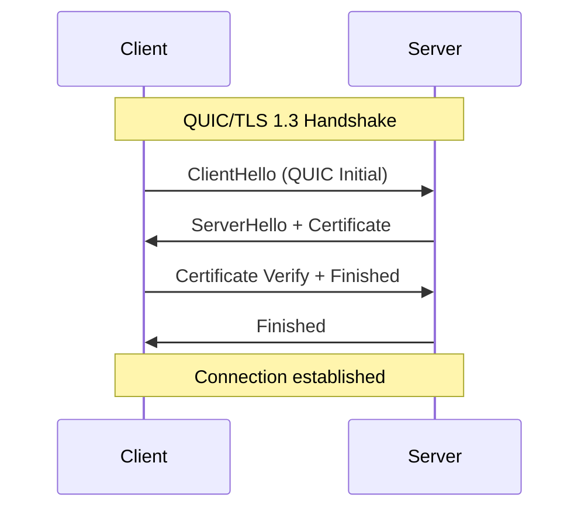
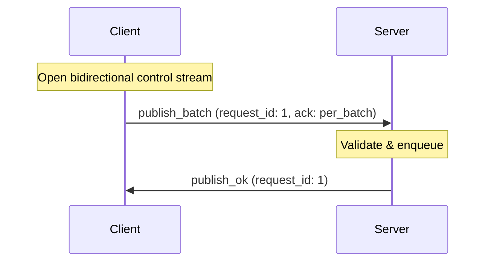
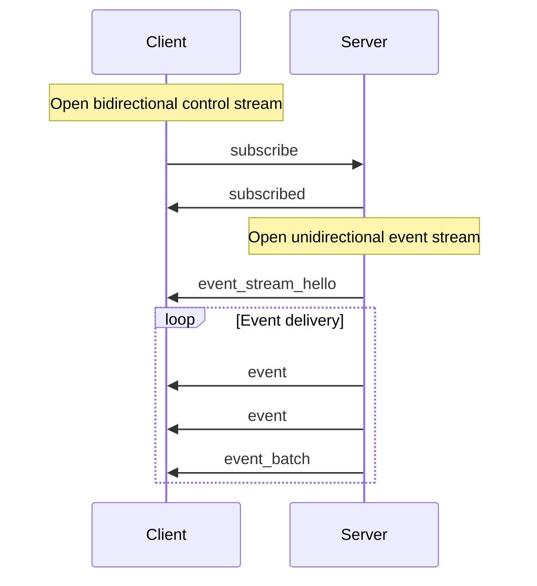
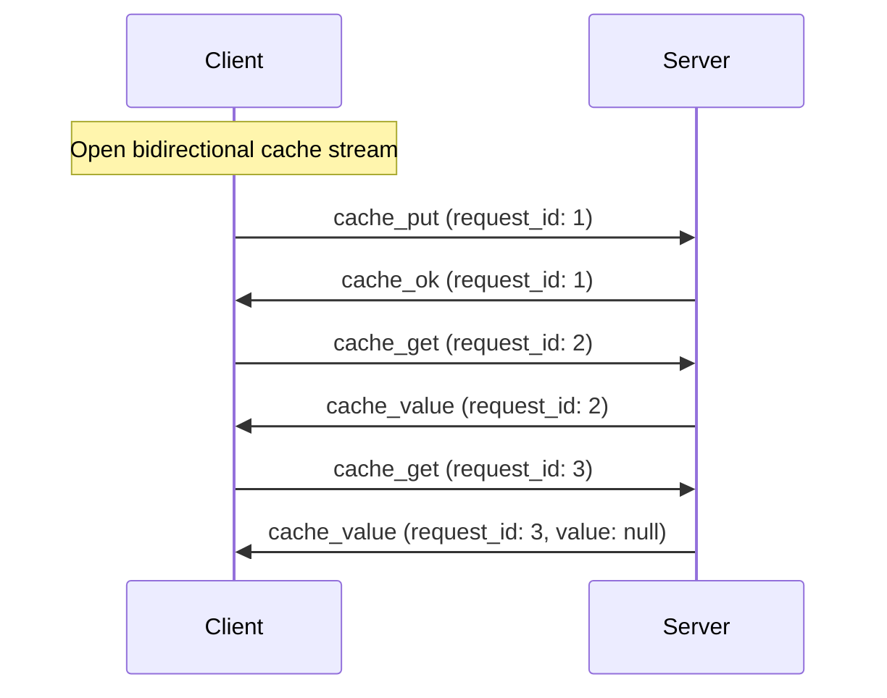
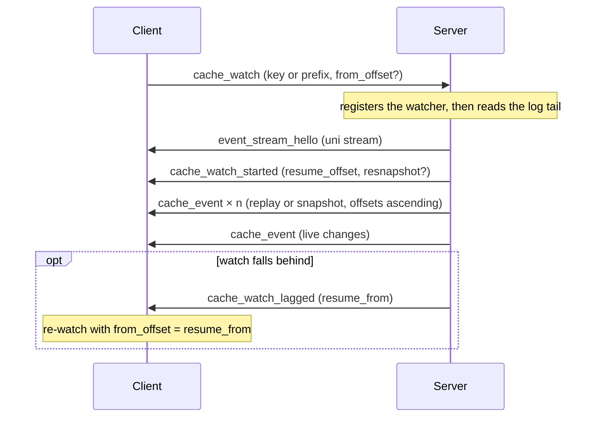
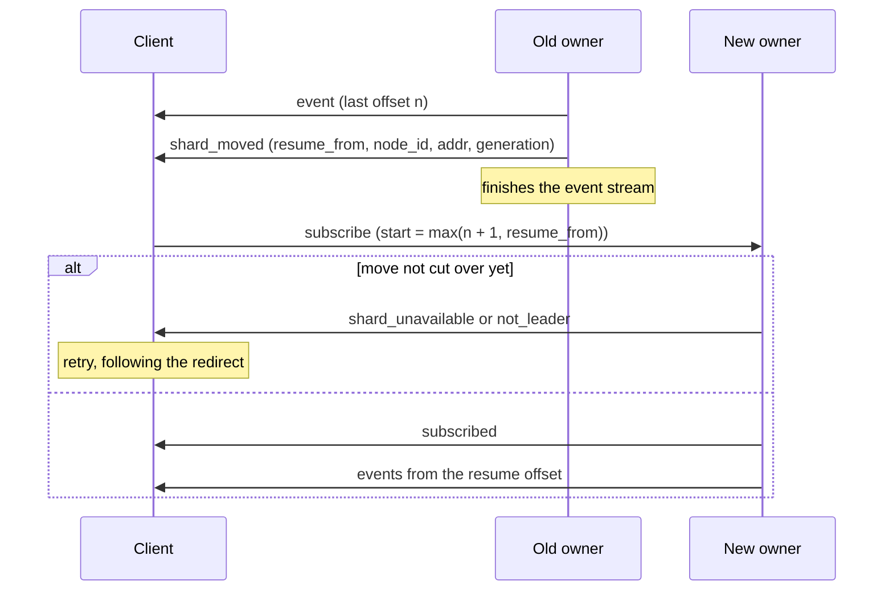

The wire protocol is what a client and a broker actually say to each other:
a fixed frame header, JSON control messages, binary data-plane frames, and
the capability negotiation that lets old and new peers interoperate. This is
the reference for implementing a compatible client or server.

## Design Goals

The wire protocol is designed with the following priorities:

1. **Language neutrality**: No Rust-specific types or semantics
2. **Forward compatibility**: Negotiated flag and feature bits, with the version fixed at 1
3. **Debuggability**: Human-readable messages in v1 with binary fast paths
4. **Explicit framing**: Clear message boundaries over stream transport
5. **Performance escape hatches**: Binary encodings for high-throughput workloads

:::note[Stability Guarantee]
The wire protocol v1 is considered stable. New capabilities arrive as negotiated flag and feature bits, so older peers keep working.
:::
## Transport Layer

Felix uses **QUIC over TLS 1.3** (IETF QUIC) as its exclusive transport:

- **Encrypted by default**: TLS 1.3 handshake integrated into connection setup
- **Multiplexed streams**: Multiple independent streams per connection
- **Flow control**: Built-in backpressure at connection and stream levels
- **No head-of-line blocking**: Stream independence prevents HOL blocking

The protocol is transport-agnostic in design and could theoretically run over TCP+TLS, but QUIC is the only supported transport in the initial implementation.

## Frame Structure

Every Felix message is transmitted as a **frame** consisting of a fixed-size header followed by a variable-length payload.

### Frame Header (12 bytes)

<svg viewBox="0 0 660 196" role="img" aria-labelledby="fh-title fh-desc" style="max-width:100%;height:auto;color:var(--sl-color-text)">
 <title id="fh-title">Felix v1 frame header layout</title>
 <desc id="fh-desc">Twelve bytes in three 32-bit rows: bytes 0 to 3 are magic, bytes 4 and 5 are version, bytes 6 and 7 are flags, bytes 8 to 11 are length.</desc>
 <g font-family="ui-monospace, SFMono-Regular, Menlo, monospace" font-size="13" fill="currentColor">
  <g opacity="0.65" text-anchor="middle">
   <text x="52" y="16">0</text>
   <text x="200" y="16">8</text>
   <text x="348" y="16">16</text>
   <text x="496" y="16">24</text>
   <text x="644" y="16">31</text>
  </g>
  <g stroke="currentColor" opacity="0.35"><path d="M52 22v6M200 22v6M348 22v6M496 22v6M644 22v6" /></g>
  <g opacity="0.65" text-anchor="end" font-size="12">
   <text x="42" y="63">0</text>
   <text x="42" y="115">4</text>
   <text x="42" y="167">8</text>
  </g>
  <g fill="none" stroke="currentColor" stroke-width="1.5">
   <rect x="52" y="34" width="592" height="44" rx="3" />
   <rect x="52" y="86" width="296" height="44" rx="3" />
   <rect x="348" y="86" width="296" height="44" rx="3" />
   <rect x="52" y="138" width="592" height="44" rx="3" />
  </g>
  <g text-anchor="middle">
   <text x="348" y="52">magic</text>
   <text x="348" y="70" opacity="0.7" font-size="12">u32 &#183; 0x464C5831 &#8220;FLX1&#8221;</text>
   <text x="200" y="104">version</text>
   <text x="200" y="122" opacity="0.7" font-size="12">u16 &#183; 1</text>
   <text x="496" y="104">flags</text>
   <text x="496" y="122" opacity="0.7" font-size="12">u16 &#183; bit field</text>
   <text x="348" y="156">length</text>
   <text x="348" y="174" opacity="0.7" font-size="12">u32 &#183; payload bytes</text>
  </g>
 </g>
</svg>

All multi-byte integers are big-endian (network byte order).

| Offset | Size | Field | Type | Value |
| --- | --- | --- | --- | --- |
| 0 | 4 | `magic` | u32 | `0x464C5831` (`"FLX1"`) |
| 4 | 2 | `version` | u16 | `1` |
| 6 | 2 | `flags` | u16 | Bit field; see below |
| 8 | 4 | `length` | u32 | Payload length in bytes |

#### Field Definitions

**magic (u32, big-endian)**

Fixed value: `0x464C5831` (ASCII "FLX1")

Purpose: Protocol identification and frame synchronization. Decoders should reject frames with incorrect magic numbers.

**version (u16, big-endian)**

Protocol version: `1`, and it has stayed `1` on purpose.

Capabilities are added by negotiating flag and feature bits during the
handshake, not by bumping this number. See
[Capability negotiation](#capability-negotiation-not-version-negotiation). The
field exists so a peer speaking something entirely different is rejected at the
header rather than misparsed.

**flags (u16, big-endian)**

Bit field for optional features:

| Bit | Mask   | Meaning |
|-----|--------|---------|
| 0   | 0x0001 | Binary publish batch encoding |
| 1   | 0x0002 | Binary event batch (legacy, per-subscriber) |
| 2   | 0x0004 | Shared binary event batch |
| 3   | 0x0008 | Acked binary publish batch (modifier on bit 0) |
| 4   | 0x0010 | Binary publish acknowledgement (broker → client) |
| 5   | 0x0020 | Event batch carries a `base_offset` (modifier on bits 1/2) |
| 6   | 0x0040 | Batch carries a routing key prefix (modifier on bit 0) |
| 7   | 0x0080 | Batch was forwarded; the ack names the shard's owner (modifier on bit 4) |
| 8   | 0x0100 | Batch carries an idempotent producer's id and sequence (modifier on bit 3) |
| 9   | 0x0200 | A failed ack carries an error code and retry class (modifier on bit 4) |
| 10  | 0x0400 | A failed ack's code is followed by its `detail`: reason and suggested wait (modifier on bit 9) |
| 11  | 0x0800 | Event batch also carries `skipped_before`: offsets just before it that hold no event (modifier on bit 5) |
| 12  | 0x1000 | A successful ack ends with the offset of the batch's first record; offered by a client, it also adds `offset` to `publish_ok` (modifier on bit 4) |
| 13-15| -     | Reserved (must be 0) |

Receivers must **reject** a frame carrying a flag bit they do not recognise, rather
than ignoring the bit. These bits select how the payload is parsed, so ignoring an
unknown one means misparsing the body instead of failing cleanly. Bit 3 is the
cautionary example: it prefixes the publish-batch body with a `request_id`, so a
receiver that masked it off would read that prefix as a `tenant_len`.

**length (u32, big-endian)**

Payload length in bytes: `0` to `2^32 - 1`

This is the byte count of the payload following the header. The maximum practical frame size is typically much smaller (16 MB default limit).

### Frame Payload

Control messages are UTF-8 JSON. Flag bits select binary layouts for publish
batches, publish acknowledgements and event batches, described further down.

## Message Types

Each control message is a JSON object tagged by `type`, carried in a frame with
`flags = 0`. Byte fields are base64 strings, and a field marked `absent` may be
left out, in which case it means what it meant before the field existed. This
page covers the messages most clients need. The full set, including consumer
groups, idempotent producers and shard queries, is in
[`docs/protocol.md`](https://github.com/gabloe/felix/blob/main/docs/protocol.md).

### Client → Server Messages

#### Publish

Single-message publish.

```json
{
  "type": "publish",
  "tenant_id": "string",
  "namespace": "string",
  "stream": "string",
  "payload": "base64",
  "key": "base64 | absent",
  "request_id": "number | absent",
  "ack": "none | per_message | per_batch | absent"
}
```

**Fields**:
- `tenant_id`, `namespace`, `stream`: the stream to publish to
- `payload`: the message bytes
- `key`: routing key that picks the shard. Absent means shard 0
- `request_id`: u64 correlation id, required whenever `ack` is not `none`
- `ack`: absent or `none` is fire-and-forget

**Semantics**:
- An acked publish is answered with `publish_ok` or `publish_error`, both
  carrying its `request_id`
- Answers can arrive out of order unless the connection negotiated
  [pipelined publishes](#pipelined-publishes)
- Current clients send publishes as [binary frames](#binary-publish-batch-encoding)
  and use this JSON form only as a fallback

#### PublishBatch

Batch publish. Same fields as `publish`, with `payloads` in place of `payload`.

```json
{
  "type": "publish_batch",
  "tenant_id": "string",
  "namespace": "string",
  "stream": "string",
  "payloads": ["base64", "base64"],
  "key": "base64 | absent",
  "request_id": "number | absent",
  "ack": "none | per_message | per_batch | absent"
}
```

**Semantics**:
- The batch is appended in order, and one `publish_ok` or `publish_error`
  answers it

#### Subscribe

Start a subscription to one shard of a stream.

```json
{
  "type": "subscribe",
  "tenant_id": "string",
  "namespace": "string",
  "stream": "string",
  "subscription_id": "number | absent",
  "start": "\"latest\" | \"earliest\" | {\"offset\": number} | absent",
  "shard": "number | absent"
}
```

**Fields**:
- `start`: absent means `latest`, the live tail. `earliest` is the oldest
  retained record. `{"offset": n}` resumes at `n`, the first record not yet seen.
  Replay needs a durable stream; an ephemeral stream keeps no history
- `shard`: which shard to read, default 0. A subscription reads one shard, so a
  multi-shard stream needs one subscription per shard
- `subscription_id`: an explicit id for the subscription. Absent, the broker
  assigns one

**Semantics**:
- Broker answers `subscribed` with the subscription's id, or
  `subscribe_cursor_error` when it cannot serve `start` (`too_old` or
  `in_future`)
- Broker opens a new **unidirectional stream** for event delivery
- First frame on the event stream is `event_stream_hello` (see below)

#### CachePut

Store a value in a cache, with an optional TTL.

```json
{
  "type": "cache_put",
  "tenant_id": "string",
  "namespace": "string",
  "cache": "string",
  "key": "string",
  "value": "base64",
  "request_id": "number | absent",
  "ttl_ms": "number | null"
}
```

**Fields**:
- `tenant_id`, `namespace`, `cache`: which cache the key belongs to
- `request_id`: u64 the client picks to match the answer to the request
- `ttl_ms`: time to live in milliseconds, `null` for no expiry

**Semantics**:
- Answered with `cache_ok` carrying the same `request_id`, or plain `ok` when
  the request had none
- Expiration is lazy (checked on access)

#### CacheGet

Read a value from a cache.

```json
{
  "type": "cache_get",
  "tenant_id": "string",
  "namespace": "string",
  "cache": "string",
  "key": "string",
  "request_id": "number | absent"
}
```

**Semantics**:
- Answered with `cache_value` carrying the same `request_id`
- `value` is `null` if the key is missing or expired

#### CacheWatch

Subscribe to changes for one cache key or key prefix.

```json
{
  "type": "cache_watch",
  "tenant_id": "string",
  "namespace": "string",
  "cache": "string",
  "key": "string | absent",
  "prefix": "string | absent",
  "shard": "number | absent",
  "from_offset": "number | absent",
  "retained": "bool | absent"
}
```

**Semantics**:
- Sent only to a broker that advertised `FEATURE_CACHE_WATCH`. Only brokers
  whose cache is log-backed advertise it
- Exactly one of `key` / `prefix`; both or neither is refused
- `from_offset` resumes at the first change not yet seen; absent watches from
  now. An offset past the tail is refused with `subscribe_cursor_error`
- `retained` asks for current state first (each matching key's current value),
  then live changes. Requires `FEATURE_CACHE_WATCH_RETAINED` (an older
  watch-capable broker would ignore the field and silently serve a live-only
  watch), and is refused together with `from_offset`
- Confirmed with `cache_watch_started`; changes arrive as `cache_event` on a
  unidirectional stream bound by `event_stream_hello`, exactly like a
  subscription's
- Served by the shard's owner; elsewhere answered with `not_leader`

#### CounterAdd / CounterGet

Counter operations, scoped and routed like cache keys.

```json
{ "type": "counter_add", "tenant_id": "string", "namespace": "string",
  "cache": "string", "key": "string", "delta": "number", "request_id": "number" }
{ "type": "counter_get", "tenant_id": "string", "namespace": "string",
  "cache": "string", "key": "string", "request_id": "number" }
```

**Semantics**:
- Sent only to a broker that advertised `FEATURE_COUNTERS` (durable brokers only)
- Both answered with `counter_value`; an add's answer is the sum *including*
  its delta
- At-least-once: a retried add after a lost acknowledgement counts twice

### Server → Client Messages

#### Event

Event delivery on a subscription stream.

```json
{
  "type": "event",
  "tenant_id": "string",
  "namespace": "string",
  "stream": "string",
  "payload": "base64",
  "offset": "number | absent"
}
```

**Semantics**:
- Sent on unidirectional event streams
- `offset` is the record's log offset on a durable stream, absent on an
  in-memory one
- One event per frame (unless batched)
- No acknowledgement from a plain subscriber. A consumer group acknowledges each record explicitly, which is what makes it redeliverable

#### EventBatch

Batched event delivery (optimization).

```json
{
  "type": "event_batch",
  "tenant_id": "string",
  "namespace": "string",
  "stream": "string",
  "payloads": ["base64", "base64"],
  "base_offset": "number | absent"
}
```

**Semantics**:
- Multiple events delivered in single frame
- `base_offset` is the first event's log offset on a durable stream. Event `i`
  is at `base_offset + i`
- Reduces framing overhead for high-throughput streams
- Configurable via broker batching parameters

#### EventStreamHello

First frame on a subscription event stream.

```json
{
  "type": "event_stream_hello",
  "subscription_id": "number"
}
```

**Semantics**:
- Allows client to correlate stream with subscription request
- Must be first frame on event stream
- Subsequent frames are events

#### CacheValue

Cache lookup response.

```json
{
  "type": "cache_value",
  "tenant_id": "string",
  "namespace": "string",
  "cache": "string",
  "key": "string",
  "value": "base64 | null",
  "request_id": "number | absent"
}
```

**Fields**:
- `tenant_id`, `namespace`, `cache`, `key`: echo the request
- `value`: the stored value, or `null` if missing or expired
- `request_id`: matches the request

#### CacheWatchStarted

Watch confirmation.

```json
{
  "type": "cache_watch_started",
  "subscription_id": "number",
  "resume_offset": "number",
  "resnapshot": "bool | absent",
  "retained_count": "number | absent"
}
```

**Semantics**:
- `resume_offset` is where live delivery begins; everything below it was
  covered by the replay or the snapshot
- `resnapshot: true` means the requested history was collapsed by compaction,
  so the watch begins with each matching key's current value instead. This is a
  defined signal, never a silent gap
- `retained_count`, present exactly when retained delivery was requested, is
  how many current values precede live delivery. `0` is the defined "no
  retained value" answer, so joining an empty key cannot be mistaken for a
  slow one

#### CacheEvent

One cache change on a watch's event stream.

```json
{
  "type": "cache_event",
  "key": "string",
  "value": "base64-encoded-bytes | absent",
  "offset": "number",
  "expires_at_millis": "number | absent"
}
```

**Semantics**:
- Absent `value` means the key was deleted
- `offset` is the change's cache-log offset; checkpoint `offset + 1` to resume
- Offsets are sparse on a filtered watch, so a gap between them is not a drop
  signal; `cache_watch_lagged` is

#### CacheWatchLagged

The watch fell behind; the broker ends the stream after this.

```json
{
  "type": "cache_watch_lagged",
  "resume_from": "number"
}
```

**Semantics**:
- Everything already queued was delivered first
- Re-watching with `from_offset = resume_from` is gapless

#### ShardMoved

The last frame on the event stream of a subscription or cache watch whose shard
moved to another broker; the broker ends the stream after it.

```json
{
  "type": "shard_moved",
  "subscription_id": "number",
  "resume_from": "number | absent",
  "node_id": "string | absent",
  "addr": "string | absent",
  "generation": "number"
}
```

**Semantics**:
- Sent only to a client that offered `FEATURE_SHARD_MOVED`. Any other client sees
  the stream end after its last event, exactly as before the frame existed
- Everything this broker committed to the shard was delivered first
- `resume_from` is the first offset the reader was not offered. Resume a durable
  subscription at `max(last delivered offset + 1, resume_from)`. Absent on an
  in-memory stream, and on a cache watch whose shard was still taking writes
- `node_id` and `addr` name the shard's next owner when the broker knows it. It
  is a hint: that broker may answer `not_leader` or `shard_unavailable` until the
  move completes
- See [Shard moves](#shard-moves)

#### CounterValue

```json
{ "type": "counter_value", "value": "number | absent", "request_id": "number" }
```

Absent `value` means the counter has never been written, which is distinct from
a sum of zero.

#### Subscribed, PublishOk, CacheOk, Ok

Success answers. Each names the request it answers where there is one.

```json
{ "type": "subscribed", "subscription_id": "number",
  "start_offset": "number | absent", "live_offset": "number | absent" }
{ "type": "publish_ok", "request_id": "number" }
{ "type": "cache_ok", "request_id": "number" }
{ "type": "ok" }
```

`subscribed` confirms a subscription, and its id matches the
`event_stream_hello` on the event stream. `start_offset` and `live_offset` are
sent on a durable stream to a client that negotiated event offsets, whose
subscribe with no `start` is treated as `latest`. `publish_ok` answers an acked publish and `cache_ok` a
cache write that carried a `request_id`. Plain `ok` answers `auth` from a client
that offered no flags, and a cache write without a `request_id`.

#### Error

A request failed.

```json
{
  "type": "error",
  "message": "string",
  "code": "string | absent",
  "retry": "retry | retry_after | redirect | outcome_unknown | fatal | absent",
  "detail": { "reason": "string | absent", "retry_after_ms": "number | absent" }
}
```

`message` is prose for people. `code`, `retry` and `detail` are sent only to a
client that offered `FEATURE_ERROR_CODES`, and `detail` may be absent even then.
`publish_error` carries the same fields next to its `request_id`.

`code` is one of `unauthenticated`, `forbidden`, `not_found`,
`invalid_request`, `shard_unavailable`, `not_leader`, `quorum_timeout`,
`leadership_lost`, `unacknowledged`, `overloaded`, `limit_exceeded`,
`draining`, `internal`, `storage` or `stale_claim`. A client must accept a code
it does not know. `retry` says what the client may do next: send again, wait
first, go to another broker, send again only if the request is idempotent, or
give up. What each code means is in
[Error codes](https://github.com/gabloe/felix/blob/main/docs/protocol.md#error-codes).

## Binary Publish Batch Encoding

For high-throughput publish workloads, Felix supports binary encodings that reduce parsing overhead.

### When to Use Binary Mode

Binary mode is enabled by setting flag bit 0 (`flags | 0x0001`). **All client
publishes use binary encoding by default**, acknowledged or not. The Rust client's
`Publisher::publish`/`publish_batch` methods select it automatically. Call
`publish_json`/`publish_batch_json` explicitly to opt into JSON instead (e.g. for
debugging or a non-Rust client that hasn't implemented the binary decoder yet).

An acknowledged publish additionally sets bit 3 (`flags | 0x0008`), which prefixes
the batch with a `request_id` and an ack mode, and the broker replies with a binary
ack frame (bit 4) instead of a JSON `publish_ok`/`publish_error`.

:::note[Negotiated, not assumed]
A client uses bits 3 and 4 only once the broker advertises them on the auth
handshake. Against a broker that does not, it falls back to the JSON encoding. See
[Capability negotiation](#capability-negotiation).
:::

:::tip[Performance Impact]
Binary batches can achieve 30-40% higher throughput, especially with large payloads and high fanout.
:::
### Binary Format Specification

<svg viewBox="0 0 660 274" role="img" aria-labelledby="bpb-t bpb-d" style="max-width:100%;height:auto;color:var(--sl-color-text)">
 <title id="bpb-t">Binary publish batch payload layout</title>
 <desc id="bpb-d">Sequential fields: tenant_len and tenant_id, namespace_len and namespace, stream_len and stream, a u32 count, then that many payload_len and payload pairs.</desc>
 <g font-family="ui-monospace, SFMono-Regular, Menlo, monospace" font-size="13" fill="currentColor">
  <g fill="none" stroke="currentColor" stroke-width="1.5">
   <rect x="8" y="8" width="200" height="38" rx="3" />
   <rect x="208" y="8" width="444" height="38" rx="3" />
   <rect x="8" y="52" width="200" height="38" rx="3" />
   <rect x="208" y="52" width="444" height="38" rx="3" />
   <rect x="8" y="96" width="200" height="38" rx="3" />
   <rect x="208" y="96" width="444" height="38" rx="3" />
   <rect x="8" y="140" width="644" height="38" rx="3" />
   <rect x="20" y="214" width="188" height="38" rx="3" />
   <rect x="216" y="214" width="428" height="38" rx="3" />
   <rect x="8" y="188" width="644" height="76" rx="4" stroke-dasharray="5 4" opacity="0.55" />
  </g>
  <g text-anchor="middle">
   <text x="108" y="24">tenant_len</text>
   <text x="108" y="39" opacity="0.7" font-size="11.5">u16 BE</text>
   <text x="430" y="24">tenant_id</text>
   <text x="430" y="39" opacity="0.7" font-size="11.5">tenant_len bytes, UTF-8</text>
   <text x="108" y="68">namespace_len</text>
   <text x="108" y="83" opacity="0.7" font-size="11.5">u16 BE</text>
   <text x="430" y="68">namespace</text>
   <text x="430" y="83" opacity="0.7" font-size="11.5">namespace_len bytes, UTF-8</text>
   <text x="108" y="112">stream_len</text>
   <text x="108" y="127" opacity="0.7" font-size="11.5">u16 BE</text>
   <text x="430" y="112">stream</text>
   <text x="430" y="127" opacity="0.7" font-size="11.5">stream_len bytes, UTF-8</text>
   <text x="330" y="156">count</text>
   <text x="330" y="171" opacity="0.7" font-size="11.5">u32 BE &#183; number of payloads</text>
   <text x="114" y="230">payload_len</text>
   <text x="114" y="245" opacity="0.7" font-size="11.5">u32 BE</text>
   <text x="430" y="230">payload</text>
   <text x="430" y="245" opacity="0.7" font-size="11.5">payload_len bytes, opaque</text>
   <text x="330" y="206" opacity="0.7" font-size="11.5">repeated count times</text>
  </g>
 </g>
</svg>

**Encoding steps**:

1. Write `tenant_len` as u16 big-endian
2. Write `tenant_id` bytes (UTF-8)
3. Write `namespace_len` as u16 big-endian
4. Write `namespace` bytes (UTF-8)
5. Write `stream_len` as u16 big-endian
6. Write `stream` bytes (UTF-8)
7. Write `count` as u32 big-endian (number of payloads)
8. For each payload:
   - Write `payload_len` as u32 big-endian
   - Write `payload` bytes (raw binary)

**Constraints**:
- tenant_id, namespace, stream limited to 65535 bytes each
- count limited to 2^32 - 1 payloads per batch
- Each payload limited to 2^32 - 1 bytes

## Acked Binary PublishBatch

When `flags & 0x0008 != 0` (always set together with `0x0001`), the publish batch
above is prefixed with a correlation header:

<svg viewBox="0 0 660 98" role="img" aria-labelledby="apb-t apb-d" style="max-width:100%;height:auto;color:var(--sl-color-text)">
 <title id="apb-t">Acked binary publish batch prefix</title>
 <desc id="apb-d">A u64 request_id and a u8 ack mode, followed by the ordinary binary publish batch body.</desc>
 <g font-family="ui-monospace, SFMono-Regular, Menlo, monospace" font-size="13" fill="currentColor">
  <g fill="none" stroke="currentColor" stroke-width="1.5">
   <rect x="8" y="8" width="320" height="38" rx="3" />
   <rect x="336" y="8" width="316" height="38" rx="3" />
   <rect x="8" y="52" width="644" height="38" rx="3" />
  </g>
  <g text-anchor="middle">
   <text x="168" y="24">request_id</text>
   <text x="168" y="39" opacity="0.7" font-size="11.5">u64 BE &#183; correlation id</text>
   <text x="494" y="24">ack_mode</text>
   <text x="494" y="39" opacity="0.7" font-size="11.5">u8 &#183; 1 = per_message, 2 = per_batch</text>
   <text x="330" y="68">Binary PublishBatch body</text>
   <text x="330" y="83" opacity="0.7" font-size="11.5">exactly as specified above</text>
  </g>
 </g>
</svg>

The prefix comes first so a receiver can read `request_id` without parsing the rest
of the frame. That is what lets the broker answer a malformed body with an error the
client can still match to its pending request, instead of leaving it blocked until
timeout.

`ack_mode` has no encoding for "none": an unacknowledged publish uses the plain
`0x0001` frame with no prefix, so every mode has exactly one wire representation.

## Binary PublishAck

The response to an acked binary publish, sent when `flags & 0x0010 != 0`:

<svg viewBox="0 0 660 98" role="img" aria-labelledby="pak-t pak-d" style="max-width:100%;height:auto;color:var(--sl-color-text)">
 <title id="pak-t">Binary publish ack layout</title>
 <desc id="pak-d">A u8 status, a u64 request_id, a u16 message length, then that many bytes of UTF-8 error text.</desc>
 <g font-family="ui-monospace, SFMono-Regular, Menlo, monospace" font-size="13" fill="currentColor">
  <g fill="none" stroke="currentColor" stroke-width="1.5">
   <rect x="8" y="8" width="200" height="38" rx="3" />
   <rect x="216" y="8" width="252" height="38" rx="3" />
   <rect x="476" y="8" width="176" height="38" rx="3" />
   <rect x="8" y="52" width="644" height="38" rx="3" />
  </g>
  <g text-anchor="middle">
   <text x="108" y="24">status</text>
   <text x="108" y="39" opacity="0.7" font-size="11.5">u8 &#183; 0 = ok, 1 = error</text>
   <text x="342" y="24">request_id</text>
   <text x="342" y="39" opacity="0.7" font-size="11.5">u64 BE</text>
   <text x="564" y="24">message_len</text>
   <text x="564" y="39" opacity="0.7" font-size="11.5">u16 BE</text>
   <text x="330" y="68">message</text>
   <text x="330" y="83" opacity="0.7" font-size="11.5">message_len bytes, UTF-8 &#183; empty when ok</text>
  </g>
 </g>
</svg>

A failed ack can carry more, each piece behind its own flag bit and only for a
client that offered that bit:

- `0x0200`: a `u16` error code and a `u8` retry class after the message.
- `0x0400`, only with `0x0200`: the error's `detail` after the code, as a `u16`
  reason length, the reason, and a `u64` suggested wait in milliseconds (`0` for
  none). This is how a binary publisher learns that a `shard_unavailable` shard is
  `moving` rather than `fenced`, and how long to wait.

A successful ack can carry where the batch landed:

- `0x1000`: a `u64` offset of the batch's first record, last in the frame. The
  rest of the batch follows it with no gaps. The broker sets it only when it
  answers after the write, so an ack sent when the batch was queued, or for a
  stream with no log, has none. A duplicate idempotent batch gets the offset of
  the copy already in the log. A client that offered the bit also gets `offset`
  on a JSON `publish_ok`; one that did not gets the same frames as before.

With both, it carries exactly the information the JSON `publish_ok` /
`publish_error` messages do. A client that published with the JSON encoding still
receives those JSON messages instead: the reply always matches the encoding of the
request.

## Capability negotiation

Flag bits decide how a payload is parsed, so neither side may guess which bits the
other understands. The supported set is exchanged during the auth handshake, which is already
the first round trip on every control stream, so negotiation adds no latency.

The client offers its set, and the broker answers with its own:

```json
// client -> broker
{"type":"auth","tenant_id":"t1","token":"...","client_flags":25}
// broker -> client
{"type":"auth_ok","server_flags":25}
```

The client must decide encodings from the *advertised* value, never from its own set.

Both directions degrade cleanly, because decoders ignore unknown fields:

| Client | Broker | Outcome |
| --- | --- | --- |
| negotiating | negotiating | `auth_ok`; the client may use any advertised bit |
| negotiating | legacy | `client_flags` ignored, plain `ok` returned; client assumes `ORIGINAL_V1_FLAGS` and sends acked publishes as JSON |
| legacy | negotiating | nothing offered, so the broker replies `ok` and never sends a frame the client cannot parse |
| legacy | legacy | unchanged |

`ORIGINAL_V1_FLAGS` (`0x0001 | 0x0002 | 0x0004`) is what an absent advertisement
resolves to: the bits that predate negotiation. It is frozen; adding to
it would make clients assume support that older brokers lack.

The broker sends `auth_ok` only in reply to an `auth` that offered `client_flags`, so
a client too old to know the variant can never receive it.

### Feature bits

Flags say how a payload is laid out; feature bits say a message exists. They are
exchanged in the same handshake, as `client_features` on `auth` and
`server_features` on `auth_ok`, and an absent set means none. A broker sends a
message the client must decode (`not_leader`, `shard_moved`, error codes) only to
a client that offered its bit, and a client sends a request only to a broker that
advertised its bit.

| Bit | Name | Meaning |
| --- | --- | --- |
| `0x0001` | `FEATURE_TOPOLOGY` | The broker answers `topology` |
| `0x0002` | `FEATURE_REDIRECT` | The peer understands `not_leader` |
| `0x0004` | `FEATURE_CACHE_DELETE` | The broker accepts `cache_delete` |
| `0x0008` | `FEATURE_CONSUMER_GROUP` | The broker serves `group_poll`, `group_ack`, `group_nack` |
| `0x0010` | `FEATURE_GROUP_DEAD_LETTERS` | The broker serves `group_dead_letters`, `group_discard`, `group_redrive` |
| `0x0020` | `FEATURE_STREAM_SHARDS` | The broker answers `stream_shards` |
| `0x0040` | `FEATURE_CACHE_WATCH` | The broker accepts `cache_watch` |
| `0x0080` | `FEATURE_CACHE_WATCH_RETAINED` | The broker serves `retained` delivery on a `cache_watch` |
| `0x0100` | `FEATURE_COUNTERS` | The broker serves `counter_add` and `counter_get` |
| `0x0200` | `FEATURE_IDEMPOTENT_PRODUCER` | The broker serves `producer_init` and `publish_idempotent` |
| `0x0400` | `FEATURE_CACHE_SHARDS` | The broker answers `cache_shards` |
| `0x0800` | `FEATURE_ERROR_CODES` | The client reads `code`, `retry` and `detail` on errors |
| `0x1000` | `FEATURE_SHARD_MOVED` | The client reads `shard_moved` at the end of an event stream |
| `0x2000` | `FEATURE_UNSUPPORTED` | The broker answers an unknown request with `unsupported` and keeps the stream; the client can read that answer |
| `0x4000` | `FEATURE_SEQUENCE_REUSED` | The client reads `publish_refused` with reason `sequence_reused` |
| `0x8000` | `FEATURE_PUBLISH_PIPELINE` | Acked publishes are pipelined under a `publish_window` (below) |
| `0x2_0000` | `FEATURE_STREAM_PUBLISH_WINDOW` | The `publish_window` is per stream rather than per connection (below) |
| `0x4_0000` | `FEATURE_SHARD_OWNERS` | The broker answers `shard_owners`: which broker owns each shard of a stream or cache |
| `0x8_0000` | `FEATURE_ACK_ON_COMMIT` | Offered by a client that wants its acked publishes answered after the write, with their offsets, on this connection only. Advertised by a broker that honours it |

The full list, with what each depends on, is in
[`docs/protocol.md`](https://github.com/gabloe/felix/blob/main/docs/protocol.md).

### Pipelined publishes

A client that offers `FEATURE_PUBLISH_PIPELINE` may be granted a window, sent
as `publish_window` in `auth_ok`:

```json
{"type":"auth_ok","server_flags":2047,"server_features":196132,"publish_window":256}
```

The grant covers every acked publish on the connection, JSON or binary,
including `publish_idempotent`. The broker answers publishes in the order each
stream carried them, holding an answer back until everything before it on that
stream is answered. At most `publish_window` publishes may be unanswered on each
stream. At that depth the broker stops reading that stream's publishes, so a
client that sends more is slowed by QUIC flow control rather than refused.
Because every stream has its own window, a stream whose publishes are waiting
on a stalled shard does not hold up the other streams on its connection. The
broker advertises `FEATURE_STREAM_PUBLISH_WINDOW` to say the window is per
stream; an older broker without that bit counts one window across the whole
connection, and the client shares one between its streams there. A client that did not offer the bit gets answers in completion
order, matched by `request_id`, and no window.

The order matters to an idempotent producer with several batches in flight:
when one fails, every batch behind it on the stream is answered after it, so the
producer sees the failure before any answer that depends on it. The details are
in
[Pipelined publishes](https://github.com/gabloe/felix/blob/main/docs/protocol.md#pipelined-publishes).

## Shared Binary EventBatch Encoding

Subscriber event delivery is always binary in practice. When `flags & 0x0004
!= 0`, the event-stream frame carries a **shared** batch: it omits the
per-subscriber `subscription_id` entirely.

<svg viewBox="0 0 660 144" role="img" aria-labelledby="seb-t seb-d" style="max-width:100%;height:auto;color:var(--sl-color-text)">
 <title id="seb-t">Shared binary event batch payload layout</title>
 <desc id="seb-d">A u32 count followed by that many payload_len and payload pairs. No subscription id is present.</desc>
 <g font-family="ui-monospace, SFMono-Regular, Menlo, monospace" font-size="13" fill="currentColor">
  <g fill="none" stroke="currentColor" stroke-width="1.5">
   <rect x="8" y="8" width="644" height="38" rx="3" />
   <rect x="20" y="84" width="188" height="38" rx="3" />
   <rect x="216" y="84" width="428" height="38" rx="3" />
   <rect x="8" y="58" width="644" height="76" rx="4" stroke-dasharray="5 4" opacity="0.55" />
  </g>
  <g text-anchor="middle">
   <text x="330" y="24">count</text>
   <text x="330" y="39" opacity="0.7" font-size="11.5">u32 BE &#183; number of payloads</text>
   <text x="114" y="100">payload_len</text>
   <text x="114" y="115" opacity="0.7" font-size="11.5">u32 BE</text>
   <text x="430" y="100">payload</text>
   <text x="430" y="115" opacity="0.7" font-size="11.5">payload_len bytes, opaque</text>
   <text x="330" y="76" opacity="0.7" font-size="11.5">repeated count times</text>
  </g>
 </g>
</svg>

With event offsets negotiated (`0x0020`), a `u64 base_offset` comes first, the
offset of the batch's first event. With `0x0800` as well (`FLAG_EVENT_BATCH_SKIPPED`),
a `u64 skipped_before` follows it on the one batch that comes right after
offsets holding no event, such as a promoted leader's generation-start record:

```
u64 base_offset       # 0x0020: offset of the first payload
u64 skipped_before    # 0x0800: offsets just below base_offset that hold no event
u32 count
repeated count times:
  u32 payload_len
  u8[payload_len] payload
```

Payload `i` is at `base_offset + i`. Every other batch omits `skipped_before`,
and a frame with `0x0800` but not `0x0020` is rejected.

**Why no subscription id in the frame**: the subscription is already bound to
its uni-directional event stream by the `EventStreamHello` frame sent when
the stream opens (see [EventStreamHello](#eventstreamhello)). Every
subsequent frame on that stream belongs to that subscription, so repeating
the id per batch is redundant. This is also what makes the encoding
*shareable*: the broker encodes one `Bytes` buffer per publish batch and
fans out clones of the same buffer to every subscriber of that stream,
instead of re-encoding a subscriber-specific frame for each one. Encode cost
is then O(1) per publish batch regardless of fanout, rather than O(fanout).

The legacy per-subscriber format (`flags & 0x0002`, `subscription_id` +
`count` + payloads) remains decodable for backward compatibility, but the
broker only emits the shared (`0x0004`) format.

## Protocol Flows

### Connection Establishment



### Publish with Acknowledgement



### Subscribe and Receive Events



### Cache Operations



:::note[Request Multiplexing]
Cache streams support request pipelining. Clients can send multiple requests without waiting for responses. The broker may respond out of order; use `request_id` to correlate requests and responses.
:::

### Cache Watch



### Shard moves

A rebalance or a drain can move a shard to another broker. The old owner ends
every subscription and cache watch it served on that shard, after delivering
everything it committed, and tells a client that offered `FEATURE_SHARD_MOVED`
where to pick the shard up.



`resume_from` is a position in the stream, not in the subscriber's queue: every
record below it was offered to the subscriber (and delivered or dropped by its
queue), none at or above it was. Resuming at the larger of the two neither
repeats nor skips a record the subscriber would otherwise have received. On an
in-memory stream it is absent, since the sequence means nothing on another
broker, and the client resumes at the new owner's tail.

The old owner ends its readers a moment before its own routes catch up with the
move. A subscribe or cache watch that reaches it in that moment is answered
`shard_unavailable` with reason `moving`, not accepted: nothing would end one
registered after the others were ended, and it would wait on a shard no longer
written there. The client retries and finds the new owner.

## Stream Types and Lifecycle

Felix uses different QUIC stream patterns for different workload characteristics:

### Control Streams (Bidirectional)

**Purpose**: Request/response control plane operations

**Lifecycle**:
1. Client opens bidirectional stream
2. Client sends publish, subscribe, or cache requests
3. Server sends acknowledgements and responses
4. Either side can close when done

**Characteristics**:
- Long-lived or short-lived depending on usage
- Multiplexed on single connection

### Event Streams (Unidirectional, Server-opened)

**Purpose**: Push events from server to client

**Lifecycle**:
1. Server opens unidirectional stream after subscribe
2. Server sends `event_stream_hello`
3. Server sends stream of events
4. Server closes stream when subscription ends; if its shard moved, a client
   that offered `FEATURE_SHARD_MOVED` gets `shard_moved` as the last frame

**Characteristics**:
- One stream per subscription
- Independent flow control
- Isolation between subscriptions

### Cache Streams (Bidirectional, Pooled)

**Purpose**: High-concurrency cache operations

**Lifecycle**:
1. Client opens bidirectional stream
2. Client sends multiple cache requests with unique request_ids
3. Server responds with matching request_ids
4. Stream lives for duration of cache operations

**Characteristics**:
- Pooled for concurrency (multiple streams per connection)
- Request/response multiplexing via request_id
- Reduces stream setup overhead

## Error Handling

### Protocol Errors

**Malformed frame header**:
- Close connection with QUIC error code
- Log protocol violation

**Invalid payload encoding**:
- Send `error` message on same stream
- Close stream if error is unrecoverable

**Unknown message type**:
- If the client offered `FEATURE_UNSUPPORTED`, the broker answers `unsupported`
  naming the request type and keeps serving the stream
- Otherwise the broker closes the stream. A client should send a request that a
  feature bit gates only to a broker that advertised the bit

### Application Errors

**Unknown tenant/namespace/stream**:
- Send `error` with descriptive message
- Client should not retry without fixing configuration

**Authentication or authorization failure**:
- Send `error` with code `unauthenticated` (no valid credentials) or `forbidden`
  (credentials lack the permission)
- Client should refresh credentials or permissions

**Backpressure / resource exhaustion**:
- Apply QUIC flow control (stop granting credits)
- A slow subscriber may drop events. Delivered records carry log offsets for a durable stream, so a jump between consecutive offsets is a drop and the client can see it. The one exception is a promoted leader's generation-start record, which takes an offset and is never delivered: a client that negotiated `0x0800` is told how many offsets before a batch hold no event, so `offset - previous - 1 - skipped_before` events were dropped; an older client reads that one-offset gap as a drop

## Conformance Testing

All Felix client and server implementations must pass the shared conformance test suite.

### Test Vectors

Test vectors are located in `crates/protocol/felix-wire/tests/vectors/`. Each
case is a pair: a `.json` file describing the frame and a `.hex` file with its
exact bytes.

- JSON control messages: `auth_ok`, `auth_with_capabilities`, `publish`,
  `subscribe`, `event`, `cache_put`, `cache_get`, `cache_value`, `ok`, `error`
- Binary publish batches: `binary_publish_keyed`, `binary_publish_acked`,
  `binary_publish_acked_keyed`
- Binary publish acks: `binary_publish_ack_ok`, `binary_publish_ack_error`

### Conformance Runner

Run the conformance suite:

```bash
cargo run -p felix-conformance
```

**What it tests**:
- A subscription whose shard moves ends with `shard_moved` only when the client
  offered `FEATURE_SHARD_MOVED`, and byte for byte as before otherwise
- Frame header encoding/decoding
- Binary batch encoding/decoding
- Error handling for malformed inputs
- Round-trip serialization stability

:::caution[Implementation Requirement]
Any client or server claiming Felix protocol compatibility must pass the full conformance suite. This ensures interoperability and prevents subtle edge case bugs.
:::
## Backward Compatibility

### Capability negotiation, not version negotiation

Felix does not bump a protocol version to add a capability. There is no version
list and no highest-mutually-supported handshake; a peer says what it can do and
the other side answers with what it will do. There are two separate mechanisms:

- **Frame flags** select the *payload layout*. A client offers `client_flags` on
  `auth` and the broker answers `server_flags` on `auth_ok`, as described under
  [Capability negotiation](#capability-negotiation) above. Because a flag decides how the body is
  parsed, an unknown flag bit is **rejected rather than masked off**, because masking
  one means misparsing the body. `ORIGINAL_V1_FLAGS` is what an absent
  advertisement means, and it is frozen: nothing is ever added to it, because a
  peer that predates negotiation cannot be asked.
- **Feature bits** say a *request exists*. They live in their own number space,
  and an absent advertisement means the peer implements none of them, which is
  the safe reading rather than a lossy one.

Both are additive. An optional field must default to the pre-existing behaviour,
so an old peer and a new peer exchange byte-identical frames. That property is
what makes a rolling upgrade safe, and it is checked by the conformance suite.

### Deprecation Policy

Removing a capability is the case this design does not cover, and no capability
has been removed yet. The mechanism that exists is one-directional: a bit stops
being advertised, and a peer that never sees it advertised never sends the
request. Anything stronger would need a policy that does not exist today.

## Implementation Guidance

### Performance Optimization Tips

1. **Avoid per-message allocation**: Pre-allocate buffers for frame headers
2. **Use larger batches**: Improve throughput for larger payloads and fanout
3. **Pool connections**: Amortize connection setup costs
4. **Pipeline cache requests**: Don't wait for responses before sending next request
5. **Batch events**: Reduce framing overhead by batching event deliveries
6. **Monitor flow control**: Don't send faster than receiver can consume

## Future Protocol Extensions

Planned protocol enhancements (not in v1):

- **Compression**: Optional zstd or lz4 compression (negotiated via flags)
- **Encryption metadata**: End-to-end encryption with key IDs in envelope
- **Stream filtering**: Server-side filtering to reduce client bandwidth
- **Replay by timestamp**: `Subscribe` takes an offset today, not a time
- **Quotas**: per-namespace limits

Since delivered, and no longer on this list: consumer acknowledgements for
at-least-once delivery (consumer groups), historical replay from an offset,
tenant isolation, a per-tenant publish rate limit, and server-side filtering for the cache, which is what a
keyed watch is (`cache_watch` delivers one key or prefix, filtered at the
broker's fanout boundary). Stream filtering above refers to streams, where it
remains future. Sequence numbers for exactly-once are **not** on this list;
exactly-once is not planned.

These extensions will be added the same way every capability has been: an
additive flag or feature bit negotiated during the handshake, never a version
bump.
