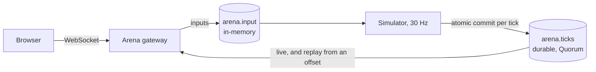

[felix-arena](https://github.com/GetFelix/felix-arena) is a team deathmatch
for up to eight players flying hover-craft in a walled arena, played in the
browser and self-hosted. When a player dies, the last few seconds replay from
the match's Felix log, and spectators can join a match in progress.

It is at the design stage. The repository holds a design, an art direction and
a static Three.js style frame. There is no game code and nothing touches Felix
yet, so everything below describes the design, not a running system.

## How it is designed to use Felix

An arena is a persistent room that runs match after match. Its resources are
created once, at deployment:

| Resource | Kind | What it holds |
|---|---|---|
| `arena.ticks.<arena>` | Durable stream, one shard, `Quorum`, three replicas | The match: one record per simulation tick, 30 a second |
| `keyframe`, `match/<n>` | Stream state keys on the tick stream | The latest keyframe tick and each match's first offset |
| `arena.input.<arena>` | In-memory stream | Player inputs |
| `arena.members.<arena>`, `arena.lobby` | Caches with a TTL | Who is connected, and every arena's status |
| `arena.epoch.<arena>` | Counter | The simulation's epoch, so readers can ignore a stale simulator |

One simulator per arena is the authority. It writes each tick as an
[atomic commit](/features/atomic-commits/) and waits for the answer before the
next, so ticks land in order and the simulator learns each tick's offset from
the commit's answer. Every 30th tick is a keyframe holding the whole match
state, and the same commit updates the `keyframe` state key, so the keyframe
and the pointer to it can never disagree. On a `Quorum` stream, a state read
never reflects a commit that a failover could take back.

Joining mid-match is a read of the `keyframe` key, whose version is the
keyframe's offset, followed by a subscription from that offset. The keyframe is
in the log, so the subscription continues into live ticks without a gap.

The kill cam is the same stream read from an earlier offset. A kill event names
`replay_from`, the offset of the tick three seconds before it, which the
simulator knows from its commit answers. The victim's client subscribes from
there on a second subscription and plays the ticks back through the same
renderer with a different camera. Recent records come from the broker's
in-memory replay ring, so a kill cam does not read from disk.
The design holds that subscription open for a few seconds because it predates
Felix's [range reads](/features/pubsub/#reading-a-range-without-subscribing),
added in 0.6.0-preview.3, which return a fixed slice of a stream without one.

Inputs go on an in-memory stream because an input 40 ms old is worthless and
the next one replaces it. Each input repeats the previous two, so a dropped
record is almost always covered by the next.

Browsers reach Felix through a gateway in the style of
[felix-gateway](/clients/browsers/), with a token narrowed to one arena and
RBAC roles for who may play and who may only watch. The design changes three
things in its own gateway (binary frames, separate live and replay
subscriptions, and sender stamping on the input stream), so it is not the stock
felix-gateway. Stamping the sender in the gateway is a trust decision the
design lists as a gap in Felix, since a Felix event does not carry its
publisher.



## Quick start

The only runnable part is the style frame, a static page:

```bash
git clone https://github.com/GetFelix/felix-arena
cd felix-arena/prototype && python3 -m http.server 8000
# open http://localhost:8000/style-frame.html
```

## More

- [README](https://github.com/GetFelix/felix-arena#readme)
- [Design](https://github.com/GetFelix/felix-arena/blob/main/docs/design.md), including the kill cam, failure modes, the build order and what the game would surface in Felix
- [Art direction](https://github.com/GetFelix/felix-arena/blob/main/docs/art.md)
