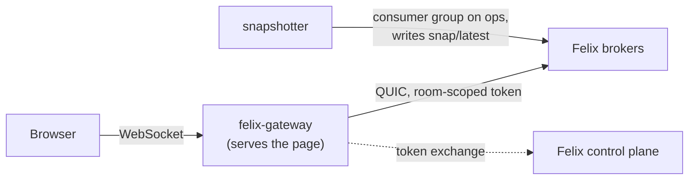

[felix-canvas](https://github.com/GetFelix/felix-canvas) is a self-hosted
multiplayer whiteboard. People draw shapes, pen strokes and rich text, see each
other's cursors, and can scrub back through a room's history. All of a room's
state lives in Felix.

## How it uses Felix

Each room is a [felix-gateway](/clients/browsers/) scope, so a browser's token
reaches one room's resources and nothing else. The seed creates these per room:

| Resource | Kind | What it holds |
|---|---|---|
| `canvas.ops.<room>` | Durable stream, one shard, 30-day retention | Every edit. The canvas is a fold of this log in offset order |
| `canvas.presence.<room>` | In-memory stream | Cursors and selections, subscribed from live |
| `canvas.snap.<room>` | Cache, key `latest` | A snapshot of the fold and the offset it covers |
| `canvas.members.<room>` | Cache, one key per session | Who is in the room. Entries expire 30 seconds after their last write |
| `canvas.seq.<room>` | Counter, one key per session | Blocks of per-session sequence numbers |

The edit stream has one shard because the fold needs one total order, and
Felix orders records within a shard. When the install sets `CANVAS_REPLICAS`
above 1 it is replicated with `Quorum` consistency, so an acknowledged edit
survives its leader failing.

Edits and cursors are separate streams because they want opposite things: an
edit must never be lost, and a cursor position from 40 ms ago is worthless.
Keeping cursors in memory also means a backed-up cursor feed never takes queue
space an edit needs.

Felix lets a slow subscriber [drop records](/features/pubsub/#isolation-and-backpressure)
rather than slow the publisher, so the browser checks every edit's offset. A
jump past the next expected offset (less any `skipped_before`) means records
were dropped, and the page subscribes again from the next offset it needs,
which the log still holds. Brokers run with
[`FELIX_ACK_ON_COMMIT`](/reference/environment-variables/#felix_ack_on_commit)
so a publish's ack carries its offset.

Joining a room follows the subscribe-before-read rule: subscribe to the edit
stream from live, then read `snap/latest`, then subscribe again from the
snapshot's offset plus one to fill the gap. Reading the snapshot first would
lose edits published in between. History is the same stream read on a second
connection from offset 0 or from a snapshot's offset.

The member list is a cache watch. Each session writes its entry every third of
the TTL from a Web Worker, so a closed tab drops out within 30 seconds, and a
tab that closes cleanly sends `POST /members/leave` to remove itself at once.
The TTL comes from the gateway's scope file.

A separate snapshotter process folds the edit stream into the snapshot cache.
It reads through a [consumer group](/features/queues/) named `snapshotter`
and acks an edit only after a stored snapshot covers it, so a crash replays
the unsnapshotted edits instead of losing them. It uses the Node
[`felix-client`](/clients/typescript/) package. The canvas has no server of
its own: the stock gateway image serves the page and relays everything else.

felix-canvas does not use atomic commits.



## Quick start

The compose install runs Felix, the gateway with the page, the snapshotter and
a development sign-in. You need Docker or Podman with Compose 2.20 or later:

```bash
curl -fsSL https://github.com/GetFelix/felix-canvas/releases/download/v0.2.0/felix-canvas-compose-0.2.0.tar.gz | tar xz
cd felix-canvas-compose-0.2.0
# change FELIX_BOOTSTRAP_TOKEN and FELIX_RAFT_PEER_TOKEN in .env first
docker compose up -d        # or: podman compose up -d
```

Open <http://localhost:8787> in two windows and sign in as `ana` or `ben`. The
images are `ghcr.io/getfelix/felix-canvas`, `ghcr.io/getfelix/felix-canvas-snapshotter`,
`ghcr.io/getfelix/felix-broker` and `ghcr.io/getfelix/felix-controlplane`.
The default install has one broker, so it has no failover.

## More

- [README](https://github.com/GetFelix/felix-canvas#readme)
- [Self-hosting](https://github.com/GetFelix/felix-canvas/blob/main/docs/self-hosting.md): identity provider, rooms, TLS, backups, Kubernetes and every setting
- [Design](https://github.com/GetFelix/felix-canvas/blob/main/docs/design.md) and [protocol](https://github.com/GetFelix/felix-canvas/blob/main/docs/protocol.md)
- [Development](https://github.com/GetFelix/felix-canvas/blob/main/docs/development.md) and [performance](https://github.com/GetFelix/felix-canvas/blob/main/docs/performance.md)
