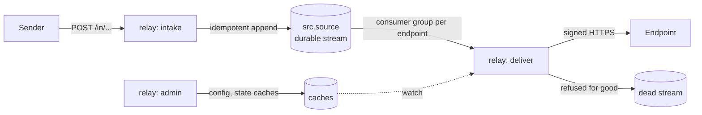

[felix-webhook-relay](https://github.com/GetFelix/felix-webhook-relay) takes
webhooks in, checks their signatures (Standard Webhooks, GitHub, Stripe or a
plain HMAC), stores them before answering `202`, and delivers them to each
endpoint signed with Standard Webhooks, with retries, backoff, pausing, dead
letters, replay and redrive. Felix is its only store.

## How it uses Felix

The relay runs in one Felix tenant, and each relay tenant is a Felix
namespace. Its services exchange an identity provider's ID token at the
control plane for a token narrowed to that namespace, so the broker, not the
relay, keeps relay tenants apart.

Each source is a durable stream, `src.<source>`, with one shard so every
endpoint sees one total order. It is created with `AtLeastOnce` delivery, and
with `Quorum` consistency when the relay is configured for more than one
replica. Intake answers `202` only after the append is acknowledged. The
compose install runs the broker with
[`FELIX_ACK_ON_COMMIT`](/reference/environment-variables/#felix_ack_on_commit)
and `on_commit` fsync, so an acknowledged webhook is on disk.

Appends go through felix-client's idempotent producer, which batches them and
re-sends a batch whose answer was lost without storing it twice. Deduplicating
a sender's own retries is a separate, best-effort check: an `idem` cache keyed
by source and event id, read before the append and written after it. Two
copies of one webhook arriving at the same moment can both be stored.

Each endpoint is a [consumer group](/features/queues/), `ep.<endpoint>`, on
its source's stream. One append fans out to every endpoint, each group is an
independent cursor over the same log, and an endpoint's backlog is just a
cursor that has not moved. A delivery task polls its group, sends, and acks
once the endpoint takes the record or the record is dead-lettered. Retries and
backoff are held in the relay: it does not nack, and a record whose claim
lapses stays with the task that holds it. Because a lapsed claim goes back to
the group, a delivery worker waits out the group's visibility timeout before
its first poll after starting.

The relay is built on Felix 0.6.0-preview.2. Felix 0.6.0-preview.3 added
[extending a claim and nacking with a delay](/features/queues/#long-work-backoff-and-giving-up-yourself),
which would let a consumer like this hand backoff to the broker.

A record the endpoint refuses for good is appended to the relay's own `dead`
stream and then acked. Records Felix itself dead-letters after
`FELIX_GROUP_MAX_ATTEMPTS` are listed, redriven or discarded through the group
dead-letter API.

Replay does not touch the groups. It reads a source's stream with a plain
subscription from an offset, found from a time range or given directly, and
checkpoints its progress in a cache. Each envelope carries its own receive
time, because Felix does not hand consumers an append timestamp.

The rest is caches and counters. `config` holds sources and endpoints, with
secrets sealed under the relay's key. `state` holds endpoint health, replay
jobs and dead-letter status. Workers follow both with retained cache watches,
so a config change reaches every worker without a restart. `stats` counters
count received, delivered, failed and dead records; a retried add counts
twice, so they are approximate. Delivery attempts go to an `attempts` stream
fire-and-forget, since it is a trail and not the source of truth.

The relay uses no atomic commits and no conditional writes.



## Quick start

The compose install runs the relay with a Felix broker and control plane and
Dex as a stand-in sign-in. You need Docker or Podman with Compose 2.20 or
later:

```bash
git clone --depth 1 https://github.com/GetFelix/felix-webhook-relay
cd felix-webhook-relay/deploy/compose
sed -i.bak "s|^RELAY_SECRET_KEY=.*|RELAY_SECRET_KEY=$(openssl rand -base64 32)|" .env
docker compose up -d --wait        # or: podman compose up -d --wait
```

Open <http://127.0.0.1:8090/admin/acme> and sign in as `alice@example.com`
with the password `password`. The README continues with creating a source and
an endpoint and sending a webhook. The images are
`ghcr.io/getfelix/felix-webhook-relay`, `ghcr.io/getfelix/felix-broker` and
`ghcr.io/getfelix/felix-controlplane`; there is also a Helm chart at
`oci://ghcr.io/getfelix/charts/felix-webhook-relay`.

## More

- [README](https://github.com/GetFelix/felix-webhook-relay#readme)
- [Design](https://github.com/GetFelix/felix-webhook-relay/blob/main/docs/design.md): the Felix layout, delivery, retries and configuration
- [Self-hosting](https://github.com/GetFelix/felix-webhook-relay/blob/main/docs/self-hosting.md) and [performance](https://github.com/GetFelix/felix-webhook-relay/blob/main/docs/performance.md)
