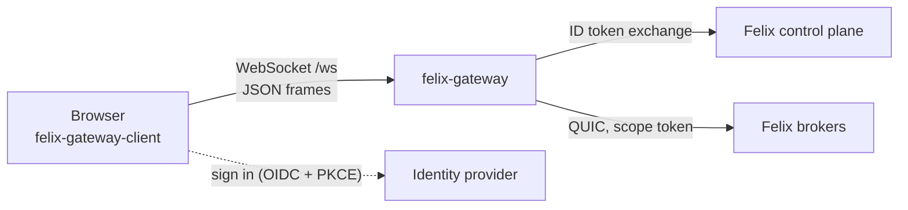

Browsers cannot speak QUIC, so they cannot use any of the Felix clients
directly. [felix-gateway](https://github.com/GetFelix/felix-gateway) sits
between them. A browser opens a WebSocket to the gateway, names one scope (a
room, a board, a match) and signs in. The gateway gets a Felix token that
reaches only that scope's streams, caches and counters, opens a Felix
connection with it, and relays JSON messages both ways without decoding
payloads.

The gateway holds no application state and knows no application names. A
scope file says which Felix resources a scope owns, so one binary serves any
app built from streams, caches and counters. It ships as a container image, a
binary and a Rust library (the `felix-gateway` crate), and the
`felix-gateway-client` npm package is the browser side. It is built on the
Rust [felix-client](/clients/rust/).



## Scopes and sign-in

A scope is a set of Felix resources named with a `{scope}` placeholder. With
the scope file below, a browser that joins room `lobby` reaches the stream
`app.ops.lobby` and the caches and counters named the same way, and nothing
else:

```toml
[scope]
field = "room"                     # join carries {"room": "lobby", ...}

[[scope.streams]]
alias = "ops"                      # what messages call it
name = "app.ops.{scope}"           # the Felix stream for scope {scope}
actions = ["publish", "subscribe"]

[[scope.caches]]
alias = "members"
name = "app.members.{scope}"
actions = ["read", "write", "watch"]
ttl_s = 30

[[scope.counters]]
alias = "seq"
name = "app.seq.{scope}"
actions = ["add"]
```

Signing in goes like this:

1. The page fetches `GET /oidc` from the gateway, which returns the
   identity provider's issuer, the client ID and the scopes to ask for.
2. It signs in with that provider using the authorization code flow with PKCE,
   as a public client, and gets an ID token.
3. Its first WebSocket message is `join`, carrying the scope's value and the
   ID token.
4. The gateway calls the control plane's
   [token exchange](/features/security/#token-exchange-oidc--felix) and asks
   for exactly the permissions the scope file lists on that scope's resources.
   The exchange only narrows what RBAC already grants the person, so whether
   they may open the scope is decided by Felix roles, not by the gateway.
5. It opens a Felix connection with the narrowed token and answers `hello`.
   The token is refreshed before it expires, and each refresh re-runs RBAC with
   the same narrowing.

The broker enforces the narrowing. A token for one scope cannot reach another
scope's resources, even for someone allowed in both, so a bug in the gateway
cannot leak across scopes. Felix grants a cache as a whole, never one key of
it, which is why each scope gets its own caches.

The gateway never creates resources or grants. The tenant, its trust in the
identity provider (with the gateway's client ID as audience), every scope's
streams and caches, and the roles that let people open them exist before the
gateway starts. Each action needs one Felix permission:

| Action | Felix permission |
|---|---|
| stream `publish` | `stream.publish` |
| stream `subscribe` | `stream.subscribe` |
| cache `read`, `watch` | `cache.read` |
| cache `write` | `cache.write` |
| counter `add` | `cache.write` (Felix keeps counters in caches) |

Two scope file options change what a sign-in can do. A resource marked
`optional = true` may be missing from the person's grants without refusing the
join; `hello` lists it under `missing`. That suits a spectator who may watch a
match but not publish a player's input. A stream marked `stamp_sender = true`
gets the publisher's Felix principal prefixed to every record (a 2-byte
big-endian length, then the UTF-8 bytes), because Felix events do not carry
their publisher and a browser should not be able to speak for someone else.

## The browser protocol

One WebSocket at `/ws` carries JSON text frames. Payloads are base64 and
opaque to the gateway. Messages name resources by their alias from the scope
file.

| Browser sends | Gateway answers |
|---|---|
| `join` (first message: scope, ID token, protocol version, features) | `hello`, or one `error` and a close |
| `subscribe` from `"live"` or a log offset | `subscribed` with the start offset and the stream's tail, then `event` messages |
| `publish`, with or without an ack | `ack` with the record's offset when the broker gave one |
| `counter_add` | `counter` with the sum after the add |
| `cache_get` | `cache_value` |
| `cache_put`, `cache_delete` | nothing, or `error` on failure |
| `cache_watch` | `cache_entries` with every entry, then a `cache_change` per write or delete |
| `throttle` (only if the scope file sets `allow_throttle`) | nothing |

The rules that matter when writing a browser app:

- On a durable stream every `event` carries its log offset, and events arrive
  in increasing offset order. Subscribing again from the last offset handled
  plus one is the recovery path after an `error` such as `subscription_ended`.
  An offset retention has discarded is answered with `trimmed`, naming the
  oldest offset left. On an in-memory stream offsets are always `null`.
- A connection's publishes and cache writes reach Felix one at a time, in the
  order the browser sent them. The gateway never resends a publish; a
  `publish_failed` may still have landed, and only the app knows whether a
  retry is safe.
- An `ack` carries an offset only when the broker acknowledges after writing
  the record. That needs [`FELIX_ACK_ON_COMMIT`](/reference/environment-variables/#felix_ack_on_commit)
  on the brokers; with the default, acks come back with `offset: null`.
- When a cache holds a snapshot of a stream up to some offset, subscribe first,
  wait for `subscribed`, then read the cache. Reading first loses whatever is
  published in between. This is the same ordering rule Felix itself follows
  when it registers a subscriber before reading history.
- The protocol has a version and negotiated features, the way the
  [Felix wire protocol](/architecture/wire-protocol/) does. Version 1 is
  frozen, and an older browser keeps working against a newer gateway.

A browser that stops reading does not lose records on a durable stream. The
gateway holds up to 1,024 events per connection and then stops reading the
Felix subscription. Felix's [bounded per-subscriber queue](/features/pubsub/#isolation-and-backpressure)
then drops, reports the drop, and the gateway resumes from the log after the
last event it relayed, so the browser gets every record, late and in order. An
in-memory stream has no log to resume from, so its dropped events are gone.

[docs/protocol.md](https://github.com/GetFelix/felix-gateway/blob/main/docs/protocol.md)
in the gateway repository is the reference for every message, field and error
code.

From a browser app:

```bash
npm install felix-gateway-client
```

```ts
import { GatewayClient } from "felix-gateway-client";

const client = await GatewayClient.connect("wss://example.com/ws", { room: "lobby", token });
client.onEvent = (event) => console.log(event.stream, event.offset, event.payload);
client.subscribe("ops", "live");
await client.publish("ops", new TextEncoder().encode("hello"));
```

`felix-gateway-client/fake` has an in-memory stand-in with the same shape, for
tests that should not need a gateway or a broker.

## Configuration

Settings come from environment variables. Three are required.

| Variable | Default | Meaning |
|---|---|---|
| `GATEWAY_SCOPE_FILE` | required | The scope file. The image sets `/etc/felix-gateway/scope.toml` |
| `GATEWAY_TENANT` | required | The Felix tenant that trusts the identity provider |
| `GATEWAY_OIDC_CLIENT_ID` | required | The client registered for the browser app at the identity provider. ID tokens carry it as audience |
| `GATEWAY_OIDC_ISSUER` | `http://127.0.0.1:9400` | The identity provider's OpenID Connect issuer URL |
| `GATEWAY_OIDC_SCOPES` | `openid profile` | The scopes a browser asks the provider for |
| `GATEWAY_NAMESPACE` | `default` | The Felix namespace the scope's resources live in |
| `GATEWAY_LISTEN` | `127.0.0.1:8787` | Where browsers connect. The image sets `0.0.0.0:8787` |
| `GATEWAY_FELIX_BROKERS` | `127.0.0.1:5000` | Comma-separated broker addresses as `host:port`, resolved again at each connection |
| `GATEWAY_FELIX_SERVER_NAME` | `localhost` | The name the broker's certificate is checked against |
| `GATEWAY_FELIX_CA_FILE` | unset | PEM certificates to trust for the broker. Unset uses the platform trust store |
| `GATEWAY_FELIX_CONTROL_PLANE` | `http://127.0.0.1:8443` | The control plane's base URL, where sign-ins are exchanged |
| `GATEWAY_WEB_DIR` | unset | A built web app to serve on every path the gateway does not route itself |
| `RUST_LOG` | `info` | Log filter |

The scope file is read once at startup. Unknown keys, a name without
`{scope}`, or an invalid alias stop the gateway from starting. The full list
of scope file keys is in the repository's
[docs/configuration.md](https://github.com/GetFelix/felix-gateway/blob/main/docs/configuration.md).

Besides `/ws`, the gateway serves `GET /oidc` (also its health check),
`POST /members/leave` (a cache delete a closing tab can send with
`navigator.sendBeacon`), and `GET /metrics`, which reports two latency
histograms apart: the browser round trip and the time from handing an acked
publish to Felix until its ack, per stream.

## Running it next to a cluster

Set up the tenant, its identity provider, the scope's streams and caches and
the roles first; the gateway checks none of that until a browser joins. Then
point the gateway at the brokers and the control plane.

The image is `ghcr.io/getfelix/felix-gateway`, for amd64 and arm64. It runs as
uid 65532 and listens on 8787:

```bash
docker run -p 8787:8787 \
  -e GATEWAY_TENANT=my-tenant \
  -e GATEWAY_OIDC_CLIENT_ID=my-app \
  -e GATEWAY_OIDC_ISSUER=https://login.example.com \
  -e GATEWAY_FELIX_BROKERS=felix-broker:5000 \
  -e GATEWAY_FELIX_CONTROL_PLANE=https://felix-controlplane:8443 \
  -v "$PWD/scope.toml:/etc/felix-gateway/scope.toml:ro" \
  ghcr.io/getfelix/felix-gateway:0.2.0
```

With Podman the arguments are the same. On an SELinux host, relabel the
mounted file:

```bash
podman run -p 8787:8787 \
  -e GATEWAY_TENANT=my-tenant \
  -e GATEWAY_OIDC_CLIENT_ID=my-app \
  -e GATEWAY_OIDC_ISSUER=https://login.example.com \
  -e GATEWAY_FELIX_BROKERS=felix-broker:5000 \
  -e GATEWAY_FELIX_CONTROL_PLANE=https://felix-controlplane:8443 \
  -v "$PWD/scope.toml:/etc/felix-gateway/scope.toml:ro,Z" \
  ghcr.io/getfelix/felix-gateway:0.2.0
```

If the brokers use a certificate from a private CA, mount it and set
`GATEWAY_FELIX_CA_FILE`; set `GATEWAY_FELIX_SERVER_NAME` to the name the
certificate carries. See [Docker or Podman](/getting-started/containers/) for
other differences between the two engines.

To run the binary instead:

```bash
cargo install felix-gateway
GATEWAY_SCOPE_FILE=scope.toml GATEWAY_TENANT=my-tenant \
  GATEWAY_OIDC_CLIENT_ID=my-app GATEWAY_OIDC_ISSUER=https://login.example.com \
  GATEWAY_FELIX_BROKERS=broker-1:5000,broker-2:5000 \
  GATEWAY_FELIX_CONTROL_PLANE=https://controlplane:8443 \
  felix-gateway
```

The repository's `dev/up.sh` starts a control plane, a broker, a stand-in
identity provider and seeded rooms, and `dev/seed.mjs` shows every grant a
deployment needs.

## Limits

- Each browser session opens its own Felix client, and a broker accepts a
  bounded number of connections, so one gateway does not serve very large
  audiences yet. Felix itself can carry many users over one client
  (`Client::with_identity`), with each user's subscriptions and publish bytes
  limited separately on the shared connection. On a broker that binds tokens
  to client certificates (`FELIX_TLS_CLIENT_CERT_BIND_SUBJECT`), a gateway
  sharing its connections has to exchange each user's token at the control
  plane's `/token/delegate` first, which names the gateway as the token's
  actor; the gateway's principal needs `token.delegate` on the tenant. The
  gateway does not do either yet.
- Events carry no publisher, which is why sender stamping lives in the gateway
  and only on streams marked `stamp_sender`.
- The scope file describes one kind of scope. An app with two kinds runs two
  gateways.
- The gateway never retries a publish or a counter add. A counter add retried
  by the browser after a lost answer is counted twice.
- The gateway is pre-1.0. The scope file format and library API may change
  between minor versions; version 1 of the browser protocol will not.
