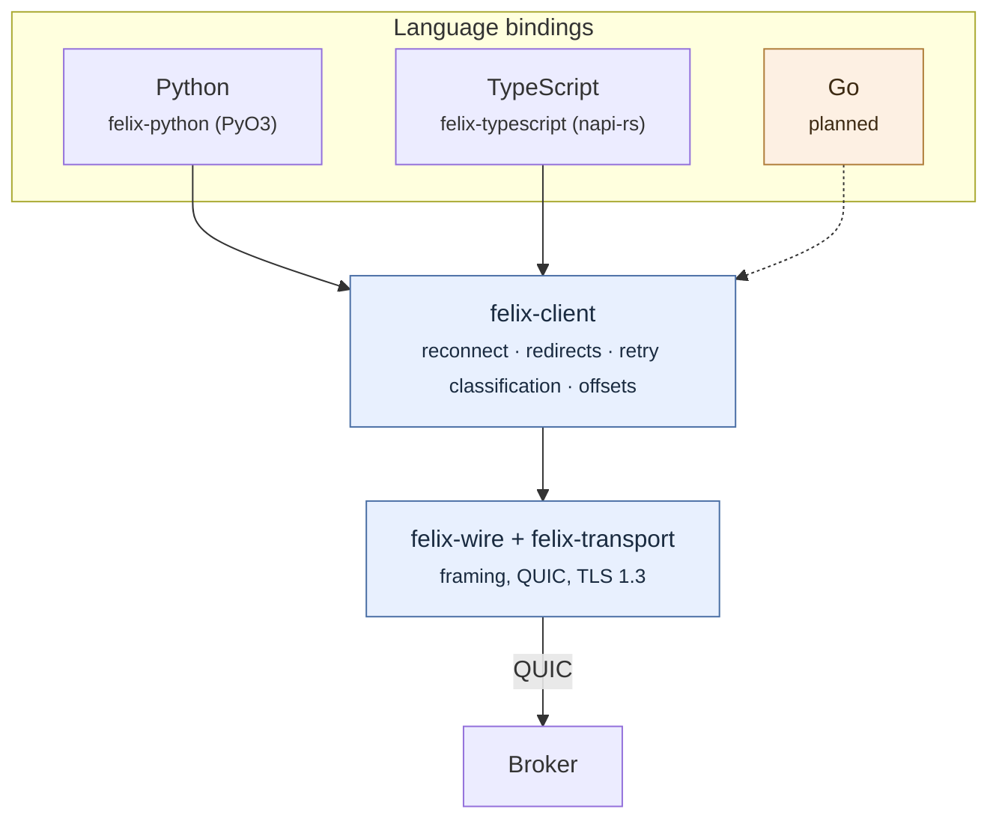
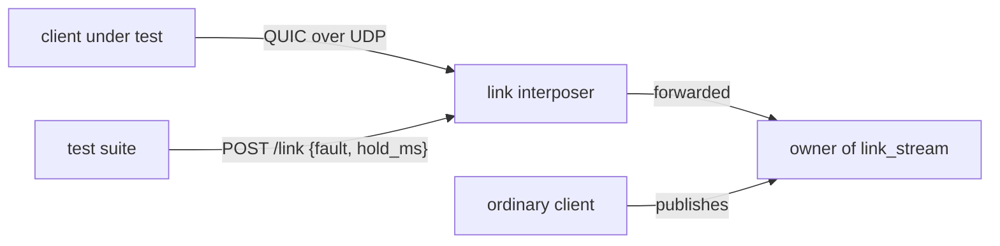

Felix has three clients today: Rust, Python, and TypeScript. This page covers
how they relate to each other, which is worth understanding before you depend
on one. Each client's own page covers using it.

## One implementation, several bindings

A Felix client does more than encode frames. It reconnects when the broker it
was using disappears, follows redirects to whichever broker owns the shard it
wants, follows a subscription's shard when a rebalance moves it, decides which failures are worth retrying and which are not, and keeps
track of offsets precisely enough that a resuming subscriber neither skips a
record nor sees one twice.

All of it is easy to get *nearly* right, so Felix writes it once. The Rust client (`felix-client`) holds the
behaviour; every other language binds to it through a thin wrapper:



Most systems write a native client per language, each speaking the wire
protocol directly, and end up with clients that behave subtly differently from
one another. The differences never show up
in a demo. They show up when a broker dies at an inconvenient moment and one
language's client loses records the other would have kept.

The cost is that a binding needs a Rust toolchain to build (though not to
*install*, since wheels and their equivalents ship compiled), and a language
with poor FFI support is harder to serve. In return, when reconnection is
improved every language gets the improvement, and no language can drift.

## The conformance suite

Sharing an implementation removes most divergence. It does not remove all of
it, because a binding still decides how to expose things: what an error looks
like, whether a timeout is an exception or a return value, whether closing
twice is safe.

So there is a catalogue of the semantics a client must implement, and a runner
that checks a client against it:

```bash
task conformance:scenarios     # what a client must implement, and why
task conformance:fixture       # a cluster to run a suite against
task conformance:verify -- results.json
```

The catalogue (`crates/testing/felix-conformance/scenarios.toml`) is deliberately
weighted toward the semantics a second client tends to approximate rather than
implement. Some examples:

| Scenario | What goes wrong without it |
|---|---|
| `redirect.carries_the_start_offset_through_every_hop` | A client that rebuilds the subscribe request when redirected drops the start offset and begins at the live tail. The call succeeds. Every record between the requested offset and now is simply absent, and nothing anywhere reports an error. |
| `reconnect.subscription_resumes_at_the_next_offset` | Off by one in one direction loses records silently; off by one in the other duplicates them. |
| `retry.ambiguous_outcomes_are_not_silently_retried` | Re-sending a publish that may already have been applied duplicates it, and nothing downstream can tell the copies apart, so the delivery guarantee changes without anyone choosing it. |
| `retry.idempotent_producers_re_send_ambiguous_outcomes` | With a producer id and a sequence the broker can tell the copies apart, so the producer must re-send under the same sequence. A client that advances the sequence on a failure, or re-sends after a refusal, turns the guarantee back into a guess. |
| `error.unauthorized_is_typed` | An application that cannot tell "not permitted" from "unreachable" retries the one that will never succeed. |
| `fault.subscription_through_a_dropped_link` | A subscription whose connection goes silent ends as though the stream had finished. The consumer loop exits cleanly, and the records published meanwhile are never read. |
| `error.quorum_timeout_is_outcome_unknown` | A write that may have survived, reported as a plain failure, gets resent and duplicated; reported as success, it may be lost. |

Each scenario has a stable id. A client's test suite tags its tests with those
ids, emits a results document, and `verify` reports any **required** scenario
without a passing result, by name. A skip does not satisfy a requirement, and
a result naming a scenario that does not exist is reported rather than ignored,
because a misspelled tag would otherwise look like coverage.

Optional scenarios may go unclaimed (a binding is allowed not to wrap a
surface yet), but may not *fail*. Claiming a semantic and getting it wrong is
worse than not claiming it.

### Connection faults

A handful of scenarios break the client's connection on purpose. Each carries a
`step` in the catalogue saying what to break, when, and for how long:

```toml
step = { during = "subscribe", fault = "drop", after_records = 3, records = 10, hold_ms = 8000 }
```

The fixture puts a UDP interposer in front of the broker that owns one
single-shard stream (`link_stream`) and serves it at `link_addr`. A suite
connects a client with `link_addr` as its only seed, handles `after_records`
records, and then asks the fixture's control endpoint to break the link:



| `fault` | What the interposer does | What the client sees |
|---|---|---|
| `drop` | discards every datagram, both ways, for `hold_ms` | silence, then its idle timeout (6 s by default); a new connection through the interposer fails until the hold ends |
| `reset` | kills every connection open through it, for good | the same idle timeout, but a reconnect gets through at once |
| `stall` | holds every datagram for `hold_ms`, then delivers them in order | a pause shorter than the idle timeout, and nothing lost |

QUIC encrypts everything a middlebox could forge, so there is no RST to inject:
a client learns of a drop or a reset from its own idle timeout, which is why the
drop holds past it.

What passes:

- **Mid-publish**, every publish returns, with an acknowledgement or an error,
  and none hangs. Once the fault is over the client publishes again, and every
  record it acknowledged is in the stream.
- **Mid-subscribe**, the subscription either resumes, delivering the rest at
  contiguous offsets with no gap and no duplicate, or raises. **Ending as though
  the broker had closed the stream fails**: that is a consumer loop exiting
  quietly on a dead connection with nothing to tell it records were missed.
- Through a **stall**, an error fails too. The connection never died.

The fixture JSON carries the steps under `faults`, so a suite in a language
without a TOML parser does not have to hard-code them. `cargo run -p
felix-conformance` runs the same steps with the Rust client, through
`ClusterClient` (which resumes) and through a plain `Client` (which reports the
loss), each on its own interposer in front of the in-process broker.

The suites poll a subscription with a short timeout, the way application code
does. That drops the read in flight every 250 ms, and it is what found a
`ClusterSubscription` that, cancelled while resubscribing, came back to its dead
subscription and reported the end of the stream, and, once that was fixed,
started a resubscribe that took longer than the timeout over on every call.

New languages are gated on this suite, not on review, because "looks correct"
is the standard that produces divergence.

### Licensing of the kit

The conformance kit is **AGPL-3.0**, like the broker it links to run its suite.
That does not reach your client: you run `felix-conformance verify` over a
results file your client produced, and nothing from the kit is linked into what
you ship. The specification itself is Apache-2.0: the wire protocol in
`felix-wire`, its byte-level test vectors, and `docs/protocol.md`.

## The three clients

Each has its own page: what to install, the surface, and the failure modes
worth writing code for.

| | | |
| --- | --- | --- |
| **[Rust](/felix/clients/rust/)** | `felix-client` on crates.io | The reference client, and the one the others are built from. |
| **[Python](/felix/clients/python/)** | `felix-client` on PyPI | A PyO3 binding, with a synchronous and an asyncio surface over the same Rust client. |
| **[TypeScript](/felix/clients/typescript/)** | `felix-client` on npm | A napi-rs addon. One asynchronous surface, because blocking Node's event loop is not something a library may do. |

Python and TypeScript both pass every required scenario in the catalogue, and
CI is gated on both. Each leaves a couple of optional scenarios unclaimed
rather than passing over them in silence; their pages say which.

## Planned

Go, then C#, in that order, because that is where Felix's intended workloads
live. Each is gated on passing the conformance suite.

If you want to write one sooner, the things you need are all public: the
[wire protocol](/felix/architecture/wire-protocol/) if you are implementing
natively, the conformance catalogue either way, and `crates/sdk/felix-python` or
`crates/sdk/felix-typescript` as worked examples of the binding approach: a few
hundred lines of Rust over a client that already works.
