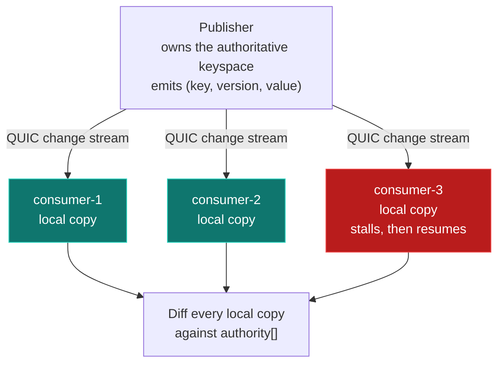

## What this shows

This demo does not showcase a feature. It shows what an at-most-once
configuration costs, deliberately.

Consumers maintain a local copy of a config keyspace built from a change stream
on an ephemeral stream that drops on overflow. One consumer stalls briefly,
recovers, and everything goes quiet. It is still holding wrong values for most
of the keyspace, permanently, with nothing in the API that would tell it so.

Run it alongside [Slow-consumer Isolation](/felix/demos/slow-consumer-isolation/). That one
shows Felix's shipped strength; this one shows what that strength costs.

## Why this exists

For an event feed, a dropped message means a consumer missed one update. For a
consumer maintaining a local copy of state, a dropped message means its local copy
is **permanently wrong**, with no signal that would let it recover on its own.

Felix has ways out of this, and the demo uses none of them on purpose. A durable
stream gives every event an offset, so a consumer sees a drop as a jump and can
resubscribe from the last offset it handled
([resumable subscriptions](/felix/getting-started/what-felix-is-for/) are
shipped). A retained `cache_watch` on a log-backed cache starts from current
values, resumes by offset, and is ended with the offset to re-watch from when it
falls behind. The status table marks distributed live-state synchronisation as
**partly** usable: those primitives exist, but in-memory caches and ephemeral
streams, like the one here, still drop with no way to resynchronise.

`lossy_mode_leaves_the_stalled_consumer_permanently_wrong` asserts the
divergence, and `lossless_mode_converges_every_consumer` asserts the blocking
configuration converges.

## Notes

- Starts an in-process broker and QUIC server on a random local port, with one
  ephemeral stream.
- Default workload is a **control-plane change feed**: 2,000 keys at 400 changes/sec,
  not a firehose. This matters; see *Why the rate is low* below.
- Key churn is Zipf-skewed. A handful of keys change constantly; most rarely do.
- Publishing **stops** when the stall ends, then consumers are given time to drain
  before anything is measured. What is still wrong afterwards is permanently wrong.

## Architecture



## Run

```bash
task demo:state-divergence
# or
cargo run --release --manifest-path demos/state-divergence/Cargo.toml
```

## Configuration flags

| Flag | Default | Meaning |
| --- | --- | --- |
| `--rate N` | `400` | Changes published per second |
| `--keys N` | `2000` | Size of the config keyspace |
| `--consumers N` | `3` | Consumer count; must be at least 2 |
| `--payload N` | `64` | Payload bytes |
| `--queue-capacity N` | `512` | Subscriber queue depth (the broker default) |
| `--duration N` | `4` | Seconds per phase; a run is 5 phases |
| `--mode M` | `both` | `lossy`, `lossless`, or `both` |
| `--no-tui` | off | Plain text instead of the terminal UI |

## Expected output (sample)

```
  at-most-once (production defaults)
    11820 changes published

    consumer-1    applied    11820   state CORRECT
    consumer-2    applied    11820   state CORRECT
    consumer-3    applied     4072   1465 of 2000 keys PERMANENTLY WRONG  <- stalled

  lossless (block at every checkpoint)
    11831 changes published

    consumer-1    applied    11831   state CORRECT
    consumer-2    applied    11831   state CORRECT
    consumer-3    applied    11831   state CORRECT  <- stalled
```

The stalled consumer is not *behind*. It has caught up, drained everything still
queued for it, and settled, and 73% of its keyspace is wrong. It received no error,
no gap notification, and no indication that anything happened.

## Why the rate is low

Twelve keys at 20,000 changes/sec show **zero** permanent divergence, despite
dropping 120,000 events. At that ratio every key is rewritten thousands of times
a second, so any missed update is overwritten by a correct one almost
immediately.

Churn heals divergence. That is a real property, but it comes from an
unrealistic workload. A control-plane config feed is thousands of
keys changing a few hundred times a second, where most keys are touched rarely and
a missed update can stand indefinitely. The defaults reflect that.

It also explains where the damage concentrates: hot keys self-repair, so what
survives is disproportionately the cold keys: authorization policy, certificate
rotation, residency rules. Those are the ones you would least want to be silently
wrong about.

## The lossless column is not the answer

Configuring every checkpoint to block does eliminate divergence, and it is a
legitimate deployment choice. But it converges only by letting the slowest consumer
throttle the publisher and therefore every other consumer. That is exactly the
trade-off [Slow-consumer Isolation](/felix/demos/slow-consumer-isolation/) measures. Neither
column is free.

The way out is not blocking but a stream a consumer can resume. Publish the
changes to a durable stream and resubscribe from the last offset handled, or
keep the keyspace in a log-backed cache and use a retained `cache_watch`, which
delivers current values first and names the offset to re-watch from when it
falls behind.

## How to extend

- Raise `--rate` or lower `--keys` to watch divergence shrink as churn repairs it.
- Lower `--queue-capacity` to make the stalled consumer start missing sooner.
- Add a second stalling consumer to check whether their surviving keyspaces differ.
  Two consumers can be wrong about *different* keys, which is worse than both being
  stale in the same way.
