This guide follows a message through the code. It is for contributors who want
to know which task owns each piece of work, where data is queued, what is
copied, what is shared, and what happens under overload.

Code references use `path::symbol` rather than line numbers, because symbols
move less.

:::note[Scope]
Felix runs as a cluster: brokers own shards placed by the control plane, forward
what they do not own, replicate what they lead, fail over to a caught-up
replica, and move shards between brokers online. Durable storage, the
log-backed cache, and consumer groups are wired into the running broker.

The [status table](/getting-started/what-felix-is-for/) is the page to
trust per capability. Tiered storage and load-aware placement are among what is
not built.
:::
## 1. The shortest useful mental model

Felix is a brokered messaging and caching system:

- **Publishers** send byte payloads to named streams.
- **Subscribers** receive new payloads published to those streams.
- **Cache clients** store and retrieve values under scoped keys.
- A **broker** authenticates clients, validates resource scope, accepts traffic,
  and routes it through bounded queues.
- A **control plane** owns metadata and authorization state. Brokers periodically
  synchronize a local view of tenants, namespaces, streams, and caches.

The current pub/sub data path is:

```mermaid
flowchart LR
    subgraph pubproc["Publisher process"]
        direction TB
        APP1(["application"]) e1@--> PUB["felix-client<br/>Publisher"]
        PUB e2@--> CADM["publish admission<br/><small>+ worker queue</small>"]
    end

    subgraph broker["Broker"]
        direction TB
        DEC["frame decode<br/><small>+ authorization</small>"] e4@--> BADM["publish admission<br/><small>+ stream-sharded worker</small>"]
        BADM e5@--> ST[("felix-broker StreamState<br/><small>claim offsets, persist, append</small>")]
        ST e6@--> SQ["per-subscriber<br/>broker-core queue"]
        SQ e7@--> LANE["subscription lane<br/><small>encode once</small>"]
        LANE e8@--> CW["per-connection writer"]
    end

    subgraph subproc["Subscriber process"]
        direction TB
        ROUTER["event router<br/><small>+ subscription queue</small>"] e10@--> APP2(["application"])
    end

    CADM e3@-->|"QUIC bidirectional stream"| DEC
    CW e9@-->|"QUIC unidirectional event stream"| ROUTER

    e1@{ animate: true }
    e2@{ animate: true }
    e3@{ animate: true }
    e4@{ animate: true }
    e5@{ animate: true }
    e6@{ animate: true }
    e7@{ animate: true }
    e8@{ animate: true }
    e9@{ animate: true }
    e10@{ animate: true }

    classDef step fill:#e8f0fe,stroke:#4a6fa5,color:#1a2b40
    classDef store fill:#fdf0e3,stroke:#b07d3a,color:#3d2a12
    classDef endpoint fill:#e9f5ec,stroke:#4a8a5e,color:#16301f
    class PUB,CADM,DEC,BADM,LANE,CW,ROUTER step
    class ST,SQ store
    class APP1,APP2 endpoint
```



Every hop above is a named thing in the code. §9 and §11 walk the publish and
subscribe halves in order.

The important architectural boundary is:

- `crates/server/felix-broker/src/` contains the transport-independent broker core.
- `services/felix-broker-service/src/` turns that core into a network service.
- `crates/sdk/felix-client/src/` implements the client-side connection pools and
  APIs.
- `crates/protocol/felix-wire/src/` defines what the two sides exchange.
- `crates/protocol/felix-transport/src/` wraps the QUIC implementation.

## 2. Repository map

| Area | Responsibility | Start reading |
|---|---|---|
| `crates/protocol/felix-wire` | Frame header, protocol messages, binary fast paths | `crates/protocol/felix-wire/src/lib.rs` |
| `crates/protocol/felix-transport` | QUIC endpoint, connection, stream, flow-control, and UDP configuration | `crates/protocol/felix-transport/src/lib.rs` |
| `crates/sdk/felix-client` | Publisher, subscription, and cache client APIs | `crates/sdk/felix-client/src/lib.rs` |
| `crates/server/felix-broker` | Stream registry, publish path (claim, persist, fan out), replay ring, subscriber registry, consumer groups | `crates/server/felix-broker/src/lib.rs` |
| `crates/server/felix-storage` | Segment log, commit sequencer, log-backed and in-memory caches, counters | `crates/server/felix-storage/src/lib.rs` |
| `crates/server/felix-replication` | Broker-to-broker transport and log replication | `crates/server/felix-replication/src/lib.rs` |
| `crates/server/felix-authz` | Token verification types and permission matching | `crates/server/felix-authz/src/lib.rs` |
| `services/felix-broker-service` | Runnable broker, network handlers, auth, metrics, control-plane sync | `services/felix-broker-service/src/main.rs` |
| `services/felix-controlplane-service` | Metadata APIs, placement, token exchange, JWKS, and RBAC | `services/felix-controlplane-service/src/lib.rs` |

## 3. QUIC transport

### 3.1 Why QUIC

QUIC runs over UDP and gives Felix TLS 1.3, reliable delivery, congestion and
flow control, and many independent ordered byte streams inside one connection.
A lost packet on one stream does not stall the others, so one connection can
carry several publish or cache workers.

Bytes within one stream are still ordered, and Felix gives each stream exactly
one writer task. The number of connections and streams is therefore what sets
real parallelism.

Felix uses the [`quinn`](https://github.com/quinn-rs/quinn) Rust implementation.
The wrapper types are:

- `crates/protocol/felix-transport/src/server.rs::QuicServer`
- `crates/protocol/felix-transport/src/client.rs::QuicClient`
- `crates/protocol/felix-transport/src/connection.rs::QuicConnection`

`QuicServer::bind` and `QuicClient::bind` create UDP sockets, install Quinn's
transport configuration, and create endpoints whose driver tasks run on a
dedicated I/O runtime when one is configured, or on the application's Tokio
runtime otherwise.

### 3.2 Connections and streams

A QUIC **connection** is the encrypted relationship between a client endpoint
and a server endpoint. A connection contains many streams:

- A **bidirectional stream** has one send direction and one receive direction.
  Either peer may send data on its half.
- A **unidirectional stream** carries bytes in one direction only.

Felix maps its operations onto these primitives:

| Operation | Stream type | Why |
|---|---|---|
| Authentication and acknowledged publish | Bidirectional | Client sends requests; broker sends responses |
| Subscribe setup | Bidirectional | Client sends `Subscribe`; broker returns `Subscribed` or `Error` |
| Event delivery | Broker-opened unidirectional | Events flow only from broker to subscriber |
| Cache put/get | Bidirectional | Each operation is a request/response exchange |
| Optional high-throughput publish ingress | Client-opened unidirectional | Fire-and-forget traffic does not need responses |

The current Rust client opens authenticated bidirectional workers for its normal
publish API. The broker also supports unidirectional publish ingress in
`services/felix-broker-service/src/serving/quic/streams/uni.rs::run_uni_loop`.
Fire-and-forget means that the broker does not return a publish response; it
does not mean that the stream is unauthenticated. A unidirectional publish
stream must begin with `Message::Auth` before it sends publish frames.

### 3.3 Transport tuning

`crates/protocol/felix-transport/src/config.rs::TransportConfig` controls:

- maximum concurrent streams;
- connection and per-stream flow-control windows;
- send window;
- initial MTU and path-MTU discovery;
- maximum accepted UDP payload;
- UDP socket send and receive buffers; and
- an optional initial congestion window.

`TransportConfig::quinn_transport_config` translates these settings into Quinn
configuration. `TransportConfig::bind_udp_socket` applies socket buffer sizes
best-effort, reducing the requested size until the host accepts it.

These settings matter because high-rate messaging can otherwise become limited
by tiny flow-control windows, excessive small datagrams, or kernel UDP drops.
They improve capacity; they do not change Felix's delivery semantics.

## 4. Felix's wire protocol

QUIC provides reliable byte streams, but it does not define where one Felix
message ends and another begins. Felix adds its own framing protocol in
`crates/protocol/felix-wire/src/client/`.

### 4.1 Frame envelope

Every Felix frame begins with `FrameHeader`, a 12-byte header:

```text
u32 magic    = 0x464C5831 ("FLX1")
u16 version  = 1
u16 flags
u32 payload length
payload bytes...
```

`FrameHeader::decode` rejects an invalid magic value, unsupported version, or
incomplete header before the payload is trusted. Higher-level read helpers also
enforce configured frame-size limits.

### 4.2 JSON control messages

`crates/protocol/felix-wire/src/client/message.rs::Message` is the version-one protocol enum. With
zero flags, `Message::encode` serializes a message as JSON and places it in a
frame. JSON is used where flexibility and request metadata matter more than
minimum encoding overhead:

- `Auth`
- acknowledged `Publish` and `PublishBatch`
- `Subscribe` and `Subscribed`
- `EventStreamHello`
- cache request/response messages
- acknowledgements and errors

Payload bytes inside JSON messages are Base64 encoded.

### 4.3 Binary data-plane frames

The hot paths avoid JSON:

- `FLAG_BINARY_PUBLISH_BATCH` identifies a binary publish batch, and
  `FLAG_BINARY_PUBLISH_ACKED` one that expects an acknowledgement.
- `FLAG_BINARY_EVENT_BATCH` identifies the event format that includes a
  subscription ID.
- `FLAG_BINARY_EVENT_BATCH_SHARED` identifies the shared event format the
  broker sends.
- `FLAG_EVENT_BATCH_OFFSETS` and `FLAG_EVENT_BATCH_SKIPPED` add a base offset
  and a skip count to an event batch, for subscribers that negotiated them
  (see §11.9).

The binary publish encoder
`felix_wire::binary::encode_publish_batch_bytes_with_stats` writes the resource
names, item count, and length-prefixed payloads directly into a byte buffer.

The shared event encoder
`felix_wire::binary::encode_shared_event_batch_bytes` writes only:

```text
u32 payload_count
repeated:
  u32 payload_length
  payload bytes
```

It does not repeat tenant, namespace, stream, or subscription identifiers. The
preceding `EventStreamHello` has already bound that QUIC stream to one
subscription. With offsets negotiated, a `u64 base_offset` comes before the
count. A batch that follows offsets holding no event also sets
`FLAG_EVENT_BATCH_SKIPPED` and carries a `u64 skipped_before` after the base
offset.

## 5. Felix's resource model

Pub/sub resources are scoped as:

```text
tenant -> namespace -> stream
```

Cache resources are scoped as:

```text
tenant -> namespace -> cache -> key
```

The broker keeps local registries for these objects in
`crates/server/felix-broker/src/broker/registry.rs`. A stream does not become valid merely
because a client names it; it must exist in the broker's synchronized metadata.

The running service obtains metadata from the control plane through
`services/felix-broker-service/src/cluster/catalog_sync.rs::start_sync`. On cold start,
`sync_once` fetches full snapshots in dependency order:

1. tenants;
2. namespaces;
3. caches;
4. streams.

Later iterations consume incremental change feeds. Each resource type has its
own sequence cursor. A failed fetch is retried without advancing that cursor,
so synchronization is eventually consistent rather than transactional across
all resource types.

## 6. Broker startup and process lifecycle

The executable starts at `services/felix-broker-service/src/main.rs::main`, which calls
`node::run_with_shutdown` (`services/felix-broker-service/src/node.rs`).

Startup proceeds in this order:

1. `observability::init_observability` installs tracing and the Prometheus
   recorder.
2. `BrokerConfig::from_env_or_yaml` resolves configuration.
3. `node::storage::open` opens durable storage when it is configured, the
   cache, consumer groups and counters, and builds the `Broker` over them.
4. `BrokerAuth::new` creates the broker's control-plane-backed authenticator.
5. `observability::serve_metrics` starts the health and metrics HTTP server.
6. `node::listeners::bind` creates the QUIC TLS configuration
   (`build_server_config`) and binds one `QuicServer` per configured listener.
7. `node::listeners::spawn_accept_loops` starts an accept loop per listener
   (`quic::serve_with_shutdown`).
8. `node::sync::spawn_catalog_sync` starts metadata synchronization
   (`catalog_sync::start_sync_with_signal`).
9. On a cluster member, `node::membership::spawn` registers the node, and
   `node::cluster` binds the peer listener and starts the shard and
   replication tasks.

:::caution[TLS certificate behavior]
`services/felix-broker-service/src/serving/tls.rs` serves the certificate in
`FELIX_TLS_CERT` / `FELIX_TLS_KEY`, re-read on rotation. Without them it
generates a fresh self-signed certificate for `localhost` at every start and
warns; that is development behavior, and `FELIX_TLS_REQUIRE_CERT=true` refuses
it.
:::
### 6.1 Graceful shutdown

Shutdown is not a single task abort. `run_with_shutdown` performs an ordered
drain:

1. mark readiness as draining, so load balancers stop routing here while the
   broker can still serve;
2. on a cluster member, ask the control plane to move this broker's shards
   elsewhere (`node/handoff.rs`), bounded by `FELIX_SHUTDOWN_HANDOFF_TIMEOUT_MS`;
   whatever is still led when that runs out fails over;
3. cancel the QUIC accept loop so no new connections are admitted;
4. wind down the connections already accepted, and wait for them under one
   deadline;
5. stop control-plane synchronization;
6. stop the metrics server last.

Metrics stay up so operators can see what is still in flight. The deadline is
one `felix_common::lifecycle::DrainBudget` shared by every subsystem, not a
timeout per subsystem, so total shutdown time stays bounded however many things
are slow.

Step 4 is the subtle one. The same cancellation token reaches every connection
task, and `handle_connection_with_shutdown` responds by:

1. no longer accepting new streams on that connection;
2. giving the streams already in flight a bounded grace period (half the
   process drain budget) to finish; and
3. closing the QUIC connection with CONNECTION_CLOSE, so the peer learns this
   was a deliberate shutdown rather than a server that vanished.

The grace has to be bounded because control and subscription streams are
long-lived: neither ends until the client closes it. Waiting on them without a
bound would burn the whole deadline and then force-abort, dropping the
in-flight work the drain exists to protect.

In-flight work inside the grace window completes. Publish executors,
acknowledgement waiters and subscription writers are not signalled one by one,
so work still running when the grace expires is ended by closing the
connection.

## 7. Client connection architecture

`crates/sdk/felix-client/src/client/connect.rs::Client::connect_with_transport`
constructs three separate pools.

### 7.1 Publish pool

For each configured publish connection, the client opens several
bidirectional streams. Each stream:

1. is authenticated by `authenticate_stream`;
2. receives a bounded `mpsc` queue; and
3. gets one `run_publisher_writer_with_limit` task that exclusively owns its Quinn
   `SendStream` and `RecvStream`.

The single-writer ownership is intentional. It avoids interleaved writes and
preserves the enqueue order of requests assigned to that worker.

### 7.2 Cache pool

The cache pool also uses multiple connections and multiple bidirectional
streams per connection. Every stream has a `run_cache_worker_with_limit` task. Each worker
performs sequential request/response exchanges, while separate workers allow
independent cache operations to progress concurrently.

### 7.3 Event pool

Event connections are reserved for subscriptions. Each event connection gets
one `event_router::run_event_router` task that accepts broker-opened
unidirectional streams and associates them with subscription IDs.

Separate pools allow publish, cache, and event-delivery flow control to be
tuned independently and keep one traffic class from consuming all streams in
another.

## 8. Authentication and authorization

Every client-created control stream begins with authentication. The broker's
read loop is `services/felix-broker-service/src/serving/quic/streams/control.rs::run_control_loop`.

Before authentication:

- JSON traffic must be `Message::Auth`.
- Binary publish frames are rejected with `auth required`.

`services/felix-broker-service/src/serving/auth.rs::BrokerAuth::authenticate`:

1. ensures the tenant's JWKS is cached;
2. verifies the token signature and critical claims;
3. verifies tenant scope;
4. compiles token permissions into a `PermissionMatcher`; and
5. returns an `AuthContext`.

After authentication, the control loop authorizes each operation against its
scoped resource: `StreamPublish`, `StreamSubscribe`, `CacheRead` (get, watch,
counter reads), `CacheWrite` (put, delete, counter adds), and `GroupConsume` /
`GroupManage` for consumer groups (`felix_authz::Action`).

The control plane is the authority for token exchange, public verification
keys, and RBAC policy. The broker caches enough state to verify and authorize
the data path locally instead of calling the control plane for every message.

## 9. The complete publish path

This is the central path to understand.

### 9.1 Application to `Publisher`

The application obtains a handle using
`felix_client::Client::publisher`, then calls:

- `Publisher::publish`; or
- `Publisher::publish_batch`.

In `crates/sdk/felix-client/src/publish.rs` and `publish/send.rs`:

- `AckMode::None` selects binary encoding.
- `AckMode::PerMessage` and `AckMode::PerBatch` select the acked binary frame
  (`FLAG_BINARY_PUBLISH_ACKED`) when the broker advertised it during auth, and
  fall back to JSON when it did not.

### 9.2 Client worker selection

`Publisher::select_worker` supports:

- `PublishSharding::RoundRobin`, which distributes calls across workers; and
- `PublishSharding::HashStream`, which consistently maps
  `(tenant, namespace, stream)` to one worker.

Hashing a stream to one worker preserves client-side order for that stream and
avoids moving it between QUIC streams. A bounded `StreamShardCache` avoids
rehashing frequently used stream names.

Round-robin can provide more parallelism, but publishing the same logical
stream through several workers weakens the simple per-client ordering model.

### 9.3 Client byte admission

Before enqueueing, `PublishAdmission::acquire` reserves permits equal to the
estimated or encoded frame size from a byte-counting semaphore.

This is distinct from the worker channel's item capacity:

- the channel limits the number of queued requests;
- the semaphore limits the number of queued or processing bytes.

The `OwnedSemaphorePermit` is stored inside `PublishRequest`. It remains held
until the writer has processed the request, so the budget represents resident
work rather than only admission-time work.

### 9.4 Client encoding and stream writer

For unacknowledged traffic,
`Publisher::publish_batch_binary` calls
`felix_wire::binary::encode_publish_batch_bytes_with_stats`, then enqueues
`PublishRequest::BinaryBytes`.

`run_publisher_writer_with_limit` is the only task writing to that publish stream. For
JSON requests it constructs the frame in reusable scratch storage. For binary
requests it writes the already encoded bytes.

For acknowledged traffic, the writer waits for a response and verifies the
request ID. For unacknowledged traffic, the public call completes after the
client writer has handed the frame to QUIC; it does not receive broker
confirmation.

### 9.5 Broker connection and stream handling

`services/felix-broker-service/src/serving/quic/conn.rs::serve_with_shutdown` accepts QUIC
connections and tracks each connection task.

`handle_connection` concurrently accepts:

- bidirectional streams, dispatched to
  `serving/quic/streams.rs::handle_stream`; and
- unidirectional streams, dispatched to
  `serving/quic/streams.rs::handle_uni_stream`.

For a bidirectional stream, `handle_stream` creates:

- one outbound response queue;
- one `run_writer_loop` task owning the stream's `SendStream`;
- the commit-ack deadline sweep, which times out commit acks that are owed;
- cancellation and throttling channels; and
- a per-stream cache of resolved stream handles.

The current task runs `run_control_loop` over incoming frames.

### 9.6 Decode and authorize

`run_control_loop` examines frame flags before JSON decoding. A binary publish
batch goes directly to `handle_binary_publish_batch_control`.

JSON `Publish` and `PublishBatch` messages are decoded into `Message`, checked
against the authenticated tenant and permission matcher, and passed to the
corresponding publish handler.

### 9.7 Route the publish

`handlers/publish/route.rs::resolve_route` is the one chokepoint every publish
passes through. It answers with a `PublishRoute`:

- `Local`: this broker owns the shard, and the stream resolved to a
  `felix_broker::StreamHandle`;
- `Forward`: another broker owns it, and the publish is sent on there;
- `Refused`: nobody can take it right now, or the stream does not exist.

Ownership is checked on every publish, outside the handle cache, because it
changes the moment the control plane says so. The check is two atomic loads.

A `StreamHandle` is a cheap `Arc<StreamState>` plus a dense numeric ID. The
per-stream cache of handles has a TTL so metadata changes eventually invalidate
old resolutions. Removed stream states are also marked inactive, and the broker
checks that bit before it claims offsets.

### 9.8 Broker byte and item admission

The network handler constructs a `PublishJob` and calls
`services/felix-broker-service/src/serving/quic/handlers/publish/ingress.rs::enqueue_publish`.

Two byte budgets are acquired:

1. a per-connection budget, preventing one publisher connection from occupying
   the entire broker;
2. a process-wide budget shared by all publishes.

The job then enters the bounded publish scheduler queue. `EnqueuePolicy`
determines what happens when there is no room:

- `Drop`: shed fire-and-forget traffic and increment drop counters;
- `Fail`: refuse acknowledged traffic at once with a retryable `overloaded`
  (`detail.reason = "publish_queue_full"`);
- `Wait`: wait up to a configured timeout, then refuse the same way;
- `Backpressure`: wait until there is room or the connection goes.

Refusals and drops are counted per tenant in
`felix_tenant_publish_queue_full_total`. The permits remain attached to the
`PublishJob` until it has been claimed.

### 9.9 The publish scheduler: per-shard lanes, fair across tenants

`services/felix-broker-service/src/serving/quic/handlers/publish/scheduler.rs` is a
process-wide queue drained by a small fixed set of executors
(`pub_workers_per_conn`). It is not one pool per connection, because that
multiplies concurrent access to shared stream state.

Every job belongs to a lane: the stream shard it writes, or the remote shard
it is forwarded to. A lane runs one job at a time in arrival order, so
publishes to the same shard are serialized inside the broker even when they
arrive through different connections, while different shards run side by
side. Tenants take turns for executors by deficit round robin, weighted by
bytes, and each tenant is guaranteed `pub_queue_depth` queue slots, so one
tenant flooding the broker is refused while others still get in.

An executor holds a lane only for the ordered step (claiming offsets, an
in-memory append). Flushes, forwards to other brokers and quorum waits run on
tasks of their own, so a slow disk, peer or replica set holds up only its own
shard.

With `core_shards` enabled, each shard has its own queue and executors, on
shard runtime `i`, and a stream's lane lives on the shard that owns it.

### 9.10 Claim, persist, append, fan out

The executor runs the publish in two halves, both in
`crates/server/felix-broker/src/broker/publish.rs`:

1. `Broker::claim_publish` is the ordered half, run while the executor holds
   the lane. It checks the handle is active and, on a durable stream, calls
   `begin_append` on the log, which consumes the batch's offsets, then
   reserves the matching range in the stream's `CommitSequencer`. The order
   claims return in is the order records land on disk.
2. `Broker::complete_publish` runs on a task of its own. It waits for the
   log's `commit` (the flush under the stream's fsync policy), waits for its
   commit turn, appends the batch to the in-memory replay ring
   (`StreamState::append_batch_at`), builds one `DeliveryEnvelope`, and
   enqueues a clone of it to each subscriber.

The commit turn is held until fanout finishes, so a later batch waits behind an
earlier one whether that one succeeds, fails or is cancelled, and delivery
order matches log order. Cancelling `complete_publish` does not cancel the
batch: once its offsets are claimed its records exist, so the ring append and
fanout finish on a detached task. On a `Quorum` stream a batch the committed
mark has not yet passed is held back from the ring and from subscribers until
it has, and the executor waits for a majority of replicas
(`felix_replication::quorum::await_quorum`) before answering.

An ephemeral stream skips the log and the sequencer: the claim only checks the
handle, and completion appends to the ring and fans out.

The subscriber registry is protected by a mutex because subscriptions come and
go. The publish path does not take it: `StreamState` keeps an
`ArcSwap<Vec<SubscriberEntry>>` snapshot that subscribe and unsubscribe rebuild
and publish loads lock-free.

### 9.11 What is copied during fanout

`DeliveryEnvelope` contains:

- `Arc<[Bytes]>` for the payload batch;
- the batch's base offset and skip count, on a durable stream;
- the enqueue timestamp; and
- lazily cached encoded frames: plain, with offsets, and with offsets and a
  skip count, each encoded at most once.

Cloning an envelope for ten subscribers increments reference counts. It does
not clone every payload buffer and does not encode ten event frames.

The first subscriber feeder calling `DeliveryEnvelope::shared_event_frame`
performs `encode_shared_event_batch_bytes` and stores the result. Other feeders
receive cheap `Bytes` clones of the same encoded frame.

This reuse applies when the envelope already contains multiple payloads, and in
the forced single-event mode. In the ordinary one-payload batching path, each
subscriber feeder may combine that payload with later envelopes according to
its own timing and then encode its resulting batch. That path can therefore
perform more than one event-frame encode per original publish. For multi-item
publish batches, the case that matters for throughput, the shared envelope
reduces serialization from one encode per subscriber to one per publish batch
(two when some subscribers negotiated offsets and others did not).

## 10. Acknowledgement semantics

`felix_wire::AckMode` has `None`, `PerMessage`, and `PerBatch`.

The important distinction is broker configuration:

- With `ack_on_commit = false`, an acknowledgement means the broker accepted
  the job into its ingress queue. It is sent before the write, so the record is
  lost if the broker crashes first, or if its lease lapses while the job is
  queued: the claim refuses a write once the lease is gone. A publish admitted
  with little lease left (less than the queue wait plus the ack wait, capped at
  half the lease) waits for its write instead. A job that was acknowledged and
  then not written is counted in `felix_broker_acked_publishes_dropped_total`.
- With `ack_on_commit = true`, the broker waits until the publish has been
  written and fanned out.

What "commit" means depends on how the stream was registered. For an ephemeral
stream it is the in-memory append and fanout, and nothing more. For a durable
stream it is a write that has reached disk under the stream's fsync policy; for
one declared `Quorum` it is a write a majority of the shard's replicas hold.

Commit acknowledgements are sent by whoever settles the publish: the executor
for an in-memory write, the commit task for a durable one. Nothing waits in
between. They use:

- `handlers/publish/commit_ack.rs::CommitAcks`, one per control stream, which
  makes a `CommitReply` that travels with the job and answers the client;
- a bounded semaphore of answers owed; and
- `CommitAcks::run_deadlines`, one deadline sweep per stream in place of a
  timer per publish.

The writer takes every answer already queued and sends them in one write. It
never waits for more.

Acknowledgements carry request IDs and may be emitted out of order, allowing
independent completed jobs to respond without waiting for an earlier slow job.
A client that negotiated `FEATURE_PUBLISH_PIPELINE` is the exception: the
control loop registers each of its acked publishes as it reads it
(`handlers/publish/order.rs::AckOrder`), taking a slot in the stream's
publish window, and the stream's writer holds an answer back until everything
read before it has been answered. The slot is freed when the answer is
written, and while none is free the control loop stops reading, so the window
bounds a stream's unanswered publishes and pushes back through QUIC flow
control. Each stream has its own window so that one stuck behind a stalled
shard cannot take the slots its connection's other streams need. The Rust
`ClusterClient` puts each shard on a stream of its own, so for it the window
and the request order are in effect per shard.

Commit acknowledgement is not an exactly-once outcome protocol. The publish job
is enqueued before the broker reserves and submits all acknowledgement-waiter
state. If that later step is overloaded, or if `ack_wait_timeout` expires, the
client can receive an overload or commit-timeout error even though the publish
was already enqueued and may have completed. A client must not interpret every
acknowledgement error as proof that the event was not published.

## 11. The complete subscription and fanout path

### 11.1 Client subscribe request

`crates/sdk/felix-client/src/client/subscribe.rs::Client::subscribe`:

1. checks that the requested tenant matches the client's authenticated tenant;
2. selects an event connection round-robin;
3. opens and authenticates a bidirectional control stream;
4. sends `Message::Subscribe` with no client-assigned ID;
5. finishes its send half;
6. reads `Message::Subscribed`; and
7. registers the returned ID with the event router.

The broker assigns the ID. This is essential because independent `Client`
instances otherwise start local counters at the same values and can collide.

### 11.2 Broker subscription registration

The control loop authorizes the request and calls
`services/felix-broker-service/src/serving/quic/handlers/subscribe.rs::handle_subscribe_message`.

That function:

1. allocates a globally unique subscription ID if none was supplied;
2. reserves capacity in the connection's `SubscriptionLimiter`;
3. calls `Broker::subscribe`, or `Broker::subscribe_from` when the request
   names a start position (§11.9);
4. opens a new broker-to-client unidirectional stream and writes
   `EventStreamHello { subscription_id }`;
5. sends `Subscribed`;
6. on a resume, writes the stored history and ring backlog straight onto the
   event stream;
7. selects a writer lane and registers the event stream with it; and
8. spawns `run_lane_feeder`.

`Subscribed` goes out before any history, because the client does not read the
event stream until it has seen it. Writing a large history first would fill
the QUIC stream's receive window and deadlock. Live events queue on the
broker-core subscriber queue meanwhile, and nothing drains that queue until
step 7, so they cannot overtake the history.

### 11.3 Broker-core subscriber queue

`Broker::subscribe` resolves the stream and calls
`StreamState::register_subscriber`.

Registration creates a bounded `mpsc::channel<DeliveryEnvelope>`, stores its
sender in a `Slab`, rebuilds the publish snapshot, and returns a
`SubscriptionReceiver`.

Dropping the accompanying `SubscriptionGuard` removes the registry entry and
rebuilds the snapshot.

### 11.4 Event stream routing on the client

The broker may open the unidirectional event stream before or after the client
has processed `Subscribed`. Therefore
`crates/sdk/felix-client/src/connection/event_router.rs::run_event_router` maintains two
bounded maps:

- registrations waiting for streams;
- streams waiting for registrations.

It reads `EventStreamHello` from each new unidirectional stream and joins the
two sides by subscription ID.

### 11.5 Lane feeder

`run_lane_feeder` receives `DeliveryEnvelope`s from the broker-core queue. It
either:

- reuses the envelope's shared encoded frame;
- splits an oversized envelope into bounded frames; or
- coalesces single-event envelopes until an event count, byte count, or timer
  limit is reached.

It then sends `LaneCommand::Delivery` to the selected writer lane.

When core sharding is enabled, the feeder is spawned on the same shard that
owns the stream's publish lane. The enqueue and dequeue sides of the
broker-core subscriber channel therefore stay core-local.

### 11.6 Writer lanes

`WriterLaneManager` owns a configurable set of bounded lane queues. Lane
`subscriber_single_writer_per_conn` is checked first; when enabled, every
subscriber on one connection is forced onto that connection's lane. Otherwise,
lane assignment follows `SubscriberLaneShard`:

- `Auto` hashes the subscription ID;
- `SubscriberIdHash` explicitly hashes the subscription ID;
- `ConnectionIdHash` hashes the connection ID when one is available; or
- `RoundRobinPin` assigns a stable lane once at subscription time.

`run_writer_lane` performs little actual I/O. It receives lane commands and
forwards them to the writer for the QUIC connection that owns the subscription.

The lane layer bounds parallelism and separates broker-core fanout from
connection-specific scheduling.

### 11.7 Connection writer

`run_connection_writer` owns the actual `SendStream`s for every subscription on
one QUIC connection.

For each subscriber it preserves at most one in-flight write. Across different
subscribers it uses `FuturesUnordered`, so writes proceed concurrently:

- subscriber A may be blocked by QUIC flow control;
- subscriber B can complete;
- B can begin its next write without waiting for A.

This continuous pipeline avoids a round barrier where the slowest subscriber
would delay every other subscriber sharing the connection.

### 11.8 Client subscription pipeline

Once the event router supplies the `RecvStream`,
`Subscription::spawn_pipeline` creates two tasks:

1. `run_subscription_io_task` reads complete Felix frames from QUIC into a
   bounded frame queue.
2. `run_subscription_dispatch_task` decodes those frames and places individual
   payloads into a bounded event queue.

`Subscription::next_event` receives one payload and returns an `Event` carrying
the subscription's tenant, namespace, and stream identity.

For `FLAG_BINARY_EVENT_BATCH_SHARED`, dispatch uses
`felix_wire::binary::decode_shared_event_batch`. The subscription identity does
not need to be present in each batch because the QUIC stream was already bound
by `EventStreamHello`.

### 11.9 Resuming from an offset

`Message::Subscribe` takes an optional `start`: `latest`, `earliest` or an
offset (`StartPosition`). On an in-memory stream it reaches only as far back as
the replay ring, and events carry no offsets. `Broker::subscribe_from` in
`crates/server/felix-broker/src/broker/subscribe.rs` handles it in an order that matters:

1. read the log's tail;
2. register the live subscriber, clamped to the oldest entry the replay ring
   holds (`StreamState::register_clamped`), which returns the ring backlog;
3. only then compute the disk range still to serve, `[requested,
   backlog_start)`.

Registering first closes that range: every record from `backlog_start` on is
already in the backlog or on the subscriber's queue. Reading history first and
registering after loses any publish that lands in between. An offset past the
tail is refused as `in_future` and one retention has removed as `too_old`, both
through `SubscribeCursorError`.

`handlers/subscribe/replay.rs::write_replay` then pages the history from disk
with `Broker::read_committed`, one page in memory at a time, followed by the
backlog. On a `Quorum` stream a page stops at the committed mark and the next
waits for it.

On a durable stream, a client that negotiated `FLAG_EVENT_BATCH_OFFSETS` and
sent a `start` gets two extra fields on `Subscribed`: `start_offset`, the first offset delivered, and `live_offset`,
the tail when the subscriber registered. Records below `live_offset` are
catch-up and records from it on are live. Every event batch carries its base
offset, so a jump in offsets is exactly a drop. A promoted leader writes a
generation-start record that takes an offset but is never delivered; a batch
after one carries `skipped_before` (with `FLAG_EVENT_BATCH_SKIPPED`, when the
client negotiated it) so the client does not read the gap as a drop.

## 12. Ordering guarantees

Ordering must be described at a specific boundary:

- One client publish worker writes requests in queue order.
- `HashStream` keeps one logical stream on one client worker.
- The broker maps one `StreamHandle` to one publish lane, which claims
  offsets one publish at a time in arrival order.
- `Broker::claim_publish` takes offsets in lane order, and the
  `CommitSequencer` makes batches reach the ring and subscribers in offset
  order.
- Each subscriber receives envelopes through one ordered broker-core channel.
- Lane and connection writers preserve ordering for each subscriber.
- QUIC preserves byte order within the subscriber's event stream.

There is no universal order across different streams.

When several independent publishers publish concurrently to the same stream,
the resulting order is the order in which their jobs reach the stream's
publish lane. Felix cannot infer a stronger application-level
causal order between independent producers.

## 13. Backpressure and overload

Felix uses bounded queues instead of allowing memory use to grow without limit.
There are six main checkpoints in publish-to-delivery order:

| # | Checkpoint | Bounds |
|---:|---|---|
| 1 | Client `PublishAdmission` | In-flight publish bytes across client workers |
| 2 | Client publish worker channel | Queued publish items per worker |
| 3 | Broker publish admission | Per-connection and process-wide publish bytes |
| 4 | Broker publish scheduler queue | Queued publish jobs, shared fairly between tenants |
| 5 | Broker-core subscriber channel | Envelopes waiting for one subscriber |
| 6 | Connection writer, per subscription | Encoded deliveries waiting for one subscription's QUIC stream |

QUIC flow control is the final transport-level checkpoint beneath these.

### 13.1 Block versus drop

Broker subscriber queues use `felix_broker::SubQueuePolicy`:

- `Block` waits for capacity;
- `DropNew` discards the new item when full;
- `DropOld` behaves as `DropNew`, counted separately in
  `felix_sub_queue_drop_old_emulated_total`.

The writer lane has its own independent policy because a subscriber can have
space in its broker-core queue while its shared connection writer is saturated.

Production defaults favor bounded latency and visible drops. Lossless benchmark
profiles select blocking queues and `pub_ingress_wait`, allowing pressure to
propagate backward until publishers slow down.

Neither policy is universally correct:

- dropping isolates healthy publishers and subscribers from a slow consumer;
- blocking preserves delivery but can let one slow subscriber throttle every
  producer of that stream.

Under `Block`, one stalled subscriber makes every publisher of its shard wait,
each on its own enqueue. The commit turn held across fanout does not widen
this: a second publisher would wait on the same full queue with no turn at
all, which `block_policy_stalls_every_publisher_of_the_shard_without_a_commit_turn`
shows on an ephemeral stream. The blast radius of `Block` is the shard. Under
`DropNew`, the default, the work per subscriber is one non-blocking
`try_reserve`, and publish latency stays flat across fanout.

### 13.2 Why both byte limits and item limits exist

A queue depth of 64 does not express how much memory 64 jobs consume. Jobs may
contain tiny payloads or multi-megabyte batches.

Felix therefore uses:

- item-count channels for scheduler and queue bounds; and
- byte-counting semaphores for resident payload bounds.

The permit travels with the work and is released after processing.

## 14. Cache request path

The client methods in `crates/sdk/felix-client/src/client/cache.rs` are
`cache_put`, `cache_get`, `cache_delete`, `counter_add` and `counter_get`. Each
call:

1. allocates a request ID;
2. selects a cache worker round-robin;
3. enqueues a `CacheRequest`; and
4. waits on a one-shot response channel.

`crates/sdk/felix-client/src/cache/worker.rs::run_cache_worker_with_limit` owns one
bidirectional QUIC stream and performs sequential round trips:

```text
encode -> write -> read -> decode -> validate request ID
```

Different cache workers run concurrently. One worker stays sequential so
response matching is simple and the stream has one writer.

Watches are separate: `watch_cache` and `watch_cache_retained`
(`client/cache_watch.rs`) open a subscription-like event stream bound by
`EventStreamHello`, and each change arrives with its cache-log offset.

On the broker, the control loop authorizes the operation, routes the key to
its shard's owner (forwarding when that is another broker), and calls the
broker's `felix_storage::StorageApi` (`crates/server/felix-storage/src/cache.rs`).
Counters go to a separate `CounterStore`.

### 14.1 Which cache the broker runs

`node/storage.rs::open` picks the implementation:

- With `FELIX_DURABLE_STORAGE_DIR` set, the cache is a `LogCache` under
  `caches/`: writes append records to a segment log, reads go through a
  key-to-offset index rebuilt from the log at startup, and compaction reclaims
  superseded and expired records in the background. Counters get their own
  `CounterStore` under `counters/`. Watches, resume by offset and replication
  need this log.
- Without it, the cache is an `EphemeralCache` in memory, and counters are not
  offered. TTL is checked lazily on read, and the broker builds it with no
  entry limit.

## 15. Core sharding and CPU ownership

Tokio's normal multi-threaded runtime may run a task on different worker
threads over time. That is flexible, but a hot stream can pay for:

- cross-core cache-line movement;
- channel wakeups between cores; and
- scheduler migration.

`services/felix-broker-service/src/serving/core_shards.rs::CoreShards` creates dedicated
single-threaded Tokio runtimes. On Linux, `pin_to_core` uses
`sched_setaffinity` to pin each runtime thread to a CPU.

A stream handle selects its owner:

```text
shard = handle_id % shard_count
```

The same mapping is used for:

- its broker publish lane and the executors that run it; and
- its subscription lane feeders.

Append, fanout enqueue, and feeder dequeue therefore occur on one core. QUIC I/O
remains on the main runtime because Quinn's endpoint driver performs
packetization, encryption, and socket I/O independently.

Core sharding scales across **streams**, not within one stream. A workload with
one logical stream still has one owning shard by design.

## 16. Observability

`services/felix-broker-service/src/observability.rs::init_observability` installs tracing,
OpenTelemetry propagation, and a Prometheus recorder.

The broker exposes:

- health and readiness endpoints;
- Prometheus metrics;
- queue depth and drop counters;
- publish-stage timings;
- subscriber lane and connection-writer timings; and
- optional frame counters.

Hot-path timing code is feature-gated. The relevant modules are:

- `services/felix-broker-service/src/observability/timings.rs`
- `services/felix-broker-service/src/observability/timings/collector.rs`
- `crates/server/felix-broker/src/timings.rs`
- `crates/sdk/felix-client/src/timings.rs`
- `services/felix-broker-service/src/serving/quic/telemetry.rs`

When investigating missing messages, begin with:

- broker ingress drop/rejection counters;
- `felix_subscribe_dropped_total`;
- `felix_sub_queue_dropped_total`, which counts every drop on the subscribe path;
- client subscription queue drop counters; and
- QUIC connection close/write-error logs.

A nonzero drop counter indicates an intentional overload policy before it
indicates a routing bug.

### 16.1 The soak harness

`services/felix-broker-service/src/bin/soak/` is the resource-leak and lifecycle harness. Run
it with:

```bash
cargo run --release -p felix-broker-service --bin soak -- --duration-secs 60
```

It stands up a real broker with real QUIC connections and the real auth path,
then drives five phases: sustained load, connection churn, slow subscribers
saturating their queues, repeated identical load cycles, and repeated
`SIGTERM` restarts of a genuine child process. It samples RSS and open file
descriptors throughout, scrapes the broker's own gauges after quiescence, and
exits non-zero on a finding.

Memory is judged across repeated identical cycles, not against a pre-load
baseline, because allocators keep freed pages and that comparison would flag
every healthy run. A leak shows as peak RSS still climbing on the last cycle.
File descriptors are checked exactly, since nothing caches them.

After every client has disconnected, `felix_sub_active_connections`,
`felix_sub_connection_subscribers`, `felix_broker_ingress_queue_depth` and
`felix_broker_out_ack_depth` must be back at zero. Anything left there is an
entry that will never be reclaimed.

Findings and the current steady-state envelope are recorded in
`docs/security/soak-report.md`, alongside the panic audit in
`docs/security/panic-audit.md`. Both are repository-local audit records rather
than published pages.

## 17. What this guide leaves out

This guide follows one broker's data path. Replication (`felix-replication`),
failover, shard moves, consumer groups and the control plane's placement are
all in the running system and have their own pages under
[Architecture](/architecture/system-design/). The
[status table](/getting-started/what-felix-is-for/) says what is complete
and what is partial.

Two local gaps are worth knowing while reading the code:

- `sub_stream_mode = hashed_pool` is accepted in configuration, but
  `handle_subscribe_message` records a fallback
  (`broker_sub_stream_mode_fallback_total`) and uses one unidirectional stream
  per subscriber.
- `SubQueuePolicy::DropOld` behaves as `DropNew` (§13.1).

## 19. A worked example

Assume one application publishes a binary batch of 64 payloads to
`tenant-a/orders/updates`, with ten subscribers.

1. `Publisher::publish_batch` sees `AckMode::None` and selects the binary path.
2. `Publisher::select_worker` hashes the stream to one client publish worker.
3. The batch is encoded once into a binary Felix frame.
4. Client `PublishAdmission` reserves the encoded byte count.
5. The request enters that worker's bounded channel.
6. `run_publisher_writer_with_limit` writes the bytes to its authenticated QUIC stream.
7. The broker control loop recognizes `FLAG_BINARY_PUBLISH_BATCH`.
8. The broker verifies the authenticated tenant and publish permission.
9. `resolve_route` confirms this broker owns the shard and returns its `StreamHandle`.
10. Broker per-connection and global byte admission reserve the payload bytes.
11. `enqueue_publish` queues the job on the stream's lane, charged to `tenant-a`.
12. An executor takes it on `tenant-a`'s turn and calls `Broker::claim_publish`,
    which takes 64 offsets from the log and a commit turn, then releases the lane.
13. `Broker::complete_publish`, on its own task, waits for the flush and the turn,
    then appends the batch to the replay ring.
14. The broker loads the lock-free subscriber snapshot containing ten senders.
15. One `DeliveryEnvelope` is created and cloned into ten subscriber queues.
16. The first awakened feeder encodes one shared event frame; the other nine
    clone the cached `Bytes`.
17. Feeders enqueue deliveries through their selected writer lanes.
18. Lane tasks forward them to the relevant connection writers.
19. Each connection writer pipelines writes across subscribers while preserving
    per-subscriber order.
20. Each client event router has already associated the event stream with its
    subscription ID.
21. Subscription I/O tasks read the shared binary event frame.
22. Dispatch tasks decode the 64 payloads and enqueue them for application
    consumption.
23. `Subscription::next_event` returns them one at a time.

The batch was encoded once on publish ingress and once for event fanout, not
once per subscriber.

## 20. How to study the code

Read in this order and follow each symbol with editor "go to definition":

1. `crates/protocol/felix-wire/src/client/`
   - `FrameHeader`
   - `Frame`
   - `Message`
   - binary publish/event encoders
2. `crates/protocol/felix-transport/src/`
   - `TransportConfig`
   - `QuicServer`
   - `QuicClient`
   - `QuicConnection`
3. `crates/sdk/felix-client/src/client/`
   - `Client::connect_with_transport` (`connect.rs`)
   - `Client::subscribe` (`subscribe.rs`)
4. `crates/sdk/felix-client/src/publish/`
   - `Publisher::select_worker` (`routing.rs`)
   - `Publisher::publish_batch_binary` (`publish.rs`)
   - `run_publisher_writer_with_limit` (`writer.rs`)
5. `services/felix-broker-service/src/serving/quic/conn.rs`
   - `serve_with_shutdown`
   - `handle_connection_with_shutdown`
6. `services/felix-broker-service/src/serving/quic/streams.rs`
   - `handle_stream`
7. `services/felix-broker-service/src/serving/quic/streams/control.rs`
   - `run_control_loop`
8. `services/felix-broker-service/src/serving/quic/handlers/publish/`
   - `build_publish_context` (`worker.rs`)
   - `resolve_route` (`route.rs`)
   - `enqueue_publish` (`ingress.rs`)
9. `crates/server/felix-broker/src/`
   - `StreamState` (`stream/state.rs`)
   - `DeliveryEnvelope` (`stream/delivery.rs`)
   - `Broker::claim_publish` and `Broker::complete_publish` (`broker/publish.rs`)
   - `Broker::subscribe` and `Broker::subscribe_from` (`broker/subscribe.rs`)
10. `services/felix-broker-service/src/serving/quic/handlers/subscribe/`
    - `handle_subscribe_message` (`subscribe.rs`)
    - `run_lane_feeder` (`feeder.rs`)
    - `run_writer_lane` (`writer.rs`)
    - `run_connection_writer` (`writer.rs`)
11. `crates/sdk/felix-client/src/connection/event_router.rs`
    - `run_event_router`
12. `crates/sdk/felix-client/src/subscribe/pipeline.rs`
    - `Subscription::spawn_pipeline`
    - `run_subscription_io_task`
    - `run_subscription_dispatch_task`

## Related guides

- [System Design](/architecture/system-design/)
- [Component Architecture](/architecture/components/)
- [Wire Protocol](/architecture/wire-protocol/)
- [Internals: The Publish Path](/development/internals-publish/)
- [Internals: Subscribe & Fanout](/development/internals-subscribe/)
- [Internals: Backpressure & Core Sharding](/development/internals-concurrency/)
- [Graceful Shutdown](/deployment/graceful-shutdown/)
- [Performance Tuning](/features/performance/)
