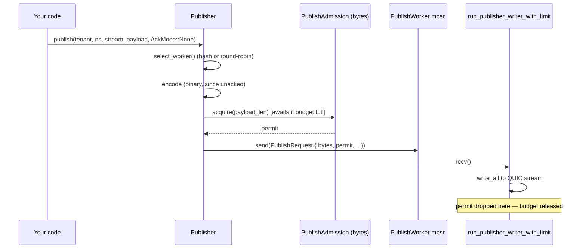

This page traces exactly what happens, function by function, when a client
publishes a message — from `Publisher::publish()` to the message landing in
every subscriber's queue. It's written for contributors who need to change
or debug this path, not as an API reference (see the
[Client SDK](/felix/clients/rust/) for that).

Every code reference below is `path/to/file.rs:function_name` as of this
writing — line numbers drift, function names are stable, use your editor's
"go to definition" from there.

## The cast of types

Keep these in your head; everything below is these types moving data around.

| Type | Where | What it is |
|---|---|---|
| `Publisher` / `PublisherInner` | `crates/sdk/felix-client/src/publish.rs` | Client-side handle; owns a pool of `PublishWorker`s and a byte-budget `PublishAdmission` |
| `PublishRequest` | `crates/sdk/felix-client/src/publish/writer.rs` | Enum sent over an mpsc channel to a `PublishWorker`'s writer task — carries the encoded message *and* an admission permit |
| `PublishJob` | `services/felix-broker-service/src/serving/quic/handlers/publish.rs` | Broker-side unit of work — a resolved `PublishTarget`, payloads, optional ack channel, optional admission permit |
| `StreamHandle` | `crates/server/felix-broker/src/broker/shards.rs` | A cheap `Arc<StreamState>` clone — the dense, pre-resolved identity of a stream. Resolving this once and reusing it is what removed string hashing from the hot path (see [below](#stream-resolution-why-a-handle-not-a-string)) |
| `StreamState` | same | The actual per-stream state: subscriber registry, in-memory replay log, queue policy |
| `DeliveryEnvelope` | same | An `Arc`-wrapped batch of payloads handed to every subscriber of a stream — the same `Arc`, not a copy per subscriber |

## Client side: `Publisher::publish()`

**File**: `crates/sdk/felix-client/src/publish.rs`

```rust
pub async fn publish(
    &self,
    tenant_id: &str,
    namespace: &str,
    stream: &str,
    payload: Vec<u8>,
    ack: AckMode,
) -> Result<()>
```

1. **Worker selection.** `select_worker()` picks one of the pool's
   `PublishWorker`s, either round-robin or by hashing `(tenant_id, namespace,
   stream)` (`PublishSharding::HashStream` — the mode that keeps a stream's
   messages on one QUIC stream, preserving order). The hash result is cached
   per-connection in `stream_cache: Mutex<StreamShardCache>` so repeat
   publishes to the same stream skip re-hashing.

2. **Encoding.** Publishes are binary-encoded by default, acked or not. With
   `ack == AckMode::None` that is `felix_wire::binary::encode_publish_batch`
   (flag `0x0001`). With `PerMessage`/`PerBatch` it is
   `encode_acked_publish_batch_bytes` (flags `0x0001 | 0x0008`), which prefixes
   the same body with a `request_id` and the ack mode; the broker replies with a
   binary ack frame (`0x0010`) rather than a JSON `PublishOk`/`PublishError` —
   but only when the broker advertised `0x0008` during the auth handshake;
   otherwise the acked publish falls back to `publish_batch_json`. If
   you want JSON instead (debugging, a client that hasn't implemented the binary
   decoder), call `publish_json`/`publish_batch_json` explicitly — see
   [Wire Protocol](/felix/architecture/wire-protocol/#binary-publish-batch-encoding).

   Both encodings converge on the same handler: the binary path decodes the frame
   and then calls `handle_publish_batch_message` with `AckEncoding::Binary`, so
   admission, authorization, overload shedding and commit-ack semantics are shared
   and only the reply framing differs. The encoding is carried on the ack-waiter
   message because a commit ack is emitted from a different task, long after the
   request frame is gone.

3. **Admission.** Before the message is handed to the worker's channel, the
   caller awaits `PublishAdmission::acquire(estimated_bytes)` — a
   `tokio::sync::Semaphore` sized in **bytes**, shared across every worker in
   the pool (`publish_inflight_bytes`, default 4 MiB). This is a second,
   independent bound from the worker's mpsc channel depth
   (`publish_queue_depth`, default 64 *items*): a handful of large messages
   can fill the byte budget long before they fill the item-count queue. The
   `OwnedSemaphorePermit` returned here is attached to the `PublishRequest`
   and travels with it — released only when the worker finishes processing,
   not when it's merely queued. See
   [Internals: Backpressure](/felix/development/internals-concurrency/) for why that timing
   matters.

4. **Enqueue.** The encoded `PublishRequest` (carrying the permit) goes onto
   the worker's mpsc channel. `run_publisher_writer_with_limit` — one task per QUIC
   stream — pulls requests off that channel **one at a time**: it's a
   single-writer loop, so a stream's messages are always written in the
   order they were enqueued. This is why `publish_conn_pool` /
   `publish_streams_per_conn` control your actual publish parallelism: each
   stream is strictly serial internally.



## Broker side: from QUIC frame to `PublishJob`

**File**: `services/felix-broker-service/src/serving/quic/handlers/publish/` (`control.rs`, `uni.rs`, `ingress.rs`, `admission.rs`, `ack.rs`, `scheduler.rs`, `worker.rs`)

The broker runs publishes through one **process-wide publish scheduler** —
not one per connection. Per-connection pools meant more publisher connections
multiplied concurrent `Broker::publish_batch` callers and caused lock
contention on shared broker state, so a small fixed set of executors
(`pub_workers_per_conn`, default 4) does the work for every connection. What
changed from the old fixed worker pool is how work reaches them: see step 3.

1. **Stream resolution.** `resolve_stream_cached()` turns
   `(tenant_id, namespace, stream)` into a `StreamHandle`, backed by a
   short-lived cache (`StreamHandleCache`, TTL'd) keyed on a scratch string
   built without extra allocation. Once resolved, the handle travels as
   `PublishTarget::Resolved(handle)` — no more string hashing or `RwLock`
   reads for this stream until the cache entry expires.

   #### Stream resolution: why a handle, not a string
   Before this existed, every publish re-hashed `(tenant, namespace, stream)`
   and read through an `RwLock<HashMap<..>>` to find the stream's state. A
   `StreamHandle` is just `Arc<StreamState>` with an `id()` — clone it, pass
   it around, and its lane (step 3) is keyed by `handle.id()` instead of a
   string hash. See `crates/server/felix-broker/src/broker/shards.rs:StreamHandle`.

2. **Admission.** Mirrors the client exactly: `enqueue_publish()` computes
   `job_bytes = payloads.iter().map(Bytes::len).sum()` and acquires from a
   broker-side `PublishAdmission` (byte semaphore, `pub_inflight_bytes`,
   default 64 MiB, process-wide) *before* the job is queued. The policy for
   what happens when admission or the queue is full is an explicit enum:

   ```rust
   pub(crate) enum EnqueuePolicy {
       Drop,         // shed — fire-and-forget traffic
       Fail,         // refuse at once — enqueue-acked traffic
       Wait,         // bounded wait (publish_queue_wait_timeout_ms) — commit-ack traffic
       Backpressure, // wait until room or the connection goes — pub_ingress_wait
   }
   ```

   Unacked publishes use `Drop` (or `Backpressure` if `pub_ingress_wait` is
   set — see [Internals: Backpressure](/felix/development/internals-concurrency/)).
   An acked publish that finds no room is answered with a retryable
   `overloaded` (`detail.reason = "publish_queue_full"`, a short
   `retry_after_ms`, and nothing queued), and every refusal or shed is counted
   against its tenant in `felix_tenant_publish_queue_full_total`. This is
   where "overload becomes visible instead of silently buffering" is enforced
   on ingest.

3. **Lanes and the fair queue** (`handlers/publish/scheduler.rs`). Every job
   belongs to a *lane*: the shard it writes (keyed by `handle.id()`), or the
   remote shard it is forwarded to (keyed by a hash of its name). A lane runs
   one job at a time in arrival order, which is what keeps a shard's offsets
   claimed in the order its publishes arrived; different lanes run side by
   side. Which ready lane an executor takes next is decided per tenant by
   deficit round robin, weighted by bytes (a 64 KiB quantum per turn), so a
   tenant sending many or large batches cannot crowd out one sending a few.
   The queue holds `pub_queue_depth × pub_workers_per_conn` jobs; every
   tenant is guaranteed `pub_queue_depth` of them, and a tenant past that may
   borrow idle room but never the last `pub_queue_depth` slots, so a flooding
   tenant is refused while a quiet one still gets in. With `core_shards`
   enabled there is one such queue per shard, with its executors on that
   shard's core, and a stream's lane lives on the shard that owns it. See
   [Internals: Backpressure & Core Sharding](/felix/development/internals-concurrency/#core-sharding).

4. **What a job does on its lane** (`handlers/publish/worker.rs:LaneWork`).
   An executor holds a lane only for the part that has to be ordered, and
   only while that part is not waiting on something outside the broker:

   | Job | Ordered, on the lane | Handed to its own task |
   |---|---|---|
   | Durable publish | fence check, `claim_publish` (offsets taken) | device flush, fanout, quorum wait, the answer |
   | Ephemeral publish | fence check, `publish_batch_with_outcome` | quorum wait, the answer |
   | Idempotent publish | sequence check and append (offsets taken), off the executor | device flush, quorum wait, the answer |
   | Forward | the whole round trip, off the executor | — |

   A durable shard may have `pub_flush_concurrency` flushes outstanding;
   past that its next claim waits for one off the executor, holding only its
   own lane. A forward keeps its lane for the round trip because a forward
   can be retried or redirected, and a later batch sent before an earlier one
   is answered could land ahead of it; only that remote shard's later
   publishes wait. Either way a slow disk, a slow peer, or a quorum that has
   not formed holds up its own shard and nothing else — with the old fixed
   pool it held a worker, and every stream hashed to that worker waited
   behind it.

   > `a_stalled_forward_does_not_hold_up_another_shard` -- with one executor,
   > a publish to a local shard is written and acknowledged while a forward
   > to a peer that never answers is still waiting.

   > `one_shards_publishes_are_answered_in_order_across_a_full_queue` -- one
   > shard's acks come back in the order the publishes were sent, and the log
   > holds exactly the accepted publishes in that order, while the queue
   > keeps refusing others in between.

   The lane is released by a guard, so a job that panics still frees it; the
   executor is replaced (`felix_broker_publish_worker_restarts_total`).

   An executor yields to the runtime after every job. Taking a queued job and
   writing an ephemeral publish never suspend, so an executor working
   through a backlog would otherwise fan out job after job while the
   subscriber feeders it woke waited for its thread, and a subscriber that
   reads fast enough would still overflow its bounded queue.

   > `subscribers_drain_between_an_executors_queued_publishes` -- with a
   > backlog of 32 publishes queued and a subscriber queue of 4 on one
   > thread, the subscriber receives all 32.

## Broker core: `Broker::publish_batch_to_handle`

**File**: `crates/server/felix-broker/src/broker/publish.rs`

This is where the message actually becomes visible to subscribers.

```rust
pub async fn publish_batch_to_handle(
    &self,
    handle: &StreamHandle,
    payloads: &[Bytes],
) -> Result<usize> {
    if !handle.state.active.load(Ordering::Acquire) {
        return Err(BrokerError::StreamHandleInactive(handle.id()));
    }
    let stream_state = &handle.state;
    stream_state.append_batch(payloads, self.log_capacity);   // 1
    let senders = stream_state.subscriber_snapshot();          // 2
    let envelope = DeliveryEnvelope::new(payloads);             // 3
    for subscriber in senders.iter() {                          // 4
        // match on stream_state.subscriber_queue_policy: Block / DropNew / DropOld
        subscriber.sender.send(envelope.clone()).await; // or try_send / try_reserve
    }
}
```

1. **`append_batch`**: appends to an in-memory `VecDeque<LogEntry>` under
   one `Mutex` lock — one lock acquisition per *batch*, not per payload —
   then trims to `log_capacity`. This log exists for cursor-based replay
   (subscribers reading from an offset); it is not durable storage.

2. **`subscriber_snapshot`**: reads an `ArcSwap<Vec<SubscriberEntry>>` —
   lock-free on the hot path. The actual subscriber registry
   (`Mutex<SubscriberRegistry>`, a `Slab`) is only touched on
   subscribe/unsubscribe; every publish just clones the current `Arc`
   snapshot. This is why adding/removing subscribers doesn't contend with
   in-flight publishes.

3. **`DeliveryEnvelope::new`**: wraps `payloads` in one `Arc<[Bytes]>` plus a
   `Mutex<Option<Bytes>>` cache slot for the encoded wire frame (filled
   lazily, once, by whichever subscriber's feeder task encodes it first —
   see [Internals: Subscribe & Fanout](/felix/development/internals-subscribe/)). Every
   subscriber gets a `.clone()` of this `DeliveryEnvelope` — an `Arc` bump,
   not a payload copy, and critically *not* a per-subscriber re-encode. This
   is the single biggest fanout-cost change in Felix's history: fanout used
   to be O(fanout) encode calls per publish; it's now O(1).

4. **Per-subscriber send**, gated by `stream_state.subscriber_queue_policy`
   (`SubQueuePolicy::Block | DropNew | DropOld`) — this is the first of two
   backpressure checkpoints on the subscribe side. See
   [Internals: Backpressure](/felix/development/internals-concurrency/#the-full-backpressure-chain)
   for the complete picture, including the second checkpoint (the writer
   lane) further downstream.

## Worked example

Publishing one message to a stream with 3 active subscribers, unacked,
`core_shards` disabled:

1. Client hashes `(t1, orders, updates)` to worker 2, encodes binary, awaits
   the 4 MiB byte budget, enqueues on worker 2's channel.
2. `run_publisher_writer_with_limit` for worker 2 (a dedicated task owning one
   bidirectional QUIC stream — publish streams are `open_bi`, opened and
   authenticated once at connect time) writes the frame; the broker's stream
   handler on the other end decodes it into
   `PublishJob { target: PublishTarget::Resolved(handle), .. }`.
3. The job joins the stream's lane; an executor takes it on tenant `t1`'s
   turn and calls `publish_batch_with_outcome`.
4. One payload is appended to the log; the subscriber snapshot (3 entries)
   is read without a lock; one `DeliveryEnvelope` is created.
5. The envelope is `.clone()`d 3 times (3 `Arc` bumps) and sent to 3
   different `mpsc::Sender<DeliveryEnvelope>` — one per subscriber.
6. Each subscriber's feeder task independently calls
   `envelope.shared_event_frame()`. The *first* one to call it pays the
   encode cost and caches the result in the envelope; the other two get the
   cached `Bytes` for free. See [Internals: Subscribe & Fanout](/felix/development/internals-subscribe/).

## If you want to change...

| You want to... | Look at |
|---|---|
| Change how publishes are encoded (binary vs JSON, new wire format) | `crates/sdk/felix-client/src/publish.rs` (`publish`) and `publish/send.rs` (encoding and the JSON fallback), `crates/protocol/felix-wire/src/client/` |
| Change client-side publish backpressure | `PublishAdmission` in `crates/sdk/felix-client/src/publish/admission.rs`; `publish_queue_depth`/`publish_inflight_bytes` in `crates/sdk/felix-client/src/config.rs` |
| Change broker ingest admission/shedding behavior | `EnqueuePolicy` in `handlers/publish/ack.rs` and `enqueue_publish()` in `handlers/publish/ingress.rs` |
| Change stream resolution/caching | `resolve_stream_cached`, `StreamHandleCache` in `publish.rs`; `StreamHandle` and `resolve_stream_handle` in `crates/server/felix-broker/src/broker/shards.rs` |
| Change fanout/queue policy for subscribers | `SubQueuePolicy` match in `Broker::complete_publish`, `crates/server/felix-broker/src/broker/publish.rs` |
| Change the in-memory replay log | `StreamState::append_batch_at`, `crates/server/felix-broker/src/stream/state.rs` |
| Add a new client publish worker sharding strategy | `PublishSharding` in `crates/sdk/felix-client/src/publish/routing.rs` |
| Change broker publish scheduling (lanes, tenant fairness, queue bounds) | `PublishScheduler` in `handlers/publish/scheduler.rs`, `FairQueue` in `scheduler/fair_queue.rs`; what each job does on its lane in `handlers/publish/worker.rs` |

Next: [Internals: Subscribe & Fanout](/felix/development/internals-subscribe/) picks up where
this page leaves off — what happens to the `DeliveryEnvelope` after it lands
in a subscriber's queue.
