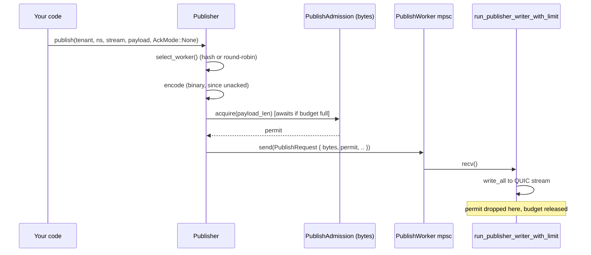

This page traces a publish function by function, from `Publisher::publish()`
to the message landing in every subscriber's queue. It is for contributors who
change or debug this path. The API reference is the
[Client SDK](/felix/clients/rust/).

Code references are `path/to/file.rs:function_name`. Use your editor's "go to
definition" from there.

## The cast of types

| Type | Where | What it is |
|---|---|---|
| `Publisher` / `PublisherInner` | `crates/sdk/felix-client/src/publish.rs` | Client-side handle; owns a pool of `PublishWorker`s and a byte-budget `PublishAdmission` |
| `PublishRequest` | `crates/sdk/felix-client/src/publish/writer.rs` | Enum sent over an mpsc channel to a `PublishWorker`'s writer task. Carries the encoded message and an admission permit |
| `PublishJob` | `services/felix-broker-service/src/serving/quic/handlers/publish.rs` | Broker-side unit of work: a `PublishTarget`, payloads, optional ack channel, optional admission permit |
| `StreamHandle` | `crates/server/felix-broker/src/broker/shards.rs` | A cheap `Arc<StreamState>` clone with a dense numeric id. Resolved once and reused, so the hot path does not hash stream names |
| `StreamState` | `crates/server/felix-broker/src/stream/state.rs` | Per-stream state: subscriber registry, in-memory replay ring, the durable log handle, the `CommitSequencer`, queue policy |
| `ClaimedPublish` | `crates/server/felix-broker/src/broker/publish.rs` | A batch whose offsets and commit turn are taken but which is not yet durable or delivered |
| `DeliveryEnvelope` | `crates/server/felix-broker/src/stream/delivery.rs` | An `Arc`-wrapped batch handed to every subscriber of a stream. The same `Arc`, not a copy per subscriber |

## Client side: `Publisher::publish()`

**File**: `crates/sdk/felix-client/src/publish.rs`

```rust
pub async fn publish(
    &self,
    tenant_id: &str,
    namespace: &str,
    stream: &str,
    payload: Vec<u8>,
    ack: AckMode,
) -> Result<()>
```

1. **Worker selection.** A `ClusterClient` publisher (`Client::shard_publisher`)
   names the shard of every publish, and `route()` first asks `ShardStreams`
   (`publish/shard_streams.rs`) for the shard's own stream, opening it on the
   shard's first publish. A pipelining stream is answered in request order, so
   a shard that shared a stream with others would hold back their answers
   while it waited on a quorum. Past `publish_shard_streams` (16) shards, and
   for every publish through a plain `Client`, `select_worker()` picks one of
   the pool's
   `PublishWorker`s, either round-robin or by hashing `(tenant_id, namespace,
   stream)` (`PublishSharding::HashStream`, the mode that keeps a stream's
   messages on one QUIC stream, preserving order). The hash result is cached
   per-connection in `stream_cache: Mutex<StreamShardCache>` so repeat
   publishes to the same stream skip re-hashing.

2. **Encoding.** Publishes are binary-encoded by default, acked or not. With
   `ack == AckMode::None` that is `felix_wire::binary::encode_publish_batch`
   (flag `0x0001`). With `PerMessage`/`PerBatch` it is
   `encode_acked_publish_batch_bytes` (flags `0x0001 | 0x0008`), which prefixes
   the same body with a `request_id` and the ack mode. The broker replies with a
   binary ack frame (`0x0010`) rather than a JSON `PublishOk`/`PublishError`,
   but only when the broker advertised `0x0008` during the auth handshake.
   Otherwise the acked publish falls back to `publish_batch_json`. If
   you want JSON instead (debugging, a client that hasn't implemented the binary
   decoder), call `publish_json`/`publish_batch_json` explicitly. See
   [Wire Protocol](/felix/architecture/wire-protocol/#binary-publish-batch-encoding).

   Both encodings converge on the same handler: the binary path decodes the frame
   and then calls `handle_publish_batch_message` with `AckEncoding::Binary`, so
   admission, authorization, overload shedding and commit-ack semantics are shared
   and only the reply framing differs. The encoding is carried on the ack-waiter
   message because a commit ack is emitted from a different task, long after the
   request frame is gone.

3. **Admission.** Before the message is handed to the worker's channel, the
   caller awaits `PublishAdmission::acquire(estimated_bytes)`, a
   `tokio::sync::Semaphore` sized in bytes, shared across every worker in
   the pool (`publish_inflight_bytes`, default 4 MiB). This is a second,
   independent bound from the worker's mpsc channel depth
   (`publish_queue_depth`, default 64 *items*): a handful of large messages
   can fill the byte budget long before they fill the item-count queue. The
   `OwnedSemaphorePermit` returned here is attached to the `PublishRequest`
   and travels with it. It is released only when the worker finishes processing,
   not when it's merely queued. See
   [Internals: Backpressure](/felix/development/internals-concurrency/) for why that timing
   matters.

4. **Enqueue.** The encoded `PublishRequest` (carrying the permit) goes onto
   the worker's mpsc channel. `run_publisher_writer_with_limit`, one task per QUIC
   stream, pulls requests off that channel one at a time. It is a
   single-writer loop, so a stream's messages are always written in the
   order they were enqueued. This is why `publish_conn_pool` /
   `publish_streams_per_conn` control your actual publish parallelism: each
   stream is strictly serial internally.



## Broker side: from QUIC frame to `PublishJob`

**File**: `services/felix-broker-service/src/serving/quic/handlers/publish/` (`control.rs`, `uni.rs`, `ingress.rs`, `admission.rs`, `ack.rs`, `scheduler.rs`, `worker.rs`)

The broker runs publishes through one process-wide publish scheduler, not one
per connection. A small fixed set of executors (`pub_workers_per_conn`,
default 4) does the work for every connection, so more publisher connections
do not mean more concurrent callers contending on shared stream state.

1. **Routing.** `resolve_route()` (`handlers/publish/route.rs`) is the one
   chokepoint every publish passes through. It checks whether this broker owns
   the shard and answers `Local` with a `StreamHandle`, `Forward` to the
   owner, or `Refused`. The handle comes from a short-lived cache
   (`StreamHandleCache` in `stream_cache.rs`, TTL'd) keyed on a scratch string
   built without extra allocation, and travels as `PublishTarget::Resolved`.
   Ownership is checked outside that cache, on every publish, because it
   changes the moment the control plane says so. A handle's lane (step 3) is
   keyed by `handle.id()` rather than a string hash.

2. **Admission.** Mirrors the client exactly: `enqueue_publish()` computes
   `job_bytes = payloads.iter().map(Bytes::len).sum()` and acquires from a
   broker-side `PublishAdmission` (byte semaphore, `pub_inflight_bytes`,
   default 64 MiB, process-wide) *before* the job is queued. The policy for
   what happens when admission or the queue is full is an explicit enum:

   ```rust
   pub(crate) enum EnqueuePolicy {
       Drop,         // shed: fire-and-forget traffic
       Fail,         // refuse at once: enqueue-acked traffic
       Wait,         // bounded wait (publish_queue_wait_timeout_ms): commit-ack traffic
       Backpressure, // wait until room or the connection goes: pub_ingress_wait
   }
   ```

   Unacked publishes use `Drop` (or `Backpressure` if `pub_ingress_wait` is
   set, see [Internals: Backpressure](/felix/development/internals-concurrency/)).
   An acked publish that finds no room is answered with a retryable
   `overloaded` (`detail.reason = "publish_queue_full"`, a short
   `retry_after_ms`, and nothing queued), and every refusal or shed is counted
   against its tenant in `felix_tenant_publish_queue_full_total`. This is
   where "overload becomes visible instead of silently buffering" is enforced
   on ingest.

3. **Lanes and the fair queue** (`handlers/publish/scheduler.rs`). Every job
   belongs to a *lane*: the shard it writes (keyed by `handle.id()`), or the
   remote shard it is forwarded to (keyed by a hash of its name). A lane runs
   one job at a time in arrival order, which is what keeps a shard's offsets
   claimed in the order its publishes arrived. Different lanes run side by
   side. Which ready lane an executor takes next is decided per tenant by
   deficit round robin, weighted by bytes (a 64 KiB quantum per turn), so a
   tenant sending many or large batches cannot crowd out one sending a few.
   The queue holds `pub_queue_depth × pub_workers_per_conn` jobs. Every
   tenant is guaranteed `pub_queue_depth` of them, and a tenant past that may
   borrow idle room but never the last `pub_queue_depth` slots, so a flooding
   tenant is refused while a quiet one still gets in. With `core_shards`
   enabled there is one such queue per shard, with its executors on that
   shard's core, and a stream's lane lives on the shard that owns it. See
   [Internals: Backpressure & Core Sharding](/felix/development/internals-concurrency/#core-sharding).

4. **What a job does on its lane** (`handlers/publish/worker.rs:LaneWork`).
   An executor holds a lane only for the part that has to be ordered, and
   only while that part is not waiting on something outside the broker:

   | Job | Ordered, on the lane | Handed to its own task |
   |---|---|---|
   | Durable publish | fence check, `claim_publish` (offsets taken) for it and the durable publishes queued behind it | device flush, fanout, quorum wait, the answers |
   | Ephemeral publish | fence check, `publish_batch_with_outcome` | quorum wait, the answer |
   | Idempotent publish | sequence check and append (offsets taken), off the executor | device flush, quorum wait, the answer |
   | Forward | the whole round trip, off the executor | nothing |

   A durable publish does not go alone if more are queued on its lane. The
   executor takes the plain durable publishes queued behind it, in order and
   up to 64 of them or 1 MiB of payload, and claims them all with one
   `claim_publish`. That is one write, one commit wait, one commit turn and
   one fanout for the lot, which is most of what an unbatched durable publish
   costs. Each publish still gets its own answer: its offset is the claim's
   first plus the records ahead of it, and the answers go out in lane order
   once the claim is durable. The tenant is charged for every publish it
   took, and pays any excess in later turns. Taking stops at the first queued
   job that cannot join (an idempotent or empty publish), so nothing
   overtakes it. `felix_broker_publish_claim_jobs` reports the group sizes.

   Failures follow what the members share. The fence and lease are checked
   per publish: one the fence refuses is answered with the refusal and left
   out, and the rest are written around it. Everything after that is shared:
   a failed append, flush or quorum wait fails every publish in the claim,
   because none of them can have succeeded without the others. Every member
   gets the same error. A quorum timeout leaves the outcome unknown for each
   of them, so none is told it is safe to send again. Exactly-once needs the
   idempotent producer, whose publishes are never grouped. A publish whose
   caller stopped waiting keeps its place, as it would alone.

   > `queued_publishes_on_one_lane_are_claimed_as_one_append`: eight
   > publishes queued on one lane, one of them three records long, are
   > answered with offsets 0, 1, 2, 5, 6, ... and reach the subscriber as
   > one delivery.

   > `no_publish_in_a_claim_is_answered_before_an_earlier_one`: when the
   > last publish of a claim is answered, every earlier one already is.

   > `a_publish_the_fence_refuses_is_left_out_of_the_claim`: the refused
   > publish gets `ShardUnavailable`, and the others are written at 0, 1, 2.

   > `a_claim_whose_quorum_wait_times_out_leaves_every_member_unknown`: both
   > members of a claim whose quorum wait timed out get `QuorumTimeout` with
   > retry class `OutcomeUnknown`.

   A durable shard may have `pub_flush_concurrency` flushes outstanding.
   Past that, its next claim waits for one off the executor, holding only its
   own lane. A forward keeps its lane for the round trip because a forward
   can be retried or redirected, and a later batch sent before an earlier one
   is answered could land ahead of it. Only that remote shard's later
   publishes wait. Either way a slow disk, a slow peer, or a quorum that has
   not formed holds up its own shard and nothing else.

   > `a_stalled_forward_does_not_hold_up_another_shard`: with one executor,
   > a publish to a local shard is written and acknowledged while a forward
   > to a peer that never answers is still waiting.

   > `one_shards_publishes_are_answered_in_order_across_a_full_queue`: one
   > shard's acks come back in the order the publishes were sent, and the log
   > holds exactly the accepted publishes in that order, while the queue
   > keeps refusing others in between.

   The lane is released by a guard, so a job that panics still frees it, and the
   executor is replaced (`felix_broker_publish_worker_restarts_total`).

   An executor yields to the runtime after every job. Taking a queued job and
   writing an ephemeral publish never suspend, so an executor working
   through a backlog would otherwise fan out job after job while the
   subscriber feeders it woke waited for its thread, and a subscriber that
   reads fast enough would still overflow its bounded queue.

   > `subscribers_drain_between_an_executors_queued_publishes`: with a
   > backlog of 32 publishes queued and a subscriber queue of 4 on one
   > thread, the subscriber receives all 32.

## Broker core: claim, then complete

**File**: `crates/server/felix-broker/src/broker/publish.rs`

The core splits a publish into an ordered half and a half that can overlap
with other publishes. `publish_batch_with_outcome` runs both back to back. The
broker service calls them separately so it can release the lane between them.

```text
lane held ─────────────────────────┐   own task ─────────────────────────────────────────────┐
claim_publish                      │   complete_publish                                       │
  handle active?                   │     log.commit(pending)       flush under fsync policy   │
  durable.begin_append(payloads)   │     turn.wait()               every earlier batch done   │
    -> offsets consumed            │     hold if Quorum mark behind                           │
  commit_sequencer.reserve_owned   │     append_batch_at           replay ring, sequence =    │
    -> commit turn for the range   │                               log offset                 │
                                   │     fan_out                   one DeliveryEnvelope,      │
                                   │                               one clone per subscriber   │
───────────────────────────────────┘   turn released ─────────────────────────────────────────┘
                                       then, on Quorum: await_quorum, then the ack
```

1. **`claim_publish`** checks the handle is active. On a durable stream it
   calls `begin_append`, which writes the records and consumes their offsets,
   and immediately reserves that offset range in the stream's
   `CommitSequencer` (`crates/server/felix-storage/src/commit_order.rs`). The
   turn is claimed before the durability wait, not after a successful one, so
   a publish that fails or is cancelled still releases its place and later
   publishes are not stranded behind it. The order claims return in is the
   order records land on disk. On an ephemeral stream the claim only checks
   the handle.

2. **`complete_publish`** (`publish/completion.rs`) waits for the log's
   `commit`, the flush under the stream's fsync policy, which group commit
   shares with other waiters. It then waits for its commit turn, so every
   earlier batch has been appended and fanned out first. On a `Quorum` stream
   a batch the committed mark has not passed is held back from readers and
   released once a majority holds it. The release is woken when the mark
   moves and also rechecks the bound every 250 ms while anything is held,
   since a route or lease change can make the bound cover a batch without
   the mark moving.

3. **`append_batch_at`** appends to the in-memory replay ring under one lock
   per batch and trims it to `log_capacity`. On a durable stream the ring's
   sequence numbers are the log's offsets. The same lock pairs the append with
   the subscriber list it fans out to, so a subscriber joining at that moment
   gets the batch either in its backlog or live, never neither.

4. **Fanout** reads the `ArcSwap<Vec<SubscriberEntry>>` snapshot. The
   subscriber registry itself (a `Slab` behind a mutex) is touched only on
   subscribe and unsubscribe. One `DeliveryEnvelope` carries the payloads, the
   base offset and the skip count, plus lazily filled encoded-frame slots, and
   each subscriber gets a clone: an `Arc` bump, not a payload copy or a
   re-encode. The send is gated by `SubQueuePolicy` (`Block`, `DropNew`,
   `DropOld`, where `DropOld` behaves as `DropNew`). This is the first of two
   backpressure checkpoints on the subscribe side. See
   [Internals: Backpressure](/felix/development/internals-concurrency/#the-full-backpressure-chain)
   for the second.

The commit turn is held until fanout finishes, so delivery order matches log
order. Cancelling `complete_publish` does not cancel the batch: once its
offsets are claimed its records exist, so the ring append and fanout finish on
a detached task.

## Worked example

Publishing one message to a stream with 3 active subscribers, unacked,
`core_shards` disabled:

1. Client hashes `(t1, orders, updates)` to worker 2, encodes binary, awaits
   the 4 MiB byte budget, enqueues on worker 2's channel.
2. `run_publisher_writer_with_limit` for worker 2 (a dedicated task owning one
   bidirectional QUIC stream, opened with `open_bi` and authenticated once at
   connect time) writes the frame. The broker's stream
   handler on the other end decodes it into
   `PublishJob { target: PublishTarget::Resolved { handle, .. }, .. }`.
3. The job joins the stream's lane. An executor takes it on tenant `t1`'s
   turn and calls `claim_publish`, which on a durable stream takes one offset
   and a commit turn, then releases the lane.
4. `complete_publish` waits for the flush and the turn, appends the payload to
   the replay ring, reads the subscriber snapshot (3 entries) without a lock,
   and creates one `DeliveryEnvelope`.
5. The envelope is `.clone()`d 3 times (3 `Arc` bumps) and sent to 3
   different `mpsc::Sender<DeliveryEnvelope>`, one per subscriber.
6. Each subscriber's feeder task independently calls
   `envelope.shared_event_frame()`. The *first* one to call it pays the
   encode cost and caches the result in the envelope, and the other two get the
   cached `Bytes` for free. See [Internals: Subscribe & Fanout](/felix/development/internals-subscribe/).

## If you want to change...

| You want to... | Look at |
|---|---|
| Change how publishes are encoded (binary vs JSON, new wire format) | `crates/sdk/felix-client/src/publish.rs` (`publish`) and `publish/send.rs` (encoding and the JSON fallback), `crates/protocol/felix-wire/src/client/` |
| Change client-side publish backpressure | `PublishAdmission` in `crates/sdk/felix-client/src/publish/admission.rs`; `publish_queue_depth`/`publish_inflight_bytes` in `crates/sdk/felix-client/src/config.rs` |
| Change broker ingest admission/shedding behavior | `EnqueuePolicy` in `handlers/publish/ack.rs` and `enqueue_publish()` in `handlers/publish/ingress.rs` |
| Change routing or stream resolution/caching | `resolve_route` in `handlers/publish/route.rs`, `StreamHandleCache` in `handlers/publish/stream_cache.rs`; `StreamHandle` and `resolve_stream_handle` in `crates/server/felix-broker/src/broker/shards.rs` |
| Change the durability step or commit order | `Broker::claim_publish` and `complete_publish` in `crates/server/felix-broker/src/broker/publish.rs` and `publish/completion.rs`; `CommitSequencer` in `crates/server/felix-storage/src/commit_order.rs` |
| Change fanout/queue policy for subscribers | `SubQueuePolicy` match in `Broker::complete_publish`, `crates/server/felix-broker/src/broker/publish.rs` |
| Change the in-memory replay log | `StreamState::append_batch_at`, `crates/server/felix-broker/src/stream/state.rs` |
| Add a new client publish worker sharding strategy | `PublishSharding` in `crates/sdk/felix-client/src/publish/routing.rs` |
| Change broker publish scheduling (lanes, tenant fairness, queue bounds) | `PublishScheduler` in `handlers/publish/scheduler.rs`, `FairQueue` in `scheduler/fair_queue.rs`; what each job does on its lane in `handlers/publish/worker.rs` |

Next: [Internals: Subscribe & Fanout](/felix/development/internals-subscribe/) picks up where
this page leaves off: what happens to the `DeliveryEnvelope` after it lands
in a subscriber's queue.
