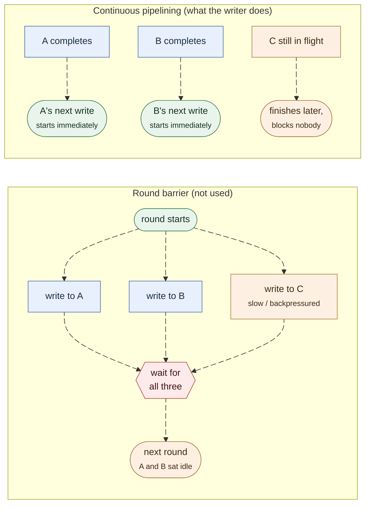

This page picks up where [Internals: The Publish Path](/development/internals-publish/)
leaves off: a `DeliveryEnvelope` has just been cloned into a subscriber's
`mpsc` channel. It traces what happens from there to bytes on the wire, plus
the subscribe handshake that set that channel up and the resume path that
replays history first.

## The cast of types

| Type | Where | What it is |
|---|---|---|
| `SubscriptionReceiver` | `crates/server/felix-broker/src/stream/subscription.rs` | The broker-core side of a subscriber's channel; yields `DeliveryEnvelope`s |
| `WriterLaneManager` | `services/felix-broker-service/src/serving/quic/handlers/subscribe/lane.rs` | Owns a fixed set of writer lanes and the per-connection writer tasks they feed |
| `LaneCommand` | same | `Register` / `Delivery` / `Unregister`, sent from a subscription's feeder to its assigned lane |
| `ConnectionCommand` | same | The same commands one hop further, sent from a lane to the connection that owns the subscriber's QUIC stream |
| `run_lane_feeder` | `subscribe/feeder.rs` | One task per subscription. Reads `DeliveryEnvelope`s, takes the shared encoded frame, dispatches `LaneCommand`s |
| `run_writer_lane` | `subscribe/writer.rs` | One task per lane. Receives `LaneCommand`s and forwards them to the right connection |
| `run_connection_writer` | `subscribe/writer.rs` | One task per QUIC connection. Owns the `SendStream`s and does the writing |
| `write_replay` | `subscribe/replay.rs` | Writes a resumed subscription's disk history and ring backlog before live delivery starts |

There are three hops: `SubscriptionReceiver` (broker core, per subscriber),
then a lane (shared across many subscribers, bounding parallelism), then a
connection writer (one per QUIC connection, because a connection's streams
need a single owner to write them).

## Subscribe handshake

**File**: `services/felix-broker-service/src/serving/quic/handlers/subscribe.rs`,
`handle_subscribe_message`

1. Client sends `Message::Subscribe` on the control (bi) stream.
2. With no `start`, the broker calls `Broker::subscribe` →
   `StreamState::register_subscriber()`, which allocates a slot in a `Slab`,
   creates the `mpsc::channel::<DeliveryEnvelope>(subscriber_queue_capacity)`,
   and rebuilds the lock-free `subscribers_snapshot` (see
   [Internals: The Publish Path](/development/internals-publish/#broker-core-claim-then-complete)
   for why that snapshot exists). With a `start`, it calls
   `Broker::subscribe_from` instead; see [Resuming from an offset](#resuming-from-an-offset).
3. Broker opens a new unidirectional stream (`connection.open_uni()`) and
   writes `Message::EventStreamHello { subscription_id }` as the first frame.
   This is the only frame that carries the subscription id. Event frames after
   it do not need it, because the client already knows which stream is bound
   to which subscription. That is what makes the shared frame below possible;
   see [Wire Protocol: Shared Binary EventBatch](/architecture/wire-protocol/#shared-binary-eventbatch-encoding).
4. Broker replies `Message::Subscribed` on the control stream. It goes out
   before any history, because the client does not read the event stream
   until it has seen `Subscribed`. A history larger than the QUIC stream's
   receive window would otherwise deadlock.
5. On a resume, `write_replay` writes the history and backlog straight onto
   the event stream. Live events queue in the subscriber's channel meanwhile.
6. Broker computes `lane_idx = manager.select_lane(subscription_id,
   connection_id)` and sends `LaneCommand::Register` to that lane, handing the
   subscriber's `SendStream` to the writer-lane pipeline. Nothing drains the
   subscriber's channel until this point, so live events cannot overtake the
   replay. The register waits for room in the lane queue. Only a lane that
   has already shut down with its connection gets an `overloaded` error.
7. Broker spawns `run_lane_feeder`, the task that pulls `DeliveryEnvelope`s
   out of this subscriber's `SubscriptionReceiver` for the rest of the
   subscription's life. If `core_shards` is enabled, this task is spawned on
   the shard owning the stream (resolved via `resolve_stream_handle` +
   `shards.handle_for(handle.id())`), not on the default runtime. See
   [Internals: Backpressure & Core Sharding](/development/internals-concurrency/#core-sharding).

## Resuming from an offset

`Message::Subscribe` takes an optional `start`: `latest`, `earliest`, or an
offset, the first record the client has not seen. On an in-memory stream it
reaches only as far back as the replay ring, and events carry no offsets.
`Broker::subscribe_from`
(`crates/server/felix-broker/src/broker/subscribe.rs`) does three things in
this order:

1. reads the log's tail;
2. registers the live subscriber, clamped to the oldest entry the replay ring
   still holds (`StreamState::register_clamped`), and takes the ring's
   backlog from that point;
3. computes the disk range still to serve, `[requested, backlog_start)`.

Registering before reading history is the point. Once the subscriber is
registered, every record from `backlog_start` on is either in the backlog or
on its channel, so the disk range is closed and cannot lose anything while it
is read. Reading history first and registering after drops any publish that
lands between the two.

An offset past the tail is refused, and so is one below what retention kept.
Both come back as `SubscribeCursorError` with reason `in_future` or `too_old`
and the nearest offset that would work.

`write_replay` pages the disk range with `Broker::read_committed`, one page in
memory at a time, and writes each page before reading the next, so a slow
client slows the reading rather than growing a buffer. On a `Quorum` stream a
page stops at the committed mark and the next one waits for it. The ring
backlog follows.

Live publishes have been queueing on the subscriber's ordinary bounded channel
the whole time, and under `DropNew` a long replay can overflow it. So
`write_replay` then drains what is queued and, wherever the offsets jump, reads
the hole from disk. It repeats up to `MAX_CATCH_UP_PASSES` times, since more
arrives while it drains, and then hands over to live delivery. Offsets are on
the wire, so any gap left after that is visible to the client.

### Offsets on the wire

A client that advertises `FLAG_EVENT_BATCH_OFFSETS` in `Auth.client_flags`
gets offsets on every event batch: a `u64 base_offset` before the payload
count, from which each event's offset is `base_offset + index`. On a resumed
durable subscription its `Subscribed` also carries:

- `start_offset`: the first offset this subscription delivers;
- `live_offset`: the tail when the subscriber registered. Records below it are
  catch-up, records from it on are live.

With offsets on events, a jump in offsets is a drop. One exception: a promoted
leader writes a generation-start record before it serves. It takes an offset
and is never delivered. The envelope counts such offsets in `skipped_before`,
and a client that also advertised `FLAG_EVENT_BATCH_SKIPPED` gets a batch
after one with that flag set and a `u64 skipped_before` after the base offset.
A jump of exactly `skipped_before` is not a drop. Every other batch is
byte-identical to the offsets-only frame.

The feeder picks the frame by what the subscriber negotiated:
`shared_event_frame`, `shared_event_frame_with_offsets` or
`shared_event_frame_with_skip`. Each is cached on the envelope, so a mixed set
of subscribers costs at most one encode per shape.

## Lane assignment: `select_lane`

**File**: `subscribe/lane.rs`, `WriterLaneManager::select_lane` /
`lane_for_subscriber` / `lane_for_connection`

Controlled by `subscriber_lane_shard`:

- `subscriber_id_hash`: `hash64(subscriber_id) % lane_count`, independent of
  connection topology.
- `connection_id_hash`: `hash64(connection_id) % lane_count`, for keeping
  many subscribers on one connection on the same lane. Falls back to the
  subscriber id when no connection id is known.
- `round_robin_pin`: assigned once at subscribe time and pinned for the life
  of the subscription. Preserves ordering, can skew under uneven churn.
- `auto` (default): the same as `subscriber_id_hash`.

`subscriber_single_writer_per_conn: true` forces every subscriber on a
connection onto the same lane regardless of the shard policy. It is the
latency-profile default, trading lane parallelism for strict per-connection
ordering.

## `run_lane_feeder`: where encode-once happens

**File**: `subscribe/feeder.rs`, `run_lane_feeder`

```rust
async fn run_lane_feeder(
    mut event_rx: SubscriptionReceiver,
    manager: Weak<WriterLaneManager>,
    lane_idx: usize,
    connection_id: Option<u64>,
    config: EventWriterConfig,
    subscriptions: Arc<SubscriptionLimiter>,
    delivery: TenantDelivery,
) {
    loop {
        let envelope = event_rx.recv().await; // blocks until broker core sends one
        // ... coalesce with more envelopes up to max_events / max_bytes ...
        let frame = envelope.shared_event_frame()?;   // or _with_offsets / _with_skip
        enqueue_lane_frame(&manager, lane_idx, config.subscription_id, frame, ..).await;
    }
}
```

`shared_event_frame()` (on `DeliveryEnvelope`, `crates/server/felix-broker/src/stream/delivery.rs`)
is a lazily filled cache. The first subscriber's feeder to call it pays the
encode (`felix_wire::binary::encode_shared_event_batch_bytes`) and stores the
result in a `Mutex<Option<Bytes>>` inside the envelope. Every other subscriber
calling it on the same envelope gets a `Bytes::clone`, a refcount bump rather
than a copy. Since publish fanout hands the same `DeliveryEnvelope` to every
subscriber
(see [Internals: The Publish Path](/development/internals-publish/#broker-core-claim-then-complete)),
one publish batch is encoded once regardless of fanout.

Coalescing here is governed by `EventWriterConfig`: `max_events`,
`max_bytes`, `flush_delay`, and `single_event_mode` (forced when
`fanout_batch_size <= 1`, the latency profile: one event per frame,
immediate flush, no batching delay).

The feeder batches adaptively. After its first event it drains what is
already queued with `try_recv` and flushes, so a lone event costs no timer
and no wait. Only when that drain found something does the feeder mark
itself busy, and the next batch then awaits more events until `flush_delay`
after its first. A batch that drains nothing clears the mark.

## `run_writer_lane` → `run_connection_writer`

**File**: `subscribe/writer.rs` (lane routing in `subscribe/lane.rs`)

A lane's job is small: receive `LaneCommand`s and forward them as
`ConnectionCommand`s to whichever connection the subscriber belongs to
(`ensure_connection_writer`/`enqueue_connection`, which lazily spawns a
`run_connection_writer` task per connection the first time it's needed).
This hop exists because a QUIC connection's streams can't be written
concurrently from independent tasks without a single owner coordinating it.

`run_connection_writer` is where `send.write_all()` happens.

### Why the writer pipelines instead of running rounds

The obvious loop builds one write per subscriber with pending data, runs them
all concurrently, and waits for every one before starting the next round. One
backpressured QUIC stream then stalls the next round for every other
subscriber on that connection. The writer avoids that round barrier.



C moves at the same speed in both halves. The difference is only whether A
and B wait for it.

### Continuous pipelining

```rust
let mut in_flight: HashSet<u64> = HashSet::new();
let mut writes = FuturesUnordered::new();
loop {
    // Start a write for every subscriber that has queued data AND isn't
    // already mid-write.
    let ready: Vec<u64> = deliveries.iter()
        .filter_map(|(id, q)| (!q.is_empty() && !in_flight.contains(id)).then_some(*id))
        .collect();
    for subscriber_id in ready {
        in_flight.insert(subscriber_id);
        writes.push(async move { /* coalesce + write */ });
    }
    let Some((subscriber_id, .., write_result)) = writes.next().await else {
        break; // nothing ready, nothing in flight: this connection is drained
    };
    in_flight.remove(&subscriber_id);
    // handle result; if Ok, this subscriber becomes eligible again next loop
}
```

As soon as any subscriber's write completes, the loop checks whether that
subscriber has more queued data and, if so, starts its next write without
waiting for the others in flight. A slow subscriber's write can still be in
flight while the rest move ahead. This matters most when many subscribers
share one connection (`sub_conns` small relative to fanout in the benchmark
harness, or `subscriber_single_writer_per_conn: true` in production). See
[Benchmarks](/features/benchmarks/) for the measured effect.

## Worked example

Three subscribers (A, B, C) on the same QUIC connection, one publish batch
lands as one `DeliveryEnvelope`:

1. Broker core sends the same envelope (3 `Arc` clones) to A's, B's, and C's
   `SubscriptionReceiver`s.
2. Three independent `run_lane_feeder` tasks wake up (possibly on different
   lanes, or the same lane if `subscriber_single_writer_per_conn` is set).
   Say A's feeder runs first: it calls `envelope.shared_event_frame()`,
   pays the encode cost, gets `Bytes`. B's and C's feeders call the same
   method microseconds later and get the cached `Bytes` for free.
3. Each feeder dispatches a `LaneCommand::Delivery` carrying that shared
   `Bytes`. Cloning `Bytes` is a refcount bump, so nothing is re-serialized
   even though three lane commands now exist.
4. The lane(s) forward `ConnectionCommand::Delivery` to the one connection
   writer for this connection.
5. The connection writer's loop sees three subscribers ready, starts three
   concurrent writes. If A's QUIC stream is flow-control-blocked, B's and
   C's writes still complete and, if they have more queued data, start their
   next write immediately without waiting on A.

## If you want to change...

| You want to... | Look at |
|---|---|
| Change event batching/coalescing thresholds | `EventWriterConfig` construction in `handle_subscribe_message`; the coalescing loop in `run_lane_feeder` |
| Change lane assignment policy | `SubscriberLaneShard` in `services/felix-broker-service/src/config.rs`; `WriterLaneManager::select_lane` in `subscribe/lane.rs` |
| Change subscriber backpressure policy | `SubQueuePolicy`, at two separate checkpoints: `subscriber_queue_policy` (broker core, the fanout in `crates/server/felix-broker/src/broker/publish/completion.rs`) and `subscriber_lane_queue_policy` (lane ingress, `WriterLaneManager::enqueue`/`enqueue_connection`). See [Internals: Backpressure](/development/internals-concurrency/) |
| Change write scheduling/fairness across subscribers on one connection | `run_connection_writer`'s `in_flight`/`FuturesUnordered` loop, `subscribe/writer.rs` |
| Change the wire format for event delivery | `encode_shared_event_batch_bytes`/`decode_shared_event_batch`, `crates/protocol/felix-wire/src/client/binary/event_batch.rs`; update [Wire Protocol](/architecture/wire-protocol/) too |
| Change how a resume replays history or reports offsets | `Broker::subscribe_from` and `read_committed` in `crates/server/felix-broker/src/broker/subscribe.rs`; `write_replay` in `subscribe/replay.rs`; the `Subscribed` reply in `handle_subscribe_message` |
| Add a new lane→connection routing mode | `WriterLaneManager::ensure_connection_writer`/`enqueue_connection`, `subscribe/lane.rs` |

Next: [Internals: Backpressure & Core Sharding](/development/internals-concurrency/)
ties the publish-side and subscribe-side admission/queue layers together
into the full picture, and covers the `core_shards` thread-per-core design.
