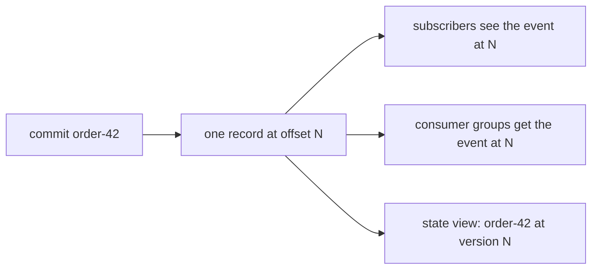

An **atomic commit** writes an event and the state updates that go with it as
one record on the shard that owns an entity. A subscriber sees the event, a
consumer group gets it as work, and a state read returns the new values, all
at the same offset. No reader, on any broker, before or after a failover, sees
the event without the state or the state without the event.

```rust
use felix_client::CommitOp;

let receipt = client
    .commit(
        "acme",
        "orders",
        b"order-42",
        vec![
            CommitOp::enqueue("order-events", r#"{"type":"placed","id":42}"#),
            CommitOp::put("order-events", "order-42", r#"{"status":"placed"}"#),
        ],
    )
    .await?;

let state = client
    .state_get("acme", "orders", "order-events", b"order-42", "order-42")
    .await?;
assert_eq!(state.version, Some(receipt.offset));
```

## What goes in a commit

A commit carries exactly one event, as `publish(stream, payload)` for
subscribers or `enqueue(queue, payload)` for consumer groups. A queue is a
stream read through a group, so both write the same record; pick the one that
says what you mean. Add any number of `put(stream, key, value)` and
`delete(stream, key)` operations, applied in order to that stream's keyed
state.

`entity_key` routes the commit to one shard of the stream, the way a publish's
routing key does. Every commit for an entity lands on its shard, in order, and
the state for that entity lives there too.



## A commit at an expected offset

`commit_if` takes one more argument, the offset the commit must land at: the
shard's next. It is written only if nothing was appended to the shard since
the writer saw that offset, and refused otherwise with the shard's tail and
nothing written, neither the event nor the state.

```rust
use felix_client::{CommitOp, ConditionalWrite};

let answer = cluster
    .commit_if("acme", "games", b"match-7", vec![
        CommitOp::publish("match-events", r#"{"tick":120}"#),
        CommitOp::put("match-events", "score", r#"{"red":3,"blue":1}"#),
    ], next)
    .await?;
if let ConditionalWrite::Refused { tail } = answer {
    // Someone else wrote, or a failover moved the tail. Re-read from `tail`.
}
```

This is a compare-and-set on the whole shard, not on a key: any write to the
shard, including a plain publish, refuses it. A per-key version check is not
built yet ([#1051](https://github.com/GetFelix/felix/issues/1051)). The same
check on a plain publish is [`publish_if`](/features/pubsub/#conditional-publishes).

## What atomic covers, and what it does not

A commit is atomic because it is one record in one shard's log. Storage,
replication, the `Quorum` committed mark and failover all treat a record as
indivisible, so a replica holds all of a commit or none of it. On the broker,
the event reaches the replay ring and the state reaches the state view under
one lock, and on a `Quorum` stream both wait together for the mark.

Each stream shard is its own log, so a commit cannot span two streams, two
shards, or a stream and a cache. The client refuses such a commit with
`CommitError::NotOnOwningShard` before sending anything. Felix never splits a
commit across logs, and it does not offer cross-log transactions.

A few more limits apply today:

- A commit is not idempotent. Re-sending one whose answer was lost may write
  it twice.
- State is rebuilt from the retained log after a restart or a failover, so
  keep an entity stream's retention long enough to cover every live key.
- An ephemeral stream refuses commits, because there is no log to hold them.
- In a cluster, an operator finalizes the `atomic_commit` fleet feature once
  every broker is upgraded, and commits are refused until then.

## Checked, not just claimed

The TLA+ model `FelixAtomicCommit` shows a commit is all-or-nothing across a
failover and a second promotion, and two variants show why it has to be one
record applied whole: split into records, or applied part by part, the model
finds a reader seeing half a commit. The history checker runs commits against
a three-broker cluster under kills, pauses, partitions and clock faults, and
its partial-commit rule fails the run if a reader ever sees the event without
the state or the state without the event.

The full semantics, the wire messages and the record format are in
[`docs/atomic-commit.md`](https://github.com/GetFelix/felix/blob/main/docs/atomic-commit.md).
