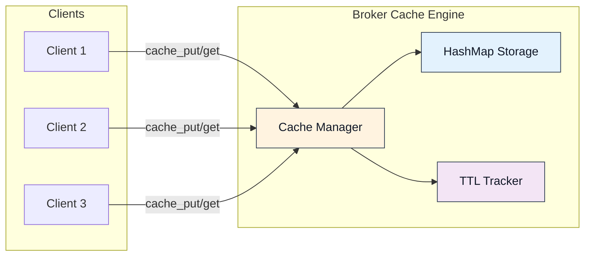
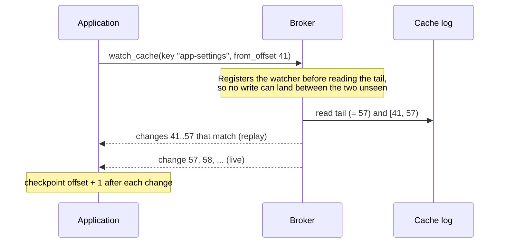

The Felix cache is a key-value store served over the same QUIC transport and
wire protocol as everything else. It exists for the workloads a sidecar Redis
usually gets deployed for (sessions, configuration, hot lookups) without
running a second system.

## Overview

The Felix cache is:

- **Key-value store** with optional TTL (time-to-live)
- **Scoped** to `(tenant_id, namespace, cache_name, key)`
- **In-memory** for lowest latency, when the broker has no durable storage configured. With `FELIX_DURABLE_STORAGE_DIR` the cache is backed by a log and survives a restart.
- **Watchable** when log-backed: subscribe to changes for one key or key prefix, resume by offset, and falling behind is reported explicitly
- **Multiplexed** over pooled QUIC streams
- **Highly concurrent** with request pipelining



## Core Features

### 1. Low-Latency Operations

Felix cache is optimized for microsecond-level latency:

**Localhost performance** (concurrency=32):

| Operation | Payload | p50 Latency | p99 Latency | Throughput |
|-----------|---------|-------------|-------------|------------|
| put | 0 B | 158 µs | 350 µs | 184k ops/sec |
| put | 256 B | 179 µs | 380 µs | 155k ops/sec |
| put | 4 KB | 260 µs | 480 µs | 78k ops/sec |
| get (hit) | 256 B | 177 µs | 360 µs | 166k ops/sec |
| get (miss) | - | 165 µs | 340 µs | 179k ops/sec |

Methodology and current figures live in
[Benchmarks](/features/benchmarks/). Compared to a plain-TCP cache,
Felix pays some latency for always-on TLS and QUIC framing; what it buys is
multiplexing, per-stream flow control, and one system instead of two.

### 2. Time-to-Live (TTL)

Store entries with automatic expiration:

```rust
// Store session with 1-hour TTL
client.cache_put(
    "acme",
    "prod",
    "sessions",
    "user-abc",
    session_data,
    Some(3600_000)  // 60 minutes in milliseconds
).await?;

// After 1 hour, entry automatically expires
tokio::time::sleep(Duration::from_secs(3601)).await;

// Returns None (expired)
assert_eq!(
    client.cache_get("acme", "prod", "sessions", "user-abc").await?,
    None
);
```

**TTL semantics**:

- **Countdown starts**: When `cache_put` completes
- **Expiration checking**: Lazy (on access)
- **Updates**: Each `cache_put` resets TTL

**Common TTL patterns**:

```rust
// Short-lived session (5 minutes)
client
    .cache_put("acme", "prod", "sessions", key, data, Some(300_000))
    .await?;

// Medium-lived cache (1 hour)
client
    .cache_put("acme", "prod", "user-profiles", key, data, Some(3600_000))
    .await?;

// Long-lived config (24 hours)
client
    .cache_put("acme", "prod", "config", key, data, Some(86400_000))
    .await?;

// Permanent (until restart or eviction)
client
    .cache_put("acme", "prod", "static-data", key, data, None)
    .await?;
```

### 3. Namespace Scoping

Cache entries are scoped to prevent collisions:

**Scope hierarchy**:

```
(tenant_id, namespace, cache_name, key)
```

**Example**:

```rust
// These are completely independent entries
client.cache_put("acme", "prod", "sessions", "user-123", data1, ttl).await?;
client.cache_put("acme", "staging", "sessions", "user-123", data2, ttl).await?;
client.cache_put("acme", "prod", "profiles", "user-123", data3, ttl).await?;
client.cache_put("other-tenant", "prod", "sessions", "user-123", data4, ttl).await?;
```

Access follows the same scopes. A token can be granted a whole cache
(`cache.read:cache:acme/prod/sessions`) or only some of its keys: one key
(`cache:acme/prod/sessions/user-123`) or every key with a prefix
(`cache:acme/prod/sessions/room1/*`). So many rooms or users can share one
cache, each credential limited to its own keys. A prefix is a plain string
prefix, so end it with a separator when ids share leading characters. A
prefix watch needs a prefix grant covering the whole watched prefix. See
[Security](/features/security/#rbac-model-casbin).

### 4. Request Pipelining

Send multiple cache requests without waiting for responses:

```rust
use futures::future::join_all;

// Issue 10 concurrent gets
let futures = (0..10).map(|i| {
    let key = format!("key-{}", i);
    client.cache_get("acme", "prod", "config", &key)
});

// Await all responses
let results: Vec<Option<Bytes>> = join_all(futures).await
    .into_iter()
    .collect::<Result<Vec<_>>>()?;
```

Ten sequential gets cost ten round trips; ten pipelined gets cost roughly
one. It works because each request carries a `request_id`, the broker may
answer out of order, and the client correlates the replies.

### 5. Stream Pooling

Felix uses stream pooling for high-concurrency cache workloads:

```yaml
# Client configuration
cache_conn_pool: 8              # QUIC connections
cache_streams_per_conn: 4       # Streams per connection
# Total concurrent operations: 8 × 4 = 32
```

**Why pooling matters**:

Without pooling (single stream):
- All requests serialize on one stream
- HOL blocking if any request is slow
- Limited throughput

With pooling, requests spread across streams with independent flow control,
so concurrency scales until the transport or broker saturates. It is not a fixed
multiplier. Measure your own workload's shape; the concurrency sweep in
[Benchmarks](/features/benchmarks/) is the reference point.

### 6. Consistency Levels

A cache key hashes to one shard, and each shard has one owner. Any broker
forwards an operation to the key's owner, so a value written through one
broker is readable through every other and there is never a second copy to
diverge. Concurrent writes to one key land in the order the owner applies
them: last write wins.

```rust
use bytes::Bytes;
client
    .cache_put("acme", "prod", "data", "key", Bytes::from_static(b"value-1"), None)
    .await?;

// A get through any broker reaches the owner.
assert_eq!(
    client.cache_get("acme", "prod", "data", "key").await?,
    Some(Bytes::from_static(b"value-1"))
);
```

A cache declares `Leader` (the default) or `Quorum` when it is created, as a
stream does ([Control plane API](/api/control-plane-api/)). The level
covers puts, deletes and counter adds.

- **`Leader`**: the owner applies the change and answers. Replicas catch up
  afterwards.
- **`Quorum`**: a write is acknowledged once a majority of the shard's replicas
  holds it. A get or counter get answers only once a majority holds everything
  its value reflects and the owner has confirmed it still leads, so a failover
  cannot take the value back.

A `Quorum` operation that cannot reach a majority in time fails with
`quorum_timeout`, and one whose owner loses the shard mid-operation fails with
`leadership_lost`. Neither means the write failed, only that the broker cannot
vouch for it, so retry. An owner whose lease has lapsed refuses operations with
`shard_unavailable`.

By default a `Quorum` read confirms leadership by the owner's lease, which
trusts the clocks. Once an operator finalizes the `lease_free_reads` fleet
feature, it confirms with a round of fences answered by a majority instead,
which makes the read linearizable without clocks. `FELIX_QUORUM_READS=lease`
keeps a broker's reads on the lease. Writes use the lease in every mode.
Watches on a replicated `Quorum` cache stop needing it once `lease_free_reads`
is finalized: a watch sees only committed changes, and ends when its broker
learns it was replaced or has heard from no majority for a lease duration. [Upgrades](/deployment/upgrades/) has the finalize runbook, and
[Delivery Semantics](/architecture/semantics/#consistency-model) the full
contract.

### 7. Keyed Watch

A log-backed cache can also be watched. `watch_cache`
delivers every applied write for one key or key prefix, in the shard's write
order, each change carrying the cache-log offset that makes it resumable:

```rust
use felix_client::{CacheWatchFilter, CacheWatchItem};

// Current changes only, from now on
let mut watch = client
    .watch_cache("acme", "prod", "config", CacheWatchFilter::Key("app-settings".into()), None)
    .await?;

while let Some(item) = watch.recv().await {
    match item {
        CacheWatchItem::Change(change) => match change.value {
            Some(value) => reload_config(&value),           // put
            None => clear_config(),                          // delete
        },
        CacheWatchItem::Lagged { resume_from } => {
            // The watch fell behind and was ended. Re-watching from
            // `resume_from` replays everything missed, with no gap.
            break;
        }
        CacheWatchItem::ShardMoved(moved) => {
            // The shard moved to another broker, which ended the watch.
            // Re-watch from `moved.resume_from`, or after the last offset seen.
            // A `ClusterClient` watch does this itself and carries on.
            break;
        }
    }
}
```

A prefix watch works the same way. `CacheWatchFilter::Prefix("user:".into())`
sees every key under `user:`, and an empty prefix is every key in the shard.

![An animated walkthrough of a keyed cache watch. Writes for several keys are applied to one cache shard's log in order, each taking the next offset. A watch on the prefix user: receives a copy of each matching change the moment it is applied (puts with their values, a delete as a tombstone), while writes to other keys pass it by. The delivered copies keep their log offsets, so the watch's offsets are sparse by construction, which is why a gap between them is not a drop signal and falling behind is reported explicitly instead.](/diagrams/cache-watch.svg)

**Resume by offset.** Pass `Some(offset)` to resume at the first change not yet
seen; the broker replays `[offset, tail)` from the cache's log before live
delivery, joined with no gap and no duplicate. An application checkpoints
`change.offset + 1` exactly as a stream subscriber does.

**Resume after compaction.** The cache's log compacts, so a
long-disconnected watcher can name an offset that no longer exists. The broker
answers with `resnapshot() == true` and each matching key's *current* value,
then live changes. This is the same snapshot-plus-changes contract etcd uses for a
compacted watch revision.

**Falling behind.** A filtered watch cannot detect a drop from an offset jump
(other keys' writes make offsets sparse), so a watch that falls behind is ended
with `Lagged { resume_from }` instead of silently dropping changes. Re-watching from
`resume_from` is gapless.



**Retained delivery.** A watch can start from the current state instead of from
now. This is MQTT's retained message, and it is what presence and state-sync
applications are built on. `watch_cache_retained` delivers each
matching key's current value (at the offset of the write that produced it),
then live changes; a client joins and immediately holds the roster:

```rust
let mut watch = client
    .watch_cache_retained("acme", "prod", "presence", CacheWatchFilter::Prefix("room:7:".into()))
    .await?;

// Exactly this many values are the current state. 0 means the room is
// empty.
let joining = watch.retained_count().expect("a retained watch reports its count");

let mut roster = std::collections::HashMap::new();
while let Some(item) = watch.recv().await {
    if let CacheWatchItem::Change(change) = item {
        match change.value {
            Some(value) => roster.insert(change.key, value),
            None => roster.remove(&change.key),
        };
        // After `joining` changes the roster is complete; everything further
        // is someone arriving or leaving, live.
    }
}
```

Retained and `from_offset` are mutually exclusive, because a resume already
replays the state a retained start skips to. Retained delivery works with
everything above: a retained watch that later falls behind still lags loudly, and a key
whose newest write races past the join arrives as the first live change
instead of in the state, folding to the same result.

TTL expiry is delivered as a delete. Reads treat an entry as absent the moment
its TTL passes, and the shard's leader writes a delete for it in its expiry
pass, which every watch of that key receives. The pass runs once a second and
writes at most 1024 deletes per shard, so under a mass expiry the deletes lag.
An expiry is permanent once written: a leader whose clock jumps forward deletes
entries early, for good. A watcher that mirrors the
cache needs no timers of its own. Every put still carries its
`expires_at_millis`.

The features are negotiated (`FEATURE_CACHE_WATCH`, with retained delivery as
its own `FEATURE_CACHE_WATCH_RETAINED` bit) and advertised only by brokers
whose cache is log-backed: an in-memory cache has no offsets to anchor resume,
duplicate detection, or the lag signal to. See the
[wire protocol](/architecture/wire-protocol/) for the message shapes.

### 8. Counters

`counter_add` appends a signed delta to a log, the broker folds the running
sum, and the answer is the sum *including* your delta. Incrementing and
learning the new value is one round trip:

```rust
// One round trip: apply the delta and learn the result.
let hits = client.counter_add("acme", "prod", "limits", "user:42:reqs", 1).await?;
if hits > LIMIT {
    return Err(RateLimited);
}

// Point read; None means never written, which is not the same as zero.
let views = client.counter_get("acme", "prod", "metrics", "page:home").await?;
```

Counters are scoped and routed exactly like cache keys (same cache scope,
same key-to-shard hash, same owner), but they are stored separately from cache
values. A counter and a cache value may share a key and are unrelated, and a cache
watch does not see counter changes.

The sum is durable and replicated: it survives a restart (rebuilt by folding
the log), compaction (applied deltas collapse into a checkpoint without the
sum or the offsets moving), and leader failover (the counter log ships with
its cache shard, so the promoted replica folds the true sum and keeps
counting). Negotiated as `FEATURE_COUNTERS`, durable brokers only.

:::caution[Counters are at-least-once]
A retried `counter_add` after a lost acknowledgement counts twice, because
deltas carry no dedupe identity. A counter is durable and atomic per shard, but
increments are not exactly-once. An application that cannot tolerate a
double-count keeps its own idempotency key.
:::

### 9. Conditional writes

`cache_put_if` stores a value only if the key is absent or still at the version
you read, and `cache_delete_if` removes it only at that version. The check and
the write are one step on the key's owner, so two clients racing for the same
key cannot both win.

```rust
use felix_client::CacheCondition;

// Take a lease if nobody holds it.
let taken = client
    .cache_put_if("acme", "prod", "leases", "endpoint-7", me.clone(), Some(30_000),
        CacheCondition::Absent)
    .await?;
if !taken.applied {
    return Ok(()); // someone else holds it; taken.version is theirs
}
let mut version = taken.version.expect("an applied put has a version");

// Renew it only if it is still ours.
let renewed = client
    .cache_put_if("acme", "prod", "leases", "endpoint-7", me.clone(), Some(30_000),
        CacheCondition::Version(version))
    .await?;
if renewed.applied {
    version = renewed.version.expect("an applied put has a version");
}

// Release it only if nobody took it over.
client.cache_delete_if("acme", "prod", "leases", "endpoint-7", version).await?;
```

For a read-modify-write, `cache_get_versioned` returns the value with its
version; write the new value with `CacheCondition::Version` and read again if
it was refused.

A refusal is an answer, not an error: `applied` is false and `version` is the
key's current version (`None` when it has none). An expired entry counts as
absent. A key's version is the log offset of the put that wrote it. It only
grows and is never reused, and it survives compaction and restarts. The
in-memory cache has no log, so its versions come from a counter that starts
each run at the wall-clock time in microseconds; a version read before a
restart is refused after it rather than matching a new value. The
answer waits on the same durability and replication as a plain put. Negotiated
as `FEATURE_CACHE_CONDITIONAL`; both cache backends support it.

A conditional write is never resent by the client after a lost answer: if the
first one applied, the retry would be refused by the version it wrote. Read
the key to find out which happened.

### 10. Choosing a feature

Watches, retained delivery and counters all read the same log, so they can be
combined. This table maps common applications to the feature that fits:

| You are building | Reach for | Why this shape |
|---|---|---|
| Config push, feature flags, cache invalidation | **Keyed watch** on the config key or prefix | Every instance learns of the change the moment it lands; the offset makes reconnects gapless |
| Presence, lobbies, collaborative state | **Retained watch** on a prefix | Join and immediately hold the roster, then stay current; `retained_count` tells you the exact moment your state is complete, and an empty room is a definite zero |
| A read-heavy dashboard over changing state | **Retained watch**, materialized locally | Current values first, then only the changes. No re-fetch loop, and a lag is reported instead of shown as stale data |
| Rate limiting, quotas, usage metering | **Counter** per principal | Increment-and-read in one round trip against the shard's owner, durable across restart and failover, with no racy get-modify-put |
| Live tallies (votes, likes, inventory deltas) | **Counter**, read by pollers or fronted by a put | Deltas fold server-side; publish the folded sum into a watched cache key when watchers need push instead of poll |
| Leases, idempotency keys, config edits | **Conditional writes** | Put-if-absent claims a key once; put-if-version edits only what you read, so concurrent writers cannot overwrite each other |

### 11. Eviction (in-memory only: best-effort)

The in-memory backend evicts opportunistically under memory pressure. There is no
guaranteed LRU or LFU, so don't rely on a specific eviction order. The
log-backed cache does not evict at all; it compacts. Configurable eviction
policies are not implemented.

## API Reference

### cache_put

Store a key-value pair with optional TTL.

**Signature**:

```rust
async fn cache_put(
    &self,
    tenant_id: &str,
    namespace: &str,
    cache: &str,
    key: &str,
    value: Bytes,
    ttl_ms: Option<u64>
) -> Result<()>
```

**Parameters**:

- `tenant_id`: Tenant identifier
- `namespace`: Namespace within the tenant
- `cache`: Cache name (e.g., "sessions", "config")
- `key`: Cache key (arbitrary string)
- `value`: Value to store (binary data)
- `ttl_ms`: Optional TTL in milliseconds (None = no expiration)

**Returns**: `Ok(())` on success, error on failure

**Example**:

```rust
use bytes::Bytes;

// Store with 30-minute TTL
client.cache_put(
    "acme",
    "prod",
    "sessions",
    "session-xyz",
    Bytes::from(session_data),
    Some(1800_000)
).await?;
```

### cache_get

Retrieve a value from the cache.

**Signature**:

```rust
async fn cache_get(
    &self,
    tenant_id: &str,
    namespace: &str,
    cache: &str,
    key: &str
) -> Result<Option<Bytes>>
```

**Parameters**:

- `tenant_id`: Tenant identifier
- `namespace`: Namespace within the tenant
- `cache`: Cache name
- `key`: Cache key to retrieve

**Returns**:

- `Ok(Some(value))`: Key found, value returned
- `Ok(None)`: Key not found or expired
- `Err(e)`: Operation failed

**Example**:

```rust
match client.cache_get("acme", "prod", "sessions", "session-xyz").await? {
    Some(data) => {
        let session: Session = deserialize(&data)?;
        // Use session
    }
    None => {
        return Err("Session expired or not found");
    }
}
```

### cache_delete

Remove a key, reporting the value it held.

**Signature**:

```rust
async fn cache_delete(
    &self,
    tenant_id: &str,
    namespace: &str,
    cache: &str,
    key: &str
) -> Result<Option<Bytes>>
```

**Returns**:

- `Ok(Some(value))`: The key was there; this is what was removed
- `Ok(None)`: The key was not there (this is not an error)
- `Err(e)`: Operation failed, or the broker predates `FEATURE_CACHE_DELETE`

### cache_put_if / cache_delete_if / cache_get_versioned

Conditional writes; see [Conditional writes](#9-conditional-writes).

**Signatures**:

```rust
async fn cache_put_if(
    &self,
    tenant_id: &str,
    namespace: &str,
    cache: &str,
    key: &str,
    value: Bytes,
    ttl_ms: Option<u64>,
    condition: CacheCondition,  // Absent or Version(u64)
) -> Result<CacheConditionResult>

async fn cache_delete_if(
    &self,
    tenant_id: &str,
    namespace: &str,
    cache: &str,
    key: &str,
    version: u64,
) -> Result<CacheConditionResult>

async fn cache_get_versioned(
    &self,
    tenant_id: &str,
    namespace: &str,
    cache: &str,
    key: &str,
) -> Result<Option<VersionedValue>>  // value and version
```

**Returns**: `CacheConditionResult { applied, version }`. Applied, `version` is
the one the put wrote; refused, it is the key's current version, or `None` when
the key has none. `Err(e)` when the operation failed, or the broker predates
`FEATURE_CACHE_CONDITIONAL`.

### watch_cache

Subscribe to changes for one key or key prefix. See [Keyed Watch](#7-keyed-watch).

**Signature**:

```rust
async fn watch_cache(
    &self,
    tenant_id: &str,
    namespace: &str,
    cache: &str,
    filter: CacheWatchFilter,   // Key(String) or Prefix(String)
    from_offset: Option<u64>    // None = from now; Some(n) = resume at n
) -> Result<CacheWatch>
```

**Returns**: a `CacheWatch` whose `recv()` yields `CacheWatchItem::Change`
(key, optional value, offset, expiry) and, if the watch falls behind,
`CacheWatchItem::Lagged { resume_from }` before ending, or
`CacheWatchItem::ShardMoved` if its shard moved to another broker. The same
method on `ClusterClient` returns a `ClusterCacheWatch`, which follows the
shard to its new owner instead of ending.
`resnapshot()` reports
whether a resume began from current values because compaction collapsed the
requested history. Fails without sending anything when the broker did not
advertise `FEATURE_CACHE_WATCH`.

## Use Cases

### 1. Session Management

Store user sessions with automatic expiration:

```rust
struct SessionStore {
    client: Arc<Client>,
}

impl SessionStore {
    async fn create_session(&self, user_id: &str) -> Result<String> {
        let session_id = generate_session_id();
        let session = Session {
            user_id: user_id.to_string(),
            created_at: Utc::now(),
            expires_at: Utc::now() + Duration::minutes(30),
        };
        
        // Store with 30-minute TTL
        use bytes::Bytes;
        self.client
            .cache_put(
                "acme",
                "prod",
                "sessions",
                &session_id,
                Bytes::from(serialize(&session)?),
                Some(1800_000),
            )
            .await?;
        
        Ok(session_id)
    }
    
    async fn get_session(&self, session_id: &str) -> Result<Option<Session>> {
        match self
            .client
            .cache_get("acme", "prod", "sessions", session_id)
            .await?
        {
            Some(data) => Ok(Some(deserialize(&data)?)),
            None => Ok(None),
        }
    }
    
    async fn extend_session(&self, session_id: &str) -> Result<()> {
        if let Some(mut session) = self.get_session(session_id).await? {
            session.expires_at = Utc::now() + Duration::minutes(30);
            use bytes::Bytes;
            self.client
                .cache_put(
                    "acme",
                    "prod",
                    "sessions",
                    session_id,
                    Bytes::from(serialize(&session)?),
                    Some(1800_000),
                )
                .await?;
        }
        Ok(())
    }
}
```

### 2. Configuration Cache

Cache application configuration with refresh:

```rust
struct ConfigCache {
    client: Arc<Client>,
}

impl ConfigCache {
    async fn get_config(&self, key: &str) -> Result<Config> {
        // Try cache first
        if let Some(data) = self
            .client
            .cache_get("acme", "prod", "config", key)
            .await?
        {
            return Ok(deserialize(&data)?);
        }
        
        // Cache miss: load from database
        let config = self.load_from_db(key).await?;
        
        // Store in cache with 1-hour TTL
        use bytes::Bytes;
        self.client
            .cache_put(
                "acme",
                "prod",
                "config",
                key,
                Bytes::from(serialize(&config)?),
                Some(3600_000),
            )
            .await?;
        
        Ok(config)
    }
    
    async fn update_config(&self, key: &str, config: &Config) -> Result<()> {
        // Update database
        self.save_to_db(key, config).await?;

        // Write through to the cache. Every watcher of this key is notified
        // with the new value, so no separate invalidation channel is needed.
        use bytes::Bytes;
        self.client
            .cache_put(
                "acme",
                "prod",
                "config",
                key,
                Bytes::from(serialize(config)?),
                Some(3600_000),
            )
            .await?;

        Ok(())
    }
}
```

### 3. Rate Limiting

A fixed-window limit with a counter. `counter_add` is atomic on the key's
owner, so concurrent requests cannot both read the same count:

```rust
struct RateLimiter {
    client: Arc<Client>,
    limit: i64,
    window_ms: u64,
}

impl RateLimiter {
    async fn check_rate_limit(&self, user_id: &str, now_ms: u64) -> Result<bool> {
        // One counter per user per window.
        let key = format!("rate-limit:{}:{}", user_id, now_ms / self.window_ms);
        let count = self
            .client
            .counter_add("acme", "prod", "rate-limits", &key, 1)
            .await?;
        Ok(count <= self.limit)
    }
}
```

## Performance Tuning

### Client Configuration

**Latency-optimized** (low concurrency):

```rust
let quinn = quinn::ClientConfig::with_platform_verifier();
let config = ClientConfig {
    cache_conn_pool: 2,
    cache_streams_per_conn: 2,
    ..ClientConfig::optimized_defaults(quinn)
};
```

**Throughput-optimized** (high concurrency):

```rust
let quinn = quinn::ClientConfig::with_platform_verifier();
let config = ClientConfig {
    cache_conn_pool: 16,
    cache_streams_per_conn: 8,
    ..ClientConfig::optimized_defaults(quinn)
};
```

### Broker Configuration

```yaml
# QUIC flow control. One listener carries cache requests and publishes,
# so its receive windows follow the publish budget (16 MiB by default).
pub_conn_recv_window: 16777216       # per connection
pub_stream_recv_window: 16777216     # per stream
cache_send_window: 268435456         # send window
```

## Limitations and Planned Features

### Current limitations

1. **No multi-key operations**: no transactions. A conditional write checks one key
2. **Best-effort eviction** in the in-memory backend: no guaranteed LRU or LFU. The log-backed cache does not evict at all; it compacts.
3. **A prefix watch reads one shard**: keys sharing a prefix hash to different shards, so `Client` needs one `watch_cache_shard` per shard. `ClusterClient::watch_cache_sharded` opens and merges them for you, as `subscribe_sharded` does for streams

### Planned Features

**Multi-key operations**:

```rust
// Batch get
let keys = vec!["key1", "key2", "key3"];
let values = client.cache_get_batch("data", &keys).await?;

// Transaction
client.cache_transaction()
    .put("accounts", "alice", decrease(100))
    .put("accounts", "bob", increase(100))
    .commit()
    .await?;
```

## Designing around the cache

For ordinary caching, design the read path to fall back to wherever the data
really lives. Then a miss, an eviction or a broker restart costs performance
but not correctness, and that is why the in-memory cache's best-effort nature is acceptable
at all. For state that lives only in the cache, such as presence, rosters and
counters, use the log-backed cache with watches and counters.
