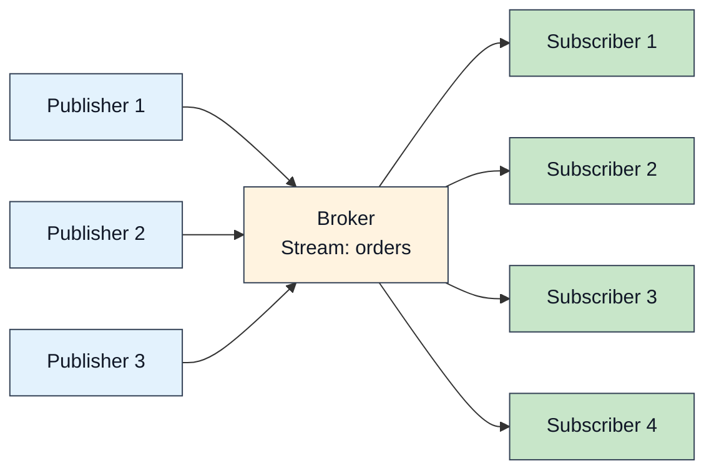

The model is small: publishers send to a **stream**, every subscriber to that
stream receives what lands on it, and streams are scoped by
`(tenant, namespace, stream)`. Most of this page covers two properties the
implementation works hard for: cheap fanout, and one slow subscriber not
slowing anyone else down.



## Fanout

A publish is encoded **once** and the encoded frame is shared by every
subscriber, so adding subscribers adds delivery work but not re-encoding
work. Latency at fanout 1 and 10 is measured on
[Benchmarks](/features/benchmarks/), with the methodology. Fanout above
10 has not been benchmarked, so treat behaviour at hundreds or thousands of
subscribers as unmeasured.

## Batching

### Publisher side

Send several payloads in one request:

```rust
use felix_client::AckMode;

let mut batch = Vec::new();
for i in 0..64 {
    batch.push(format!("Event {}", i).into_bytes());
}

let publisher = client.publisher().await?;
publisher
    .publish_batch("tenant", "ns", "stream", batch, AckMode::PerBatch)
    .await?;
```

Batching amortizes per-request overhead (framing, syscalls, one ack for the
whole batch), and it is the single biggest throughput lever on the publish
path. Measured batch throughput is in
[Benchmarks](/features/benchmarks/). A batched run measures a
throughput profile, not request latency.

### Acked publishes are pipelined

Acked publishes (`AckMode::PerMessage` / `AckMode::PerBatch`) do not stall
the stream for the broker's round trip. The client writes acked requests back
to back and resolves each caller's future as the matching ack arrives, in
order. Concurrent publishers on the same stream share the stream's full
bandwidth instead of taking turns paying a round trip each. In-flight acked
data is bounded by the publisher's byte budget (`publish_inflight_bytes`,
4 MiB by default): a request holds its budget until the broker's ack, not
merely until the frame is written.

A client that negotiates `FEATURE_PUBLISH_PIPELINE` also gets a publish window
from the broker (`FELIX_BROKER_PUBLISH_WINDOW`, 256 by default): up to that many
acked publishes may be unanswered on each stream, and their acks come back in
the order the stream sent them. Every stream has its own window, so publishes
stuck behind a stalled shard do not hold up the other streams on the same
connection. The Rust client also gives each shard a stream of its own, so a
stalled shard holds up only its own publishes, not the stream's other shards,
and one busy stream's shards spread over the client's connections and the
broker's listeners. It keeps up to 16 such streams per broker
(`publish_shard_streams`); shards past that share the pooled streams.

Spreading never reorders a shard. Every publish one client makes to one shard
goes through one writer on one QUIC stream, so the shard's log holds them in
the order the client issued them. Different shards of a stream may travel on
different connections, which costs nothing: their order relative to each
other was never defined. Unkeyed publishes all go to shard 0, so a stream
published without keys, or a single-shard stream, stays on one stream and one
connection per client. That is the price of total order; spread such a
stream's load over several clients, or give it shards and keys.

A single caller that awaits each publish before issuing the next still
pays one round trip per publish. Batch, or publish concurrently, to amortize
it.

### Broker side

The broker coalesces events into delivery batches per subscription. A batch
takes every event already queued for the subscriber and flushes as soon as
nothing more is waiting, or when a bound is hit:

```yaml
event_batch_max_events: 64      # this many events, or
event_batch_max_bytes: 262144   # this many bytes, or
event_batch_max_delay_us: 250   # under load, this much time since the first event
```

A trickle is sent event by event with no added delay. Once events arrive
faster than the broker drains them, so a batch finds others queued behind its
first, the next batch waits up to the delay to fill. Small events under a
steady load then flush on the count bound and big events on bytes. Delivery uses binary `EventBatch` framing by default.

## Ordering

Within one stream (strictly: one shard of one stream), subscribers see
records in publish order. Across streams there is no ordering: two publishes
to different streams may be observed in either order.
On a multi-shard stream, ordering is per routing key. A stream maps a key to a
shard by `hash(key) % shards`, or, for streams created with jump-hash routing,
by jump consistent hashing of the same hash; an unkeyed publish goes to shard
0. See the [wire protocol](/architecture/wire-protocol/) page.

## Conditional publishes

A single writer, such as the process that owns a match's state, can publish
only if the stream has not moved since it last wrote. `publish_if` carries the
offset the writer expects the batch to start at, the shard's next. The broker
checks it where it assigns offsets, so of two writers expecting the same
offset exactly one is written. The other is refused with the tail and writes
nothing.

```rust
use felix_client::ConditionalWrite;

let mut next = 0;
match cluster
    .publish_if("acme", "games", "match-7", None, vec![b"tick 120".to_vec()], next)
    .await?
{
    ConditionalWrite::Written { offset } => next = offset + 1,
    // Another writer got there first, or a failover moved the tail.
    ConditionalWrite::Refused { tail } => return Err(anyhow::anyhow!("lost the stream at {tail}")),
}
```

A few things to know:

- The tail counts every record on the shard, including the one a new leader
  writes when it takes over. After a failover the expected offset is stale
  even with no rival, and the refusal says where the shard is now.
- A refused publish consumes no offset, so the next write is not held up and
  leaves no gap.
- If the answer is lost, do not resend: the retry would be refused by your own
  write. Read the shard at the expected offset to see whether it landed.
- The broker leading the shard answers it; it is never forwarded. On a
  `Leader` stream the fence is only as strong as the leader's lease.
- It needs a durable stream. Negotiated as `FEATURE_PUBLISH_CONDITIONAL`.
- `commit_if` is the same check on an [atomic commit](/features/atomic-commits/).

See [Conditional writes](https://github.com/GetFelix/felix/blob/main/docs/semantics.md#conditional-writes)
for the guarantees and the tests behind them.

## Isolation and backpressure

Each subscription gets its own bounded queue in the broker and its own QUIC
stream to the client, with its own flow-control window. Backpressure applies
at each level:

- **QUIC flow control** (per connection and per stream) bounds bytes in
  flight; a full window pauses that stream only.
- **The publish queue** (`pub_queue_depth`) bounds admitted-but-uncommitted
  publishes; when full, new publishes wait up to
  `publish_queue_wait_timeout_ms`, then fail. That failure means the broker
  is overloaded, and it is deliberately visible.
- **The subscriber queue** (`subscriber_queue_capacity`) bounds what one
  subscription can have pending. What happens when it fills is set by the
  overflow policy:


Under the default a publisher never waits on a subscriber. That is why one
stalled consumer cannot degrade the rest, and also why a subscriber can
silently miss records.

The overflow policy covers live records only. A subscription resumed from an
earlier offset reads history the broker pages off disk for it alone, with no
publisher to protect, so history below the subscription's `live_offset` is
never dropped: the client waits for room in its queue, and a slow reader slows
the replay instead of losing part of it.

`DropOld` is accepted in configuration and counted separately, but it currently
behaves as `DropNew`: the arriving record is the one discarded. The metric
`felix_sub_queue_drop_old_emulated_total` is what tells you that happened.

### Choosing a queue size

A subscriber can ask for its own queue capacity when it subscribes, instead of
the stream's `subscriber_queue_capacity`. A reader with bursty processing asks
for more room so a burst does not overflow it; a reader that only cares about
recent records can ask for less. The capacity counts published batches, not
records.

The broker clamps the request to between 1 and
`FELIX_SUBSCRIBER_QUEUE_CAPACITY_MAX` (default 4096) and answers with the
capacity it granted, so the client knows what it got. Each queued batch stays
in broker memory until the subscriber reads it, and the maximum is what bounds
that per subscriber. In the Rust client, set
`ClientConfig::broker_sub_queue_capacity` and read the grant from
`Subscription::queue_capacity`. A broker that predates the option does not
advertise `FEATURE_SUBSCRIBE_QUEUE`; the client does not ask it, and the
subscription gets the stream's default.

A subscriber picks only the size. The overflow policy stays the stream's,
because a subscriber that could pick `Block` could stall every publisher on the
shard just by reading slowly, and anyone allowed to subscribe could do it. A
reader that must not miss records uses a durable stream: when its queue drops,
the subscription ends with `subscription_lagged` and the offset to resume from,
and `ClusterClient` resubscribes there and replays the gap from the log. A
larger queue only makes that rarer.

:::caution[At-Most-Once Semantics]
A dropped event is not redelivered. A subscriber that falls behind its queue
misses messages. On a **durable** stream the loss is detectable and
recoverable: delivered events carry log offsets, so a gap in offsets is a drop
(less any `skipped_before` the event reports, for the generation-start records a
new leader writes), and the subscriber can resume from the offset it last
saw. On an
ephemeral stream there is nothing to resume from.

If you need redelivery rather than detection, use a **consumer group**: it
acknowledges each record and hands back anything unanswered once the visibility
timeout lapses. See [Projections](/architecture/projections/).
:::

## Delivery semantics

### At-most-once, per subscriber

This is what a plain subscription gives: no subscriber acknowledgements, no
redelivery, the lowest latency. It suits signals whose old values are
worthless, such as dashboards, telemetry and presence.

Ways a subscriber misses records: it fell behind its bounded queue, the
network partitioned, or the broker restarted while the stream was
**ephemeral**. A durable stream keeps its records across a restart, and a
subscriber resumes from the offset it last saw.

### At-least-once, via a consumer group

A different shape from `subscribe`: records are **pulled**, because only the
consumer knows when it has capacity for more work.

- Each record is claimed by one consumer and not handed to another while the
  claim holds
- An acknowledgement finishes a record; the group's cursor advances over a
  contiguous run, so acknowledging out of order cannot skip a gap
- Anything unanswered is redelivered once the visibility timeout lapses
- Redelivery is bounded: past `max_attempts` the record is dead-lettered
- Requires durable storage, and costs a round trip per settle

```rust
// Waits up to 5s for work rather than spinning on empty polls.
let records = client
    .group_poll_wait("tenant", "ns", "orders", shard, "fulfilment", 32, Duration::from_secs(5))
    .await?;

for record in records {
    match process_order(&record.payload) {
        Ok(()) => client.group_ack("tenant", "ns", "orders", shard, "fulfilment", record.offset).await?,
        // Hand it back for immediate redelivery instead of waiting out the timeout.
        Err(_) => client.group_nack("tenant", "ns", "orders", shard, "fulfilment", &record).await?,
    }
}
```

`record.attempts` carries how many times this record has been delivered, so a
consumer can treat a retry differently from a first attempt.

See [Queues](/features/queues/) for dead letters, redrive, and the
ordering rules that make the cursor safe.

### Reading a range, without subscribing

A subscription has no end. Replay from an offset runs on into live delivery
until the client unsubscribes. To read a fixed slice of a durable stream, such
as one match's events or a page of history in a UI, use a range read
(`stream_read` on the wire, `Client::read` in Rust). It returns one page of
committed records from a start offset, stopping before an end offset, with the
offset to read the next page from. Nothing is registered with the stream's
fanout, so the broker does no live work for it. A page is capped in records and
bytes, and it never waits: once it reaches what is committed it comes back short.
It is a request and response over JSON, one round trip per page. For bulk
export, a subscription is still the faster path.

### Exactly-once delivery is not offered

Writes can be idempotent: an idempotent producer's re-send is recognised and not
written twice. Delivery is at-most-once or at-least-once. Deduplicating on
receive has to happen in the application, the only layer that knows what makes
two records the same, so deduplicate there, keyed on something the record
carries.

## Tuning

Start with the defaults and change things only off a measurement. The
defaults are what [Benchmarks](/features/benchmarks/) measures. The
knobs pull in two directions:

Toward latency, use smaller batches, shorter delays and shallower queues:

```yaml
event_batch_max_events: 8
event_batch_max_delay_us: 100
fanout_batch_size: 8
pub_queue_depth: 16
subscriber_queue_capacity: 64
subscriber_writer_lanes: 2
```

Toward throughput, use bigger batches, deeper queues and more connections:

```yaml
event_batch_max_events: 256
event_batch_max_delay_us: 2000
fanout_batch_size: 256
pub_queue_depth: 512
subscriber_queue_capacity: 4096
subscriber_writer_lanes: 8
```

```rust
let quinn = quinn::ClientConfig::with_platform_verifier();
let config = ClientConfig {
    event_conn_pool: 16,
    publish_conn_pool: 8,
    publish_streams_per_conn: 4,
    event_router_max_pending: 4096,
    ..ClientConfig::optimized_defaults(quinn)
};
```

In a throughput-shaped configuration, per-message latency is dominated by
batch fill and queueing, so the latency percentiles of a batched run measure
the queue, not the request.

## How this compares

Roughly: Kafka is durable-first and batch-oriented, with a far bigger
ecosystem and higher per-message latency; Redis pub/sub and NATS (core) are
fast fire-and-forget with no per-subscriber isolation or replay. Felix sits
between: at-most-once fanout with real isolation, plus durable streams and
consumer groups on the same log when you need replay or redelivery. If your
workload is heavy stream *processing* (joins, windows, transformations),
that layer does not exist here; use a processing framework on top, or a
system that ships one.

A durable stream can also be written and read with Kafka clients: producers,
and consumers that assign their own partitions. That makes it possible to put
Felix behind services that already speak Kafka; see
[Kafka compatibility](/features/kafka/).
