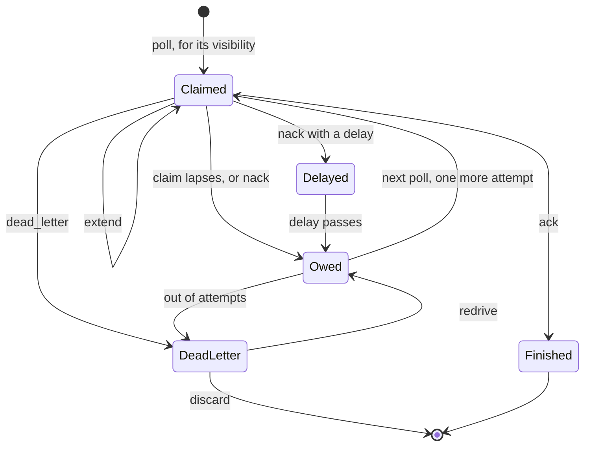

A **consumer group** reads a stream as work rather than as a broadcast. Where
every subscriber to a stream sees every record, the members of a group divide
the records between them: one consumer holds a record at a time, and the record
is not finished until someone says so.

It is the same log underneath (see
[Projections](/architecture/projections/)), read through a cursor the
group shares instead of a cursor per subscriber.


In the middle of the diagram, offset 4 is acknowledged while offset 3 is still
held, and the cursor stops at 3 anyway. It only advances over a contiguous run
of finished records, which makes the cursor safe to restart from: everything below it is genuinely done, so a broker
that restarts redelivers offset 3 and nothing before it.

Moving the cursor to the highest acknowledged offset would be simpler, and
would silently drop offset 3 on the next restart.

## The loop

```rust
loop {
    // Wait up to five seconds for work rather than spinning.
    let batch = client
        .group_poll_wait("t1", "default", "jobs", 0, "workers", 16, Duration::from_secs(5))
        .await?;

    for record in batch {
        match handle(&record.payload).await {
            Ok(()) => {
                client.group_ack("t1", "default", "jobs", 0, "workers", record.offset).await?;
            }
            Err(_) => {
                // Hand it back now rather than waiting out the timeout.
                client.group_nack("t1", "default", "jobs", 0, "workers", &record).await?;
            }
        }
    }
}
```

An empty batch means nothing was available, not an error.

A poll sees a record once it is written, which is not always when its publish
was acknowledged. A broker with `ack_on_commit` off (the default) acknowledges
a `Leader` stream's publish when it is queued, so a poll sent right after the
ack can come back without it. The next poll gets it. If a consumer has to see
everything acknowledged so far, publish with commit acks: `ack_on_commit: true`
in the producer's `ClientConfig`, or `FELIX_ACK_ON_COMMIT=true` on the broker.

## What the broker guarantees

**A record is held by one consumer at a time.** While a claim stands, no other
poll receives that record.

**A claim expires.** A consumer that stops answering does not hold a record for
ever: after `FELIX_GROUP_VISIBILITY_TIMEOUT_MS` the record is owed again and
goes to whoever polls next. This is why the loop above must be able to see the
same record twice.

**The cursor moves only over a contiguous run of acknowledgements.** If you
finish offset 6 while 5 is still outstanding, the group's saved position stays
below 5. Acknowledging out of order is fine; the position simply waits.

**Owed records go out before new ones**, so a redelivery is not starved behind a
fast producer.

> `an_offset_in_flight_is_not_handed_out_again`,
> `a_lapsed_claim_is_handed_out_again`,
> `the_cursor_does_not_advance_over_a_gap`,
> `owed_records_go_out_before_new_ones`.

## Holes that will not fill

Some offsets are settled by the broker and never delivered: generation-start
records a new leader writes, and records retention removed before the group got
to them. A record says how many offsets directly below it went that way
(`skipped_before`; `skippedBefore` in Node). A consumer that applies records in
offset order can wait for a missing offset unless this count covers it. The
count is negotiated (`FEATURE_GROUP_SKIPPED`), and the Felix clients offer it,
so a client that predates it gets the record without the field.

## A member that restarts

A claim belongs to the group, not to a process, so a member that dies leaves
its records claimed until the visibility timeout (`FELIX_GROUP_VISIBILITY_TIMEOUT_MS`,
30 s by default) lapses, and its replacement gets newer records first. A member
that names itself takes them back at once: poll with a stable `consumer` name
(`group_poll_as` with a `GroupMember` in Rust, `consumer=` in Python, the
`consumer` argument in Node), and set `reclaim` after a restart. The names
belong to the principal you authenticate as, so another principal using the same
name gets nothing of yours. A name is 1 to 128 bytes.

The first poll on a new connection that sets `reclaim` reserves every record the
member still holds from older connections. Those come back to that connection
before anything else, including records owed to the group, over as many polls
as it takes, and nobody else gets them in the meantime. Each counts as another
attempt. One whose claim lapses before you take it back goes to the whole group,
as any lapsed claim does.

Only that first poll reclaims. Leaving `reclaim` set on every poll is harmless,
and a connection older than the last one to reclaim never takes anything back.
Give each live process its own name: two under one name work, but the newer
takes what the older held when it first reclaims.

Claims are kept in the leader's memory, so this holds while the shard's leader
stays put; after a failover the group resumes from its durable position anyway.

## Retries and giving up

Every delivery carries `attempts`, counting this one. `1` is a first attempt;
anything higher is a redelivery, so a consumer can behave differently on a
retry: log it, route it elsewhere, or give up early.

After `FELIX_GROUP_MAX_ATTEMPTS` deliveries the broker gives up on a record: the
offset is recorded as a **dead letter** and the group moves past it. Without
that bound, one record that always fails stops the queue at that offset for
ever.

```rust
let dead = client.group_dead_letters("t1", "default", "jobs", 0, "workers").await?;
for offset in dead {
    // The record is still in the log at this offset.
    // Fixed the bug? Put it back:
    client.group_redrive("t1", "default", "jobs", 0, "workers", offset).await?;
    // Genuinely unprocessable? Stop tracking it:
    // client.group_discard("t1", "default", "jobs", 0, "workers", offset).await?;
}
```

A dead letter is a pointer to the record, not a copy. The record stays in the
stream's log at that offset, readable by an ordinary replay.

A redrive resets the record's attempt count and makes it owed again. It does
**not** move the group's cursor backwards, so everything already finished stays
finished. The redrive is durable: it is written to the dead-letter log before
the broker answers, so a leader lost before the record is finished leaves the
next leader owing it. It stays owed until a consumer acknowledges it, or until
it fails its attempts again and goes back on the list.

Redrive and discard change what every consumer of the group sees, so they need
`group.manage` (or `stream.manage`) on the stream. Polling, acknowledging,
handing back and listing dead letters need `group.consume`, which
`stream.subscribe` also grants. Either can be granted on one group
(`group:{tenant}/{namespace}/{stream}/{group}`) to keep a principal to the
groups it runs. See [Security](/features/security/).

> `a_record_is_given_up_on_after_the_attempt_bound`,
> `a_redriven_record_is_handed_out_again`,
> `a_redriven_record_gets_its_attempts_back`,
> `a_redriven_record_is_still_owed_after_a_restart`.

### Limits

- A consumer can only acknowledge or hand back an offset the group has handed
  out. Anything else, such as an offset at or past the tail, is refused with
  `invalid_request`: acknowledging a record that does not exist yet would skip
  it when it is written.
- A group on a shard has at most `FELIX_GROUP_MAX_IN_FLIGHT` records handed
  out and unsettled at once. A poll past it answers empty, and is counted in
  `felix_group_polls_capped_total`, until acknowledgements, hand-backs or
  lapsed claims free room; a poll waiting at the cap is woken when they do.
- One poll hands out at most 1,000 records and stops reading after about 4 MiB
  of payload, whatever `max_records` asks for. The rest stay owed for the next
  poll.
- A group untouched for ten minutes (or twice the visibility timeout, if that
  is longer) has its in-memory state dropped and rebuilt from disk on its next
  request. That redelivers anything it still had in flight and restarts attempt
  counts, the same as a leader change. A group with a claim or a delayed nack
  still standing is kept until it lapses.

Group state survives a leader failover. The position and the dead-letter list
replicate beside the shard's records, so a promoted leader resumes where the
group had got to, lists the records that were set aside, serves a redrive, and
still owes any record an operator redrove before the failover.

## Long work, backoff, and giving up yourself

The visibility timeout and the attempt bound are the broker's defaults. A
consumer can take each decision for itself, record by record, on a broker that
advertises `FEATURE_GROUP_CLAIM_CONTROL`.



**Claim for longer, or shorter, from the start.** `GroupPollOptions::visibility`
sets how long that poll's claims stand, instead of
`FELIX_GROUP_VISIBILITY_TIMEOUT_MS`.

**Extend a claim you are still working on.** A worker calling a slow downstream
heartbeats instead of letting the claim lapse:

```rust
use std::time::Duration;

let stands = client
    .group_extend("t1", "default", "jobs", 0, "workers", &record, Duration::from_secs(60))
    .await?;
```

The claim then stands for the returned duration from now. The extension is for
the delivery you hold: once the claim has lapsed and the record has gone out
again, it is refused with `stale_claim`, even if this worker is still running.
The record belongs to the group by then, and extending someone else's claim
would keep it from the group if that consumer died.

**Back off before a retry.** `group_nack_after` hands the record back to be
owed again only once the delay has passed:

```rust
client
    .group_nack_after("t1", "default", "jobs", 0, "workers", &record, Duration::from_secs(30))
    .await?;
```

Like an extension, the nack is for the delivery you hold, named by
`record.attempts`. Once the claim has lapsed and the record has gone out again
it is refused with `stale_claim`, so a late nack cannot take the record from
the consumer now working on it, or push its redelivery back. A plain
`group_nack` takes the record too and is refused the same way.

While it waits, the record holds a place under `FELIX_GROUP_MAX_IN_FLIGHT`, so
a group cannot park more than that. Nobody holds it, so it cannot be extended,
and a member that restarts does not reclaim it. Its redelivery counts as an
attempt as usual.

**Give up yourself.** When the consumer knows a record will never succeed,
`group_dead_letter` lists it as a dead letter of the group and finishes it,
exactly as the broker does at `FELIX_GROUP_MAX_ATTEMPTS`: written to the
dead-letter log first, so a crash in between leaves it listed and owed rather
than gone. `group_redrive` and `group_discard` work on it as on any other.
A record already finished is refused and not listed.

All three need `group.consume`, like an ack, and like an ack they are taken for
whatever the group has in play, from any consumer of the group: claims do not
yet say who holds them. Extensions and delays are the leader's memory, so a
failover hands those records out from the group's durable position, sooner
than asked. A consumer dead letter is durable and replicates with the shard.
The broker caps visibility, extensions and delays at
`FELIX_GROUP_MAX_VISIBILITY_MS`. The same calls are on `ClusterClient` and on
`ShardedGroup` (`extend`, `nack_after`, `dead_letter`).

The client refuses a delay or a visibility to a broker without the feature bit,
rather than sending it: an older broker ignores both fields, and would nack at
once or claim for its own timeout without a word.

> `an_extended_claim_outlasts_the_visibility_timeout`,
> `an_extend_after_the_record_was_handed_out_again_is_refused`,
> `a_delayed_nack_is_redelivered_after_the_delay`,
> `a_consumer_dead_letter_is_listed_finished_and_redrivable`,
> `a_tracker_with_a_standing_claim_is_not_evicted`,
> `a_consumer_extends_delays_and_dead_letters_its_claims`.

## Creating, moving and deleting a group

A group comes into being on its first poll, at offset 0. To start it somewhere
else, create it first:

```rust
use felix_wire::StartPosition;

// Only new work: leave alone a group that already exists, so this is safe on
// every start of the consumer.
client
    .group_create("t1", "default", "jobs", 0, "workers", StartPosition::Latest)
    .await?;
```

`Earliest` is the oldest record the shard still holds, `Latest` its committed
tail, and `StartPosition::Offset(n)` must lie between the two. `group_seek`
takes the same argument and moves a group that already exists, backwards to
replay or forwards to skip. `group_describe` says where a group stands, and
`group_delete` removes its position and dead letters.

```rust
let info = client.group_describe("t1", "default", "jobs", 0, "workers").await?;
println!("{} records behind, {} in flight", info.lag(), info.in_flight);
```

A seek voids every claim standing when it lands. An ack for a record the group
now owes is refused as `stale_claim`, and the record is delivered again from
the new position; an ack below the new position is a harmless duplicate.
Dead letters are kept across a seek. The in-flight and owed counts are the
leader's memory, so they start again from zero when the shard changes leader.

These calls work on one shard. On `ClusterClient`, `group_create_stream`,
`group_seek_stream`, `group_describe_stream` and `group_delete_stream` make one
call per shard. `Latest` is then each shard's own tail at the moment its call
lands, not one cut across the stream, and an offset is refused for a stream
with more than one shard since offsets are per shard. Creating, moving and
deleting need `group.manage`; describing needs `group.consume`. They need a
broker that advertises `FEATURE_GROUP_ADMIN`.

> `a_seek_backwards_replays_what_the_group_finished`,
> `an_ack_for_a_claim_from_before_a_seek_is_refused`,
> `an_ack_racing_a_seek_does_not_move_the_new_cursor`,
> `a_group_is_created_moved_described_and_deleted`.

## What a queue does not promise

**Order.** A shared cursor gives it up the moment two consumers hold adjacent
records, and a redelivery reorders regardless of how many consumers there are. A
queue preserves the order records are *handed out* in and says nothing about the
order they are finished in. If you need per-key ordering, use a stream with a
routing key so related records land on one shard.

**Exactly-once.** A record can arrive twice: after a claim lapses, after a
leader is lost, after an idle group is rebuilt, or after a redrive. Handlers must tolerate seeing the same
record again.

**A consumer per group member.** A group is bound to the shard you name, and
nothing assigns shards across a group's consumers. Running one consumer per
shard is the application's job today; there is no coordinator handing shards
out.

## Configuration

| Variable | Default | What it controls |
| --- | --- | --- |
| `FELIX_GROUP_VISIBILITY_TIMEOUT_MS` | `30000` | How long a claim stands before the record is owed again. Too short redelivers work still being done; too long leaves a dead consumer's records stuck. |
| `FELIX_GROUP_MAX_ATTEMPTS` | `5` | Deliveries before a record is dead-lettered. |
| `FELIX_GROUP_MAX_WAIT_MS` | `30000` | Cap on how long a polling client may ask the broker to wait. |
| `FELIX_GROUP_MAX_IN_FLIGHT` | `10000` | Most records one group may have handed out and unsettled on a shard. Keeps one consumer that never answers from claiming the whole backlog. |
| `FELIX_GROUP_MAX_VISIBILITY_MS` | `43200000` | Cap on a poll's chosen visibility, a claim extension, and a nack delay. Never below `FELIX_GROUP_VISIBILITY_TIMEOUT_MS`. |

Groups need durable storage: without `FELIX_DURABLE_STORAGE_DIR` the broker does
not advertise the feature at all, because a position lost on every restart would
redeliver everything each time.
