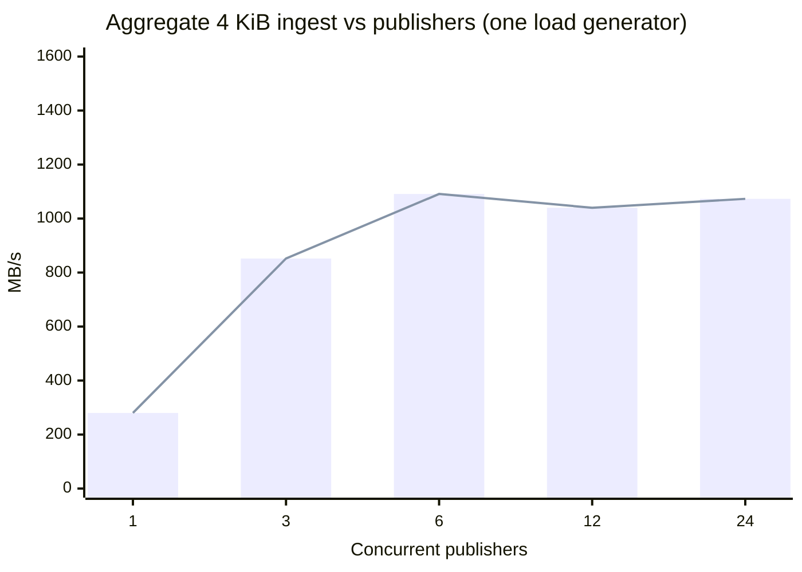
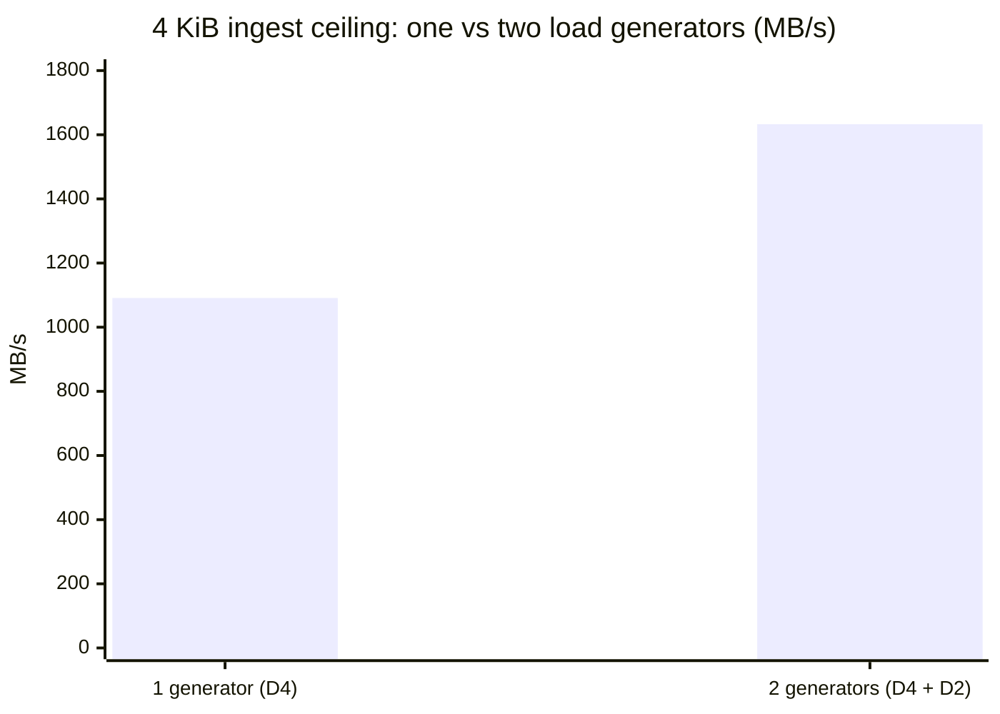
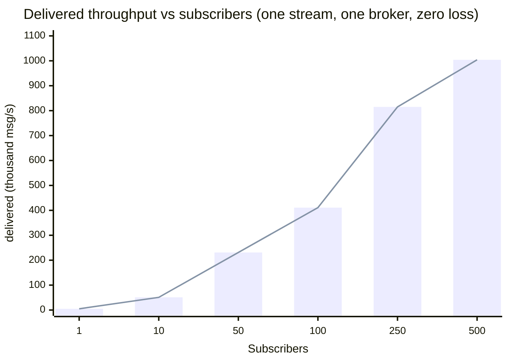

Every performance number Felix published before this page was measured over
loopback, most of it against an in-process broker. Loopback is good for
catching regressions in Felix's own code, but it does not show what a
deployment sees: it hides RTT, congestion control and the cost of TLS and real
fsync, and it inflates throughput. This page is the first set of numbers taken
on **real hardware, over a real network, with a real identity provider on the
hot path**.

On three 4-vCPU brokers, **Felix's aggregate ingest scales linearly with
offered load to ~1.63 GB/s (13 Gbit/s) with zero loss, and only at that point
do the brokers' own CPUs become the limit.** A single load generator already
moves **1.09 GB/s** (or **3.68 M messages/s**). That is ~73 % of a single NIC's
raw line rate while encrypting every byte, so the generator is bound by *its
own CPU* doing the crypto rather than by the network. A second generator lifts
the total to 1.63 GB/s without slowing the first. Acknowledged-publish latency
is **~181 µs** p50, and **durability costs no throughput** (group commit makes
the durable path match in-memory). Fanout, the workload Felix is built for,
delivers **over a million messages a second to 500 subscribers on a single
broker with zero loss**, while the publisher's acknowledgement latency stays
flat. Felix is not the bottleneck anywhere here until the brokers are
saturated.

### Headline numbers

All on **three 4-vCPU brokers** (`D4as_v5`), over a real network, with **real
Microsoft Entra ID verifying every token**. Nothing ran on loopback.

| | Result |
|---|---|
| **Aggregate ingest (4 KiB)** | **1.63 GB/s** (13 Gbit/s), **zero loss**, still scaling; the brokers aren't saturated |
| **Message rate (256 B)** | **3.68 million messages / second** |
| **Acked-publish latency** | **181 µs** p50, tight across 5 trials |
| **Publish → subscriber latency** | **190 µs** p50, a **30×** cut from one broker setting |
| **Durable throughput** | **identical to in-memory** (group commit) |
| **Network efficiency** | **~73 % of raw TCP line rate**, with every byte encrypted (QUIC/TLS 1.3) |
| **Real-IdP token exchange** | **686 µs** p50 on the control plane |
| **Fanout scaling** | **1.0 M msg/s** delivered to **500 subscribers, zero loss**; publisher ack flat at ~206 µs |
| **Watch fanout 500** | **1,100,000 / 1,100,000** delivered (every message to every watcher) |

That is roughly **136 MB/s of ingest per broker vCPU**, climbing **linearly** as
clients are added. Felix does not become the bottleneck until the brokers' own
cores run out. Every figure comes from a single provisioned session; the rest of
this page covers how they were taken and what they mean.

## How this was measured

| | |
|---|---|
| **Cluster** | 3 × `Standard_D4as_v5` brokers (4 vCPU, 16 GiB), 1 × `D2as_v5` control plane, 1 × `D4as_v5` load generator |
| **Region / placement** | `eastus2`, one availability zone, proximity placement group, accelerated networking |
| **Broker storage** | Premium SSD (`Premium_LRS`), 128 GiB |
| **Artifacts under test** | broker `v0.3.0` release tarball; control plane a `v0.3.1`-candidate build (see [What we found and fixed](#what-we-found-and-fixed)) |
| **Identity** | Microsoft Entra ID app registration, client-credentials grant, **RS256**, verified on every token exchange (no demo auth) |
| **Instrument** | `felix-loadgen` (`crates/testing/felix-loadgen`), built once on the load-gen VM, driving the cluster over its real routed paths |

The rules from the local suite apply here too. Compare only within one
provisioned session, because cloud VMs vary from one allocation to the next.
Report spread as well as medians. Every number cites the environment that
produced it. Full inventory in `scripts/perf/azure/sessions/t1-a-results/`.

### The network and the machines, measured first

The environment was measured before Felix, so its numbers have something to be
compared against:

| Baseline | Value | How |
|---|---|---|
| Raw TCP line rate | **11.9 Gbit/s (1.49 GB/s)** | `iperf3`, load-gen → broker, in-VNet |
| `quinn` smoothed RTT | ~260 µs | broker connection stats; a smoothed EWMA, *not* the path RTT (see caveat) |
| ICMP ping RTT | 0.64–0.93 ms | `ping`; ICMP is deprioritised on Azure and overstates |
| Path MTU | ~1400 | settled DPLPMTUD |
| Premium-SSD `fsync` | **3.6 ms p50, 8.7 ms p99** | raw `fsync()` of a 256 B write to `/data` |

A caveat on the RTT, because a later number depends on it: **neither the
`quinn` figure nor `ping` is the true path round trip. Both overstate it.**
`quinn`'s stat is a smoothed average that includes QUIC's ack delay, and Azure
deprioritises ICMP. A better reading comes from Felix itself. An acknowledged
publish *cannot* complete in less than one round trip, so the **~182 µs
acked-publish p50** (below) is an *upper bound* on the RTT, and the **~55 µs**
it adds over the loopback processing floor is the practical estimate of the
network's cost. Read the path RTT as tens of microseconds, well under 260.

## Latency and throughput profiles

Felix has two operating points, chosen by a handful of settings, and each
result here is labelled with the one it used.

- **Latency profile**: batch 1, per-message ack, delivery batching off
  (`FELIX_EVENT_BATCH_MAX_DELAY_US=0`, `FELIX_EVENT_BATCH_MAX_EVENTS=1`).
- **Throughput profile**: large batches, concurrent publishers across shards,
  fire-and-forget, delivery batching on (the defaults).

## Latency

### Acknowledged publish (latency profile)

This is the request-latency number: publish one message and wait for the
broker's acknowledgement, over the real NIC. p50 / p99, batch 1, in-memory
stream. The fanout-1 cells are the **median of five trials**, and the spread is
tight (181–185 µs across trials).

| Payload | Fanout 1 | Fanout 10 | Fanout 50 |
|---|---|---|---|
| 0 B | **182 / 221 µs** | 186 / 242 µs | 198 / 339 µs |
| 256 B | **183 / 216 µs** | 187 / 330 µs | 199 / 862 µs |
| 4 KiB | **203 / 287 µs** | 211 / 763 µs | 227 / 2866 µs |

p50 barely moves with fanout or payload, because the acknowledgement is one
round trip plus durability admission. It also puts a bound on the network: an
acked publish contains a full round trip, so the path RTT must be **below 182
µs**. That is why the ~260 µs `quinn` smoothed_rtt cannot be the real RTT; it
is an average inflated by ack delay. Compared with the loopback baseline below,
182 µs is ~127 µs of in-memory processing plus ~55 µs of real round trip. Tails
widen with fanout and payload, which is the real network showing up in a way
loopback cannot.

**Against the loopback baseline** (`benchmarks.md`, Apple M4 Max, in-memory),
both sides in-memory:

| Payload | Loopback p50 | Azure T1 p50 | Cost of the real network |
|---|---|---|---|
| 0 B | 127 µs | 182 µs | +55 µs |
| 256 B | 128 µs | 183 µs | +55 µs |
| 4 KiB | 136 µs | 203 µs | +67 µs |

The real network adds ~55–67 µs to p50 (NIC, switch, the path round trip). This
measured delta agrees with the acked-publish upper bound above. It is the figure
to use for the network's cost, and it replaces the localhost latency numbers
Felix quoted before.

### Publish-to-delivery latency

End-to-end publish→subscriber latency depends almost entirely on the broker's
delivery-batching settings. Same cluster, same batch-1 workload, only the
delivery settings changed:

| Payload | Fanout | Default batching (p50) | **Latency profile (p50)** |
|---|---|---|---|
| 0 B | 1 | 5,907 µs | **190 µs** |
| 256 B | 1 | 6,014 µs | **202 µs** |
| 4 KiB | 1 | 2,209 µs | **253 µs** |
| 0 B | 10 | 6,140 µs | **325 µs** |

```mermaid
xychart-beta
    title "Publish-to-delivery p50 (µs), fanout 1: default batching vs latency profile"
    x-axis "Payload" ["0 B", "256 B", "4 KiB"]
    y-axis "delivery p50 (µs)" 0 --> 6500
    bar [5907, 6014, 2209]
    bar [190, 202, 253]
```

The tall bars are the default (throughput-oriented) batching; the short bars
are the latency profile. Turning delivery batching off cuts publish-to-delivery
latency by **~30×**, to about the acknowledgement latency: the message reaches
the subscriber as soon as it is durable. The default gives that up for batching
that helps sustained fanout throughput. Both numbers are valid for their
workload, and both are measured here.

## Throughput

### The aggregate ingest ceiling

A single publisher on a single shard is the least parallel configuration
possible and says little about a cluster. Kafka's and Redpanda's headline
numbers are aggregates across many partitions and producers. Measured the same
way (N publishers across brokers, fire-and-forget binary, no subscriber to add
a false bottleneck), Felix's write ceiling is:

**4 KiB (the MB/s ceiling):**

| Publishers | Throughput |
|---|---|
| 1 | 280 MB/s |
| 3 | 852 MB/s |
| 6 | **1,091 MB/s** |
| 12 | 1,040 MB/s |
| 24 | 1,073 MB/s |

**256 B (the msg/s ceiling):**

| Publishers | Throughput |
|---|---|
| 1 | 972 K msg/s |
| 6 | 2.87 M msg/s |
| 24 | **3.68 M msg/s** |

Ingest is loss-free at every point (`publish_retries = 0`). Throughput climbs to
**~1.09 GB/s** / **3.68 M msg/s** and then plateaus.

The climb is steep to 6 publishers and then flat, which points to a fixed limit
that the next section identifies. The 12-publisher cell (1,040 MB/s) sits just
below both 6 and 24. These are single-trial points and that dip is within
run-to-run spread; what matters is the plateau, not the order of points along
it.

### Where the ceiling actually is

The plateau from 6→24 publishers suggests a fixed limit, and two measurements
show it is **not the brokers**:

- **Raw network vs Felix, one path:** a single load-gen NIC ↔ a single broker
  NIC moves **1.49 GB/s** of raw TCP (`iperf3`). Felix's single-generator
  1.09 GB/s of *application* payload is **~73 % of that**, while encrypting
  (QUIC/TLS 1.3), framing a durable log record and routing across 12 shards.
  Since it is *below* the raw line rate, a single generator is not NIC-bound. It
  is **CPU-bound doing the crypto** on 4 vCPUs, with NIC headroom to spare.
- **Broker CPU during a sustained 1 GB/s run:** 73 % / 48 % / 42 % across the
  three brokers. Busy but not saturated.

So the ceiling with one load generator is that VM's own compute, not the brokers
and not any single link. Adding a **second** load generator (a D2), with its own
NIC and CPU, and driving both at once confirms it:

| Source | Throughput | Retries |
|---|---|---|
| Load generator 1 (D4) | 1,084 MB/s | 0 |
| Load generator 2 (D2) | 549 MB/s | 0 |
| **Aggregate** | **1,633 MB/s (13.1 Gbit/s)** | 0 |

The aggregate exceeds the 1.49 GB/s single-path `iperf3` figure because it is
not a single path. Two generator NICs fan out across three broker NICs (each
broker takes ~1/3, ≈ 0.55 GB/s), so several NIC pairs carry the load in
parallel and no one link is pushed past its own rate. This run used the
**non-durable** stream. The durable-equals-in-memory result below was measured
with one generator, so 1.63 GB/s *durable* is an inference, not a measured
number.

The first generator held its full 1,084 MB/s while the second added 549, a
linear addition with zero loss. The single-generator 1.09 GB/s was never Felix's
limit. The cluster sustains **~1.63 GB/s**, and only then do the brokers become
the constraint (broker-0 at **84 %** CPU under the doubled load). The real
ceiling of these three 4-vCPU brokers is ~1.6–1.9 GB/s. A third generator would
pin it down, but the session was already at the 20-vCPU Azure quota. The shape
matters more than the exact number: **Felix's ingest scales linearly with
offered load until the brokers run out of CPU.**

### Durable ingest

The same ingest sweep against a **durable** stream with `FsyncMode::OnCommit`
(a real premium-SSD flush per commit) is **indistinguishable from in-memory**:

| Publishers | Non-durable | Durable (`on_commit`) |
|---|---|---|
| 1 | 280 MB/s | 280 MB/s |
| 6 | 1,091 MB/s | **1,093 MB/s** |
| 12 | 1,040 MB/s | 1,075 MB/s |

Group commit is the reason. Under concurrency one blocking flush serves many
waiters, so the 3.6 ms device `fsync` is amortised to almost nothing.
Durability costs latency but not throughput, as long as there is concurrency to
amortise it (the cache path below is the counter-example).

:::caution[This is a burst, not a sustained rate]
A later disk measurement corrects this. The Premium SSD on these VMs sustains
only **~170 MB/s** of writes (`dd`, direct + fsync). You cannot fsync a
gigabyte a second onto a 170 MB/s disk, so the ~1 GB/s *durable* figures above
are a **page-cache burst**: during the measured window the writes land in the
OS page cache, and the run finishes before they are all flushed. Group commit
does make durability free *for a burst that fits in cache*, but **sustained**
durable throughput on this hardware is bounded by the disk at ~170 MB/s, the
same limit any log-based system hits here. The in-memory figures are
unaffected because they touch no disk.

**Update: the NVMe follow-up settled it.** Re-run on local-NVMe brokers
(below), durable OnCommit *does* match in-memory and *sustains it*: 1,151 vs
1,136 MB/s at the plateau, zero drops, iowait ~0. On fast disk group commit is
free; the Premium-SSD number was the burst and the NVMe number is sustained. See
[Local NVMe runs](#local-nvme-runs).
:::

## Fanout

On ingest, QUIC costs Felix. Fanout is what the architecture is designed for:
a publish is encoded **once** into a shared `Arc<Bytes>` and handed to every
subscriber, each behind its own bounded queue. The broker's per-publish work
barely grows as subscribers are added, and one slow subscriber cannot apply
back-pressure to the rest. Measured on one stream (a single shard, so this is
*one* broker's delivery path), 256 B, a paced publisher (batch 1, per-message
ack), subscriber count 1 → 500:

| Subscribers | Delivered throughput | Publisher ack p50 | Publisher ack p99 | Dropped |
|---|---|---|---|---|
| 1 | 5.4 K msg/s | **183 µs** | 217 µs | 0 |
| 10 | 50.5 K msg/s | 191 µs | 317 µs | 0 |
| 50 | 230.6 K msg/s | 198 µs | 930 µs | 0 |
| 100 | 410.8 K msg/s | 201 µs | 1.7 ms | 0 |
| 250 | 814.7 K msg/s | 205 µs | 3.0 ms | 0 |
| 500 | **1,004,273 msg/s** | **206 µs** | 7.3 ms | **0** |

Delivered throughput scales almost linearly, to just over a million messages a
second on one broker, and nothing is dropped: every publish reaches all 500
subscribers (`unaccounted = 0` in every row). The publisher barely notices. Ack
p50 goes from 183 µs at one subscriber to 206 µs at five hundred, 23 µs more
for 500× the delivery work. That comes from encoding a publish once and sharing
it. A log that each consumer re-reads on its own, or a single shared delivery
queue, could not keep a publisher this flat.

The cost shows in the tail. Ack p99 climbs from 217 µs to 7.3 ms as the
broker's four cores spend more of their time fanning out, and the publisher's
own rate drops from 5.4 K to 2.0 K publishes/s. Delivered throughput keeps
rising only because fanout grows faster than the publish rate falls. A million
a second is one 4-vCPU broker delivering one stream; more streams put more
shards on more brokers, each with its own delivery path.

The isolation between subscribers can be measured too. Run 50 subscribers on
one stream and slow 10 of them down to 20 ms per delivery, far slower than the
publisher sends. The rest are unaffected:

| 50 subscribers, one stream | Publisher ack p50 | Healthy subs (40) | Slow subs (10) |
|---|---|---|---|
| none slow | 198 µs | 42,000 / 42,000 each | n/a |
| 10 slow @ 20 ms | **198 µs** | **42,000 / 42,000 each** | 690 / 42,000 each |

The publisher's acknowledgement latency stays at 198 µs either way, the 40
healthy subscribers still receive every message, and the 10 slow ones drop ~98%
of theirs. The loss lands only on the subscribers that fell behind. That is what
a bounded queue per subscriber under `DropNew` is for: a slow consumer degrades
itself and nobody else.

These come from a second session (`f1`) on the same topology, so the curve is
self-consistent within one session. Fanout-1 ack p50 is 183 µs here against
181–183 µs in the primary session, so the hardware behaved the same way in
both.

## Durability: latency vs throughput

The two ends of the fsync setting, measured on the cache write path (each cache
put lands on durable storage):

| Config | put p50 | put throughput |
|---|---|---|
| Periodic fsync (default) | **316 µs** | 16.9 K/s |
| OnCommit, 1 writer | **4.0 ms** | 226/s |
| OnCommit, 8 writers | 33.4 ms | 233/s |

Per-commit durability on the cache path costs a full device flush (~4 ms): the
raw `fsync` figure plus request handling. The run also found a problem. The
cache write path at the time did *not* group-commit, so eight concurrent writers
got the same ~230 puts/s as one, with 8× the latency, while the durable *stream
append* path amortised fsync to >1 GB/s on the same disk.

That gap has since been closed. The cache write path now stages under a short
lock and commits outside it, sharing the log's group-committed fsync the same
way the stream path does (`docs/cache-put-group-commit-plan.md`). The OnCommit
rows above are the *pre-fix* measurement and record the bug. The concurrency
scaling has not yet been re-measured on this topology.

## Cache, counter, watch and queue

| Scenario | Result |
|---|---|
| **Cache** get (warm) | 407 µs p50 |
| **Counter** add / get | 307 µs / 297 µs p50; one round trip applies the delta and returns the sum |
| **Keyed watch** fanout 1 / 50 / 500 | 199 µs / 513 µs / 4.6 ms p50; **every put delivered to every watcher** (1,100,000 / 1,100,000 at fanout 500) |
| **Retained join** roster 100 / 1 K / 10 K | 3.9 ms / 5.5 ms / 38 ms time-to-complete-state for a late joiner |
| **Queue** drain (consumer group), 0 / 256 B / 4 KiB | 17.3 K / 9.6 K / 5.8 K msg/s, at-least-once (every record delivered) |

The most notable result is watch fanout: at 500 watchers on one key, all 1.1 M
deliveries land, p50 4.6 ms. The queue figure is a backlog-drain rate
(publish, then drain), and its redelivery count climbs with payload.
At-least-once redelivery under a slow drain needs its own study.

## The control plane

Nothing in the numbers above touches the control plane *per message*. Brokers
seed their metadata (tenants, streams, shard assignments, IdP config) from the
control plane at startup, cache it, and watch for changes. The data path
(publish, subscribe, cache, queue) never calls it, so a control plane that is
slow or briefly down does not slow a publish. Every latency and throughput
figure on this page is about the brokers. The control plane ran on a
`D2as_v5`, off the data path and memory-backed (a session's metadata fits in
memory and is lost with it).

The one place it *is* on the hot path is **authentication**: the token exchange,
where it verifies the Entra RS256 token, evaluates RBAC, and mints a Felix EdDSA
token.

| | p50 | p99 |
|---|---|---|
| Token exchange (warm JWKS) | **686 µs** | 876 µs |

That is under a millisecond on the control plane (add one ~55 µs network round
trip for a remote caller), and it is amortised in practice. A Felix token is
minted once and presented on many operations until it expires, so the exchange
is a **per-session** cost rather than a per-message one. Brokers then verify
that token *locally* per request against the tenant's cached signing keys, so
there is no control-plane round trip on the data path. For this session the
control plane ran a **v0.3.1-candidate build** carrying the real-IdP fixes
below; released v0.3.0 could not validate an Entra token at all.

**Not measured here** (a separate exercise): the control plane under sustained
exchange load, node-registration and shard-assignment latency, watch-propagation
time to the brokers, and control-plane failover.

## Comparing with other systems

These are three 4-vCPU brokers, so the fair comparison with Kafka, Redpanda or
NATS is **per-vCPU efficiency (~136 MB/s per broker vCPU)** rather than raw
totals. Those systems publish headline numbers on much larger instances, and
comparing totals would mostly compare instance sizes.

Two points cut both ways:

- **Ingest is Felix's weakest area, and it is most of what is measured above.**
  A pure write firehose is where Kafka's and Redpanda's kernel `sendfile`
  zero-copy has a structural advantage that QUIC cannot use. Felix encrypts
  every byte in userspace (TLS 1.3 is mandatory in QUIC), which is *why* a
  single generator is CPU-bound on crypto at 1.09 GB/s rather than NIC-bound.
  Expect Felix to trail a plaintext, zero-copy log on raw ingest per core. That
  is a deliberate trade for QUIC.
- **Fanout is where the architecture pays off** (see [Fanout](#fanout)).
  Delivered throughput scales almost linearly to **1.0 M msg/s on a single
  broker with zero loss**, while the publisher's ack p50 stays flat (183 → 206
  µs) across 1 → 500 subscribers. A Kafka-style log, re-read independently by
  each consumer group, is structurally worse at this, and an ingest-only
  comparison would leave it out. The comparison work still has to turn this
  into a head-to-head (N consumer groups per system, plus a deliberately slow
  consumer to show isolation).

A credible comparison has to match configuration as well as hardware:

- identical durability (Felix `Leader` / `Quorum` ↔ Kafka `acks=1` /
  `acks=all`+`min.insync.replicas`)
- matched fsync policy (benchmarking Felix `on_commit` against a broker left on
  its default OS flush measures fsync, not the broker)
- matched replication factor, partition/shard count and publish batching
- **TLS on every system**, since Felix cannot turn it off and a plaintext
  competitor would get an advantage Felix cannot match

NATS *core* is at-most-once and not comparable to a durable stream at all; only
JetStream is. The matched-configuration harness lives in
`scripts/perf/azure/compare/`. The first system run through it is **Redpanda**
(v26.2.2, same three D4as_v5 brokers, TLS on, rf=1, `write_caching` on so it
acks from memory the way Felix's headline does). That first run said as much
about the *hardware* as about the engines:

- **Ingest is disk-bound.** A raw `dd` on these VMs' Premium SSD sustains
  **~170 MB/s** (direct + fsync). Every durable log is capped there. Redpanda
  measured **45–80 MB/s** (its per-partition write pattern doesn't reach the
  sequential ceiling), and Felix's own sustained durable rate is bounded by the
  same limit (see the durability caution above). On this hardware ingest does
  not separate the engines; it measures the SSD.
- **Latency is where Felix separates.** Both sides ack *from memory* here
  (Redpanda with `write_caching`, Felix on its default Leader / periodic-fsync
  path), so this is a matched comparison and not durable against non-durable.
  Felix's acked-publish p99 is **~224 µs**; Redpanda's produce→ack p99 is
  **70–136 ms**, at only 1000 msg/s. Medians are sub-millisecond for both, and
  the whole difference is in the tail. Redpanda's ack, though served from
  memory, still gets caught behind the log's periodic flush; Felix's default
  ack does not. The claim is deliberately narrow. Felix's *own* `OnCommit` path
  **does** wait on the flush (~4 ms, see the durability section), so the claim
  is "default ack vs `write_caching` ack, and only one of them catches the flush
  in its tail". It does not say Felix never touches disk. **Caveat:** that tail
  tightens on NVMe, so it is partly this SSD. But flush-stall tails are also
  what Kafka-family systems hit on network-attached storage every day, so this
  is a real deployment pattern and not only a quirk of the test rig.
- **Fanout lands in the same range, but the client machines saturated first.**
  Redpanda served ~912 K msg/s across 8 consumer groups re-reading one topic,
  next to Felix's 1.0 M msg/s to 500 subscribers. The JVM Kafka clients on
  4-vCPU VMs saturated before the brokers did, so that is a floor for Redpanda,
  not its ceiling. The architectural difference (Felix encodes once;
  Kafka-style consumers each re-read the log) is real, but this rig could not
  push far enough for it to show in broker CPU.

That leaves two gaps. **Ingest needs NVMe**, so the test measures the engine
and not a 170 MB/s SSD, and **fanout needs a lighter client** (a
librdkafka-based consumer instead of a JVM per consumer on a small VM), so the
*broker* is the bottleneck. The first is done: [Local NVMe runs](#local-nvme-runs)
moved the limit off the disk and confirmed durability is free and sustained,
though a *balanced* cluster ceiling still waits on the shard-assignment fix
noted there. The lighter-client fanout comparison has not been done yet.

Throughout, the number to track is **CPU at saturation**: MB/s per vCPU and
absolute utilisation. When the disk is the constraint, what each engine
*spends* to hold the ceiling is what still separates them, and it predicts what
happens when fanout and failover are added. It is also where Felix pays: QUIC
costs per-packet AEAD, userspace packetisation and no kernel `sendfile`, which
a plaintext, zero-copy log avoids, so keeping pace *per core* is the efficiency
claim that needs proving. Kafka and NATS will go through the same harness once
the rig can drive them properly. Full configs and raw output are in
`scripts/perf/azure/compare/`.

## Local NVMe runs

The Premium-SSD runs left two open questions: is durable throughput real or a
page-cache burst, and once the disk is not the limit, what is? So the suite was
re-run on **local-NVMe brokers** (Azure L-series, `L4as_v4` / `L8as_v4`, with
two to four local NVMe drives striped RAID0 at ~0.75–1.5 GB/s write per broker).
Instance-store NVMe is how throughput-sensitive log systems are usually
deployed. Same v0.3.1, real Entra, TLS/QUIC, OnCommit durable.

Three results:

- **Durability is free, sustained and not a burst.** Ramping in-memory against
  durable OnCommit, the two track within ~5% and are indistinguishable at the
  plateau (durable **1,151** vs in-memory **1,136 MB/s**; 256 B: **3.56 M** vs
  **3.41 M msg/s**), with zero drops. That was impossible on a 170 MB/s disk and
  holds on NVMe. Group commit does what it claims.
- **The disk is never the limit.** Every broker-CPU breakdown under load showed
  **iowait ~0–1.7%**. The cost is user + system + **softirq** (QUIC/UDP packet
  processing and AEAD), never I/O wait. The NVMe always had headroom.
- **The per-broker durable ceiling is the transport, not cores and not the
  commit path.** Driven hard against a single broker, durable OnCommit tops out
  with the broker at ~50% CPU, and more load does not use the idle cores. That
  much held up. The reason first published here did not: it was attributed to
  the commit sequencer, and a later session ruled that out (see below). Durable
  throughput does scale by adding **brokers**, but not for the reason first
  given. The difference matters, because "more commit paths" implies more
  *shards* would help, and they do not.

Two limits surfaced in these runs, both since addressed. **Cross-broker
forwarding is expensive:** a publish that lands on a non-owner broker is
decrypted, re-encrypted to the owner, and decrypted again, so round-robin
clients spent roughly **twice** the CPU per byte of clients connected to the
shard owner (~140 vs ~250 MB/s per vCPU). The ack now names the owner and
`ClusterClient` routes the next batch straight there, so a client pays that
once per shard rather than on every record. And **shard assignment did not
balance**: the control plane put 48/0 of the shards on one of two brokers (and
11/5/8 on three), which is why no balanced multi-broker number was quoted here
at the time. One has since been measured and is in the next section.

## Sizing: add brokers, not shards

One broker holds 842–926 MB/s durable. A second takes it to 1,896. Twelve
shards on one broker change nothing.

Those numbers come from a session that drove the broker with four generators.
Earlier sessions used one, and a `D4as_v5` generator tops out near 1,050 MB/s.
That is close enough to the broker's own limit that neither could be separated
from the other, and the ~977 MB/s quoted above is one of those figures.

| axis | measured | |
|---|---|---|
| one broker | 842–926 MB/s across every valid run | broker ≤69% busy, generators ≤31% |
| a second broker | 1,896 MB/s (repeat: 1,852) | 2.1x |
| more shards on one broker | within run-to-run spread of one shard | 1.0x |

Shard count, connection count, flush mechanism, worker count and admission
budget all moved the single-broker number by less than the 3% that two
identical runs differed by.

Shards spread work across brokers. On one broker they share a socket, a CPU and
a filesystem, so they have nothing to gain.

Size on ~900 MB/s durable per broker (8 vCPU, local NVMe, `on_commit`) and add
brokers from there. A faster disk or more cores per node will not move it. At
the ceiling the broker used 3.96 of 8 cores, iowait sat at 2%, and the device
was running at two-thirds of its `fdatasync` capability.

The limit is one task. Every inbound datagram goes through a single `quinn`
endpoint driver that reads the socket and routes by connection id, and it
measured at 88% of one core. A second broker brings its own socket and its own
driver. Shards do not.

One warning before you change settings: `FELIX_IO_RUNTIME_THREADS=2` measured
1,341 MB/s where the default gave 1,896, on the same two brokers. Isolating the
drivers helps on macOS and hurts on Linux, which is why Linux defaults it off.

Method, the hypotheses that were tested and discarded, and the flamegraph are
in [`docs/perf-investigation-sharding-ceiling.md`](https://github.com/gabloe/felix/blob/main/docs/perf-investigation-sharding-ceiling.md).
The raw session output is under
[`scripts/perf/azure/sessions/`](https://github.com/gabloe/felix/tree/main/scripts/perf/azure/sessions).

## What we found and fixed

Measuring the *real* IdP flow found bugs that the ES256-only localhost path
could not. All of them are fixed for `v0.3.1`:

- **The control plane could not validate any Entra token.** It required the
  optional `alg` member on JWKS keys (RFC 7517 §4.4), which Entra omits, so
  every real token was rejected. Fixed: accept alg-less keys, bound by the
  key-type match.
- **Exchanged-token TTL was fixed at 900 s**, too short for a broker that holds
  its node credential for its lifetime. It is now configurable (proper refresh
  is the real fix, tracked separately).
- **Throughput was measured single-publisher/single-shard** and looked
  disappointing (131 MB/s) until it was measured with parallelism. Felix was
  fine; the measurement was wrong.

## Reproducing

The whole session (provision, seed through the real IdP, run the matrix, tear
down) is in `scripts/perf/azure/` (see `docs/perf-real-network.md` for the
design and budget). Raw results, including the out-of-band context metrics
(`session-extras.json`), live under `scripts/perf/azure/sessions/`.

This is one T1 session, single-trial for most cells (five for the headline
latency cells; the throughput ceiling confirmed with a second load generator).
Next steps:

- cross-session variance
- a **third** load generator to pin the exact ingest ceiling (this session hit
  the 20-vCPU Azure quota with two)
- pushing the fanout curve past 500 subscribers (1000 needs the delivery load
  spread across more than one load-generator VM), and a **deliberately slow
  subscriber inside a healthy fleet** to put a number on the isolation the
  fanout section describes
- the matched-hardware, matched-configuration comparison against Kafka,
  Redpanda and NATS described in
  [Comparing with other systems](#comparing-with-other-systems)
