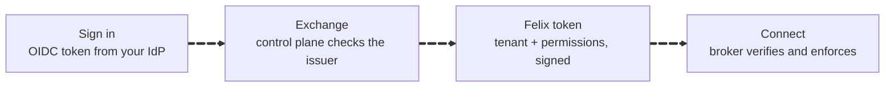
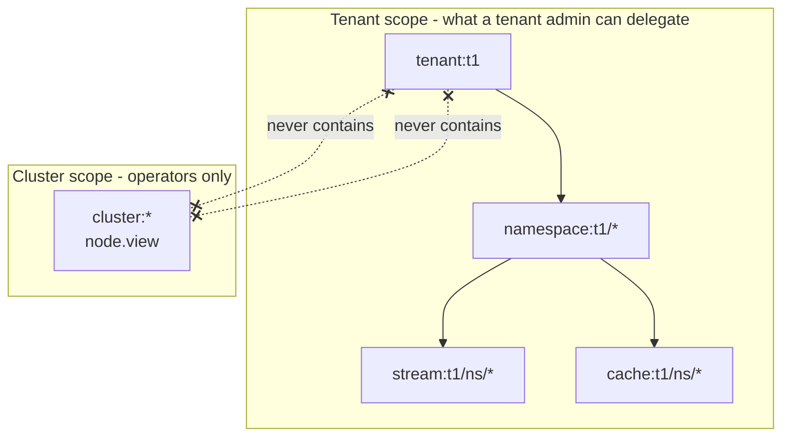
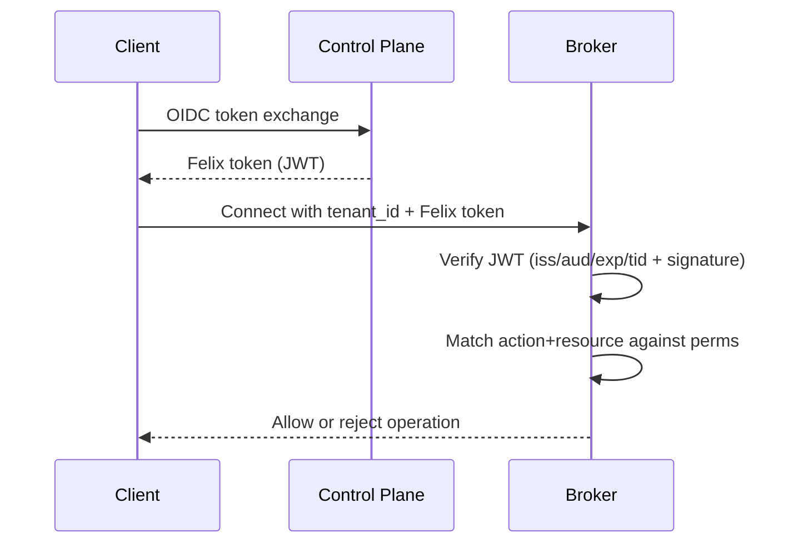

What Felix secures today, how the authentication chain works, and what is not
built yet.

Every QUIC connection is TLS 1.3, because QUIC allows nothing less. A broker
proves *who it is* to clients only once you give it a certificate. The
control-plane REST API is plain HTTP unless you give it one too. Identity comes
from your own IdP via OIDC token exchange, and authorization is tenant-scoped
RBAC enforced at the broker. Brokers authenticate each other with mTLS when
given certificates, and refuse to join a cluster without it unless told
otherwise. Encryption at rest and audit logging are **not** built.

:::note[Security Maturity]
Felix is in early development and has not been through an external security
review. This page states plainly which protections exist and which are
planned; the [status table](/getting-started/what-felix-is-for/) is
kept current per capability.
:::

## Transport security

What is encrypted, and what is authenticated, by default and with
configuration:

| Link | Default | With configuration |
| --- | --- | --- |
| Client ↔ broker (QUIC) | Encrypted (TLS 1.3). The broker serves a **self-signed `localhost` certificate generated at every start**, so clients cannot verify which broker they reached, and startup warns. | `FELIX_TLS_CERT` / `FELIX_TLS_KEY`: a real certificate, re-read on rotation. `FELIX_TLS_CLIENT_CA`: clients must also present a certificate. `FELIX_TLS_CLIENT_CERT_BIND_SUBJECT=true`: that certificate must be issued to the token's subject (a `felix:principal:<sub>` URI SAN, or a DNS or IP SAN). `FELIX_TLS_REQUIRE_CERT=true` refuses to start without a certificate. `FELIX_TLS_REQUIRE_ALPN=true` refuses clients that do not negotiate the `felix/1` ALPN. |
| Client ↔ broker (Kafka listener) | TLS with the same certificate as QUIC (`FELIX_KAFKA_TLS=false` turns it off). | Same variables as QUIC, except `FELIX_TLS_REQUIRE_ALPN`. |
| Broker ↔ broker (internal port) | Encrypted, not authenticated. A broker with a node id **refuses to start** this way unless `FELIX_INTERNAL_ALLOW_UNAUTHENTICATED=true`. | `FELIX_INTERNAL_TLS_CERT` / `_KEY` / `_CA`: mutual TLS, the certificate's DNS name checked against the node id in both directions. |
| Broker / admin CLI ↔ control-plane API | **Plain HTTP**, and the control plane warns at startup. Node credentials, token exchange and tenant JWKS cross it. | `FELIX_CONTROLPLANE_TLS_CERT` / `_KEY` on the control plane, an `https://` `FELIX_CONTROLPLANE_URL` on brokers, and `FELIX_CONTROLPLANE_CA` when the certificate comes from a private CA. |
| Control-plane bootstrap listener | Plain HTTP, off by default. | `FELIX_BOOTSTRAP_TLS_*`: mutual TLS, described below. |
| Control-plane Raft peer listener (metadata backend only) | Plain HTTP, on its own port (`FELIX_RAFT_BIND_ADDR`), authenticated by a shared `FELIX_RAFT_CLUSTER_ID` and `FELIX_RAFT_PEER_TOKEN` checked on every request. | `FELIX_RAFT_TLS_CERT` / `_KEY` / `_CA`: mutual TLS on top of the token, so a connection without a certificate from the cluster CA never reaches the router. |

So every QUIC connection is encrypted out of the box, the control-plane API
is not, and "authenticated" holds only for what you configure. Without a
configured broker certificate, a client that trusts the generated one trusts
whoever answers on that address, and hands it a bearer token. Set `FELIX_TLS_CERT`
for anything but development; the demos and the cluster harness distribute
trust for the generated certificate through `FELIX_TLS_CERT_EXPORT`.

Certificate and key files are re-read every 30 seconds on every listener that
takes them, so a renewal written over the same paths (cert-manager, a
Kubernetes Secret volume) is used by the next handshake without a restart.
CA bundles are read at startup.

Client-side, certificate verification is Quinn's:

```rust
// Production: validate against the platform trust store
let quinn = quinn::ClientConfig::with_platform_verifier();
let config = ClientConfig::optimized_defaults(quinn);

// A private CA: trust its bundle, and dial with a name the certificate carries
let mut roots = rustls::RootCertStore::empty();
for cert in rustls::pki_types::CertificateDer::pem_file_iter("ca.pem")? {
    roots.add(cert?)?;
}
let quinn = quinn::ClientConfig::with_root_certificates(Arc::new(roots))?;
let client = ClusterClient::connect(&seeds, "broker.example.com", ClientConfig::optimized_defaults(quinn)).await?;
```

The Python and TypeScript bindings take the same two choices: the platform
trust store, or a CA file, plus the server name to verify. Neither presents a
client certificate yet, so they cannot connect to a broker with
`FELIX_TLS_CLIENT_CA` set.

## Multi-tenancy and isolation

Everything is scoped `tenant → namespace → stream/cache`, and the scope is
part of every wire operation, so there is no unscoped request to forget to
check. The broker rejects unknown tenants, and a token for one tenant is
useless against another (the `tid` claim is checked after signature
verification, so a valid signature for the wrong tenant fails).

Within a tenant, namespaces are the isolation unit for environments or teams:
`acme/production/orders` and `acme/staging/orders` share nothing but a
naming convention.

A tenant's publish rate can be capped per broker, in bytes and in messages per
second (`FELIX_TENANT_PUBLISH_*` in the
[environment reference](/reference/environment-variables/#connection-limits-and-tenant-quotas)),
and one source address can hold at most `FELIX_MAX_CONNECTIONS_PER_IP` client
connections. Quotas on subscriptions, cache use and storage are not built, and
publish quotas live in each broker's environment rather than the control
plane.

## Authentication and authorization

Felix implements token-based authentication with upstream OIDC and tenant-scoped RBAC enforced by brokers using Felix tokens.

The whole flow, end to end:



Felix never sees your IdP password, and the broker never calls the control plane
on the request path: it verifies the signature against published JWKS and reads
the permissions out of the token.

### Bootstrap Mode (Day-0)

New tenants need IdP issuers, signing keys, and initial RBAC before any admin tokens exist. Felix provides a **one-time bootstrap mode** for operators:

1. Enable bootstrap on the control plane (disabled by default):

```
FELIX_BOOTSTRAP_ENABLED=true
FELIX_BOOTSTRAP_BIND_ADDR=127.0.0.1:9095
FELIX_BOOTSTRAP_TOKEN=<random secret>
```

Two optional hardening layers, independent of each other:

- **Token rotation without an outage.** `FELIX_BOOTSTRAP_TOKEN_PREVIOUS`
  holds the token being retired; both are accepted (each compared in constant
  time) while a rolling deploy replaces one with the other. Setting only the
  previous token fails startup, because it means the rotation removed the
  wrong half.
- **mTLS on the bootstrap listener.** `FELIX_BOOTSTRAP_TLS_CERT`,
  `FELIX_BOOTSTRAP_TLS_KEY`, and `FELIX_BOOTSTRAP_TLS_CLIENT_CA` (all three,
  or startup fails rather than coming up half-secured) make the listener
  terminate TLS itself and refuse, at the handshake, any client without a
  certificate signed by that CA. An unauthenticated caller never reaches the
  endpoint, so the token never even gets read.

2. Call the internal endpoint (bound to the bootstrap address):

```
POST /internal/bootstrap/tenants/{tenant_id}/initialize
X-Felix-Bootstrap-Token: <secret>
Content-Type: application/json

{
  "display_name": "Tenant One",
  "idp_issuers": [
    {
      "issuer": "https://login.microsoftonline.com/<tenant>/v2.0",
      "audiences": ["api://felix-controlplane"],
      "discovery_url": null,
      "jwks_url": null,
      "claim_mappings": {
        "subject_claim": "sub",
        "groups_claim": "groups"
      }
    }
  ],
  "initial_admin_principals": ["p:alice"]
}
```

3. Disable bootstrap after the initial setup.

Initialization is **atomic and exactly-once per tenant**: the signing keys,
issuers, RBAC seed, and the bootstrapped flag commit as one store operation,
serialized on the tenant row. Racing the call against itself, including
through different control-plane instances behind one load balancer, produces
one winner and `409 already_initialized` for everyone else, and a failure
part-way leaves the tenant retryable rather than half-initialized. The token
itself is a static shared secret, valid while bootstrap is enabled. The full
threat model, replay rules, rotation procedure, and recovery steps are in
[`docs/security/bootstrap.md`](https://github.com/GetFelix/felix/blob/main/docs/security/bootstrap.md).

#### Development tokens

For a local stack or a CI job, `FELIX_BOOTSTRAP_DEV_TOKENS=true` makes the
bootstrap listener mint a Felix token for any principal of an initialized
tenant, with no identity provider:

```bash
curl -sS -X POST http://127.0.0.1:9095/internal/bootstrap/tenants/t1/dev-token \
  -H 'X-Felix-Bootstrap-Token: change-me' \
  -H 'Content-Type: application/json' \
  -d '{ "principal": "p:dev" }'
```

The principal is named as RBAC policies and groupings name it, and the token
carries what RBAC grants it, narrowed by `requested`, `resources`,
`permissions` and `audience` exactly as on [token exchange](#token-exchange-oidc--felix). The
answer is the exchange's, refresh token included. The control plane refuses to
start with the switch on unless bootstrap is enabled on a loopback
`FELIX_BOOTSTRAP_BIND_ADDR`, and logs a warning that it is on. Anyone holding
the bootstrap token can then act as any principal, so never set it on a shared
or production control plane.

After bootstrap, admin actions require explicit Felix permissions:
- IdP issuer admin: `tenant.manage:tenant:{tenant_id}`, plus
  `tenant.manage:cluster:*` to change an existing issuer's keys, audiences or
  claim mapping, to register an issuer another tenant already trusts, or to
  delete one
- RBAC list: `rbac.view:<scoped object>`
- RBAC policy writes: `rbac.policy.manage:<scoped object>`
- RBAC assignment writes: `rbac.assignment.manage:<scoped object>`
- Namespaces, streams and caches: `ns.manage`, `stream.manage` or `cache.manage`
  over the object, from a token minted for that tenant; listings are filtered
  to the caller's scope
- Tenant catalog (create, list, delete): `tenant.manage:cluster:*`
- Metadata feeds brokers seed from (`snapshot`, `changes`): `node.view:cluster:*`
- Cluster membership reads: `node.view:cluster:*`
- Cluster membership writes: `node.manage:node:{node_id}` or `node.manage:cluster:*`

The credential is checked before existence, so nothing about what exists can
be learned without one: a tenant with no signing keys answers `401`, not `404`.

### RBAC Object Grammar and Delegation

Canonical RBAC object formats:
- `tenant:{tenant_id}`
- `namespace:{tenant_id}/{namespace}`
- `stream:{tenant_id}/{namespace}/{stream_or_*}`
- `cache:{tenant_id}/{namespace}/{cache_or_*}`
- `cache:{tenant_id}/{namespace}/{cache}/{key}` or `.../{key_prefix}*`: some keys of one cache
- `group:{tenant_id}/{namespace}/{stream_or_*}/{group_or_*}`: one consumer group; a `*` only after other `*`s
- `cluster:*`: the cluster itself, outside the tenant hierarchy
- `node:{node_id}`: one broker, also outside it

Write-time protections:
- `tenant:*` is rejected
- non-tenant-scoped wildcards are rejected
- policy/assignment writes are rejected if target scope is broader than caller scope

This blocks privilege escalation when delegating namespace or stream admins.

#### Cluster scope

`cluster:*` covers broker membership (which brokers exist, whether they are
alive, and whether placement can use them), the tenant catalog, and the
metadata feeds. It is isolated from tenant scope in both directions:



A permission is only writable when its object already sits inside the writer's
own scope. Because no arrow runs between the two scopes, a tenant admin cannot write themselves `cluster:*`, and
cluster scope cannot read tenant data.

No tenant scope contains `cluster:*`, and the bootstrap seed does not grant it
either. In the other direction, `cluster:*` contains no tenant object.

Reads require `node.view:cluster:*`. Writes (register, heartbeat, drain,
deregister) require `node.manage` over the node being changed, held either as
`node:{node_id}` by that broker or as `cluster:*` by an operator. A node is an
RBAC object rather than a field the caller asserts, which is what stops one
broker acting for another.

Cluster scope reaches a token only through bootstrap: initialize an operator
tenant whose policies grant the cluster actions to a role, assign the operator
principal to it, and exchange. The same route gives a broker its
`node.view:cluster:*`.

### Supported Identity Providers

Felix supports any OIDC-compliant IdP that exposes a JWKS endpoint (via discovery or direct JWKS URL) and uses an allowed upstream OIDC signing algorithm.

Supported upstream OIDC JWT signing algorithms:
- `ES256` and `RS256` (the default)
- `RS384`, `RS512`
- `PS256`, `PS384`, `PS512`

Control plane configuration:
- YAML: `oidc_allowed_algorithms: ["ES256", "RS256"]`
- Env: `FELIX_CONTROLPLANE_OIDC_ALLOWED_ALGORITHMS=ES256,RS256,...`

Common providers that work out of the box include Microsoft Entra ID, Okta,
Auth0, Google, and Apple.

### Allowing Upstream IdPs Per Tenant

IdP trust is configured per tenant in the control plane store. Each tenant has an allowlist of issuers and audiences, plus optional claim mappings.

The control plane validates:
- `iss` matches an allowed issuer for the tenant
- `aud` matches one of the configured audiences
- signature via JWKS (cached with TTL; an unknown `kid` re-fetches the JWKS
  at most once per 30 seconds per URL, because it is reachable before the
  signature is checked)
- `exp` with clock skew and `iat` not in the future

### Token Exchange (OIDC → Felix)

Clients authenticate to the control plane with an upstream OIDC JWT and exchange it for a tenant-scoped Felix token.

```text
POST /v1/tenants/{tenant_id}/token/exchange
Authorization: Bearer <oidc_jwt>
Content-Type: application/json

{
  "requested": ["stream.publish", "cache.read"],
  "resources": ["namespace:t1/payments", "stream:t1/payments/orders/*"]
}
```

Response:

```json
{
  "felix_token": "<jwt>",
  "expires_in": 900,
  "token_type": "Bearer"
}
```

The request body can only narrow the permissions RBAC grants. It cannot widen
them. `requested` keeps the listed actions and `resources` the listed objects,
as a cross product: every kept action on every kept resource.

To give one token different actions on different resources, name
`action:object` pairs in `permissions` and send `requested` as an empty list:

```json
{
  "requested": [],
  "permissions": [
    "stream.subscribe:stream:t1/rooms/a",
    "stream.publish:stream:t1/rooms/b"
  ]
}
```

Each pair is narrowed on its own against the grants with exactly its action,
so the token above can read `a` and write `b` and nothing else. A pair for an
action the principal lacks, or for a resource outside its grants, adds
nothing, and a pair broader than a grant keeps the grant as it is. Sending
`permissions` without `"requested": []`, or with a non-empty `requested` or
`resources`, is a `400`. The empty `requested` makes a control plane that
predates `permissions` refuse the exchange instead of ignoring the pairs and
minting full rights. A refresh keeps the pairs. With the Raft store, pairs are
refused with `409` until every control-plane member runs a release that
supports them.

### Felix Token Claims

Felix tokens are JWTs minted by the control plane and validated by brokers.

- `iss`: `felix-auth`
- `aud`: `felix-broker` for tokens presented to brokers, `felix-controlplane`
  for the control plane's API. Each side refuses the other's, so a broker
  cannot replay a client's token against the API.
- `sub`: `principal_id` (sha256 of `iss|sub`)
- `tid`: tenant id
- `exp`, `iat`
- `perms`: effective permissions
- **Algorithm**: EdDSA (Ed25519) only; Felix-issued tokens never use RSA.
  The tenant JWKS publishes the current key and any others still verifying,
  and verification tries them all. Keys rotate in three steps (stage,
  activate, retire) through `/v1/tenants/{tenant_id}/signing-keys`, so brokers
  learn a key before any token carries it.

### RBAC Model (Casbin)

Casbin is used with domains for tenant scoping. Policies and groupings are stored per tenant.

**Objects**:
- `tenant:{tenant_id}`
- `namespace:{tenant_id}/{namespace}` or `namespace:{tenant_id}/*`
- `stream:{tenant_id}/{namespace}/{stream}` or `stream:{tenant_id}/{namespace}/*`
- `cache:{tenant_id}/{namespace}/{cache}` or `cache:{tenant_id}/{namespace}/*`
- `cache:{tenant_id}/{namespace}/{cache}/{key}` or `cache:{tenant_id}/{namespace}/{cache}/{key_prefix}*`
- `group:{tenant_id}/{namespace}/{stream}/{group}` or `group:{tenant_id}/{namespace}/{stream}/*`

**Actions**:
- `rbac.view`, `rbac.policy.manage`, `rbac.assignment.manage`
- `tenant.manage`, `ns.manage`, `stream.manage`, `cache.manage`
- `stream.publish`, `stream.subscribe`
- `cache.read`, `cache.write`
- `group.consume`, `group.manage`

Consumer-group operations are split in two, over the stream's object:

- **`group.consume`**: poll, acknowledge, hand back, and list dead letters.
  `stream.subscribe` also grants it, so a reader works a group without a new
  grant.
- **`group.manage`**: redrive or discard a dead letter. `stream.manage` also
  grants it; `stream.subscribe` does not. Both change what every consumer of the
  group sees, so a principal that may only read cannot do them.

A broker that predates these actions refuses a token carrying either one, so
upgrade brokers before writing policies that use them.

Either action can also be granted on one group,
`group:{tenant_id}/{namespace}/{stream}/{group}`. A principal holding a group
grant for an action on a stream is scoped to those groups there: its stream
grants stop covering that stream's other groups for that action. Principals
with no group grants keep the stream-wide behaviour.

Cache access can be granted on some keys of a cache instead of all of it. A
fourth segment names one key, `cache:t1/ns/rooms/room1/state`, or a prefix
ending in `*`, `cache:t1/ns/rooms/room1/*`. The prefix is a plain string
prefix: `user:1*` also covers `user:10`, so end a prefix with a separator when
ids share leading characters. The broker checks gets, puts, deletes,
conditional writes, counters and key watches against the key, and a prefix
watch against its prefix, which only a prefix grant the watch starts with can
allow. An exact-key grant never allows a prefix watch. A `*` anywhere but the
end of the key, a bare `*`, or a wildcard namespace or cache in a key object
is refused when the policy is written. A whole-cache grant still covers every
key, and a broker that predates key grants refuses requests made with them.

**Permission strings** embedded in Felix tokens:

```
stream.publish:stream:t1/payments/orders
cache.read:cache:t1/payments/session
cache.write:cache:t1/payments/session/user:42/*
ns.manage:namespace:t1/payments
tenant.manage:tenant:t1
```

### Inheritance Rules

- `tenant.manage:tenant:{T}` implies tenant-scoped namespace/stream/cache permissions.
- `ns.manage:namespace:{T}/{N}` implies stream/cache manage + read/write within `{N}`.

### Group-Based RBAC from IdP Claims

If tenant issuer config sets `groups_claim`, exchange maps each incoming group
to `group:<issuer>#<name>` (always prefixed, so `group:ops` and `ops` stay
distinct, and scoped by the token's issuer, so one IdP cannot claim another's
groups) and adds a transient grouping edge for evaluation:

```text
g, <principal_id>, group:<issuer>#<name>, <tenant>
```

This enables role assignment by group without per-user policy writes.

### Broker Enforcement

Brokers validate Felix tokens (signature + claims) using tenant JWKS published by the control plane and enforce permissions locally using wildcard matching (`keyMatch2` semantics).



## Not built

- **Encryption at rest.** Durable log segments are plaintext on disk. If the
  disk needs protecting today, use filesystem or block-level encryption.
- **End-to-end payload encryption.** The broker sees plaintext payloads. A
  client can of course encrypt its own payloads before publishing, since the
  broker treats them as opaque bytes, but Felix ships no key
  management for it.
- **Broker-to-broker authentication without certificates.** mTLS is built
  and required by default; with `FELIX_INTERNAL_ALLOW_UNAUTHENTICATED=true`
  peers encrypt but do not authenticate each other and the internal network
  is trusted.
- **Client certificates from the Python and TypeScript bindings.**
- **Audit logging, and quotas beyond the publish rate.** Subscriptions, cache
  use and storage are not limited per tenant.

## Reporting a vulnerability

Open a report through
[GitHub Security Advisories](https://github.com/GetFelix/felix/security/advisories)
rather than a public issue.
