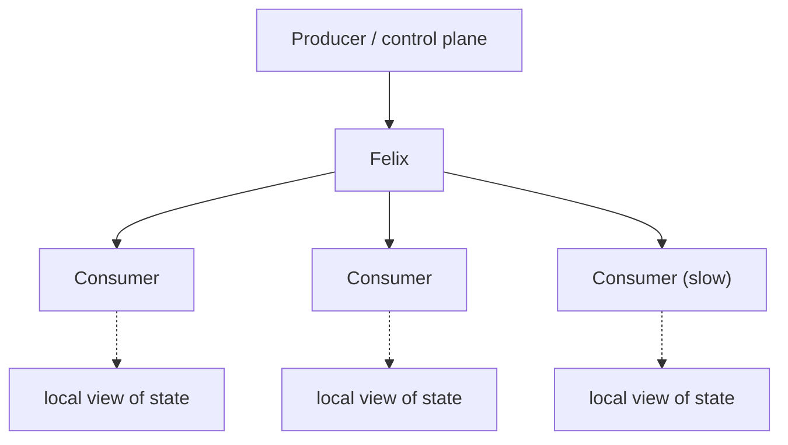

:::caution[Read this as two documents]
Felix is in early active development. This page separates **what Felix does
today** from **what Felix is being built to become**. Every capability below
carries a status marker. Nothing marked *Target* should be relied on, planned
around as if it exists, or claimed externally.

- ✅ **Today** — implemented, tested, and measurable in the current build.
- 🚧 **Partial** — a real implementation exists but is incomplete or not wired end to end.
- 🎯 **Target** — intended design. Not implemented. May change.
:::
:::note[Maintenance]
**Status markers last verified against the code on 2026-09-13.** This page
goes stale the moment a 🎯 row lands, and stale status markers are worse than
no status markers — a reader who catches one wrong row stops trusting the
other twenty. Treat updating it as part of shipping any capability listed
here. There is precedent for drift: `docs/semantics.md` claimed authorization
was unimplemented long after it was enforced on the control stream, and
described a single-node at-most-once system long after replication shipped.
Both were corrected when that document was rewritten against the tests.

✅ and 🚧 rows were confirmed by reading the implementation. "Not started"
on 🎯 rows means no implementation was found, which is a weaker check.
:::
## The one-sentence answer

**Today:** Felix is a QUIC-based replicated log that serves stream, cache, and
queue semantics from one storage engine, optimized for high-fanout delivery with
predictable tail latency and strict slow-consumer isolation.

Shards of a stream or cache are placed across brokers, replicated by leader
leases and log shipping, and survive the loss of a leader; a publish can be made
to wait for a quorum of the replica set before it is acknowledged. What is not
yet true of a cluster is spelled out row by row in
[section 2](#2-what-felix-does-today) — most of the multi-node rows are 🚧
rather than ✅, and the reason each one is Partial is the fault injection it has
not been put through, not a missing feature.

The slow-consumer isolation half of that sentence is runnable:
[`task demo:slow-consumer`](/felix/demos/slow-consumer-isolation/) stalls one
consumer and measures what happens to the others, under both queue policies.

**Target:** Felix is a distributed data plane offering coordination-store watch
semantics — read the current value, then receive every subsequent change with no
gap — at messaging-system fanout and throughput. The point of that combination is
keeping large populations of services, agents, and edge nodes synchronized with
rapidly changing state.

The gap between those two sentences is the roadmap. The rest of this page makes
that gap explicit.

---

## 1. The problem Felix is aimed at

Many distributed systems need a large number of independent processes to agree on
the same continuously changing state — configuration, policy, routing tables,
task assignments, cluster membership, device state.

The common implementation stitches together several systems: a database for the
authoritative value, Redis for fast reads, Kafka or RabbitMQ for change events,
WebSockets or polling to reach the consumers. Each one solves part of the problem
with different semantics, different failure modes, and no shared consistency
story between them.

Felix's thesis is that this class of workload deserves a single coherent
abstraction: **current state, the stream of changes to it, and the transport that
distributes both.**

Concretely, the traffic looks like a namespace of small, frequently-changing
values with a change feed beside each one:

```text
config/current              # the authoritative value
config/changes              # the deltas since
routing/table
policy/authz
cluster/membership
device/{id}/state
agent/{id}/tasks
agent/{id}/events
```

carrying events like `certificate rotated`, `node joined`, `route changed`,
`policy updated`, `feature enabled`, `task assigned`, `run cancelled`. The
defining property is that each consumer needs to end up holding an accurate local
copy — not merely to observe that something happened.



That is the target. What exists today is the transport and fanout layer
underneath it, plus the first watch primitives on top: a keyed cache watch —
subscribe to one key or prefix, resume by offset, loud loss — and retained
delivery on it, which is exactly the "current value plus every subsequent
change, gap-free" contract this section describes, for cache keys (see the
table below for exactly how far it goes).

### Why not etcd, Consul, or ZooKeeper?

This is the first question the thesis has to survive, because "current value plus
every subsequent change, gap-free" is not a new idea. etcd's watch does exactly
this — read at a revision, watch from that revision — and Kubernetes is built on
it. Consul and ZooKeeper have watches. NATS JetStream's KV store has watch.
Kafka's stream-table duality is the same concept applied to a log. Anyone
evaluating Felix will reach for one of these first, and for many workloads they
should.

The gap Felix is aimed at is not the semantics. It is the scale those semantics
are available at. Coordination stores are consistency-first: they run a
consensus quorum over a comparatively small dataset, and they trade write
throughput and watch fanout to get correctness. etcd is a well-known example —
the Kubernetes apiserver maintains its own watch cache in front of etcd in large
part because etcd cannot serve that many watchers directly. When people need
watch semantics at high fanout, they build a fanout tier in front of the
coordination store.

Felix's bet is that this tier should be a system rather than a bespoke component
rebuilt per deployment: **watch semantics as a first-class primitive on
infrastructure designed for fanout and throughput from the start, rather than
bolted in front of a quorum store.**

That bet is unproven, and it is the load-bearing claim of this entire document.
It fails if coordination stores turn out to be fast enough for most real
workloads, or if the consistency Felix gives up to get fanout turns out to be the
part that mattered. Both are live possibilities.

---

## 2. What Felix does today

These are shipped and measured. If you need one of these, Felix is usable now.

| Capability | Status | Notes |
|---|---|---|
| QUIC transport, TLS 1.3 always on | ✅ Today | Multiplexed streams, no head-of-line blocking, tuned path-MTU/cwnd/socket buffers. The broker serves an operator-supplied certificate (`FELIX_TLS_CERT`), re-read on rotation, with optional client certificates (`FELIX_TLS_CLIENT_CA`); without one it generates a self-signed development certificate and warns |
| Publish / subscribe with high fanout | ✅ Today | Shared-frame fanout encodes a publish batch once regardless of subscriber count |
| Batched publish and batched delivery | ✅ Today | Count- and time-bounded, JSON or binary framing |
| Gap-free "current state + subsequent changes" subscribe | ✅ Today | A subscribe with a start position on a durable stream reports `start_offset` (the first record delivered) and `live_offset` (the tail at join). Everything below `live_offset` was already there, everything from it on is new, and nothing is skipped between them, including under concurrent publishes. A stream has no per-key current value, so "current state" here is a position rather than a snapshot |
| Idempotent producers | ✅ Today | A broker-assigned producer id and a per-shard sequence (`producer_init`, `publish_idempotent`, negotiated as `FEATURE_IDEMPOTENT_PRODUCER`): the leader appends the sequence it expects, answers a re-send of one it holds without appending it, and refuses a gap or a forgotten producer with a typed reason. A different batch under a sequence it holds is told apart by a digest of the payloads kept with each remembered batch (derived from the log on a durable stream) and refused as `sequence_reused` to a client that offers `FEATURE_SEQUENCE_REUSED`, which the Rust client does; a client that does not is answered as for a re-send, as before, and the batch is not written. The Kafka listener does not check it, as Kafka does not. `ClusterClient::idempotent_producer` re-sends across reconnects and follows the leader. On a durable stream the sequences are stored in the log with the records and replicated with them, so a leader promoted after a failover, a planned move's destination and a restarted broker answer a re-send from the records they hold, and the producer carries on: `a_producer_keeps_its_sequence_when_its_leader_dies` and `a_producer_keeps_its_sequence_across_a_planned_move` re-send the last batch to the new leader and see it land once, on a `Quorum` stream replicated three ways and on a drained broker. Batches go out as binary frames (`FLAG_BINARY_PUBLISH_IDEMPOTENT`), with JSON as the fallback for older brokers. A producer is remembered while any of its batches is in the log, so one whose batches retention removed is refused as `unknown_producer`; an in-memory stream keeps its sequences in the leader's memory, and loses them, like its records, with the leader |
| Bounded per-subscriber queues | ✅ Today | Explicit depth limits at every stage |
| Slow-consumer isolation | ✅ Today | `Block`, `DropNew` (default), `DropOld` — see [`SubQueuePolicy`](/felix/reference/configuration/) |
| Key/value cache with TTL | ✅ Today | Scoped `(tenant, namespace, cache, key)`, lazy expiry against an absolute expiry time that survives a restart |
| Keyed cache watch | ✅ Today | Subscribe to changes for one cache key or key prefix (`cache_watch`, negotiated as `FEATURE_CACHE_WATCH`): each applied write is delivered in the shard's write order with its log offset, deletes included. Resume by offset replays from the cache's log and joins live delivery with no gap and no duplicate, proven under concurrent writes at join time; an offset compaction has collapsed is answered with a marked snapshot of current values, never a silent gap; a watch that falls behind is ended with a signal naming the offset to re-watch from, because filtered offsets are sparse and a drop would otherwise be invisible. Retained delivery (`FEATURE_CACHE_WATCH_RETAINED`) starts a watch from current state: each matching key's current value first — the offset-carrying retained message — then live changes, with the confirmation counting the state phase so joining an empty key is a definite zero rather than silence; proven under concurrent writes at join time, across a restart's rebuilt index, and through leader failover, where the promoted replica serves the retained value and the watch is live on it. Log-backed caches only — an in-memory cache has no offsets to anchor any of this to, and does not advertise the features. A prefix watch reads one shard, and on a multi-shard cache one that names no shard is refused. `ClusterClient::watch_cache_sharded` watches a prefix across every shard and says when every shard's retained state has arrived (Rust client only for now) |
| Counters (deltas folded into a durable sum) | ✅ Today | `counter_add` applies a signed delta and answers with the sum including it — one round trip to increment and know where you stand, for rate limits, quotas, and live tallies. Scoped and routed exactly like cache keys, stored beside the cache; the sum survives restart (rebuilt by folding the log), compaction (deltas collapse into a checkpoint without renumbering the log — regression-tested), and leader failover (the counter log replicates with its cache shard, and the promoted replica keeps counting from the true sum). At-least-once, stated honestly: a retried add after a lost acknowledgement double-counts, and the decision is recorded in [`docs/projections.md`](https://github.com/gabloe/felix/blob/main/docs/projections.md) |
| Multi-tenant scoping | ✅ Today | Tenant and namespace required on all data-plane operations |
| Per-tenant quotas and connection limits | 🚧 Partial | A tenant's publish rate (bytes and messages per second) is capped per broker, across QUIC and Kafka, with a typed retryable refusal for acked QUIC publishes and `throttle_time_ms` for Kafka; one source address may hold a bounded number of connections; publish and delivery are counted per tenant under a label cap. Publishes queue per shard behind a per-tenant fair queue (deficit round robin) with a guaranteed share per tenant, so one tenant flooding a broker is refused with a retryable `overloaded` while others still get in, and a slow shard, forward or quorum wait holds up only its own shard. Not built: quotas on subscriptions, cache or storage, and quotas stored in the control plane rather than each broker's environment |
| Token-based authorization | ✅ Today | OIDC token exchange, tenant-scoped JWTs, broker-side permission checks on publish/subscribe/cache; broker-to-broker mTLS with the certificate's name bound to the node id, required for a cluster member unless explicitly waived |
| Control plane metadata service | ✅ Today | REST + OpenAPI, tenant/namespace/stream/cache CRUD, snapshot and changes feeds, every one of them behind a Felix token — tenant resources by the tenant's own manage permissions, the tenant catalog and the feeds by cluster scope — with in-memory or Postgres backing. Any number of identical instances over one HA Postgres: a rolling restart of every instance, with broker heartbeats and watches flowing throughout, serves every call — proven by test, with the database's own HA an explicit operational contract ([`docs/ha-postgres.md`](https://github.com/gabloe/felix/blob/main/docs/ha-postgres.md)). Tenant bootstrap is atomic and exactly-once across instances, with token rotation and optional mTLS on the bootstrap listener. The API serves TLS when given a certificate (`FELIX_CONTROLPLANE_TLS_CERT`) and is plain HTTP otherwise |
| Prometheus metrics, health endpoints | ✅ Today | Plus opt-in `telemetry` feature for per-stage timings |
| Kubernetes packaging | ✅ Today | A Helm chart at `deploy/helm/felix`: the control plane as a Deployment over Postgres or a StatefulSet under the Raft backend, brokers as a StatefulSet whose pod name is the node id with a volume each, probes and a preStop-plus-drain grace period derived from the values, PodDisruptionBudgets that keep a replication-factor-three quorum, anti-affinity and zone spread, a NetworkPolicy admitting the internal port from brokers only, and optional peer mTLS issued per pod by cert-manager's CSI driver. Value combinations that are each fine alone and wrong together — an even Raft group, a budget wider than the replica count, a drain longer than its grace period — refuse to render rather than deploying something broken. `task chart:check` lints and renders it every way `ci/` describes and CI runs it |
| Durable streams | ✅ Today | Opt-in per stream via `durable: true`, and only when the broker runs with `FELIX_DURABLE_STORAGE_DIR`. Segmented crash-safe log: CRC-verified records, torn-tail recovery, group commit, three fsync policies. A durable shard is replicated to followers and survives losing its leader. Retention is available and off by default (`FELIX_DURABLE_RETENTION_BYTES` / `FELIX_DURABLE_RETENTION_SECONDS`); unset, a log grows without bound |
| Resumable subscriptions | ✅ Today | `Subscribe` takes `latest` / `earliest` / an offset; every delivered event carries its offset (`Event.offset`) so an application can checkpoint and resume at `offset + 1`. Stored history joins live delivery with no gap, backfilling from disk if the live queue overflowed. Durable streams only; bounded by retention when it is configured, unbounded otherwise |
| Queue semantics (consumer groups, acks, redelivery) | 🚧 Partial | A client polls a group, acknowledges a record, or hands it back; an unanswered record is redelivered once the visibility timeout lapses. A claimed record is not handed to a second consumer, and the cursor advances only over a contiguous run of acknowledgements, so an acknowledgement out of order cannot skip a gap. The cursor is a durable key → latest-value projection over a log, monotonic so a late acknowledgement cannot rewind it, and it is replicated with its shard — a promoted replica resumes where the group had reached rather than at zero. Redelivery is bounded: past `max_attempts` a record is dead-lettered, and the delivered record carries its attempt count. Dead letters are pointers into the stream's log, not copies, and can be listed and discarded. Group state survives failover whole: the cursors *and* the dead-letter list replicate beside the shard's records, so a promoted replica resumes each group where it reached, lists what it abandoned, and serves an operator's redrive — proven by killing the leader mid-list. A waiting poll is woken by an append, an acknowledgement or a lapsing claim rather than re-polling on a timer; each group has a cap on records in flight (`FELIX_GROUP_MAX_IN_FLIGHT`); and `group.consume`/`group.manage` can be granted on one group (`group:{tenant}/{ns}/{stream}/{group}`). A group is bound to one shard, served by its leader; `ClusterClient::group_sharded` keeps one per shard, follows each shard's redirect to its leader, visits shards in turn and routes each ack back to the shard its record came from. Partial because that is a client-side merge, like `subscribe_sharded`: the broker serves one shard's group at a time |
| Graceful shutdown | 🚧 Partial | Readiness flips before the listener closes, and both the control plane and the broker can keep serving across a configurable hold-off so a load balancer can act on it. Bounded drain against one shared deadline, with a forced termination reported rather than logged as clean. A client that negotiated error codes and opens a control stream while its connection drains is told `draining`, so it can go elsewhere at once. Publish workers are supervised and drained explicitly: once connections are gone they write everything still queued, including publishes already acknowledged on enqueue, before replication catches up and the logs are flushed. Partial because, inside a connection, acknowledgement waiters and subscription writers are still not told to wind down early: the drain waits for each connection task as a whole |
| Sharding | ✅ Today | Streams carry a shard count, the control plane assigns each shard an owner, and a publish resolves against that ownership before anything else happens. A publish for a shard this broker does not own is forwarded to the owner and acknowledged only once the owner has written it; the ack says so and names the owner (`FLAG_BINARY_PUBLISH_ACK_OWNER`), so a client can see it is paying to relay every record rather than inferring it from broker-side metrics. `ClusterClient` acts on that hint: it caches the owner per shard and sends the next batch straight there, falling back to forwarding whenever the cache is cold or the owner stops answering. A client that connects to an arbitrary broker pays the relay once per shard rather than on every record; relaying cost roughly twice the CPU per byte. A publish may carry a routing key, and the key decides the shard, so a stream placed across brokers spreads across them. That is what shards are for. Twelve shards on one broker measure 1.0x against a single shard, because they share a socket, a CPU and a filesystem; a second broker measures 2.1x. Ordering becomes per key rather than per stream once a stream has more than one shard; a single-shard durable stream keeps total order. A single-shard in-memory stream does not: fanout is not ordered against concurrent publishes, so two subscribers can see a racing pair of publishes in different orders. A subscription still reads one shard, but `ClusterClient::subscribe_sharded` opens one per shard and merges them, following each shard's own redirect — promising per-shard ordering and nothing more, refusing to open rather than covering some shards, and re-establishing one shard without disturbing the rest. A keyed publish uses the binary encoding like an unkeyed one: the key rides in the frame under `FLAG_BINARY_PUBLISH_KEYED`, negotiated on the handshake, with JSON as the fallback for brokers that predate it. A subscription reads one shard, and a whole-stream read is a client-side merge by design: the broker serves shards, and merging on one broker would move every record twice and put the stream's read load back on one broker. The Python and TypeScript clients wrap the same merge |
| Multi-node clustering and replication | 🚧 Partial | Brokers register, their liveness is tracked, shards are assigned to owners, and a publish that reaches the wrong broker is forwarded to the right one. Shard leaders now replicate committed records to followers, and a follower whose history is gone is given a log starting where the leader's surviving log does. A subscribe sent to a broker that does not hold the shard is now answered with a redirect naming the one that does, rather than being accepted and silently delivering nothing; `ClusterClient` follows it |
| Fleet-wide feature gate | ✅ Today | Each broker reports the cross-broker features it implements when it registers, and the control plane tracks which ones every live or draining broker supports. A feature turns on only when an operator finalizes it (`felix-controlplane admin features finalize`), which is refused until every serving broker supports it, so a rolling upgrade can be rolled back broker by broker right up to the finalize. Finalizing is one-way: after it a broker without the feature is refused at registration, serialized with the finalize on every store backend. Readable at `GET /v1/fleet/features` and `felix_broker_fleet_feature_enabled`. No feature uses it yet; the first planned are jump-hash routing and the replication peer fence. See [Upgrades and compatibility](/felix/deployment/upgrades/) |
| Leader failover | 🚧 Partial | A lost leader is replaced by a replica that holds the log — never by a broker that does not — in about a second on a local three-node cluster, and a quorum-acknowledged record is readable from the replacement. A shard with no qualifying replica is left unavailable rather than served empty; that includes every durable shard with `replication_factor: 1`, which waits for its broker to return unless an operator abandons its log. A leader frozen past its lease and then resumed cannot acknowledge a write the cluster has lost. Proven against process kill, graceful stop, freeze, and partition — a broker severed from its peers while it keeps running and keeps heartbeating, so the control plane still believes it is healthy, including one-way: a leader whose own packets reach no follower acknowledges no `Quorum` write. Clock skew cannot affect the lease, which reads a monotonic clock and never a wall clock; the assumption that does matter, bounded process suspension, is injected by freezing a leader past its lease. Clock steps and rates are injectable too, in debug and fault-injection builds only (a release build ignores `FELIX_CLOCK_FAULT_FILE` and reads the real clocks): a broker clock running fast lapses its lease, and a control-plane wall clock stepped forward expires no live broker, and stepped back it still expires a dead one within one window rather than after the size of the step, including under Raft when control-plane leadership moves after the step (`a_leader_elected_after_a_clock_step_back_expires_a_dead_broker_within_a_window`). The interleaving no injected fault reaches — a leader acknowledging a `Quorum` write and dying before the control plane learns which replica holds it — is closed by ordering rather than by testing: the leader reports who holds the record and waits for that report to land *before* the mark that releases the acknowledgement moves. A TLA+ model of the protocol explores 5.38M distinct states of the implemented design without violating it, and the same model with the ordering removed loses an acknowledged record in a second. A promoted leader fences a majority of its replicas before it serves, and takes a tail one of them holds past its own: a follower the deposed leader can still reach refuses it even when the control plane never told that follower about the promotion, which a test shows with the old leader cut off or frozen past its lease and its clock slowed a hundredfold. That runs only when every replica offers the fence, negotiated per peer; a fleet with one broker that does not keeps the lease. `Leader` streams still rely on the lease alone to keep a deposed leader from acknowledging. Partial rather than done because the injected faults are still the ones a single machine can produce |
| Online rebalancing | ✅ Today | A shard whose leader is alive is moved, never reassigned: the destination is staged as a replica and copied to, the leader is fenced once the destination is within a lag bound, the leader reports its log has stopped growing, and only then does the destination lead. A draining broker (`POST /v1/nodes/{id}/drain`) hands everything off and can then be removed; a broker that joins takes shards from any broker over its share. Every step is a conditional write to the control plane's store, so a control-plane restart resumes a move and a stale planner cannot undo a step. The switch-over takes about 90 ms on a local debug build (`a_move_switches_over_in_well_under_a_second`). A publish that arrives during it is held and forwarded to the new owner rather than refused: publishers running through a whole move see no refusal and no record lost or stored twice (`continuous_publishing_through_a_move_is_never_refused`). Subscriptions follow the shard: the old leader ends each with `shard_moved`, naming the new owner and an exact offset, and a `ClusterClient` subscription resumes there with nothing repeated or skipped (`a_subscription_follows_its_shard_to_the_new_owner`). A `ClusterClient` cache watch, one shard or all of them, follows the same way from the offset after the last change it delivered (`a_cache_watch_follows_its_shard_to_the_new_owner`). Group positions, dead letters and counters move with the shard (`a_moved_shard_keeps_its_group_state_and_counters`), and idempotent producers keep their sequences (`a_producer_keeps_its_sequence_across_a_planned_move`). Copies are paced by a cluster-wide and a per-broker limit, a move timeout and a per-leader bandwidth limit, and a move completes under steady writes (`a_move_completes_while_a_publisher_keeps_writing`, `a_move_that_cannot_copy_is_abandoned_after_its_timeout`). Operators can list, preview, start, cancel and pause moves over the API or `felix-controlplane admin`; `routing::operator_moves` runs a move, a cancel before and after the fence, and a pause against real brokers. Cache and counter operations are held and forwarded the same way, and a consumer-group operation is held and then redirected to the new owner, which a `ClusterClient` group follows: cache puts and deletes, counter adds, publishes and a group's polls and acks running through a move see no refusal, every acknowledged cache write reads back, the counter equals the acknowledged adds, and no acknowledged record is redelivered (`writes_of_every_kind_through_a_move_are_never_refused`). The Python and TypeScript clients' group calls follow it too (`a_cluster_client_follows_a_group_redirect_to_the_leader`), and a redirect to a draining broker that still leads the shard carries its address. Where it stops: the single-broker Rust `Client` returns that redirect as `NotLeaderError` rather than following it; the move limits hold across control-plane instances, since every placement write is fenced by a token read before its pass decided (`two_instances_cannot_both_take_the_last_move_slot`), but an instance that dies holding the placement lease holds up the timed passes, failover included, until the lease expires (three reconcile intervals, 15 s by default). A broker told to stop drains itself first and keeps serving until its shards have moved, so a rolling restart refuses no publish (`a_stopping_broker_hands_its_shard_over_under_load`); that wait is bounded by `FELIX_SHUTDOWN_HANDOFF_TIMEOUT_MS`, and what is still led when it runs out fails over, which for a `Quorum` stream loses no acknowledged record (`a_handoff_that_times_out_loses_no_acknowledged_record`). Placement balances shard counts, not load (see Load-aware placement below) |
| Consistent backup point | 🚧 Partial | `felix-controlplane admin backup-point` records, after one barrier instant, each shard log's committed offset on its leader (`GET /backup/offsets` on the broker's metrics listener): the quorum mark for a `Quorum` shard, the acknowledged tail otherwise, re-collected if any leader or generation changed meanwhile. Leaders' shard directories are copied while they run and `felix-broker restore-point` cuts each copy back to the point, below its own commit offset. Proven under load: every record acknowledged before the barrier is in the point and the restored copy, and a `Quorum` shard whose leader can reach no follower is not cut past its mark (`a_point_under_load_is_committed_and_misses_nothing_acknowledged_before_it`, `a_live_copy_restored_to_the_point_keeps_every_ack_before_it_and_nothing_after`). Where it stops: offsets are read one broker at a time with no write pause, so a record written during the collection can be in the point on one shard and not another; a `Leader` shard is cut at what its leader held; a cache, group or counter log compacted after the point cannot be cut back to it and the restore refuses the copy; and control-plane metadata is backed up separately. See [Backup and restore](/felix/deployment/backup-and-restore/) |
| Zone-aware placement | ✅ Today | A broker registers its failure domain with `FELIX_NODE_ZONE`, and placement puts each shard's followers in zones the shard has no copy in yet. A drain goes where the shard keeps the most zones, a rebalance only where it loses none, and the cut-over keeps the copies that hold the spread. A follower sharing a zone with another copy is replaced, paced like any move, once a broker in a missing zone has room, so shards placed before zones were reported are spread too. When a shard cannot be spread (every broker in a missing zone is full) it is placed anyway, with a warning and `felix_shards_zone_unspread`. A broker without a zone is treated as alone in its own, so a cluster that reports none is placed as before. `a_shards_copies_span_every_zone_and_a_drain_keeps_them_spread` runs four brokers in three zones. An operator's move is never refused on zone grounds: it reports `zones_before` and `zones_after`, can be previewed with `dry_run` (`felix-controlplane admin move --dry-run`), and a narrowing one is logged as a warning. The Helm chart's `broker.zones` runs one StatefulSet per zone, pinned to it and reporting it. A zone is read when the broker registers, so changing it takes a restart |
| Quorum acknowledgement | 🚧 Partial | `Stream.consistency` is honoured: a `Quorum` publish waits for a majority of the replica set, counting the leader, to hold the record durably, and the acknowledgement survives losing the leader. The wait does not depend on which broker the client reached: a publish forwarded to the shard's leader waits for the same majority before it is acknowledged. One replica being unreachable does not stall it — a leader ships to its followers concurrently, so losing a minority of the set costs nothing. Bounded by a timeout, and a timeout is reported as "this broker cannot vouch for the write" rather than as failure. A publish with no reachable majority is refused rather than acknowledged — until #282 it was acknowledged on enqueue whenever `ack_on_commit` was off, which is the default, so `Quorum` silently behaved like `Leader`. The acknowledgement's survival depends on which replica is promoted, and promotion prefers the replica furthest ahead among those the control plane has been told hold the record — a report that, by construction, is already in hand when the acknowledgement is released. Checked in TLA+ rather than only by fault injection. The acknowledgement still waits on the report and the lease, not on the followers alone: acknowledging on a majority at the leader's generation is designed and model-checked, and not built. Partial for the same reason as failover: the faults it is proven against are the ones a single machine can produce — kill, stop, freeze and partition |
| Client surviving a broker failure | ✅ Today | `ClusterClient` takes several broker addresses and rebuilds its connection from the rest when the one it is using fails, so an application outlives the broker it happened to connect to. It holds one QUIC connection per broker, shared by every role that broker plays (entry, shard owner, redirect target, producer leader) with every stream multiplexed on it, and opens more only when those streams saturate it, up to a ceiling; a connection that dies fails only its own streams and is replaced (`one_connection_per_broker_under_light_mixed_role_use`, `a_dead_connection_is_replaced_and_only_its_streams_fail`). `publish` reports the failure with the connection already replaced; `publish_at_least_once` also resends, and documents that a resend can duplicate. A client given one broker address asks it which brokers exist and adds them to what it will try, so the address it was configured with stops being a single point of failure; the configured seeds are always kept, so a wrong or stale answer cannot leave it worse off. A publish in flight when the leader fails is resolved by the idempotent producer on a durable stream: it re-sends until the promoted leader answers, and the sequence stored in the log makes the re-send land once. `a_producer_publishing_through_its_leaders_death_loses_and_repeats_nothing` kills the leader mid-stream and finds every record exactly once, in order. `publish_at_least_once` still documents that a resend can duplicate: that is its contract, and the idempotent producer is the path without the duplicate. A subscription whose broker dies is not ended quietly: `next_event` returns `SubscriptionLost`, and a `ClusterClient` subscription on a durable stream resubscribes from the offset after the last one it delivered (`a_subscription_resumes_after_its_broker_is_killed`). The same holds when the network rather than the broker fails: the conformance suite drops, resets and stalls the client's link mid-publish and mid-subscribe, and the Rust, Python and TypeScript clients each resume with no gap or report the loss, never end the subscription as if the stream had finished (`fault.*` in the catalogue) |
| Kafka wire compatibility: consumers | ✅ Today | With `FELIX_KAFKA_LISTEN` set, every broker serves Kafka consumers that assign their own partitions: durable streams appear as `<namespace>.<stream>` topics, partitions are shards, offsets are Felix's log offsets, and a fetch follows its partition to a new leader after a move or failover. SASL/PLAIN with a Felix token. Tested with kcat. Consumer groups are refused with an error that says why, so Connect, Streams and ksqlDB do not work. See [Kafka compatibility](/felix/features/kafka/) |
| Kafka Produce | ✅ Today | Kafka producers write to durable streams through the broker's publish path on the shard's leader: gzip, snappy, lz4 and zstd; `acks` 0, 1 and all, where all waits for the stream's own consistency (a majority on `Quorum`, the leader on `Leader`). Idempotent producers get a Felix producer id, and their sequences are kept in the log, so a batch re-sent after a failover or a move is answered as a duplicate, not written twice. Keys, headers and producer timestamps are dropped. Transactions are refused with an error that says why. Tested with kcat and across a failover and a move. See [Kafka compatibility](/felix/features/kafka/) |

### Measured performance

Single host, loopback, release build, TLS 1.3 on, defaults, zero delivery drops:

- **Latency (batch = 1, per-message ack, JSON framing):** p50 109–136 µs,
  p99 138–176 µs at fanout 1 across 0 B–4 KiB payloads; p50 236–269 µs,
  p99 278–399 µs at fanout 10.

  The framing matters and is easy to get wrong. `latency-demo` enables
  per-message acks only when `batch <= 1 && !binary`, so passing `--binary`
  silently measures a different thing — fire-and-forget delivery rather than a
  request round trip. Those two are not comparable.
- **Throughput (batch = 64, lossless, fanout 1):** ~461 MB/s at 1 KiB,
  ~508 MB/s at 4 KiB, ~503 MB/s at 16 KiB of payload.

  A minority of runs land several times lower — a known open issue in the
  transport's scheduling, documented under
  [Benchmarks](/felix/features/benchmarks/). Take a median of several runs;
  a single run is not a measurement.

Full methodology and per-platform tables are in [Benchmarks](/felix/features/benchmarks/).
These are **single-node loopback numbers at fanout ≤ 10**. They are not evidence
for behavior at thousands of subscribers or across a network.

### Delivery semantics today

- **At-most-once for a plain subscription.** A subscriber is delivered to
  best-effort: no redelivery, and no publisher-visible confirmation that anyone
  received anything. This is the right default for the fanout workloads Felix is
  aimed at, where the next update supersedes the one that was dropped.
- **At-least-once through a consumer group.** Polling a group is the other
  shape: a record is claimed rather than pushed, redelivered if it is not
  answered for within the visibility timeout, and dead-lettered once it has
  been attempted too many times. A consumer must expect the same record twice —
  a crash after handling and before acknowledging is indistinguishable from a
  crash before handling. See [Queues](/felix/features/queues/).
- **Idempotent producers, not exactly-once delivery.** A producer that takes
  an id from the broker and numbers its batches can re-send a publish whose
  acknowledgement never arrived and have it land once — the shard's leader
  answers a sequence it already holds without appending it, and on a durable
  stream that holds across a failover or a move too. Delivery stays one
  of the two shapes above: a consumer can still see a record twice on
  redelivery. Deduplicate there, keyed on something in the record.
- **Per-stream ordering** preserved for a given subscriber on a durable
  stream. No ordering across streams. An in-memory stream's fanout is not
  ordered against concurrent publishes, so different subscribers of the same
  in-memory stream can see a racing pair in different orders.
- **Resumable subscriptions over the wire, for durable streams.** `Subscribe`
  carries an optional `start` — `latest` (the default, and what every older
  client sends), `earliest`, or an exact offset — and every delivered event
  carries its offset, so an application checkpoints what it handled and resumes
  at the next one. History read from disk joins live delivery with no gap and no
  duplicate. Asking for an offset retention has discarded is a typed error, not
  a silent restart at the tail. A non-durable stream stays tail-only beyond its
  bounded replay ring, because there is nothing older to read.
- **Slow subscribers drop** under the default policy, and lag is surfaced to the
  subscriber. Publishers never block on subscriber speed.
- **Ephemeral by default.** Nothing survives a broker restart unless the stream
  was registered with `durable: true`, which persists each record before
  acknowledging it and replays it afterwards. Durable storage is opt-in per
  stream and off unless the broker is started with `FELIX_DURABLE_STORAGE_DIR`.
  Retention is available but off by default (`FELIX_DURABLE_RETENTION_BYTES` /
  `FELIX_DURABLE_RETENTION_SECONDS`): unset, a durable stream grows without
  bound; set, the oldest records are discarded and a resume below them fails
  with a typed error naming the oldest retained offset. Tiering is not
  implemented ([#172](https://github.com/gabloe/felix/issues/172)).

---

## 3. What Felix is being built to become

None of the following exists today. It is listed so the intent is legible, not so
it can be planned around. Capabilities move up into the table above when they
ship rather than being marked off here.

| Capability | Status | Current state of the code |
|---|---|---|
| Log-backed cache (one core log, many semantics) | 🚧 Partial | A cache is a log: writes append records, reads go through an index of key → offset rebuilt from the log at startup, and compaction reclaims superseded and expired records without ever rewriting one, on a background task with its own I/O budget, so no write waits for it. Entries survive a restart when the broker has `FELIX_DURABLE_STORAGE_DIR`; without one the cache is in memory, because there is nowhere to write a log. Cache operations are routed: a key hashes to a shard, that shard has one owner, and a broker that receives an operation for a key it does not own forwards it there — so a value written through any broker is readable through every other. A cache's shards are replicated and survive the loss of their leader. Put, get and delete are all on the wire, with delete reporting the value it removed, and the log is what makes the keyed watch above possible — every change has an offset to resume from. A cache declares `Leader` or `Quorum` like a stream, and under `Quorum` a put or delete is acknowledged only once a majority of its shard's replicas hold it. Partial because counter updates are still acknowledged by the leader alone, whatever the cache declares |
| Tiered / cold storage | 🎯 Target | `TieredStore` trait declared, no implementation |
| Raft consensus for cluster metadata | 🚧 Partial | Complete as a capability: `FELIX_RAFT_NODE_ID`/`_DATA_DIR`/`_PEERS` select a Raft-replicated metadata store with **no external database** — an openraft group embedded in the control-plane instances behind a seam, a deterministic command-driven state machine, invisible follower→leader write forwarding, leader-gated sweep and placement, quorum-aware readiness, a documented Postgres migration and DR path, and a chaos suite in which three real binaries survive rolling restarts, a SIGKILLed leader, a frozen-then-thawed leader, and a wiped follower volume with zero failed calls and every acknowledged write on every member. A member that comes back with a wiped volume does not vote until it has caught up with the group, because voting from an empty log can elect a member that is missing acknowledged writes. Partial for the same reason leader failover is: the injected faults are the ones a single machine can produce — plus the known pre-0.10-openraft bound that restarting the *leader* pauses writes one election (~1.2s). Postgres remains fully supported per [`docs/ha-postgres.md`](https://github.com/gabloe/felix/blob/main/docs/ha-postgres.md). Design and findings: [`docs/metadata-raft-design.md`](https://github.com/gabloe/felix/blob/main/docs/metadata-raft-design.md). Raft here is for *metadata* only, deliberately not for stream records: that is leases plus log shipping per [`docs/replication-design.md`](https://github.com/gabloe/felix/blob/main/docs/replication-design.md) |
| Cross-region routing and data sovereignty enforcement | 🚧 Partial | A stream created with a `region` has its leader and every replica only on brokers in that region, or in a region the directional allowlist `FELIX_REGION_BRIDGES` bridges it to. That holds for first placement, rebalancing and drain moves, failover promotion and operator moves, which are refused as `region_not_allowed`; a copy found outside the allowed regions, because a broker's region changed or a bridge was removed, is moved back in the way a draining broker's copies are. A broker forwards a request only to a leader in its own region or one its `FELIX_REGION_BRIDGES` reaches, and otherwise refuses it as `shard_unavailable` with reason `region_not_routable`. `a_stream_homed_in_one_region_is_refused_by_another` runs two regions with no bridge and checks both. Partial because: a stream created without a region, and every cache, is placed anywhere; the allowlist is per process, so the control plane and each broker must be given the same one; brokers ship to the replica set the control plane assigned without checking its regions themselves; a follower already outside the region stays until a broker inside it can replace it; a client connecting straight to a leader is not asked where it is; and there is no bridge agent, per-region encryption or audit log of cross-region movement |
| Load-aware placement | 🎯 Target | Not implemented. Placement moves a shard off a broker only when that broker leads more than its share of shards, counted, or is draining. It reads no traffic, disk or CPU figures, so a broker leading its share of hot shards is left as it is. An operator can move a hot shard by hand (`felix-controlplane admin move`) |
| Non-Rust client SDKs | 🚧 Partial | Python ships, as a binding over the Rust client rather than a reimplementation, and passes every required scenario in the client conformance catalogue — publish and subscribe, consumer groups, cache watches and multi-shard subscribe, on both a synchronous and an asyncio surface. Two optional scenarios stay unclaimed rather than passing: `at_least_once` does not carry a routing key, and a prefix watch over a multi-shard cache needs one watch per shard. TypeScript ships too (`crates/sdk/felix-typescript`, a napi-rs addon over the same client) with the same surface, and passes every required scenario as well; it leaves idempotent producers and `error.bad_offset_is_typed` unclaimed rather than passing. Both raise errors typed from the broker's error code, with the code and retry class on the error, so a refusal during a shard move reads as retryable and a quorum timeout as outcome-unknown. All three publish to their language's registry — `felix-client` on crates.io, PyPI and npm, the same name in each. Go and C# are not started; each will be gated on the same suite. See [Clients in Other Languages](/felix/clients/overview/) |

**Target scale**, stated as ambition and nothing more: a single update fanning out
to tens of thousands of subscribers across a multi-node cluster. Measured fanout
today is 10, on loopback, single-node. There is no benchmark, model, or
napkin-math projection behind the target figure yet — treat the gap between 10
and "tens of thousands" as unexplored engineering, not as a scaling curve someone
has already validated.

The target architecture is described in full in
[Design](https://github.com/gabloe/felix/blob/main/docs/design.md) and
[System Design](/felix/architecture/system-design/).

---

## 4. Workload fit

Two separate questions, deliberately kept apart. "Fits the architecture" is about
whether the workload matches where Felix is going. "Usable today" is about
whether you could build it on the current release.

| Workload | Fits the architecture | Usable today | Why |
|---|---|---|---|
| High-fanout real-time event distribution | Strong | **Yes** | Fanout, isolation, and tail latency are the shipped strengths |
| Live operational dashboards, telemetry feeds | Strong | **Yes** | Tolerant of at-most-once and of loss under lag |
| Ephemeral coordination between services | Strong | **Yes** | Low-latency, no durability needed |
| Internal service event bus | Moderate | Mostly | Works, but NATS and RabbitMQ serve this well already — weak differentiation |
| Distributed live-state synchronization | Strong | Partly | On log-backed caches the primitive exists: a retained `cache_watch` starts from current values, resumes by offset with no gap, and a watch that falls behind is ended with the offset to re-watch from rather than dropping silently. In-memory caches and streams still drop under lag with no way to resynchronize, and only the Rust client watches a prefix across shards |
| Infrastructure / control-plane state distribution | Strong | Partly | The same primitive, on a multi-node story that is still 🚧 (see section 2) |
| AI-agent coordination and shared state | Strong | Partly | Ephemeral coordination works now; durable task state works on one node. Records replicate to followers and a lost leader fails over to one that holds the log |
| Edge and disconnected operation | Strong | **No** | Durability, resumable subscriptions, and replication exist; retention is available but bounded by one machine's disk, and there is no store-and-forward between sites |
| Durable event log, replay, event sourcing | Weak | Partly | A durable log with offset replay exists, records replicate to followers, and retention can bound growth. No tiering — use Kafka for anything that needs history to outlive one machine today |
| Primary datastore | Weak | No | Use a database |
| General-purpose key-value store | Weak | No | Use Redis or Valkey |
| Complex broker routing, workflow messaging | Weak | No | Use RabbitMQ |
| Strongly-consistent coordination, leader election, locks | Weak | No | Use etcd, Consul, or ZooKeeper |

Read the two columns together and the current position is uncomfortable but
worth stating plainly: **the workloads Felix is differentiated for are the ones
it cannot serve yet, and the workloads it serves today are ones several mature
systems already serve well.** That is a normal place for an early project to be.
It is not a place to make strong adoption claims from.

### What the target workloads actually carry

The four "Strong fit, not usable today" rows are the ones the architecture is
being aimed at. What each moves:

- **Infrastructure and control planes** — distributed configuration, feature
  flags, service discovery, routing tables, authorization policy, deployment
  state, cluster membership, certificate rotation. Kubernetes control planes,
  service meshes, fleet management, private and hybrid cloud. The traffic is
  live infrastructure state, not durable business events.
- **Agent fleets** — task assignments and status, tool results, model
  configuration, resource availability, cancellation signals, intermediate
  results, shared scratch state. Attractive because agent systems naturally
  produce many concurrent producers and consumers, high event rates, fanout,
  ephemeral data, and wildly heterogeneous consumer speeds — close to Felix's
  intended operating point.
- **Edge and device fleets** — site- and device-level state pushed outward
  rather than polled inward, under intermittent connectivity, constrained
  bandwidth, and high latency. The model is that the edge holds a local copy and
  reconciles when a link returns. This is the furthest from what exists today.
- **High-fanout real-time data** — dashboards, telemetry, IoT, multiplayer and
  collaborative applications, live-event and market-data-style feeds. This one
  is largely usable now, because it tolerates loss.

### The open design question

The state-synchronization thesis and the current delivery semantics are in real
tension, and it has not been resolved.

For an event feed, a dropped message means a consumer missed one update. For a
consumer maintaining a local copy of state, a dropped message means its local
copy is **permanently wrong** with no signal that would let it recover on its
own. At-most-once delivery plus `DropNew` is a correct design for the first case
and an incorrect one for the second.

Closing this requires at least one of: gap-free snapshot-plus-stream subscribe,
resumable subscriptions with a durable log behind them, or an explicit
resynchronization protocol triggered by the lag signal subscribers already
receive.

The second of those now exists for durable streams: a subscriber that records
the offsets it handles can resume from them, and — because offsets are
contiguous — can *detect* a drop rather than diverging silently. That narrows
the case rather than closing it. It does not help a non-durable stream, it
requires the application to checkpoint, and a resume reaches only as far back
as retention keeps — unbounded when retention is unset, and no further than
the configured bound when it is.

For keyed state the first and third now exist too, on log-backed caches: a
retained cache watch delivers current values and then changes with no gap, and a
watch that falls behind is ended with the offset to re-watch from, which is the
resynchronization signal. What is left is everything that is not a log-backed
cache: an in-memory cache or stream still drops under lag with nothing to
resynchronize from.

---

## 5. What Felix is deliberately not

Felix should not be positioned against any of these, now or later.

- **Not a Kafka replacement.** Kafka is excellent at durable event history,
  long-term retention, replay, and data integration. Felix's durability is meant
  to serve live distribution, not to compete on retention — there is no tiered
  or cold storage, and retention is off unless it is configured. Speaking part
  of Kafka's protocol does not change that: it lets Kafka producers and
  partition-assigning consumers reach Felix streams, not run Kafka's ecosystem.
- **Not a Redis replacement.** Cache semantics in Felix exist as part of a
  state-distribution model, not as a general-purpose data-structure server.
- **Not a RabbitMQ replacement.** Elaborate routing topologies and traditional
  enterprise queueing are not the differentiator.
- **Not a database.** Felix is not the system of record.
- **Not a NATS competitor on general-purpose messaging.** NATS is fast, mature,
  broadly deployed, and already covers general high-performance pub/sub — with
  JetStream and its KV store overlapping parts of Felix's target surface. This
  is the closest neighbor, and "we are like NATS but faster" is not a position.
- **Not "a faster message broker."** That is a crowded category and the claim
  would rest on single-node loopback numbers.

Likewise, "Rust" and "QUIC" are implementation choices, not the value
proposition — though QUIC is load-bearing for the eventual edge story
(connection migration, 0-RTT resumption, no head-of-line blocking).

### Where that leaves Felix

Stated positively, rather than as a list of things Felix is not:

| System | Owns |
|---|---|
| Databases | Storing authoritative state |
| Kafka | Durable event history and replay |
| Redis / Valkey | Fast data structures and caching |
| RabbitMQ | Traditional broker routing and workflow queueing |
| NATS | General-purpose high-performance messaging |
| etcd / Consul / ZooKeeper | Strongly-consistent coordination and watch, at modest scale |
| **Felix (target)** | **Watch semantics at fanout and throughput coordination stores don't reach** |

The nearest neighbour is the coordination-store row, not the messaging rows —
see [Why not etcd, Consul, or ZooKeeper?](#why-not-etcd-consul-or-zookeeper) for
the argument and its failure modes. The snapshot-plus-stream primitive exists
for log-backed caches; Felix becomes credible against that row only once the
multi-node story is real and fanout has been measured somewhere well past 10.

---

## 6. How to decide whether Felix fits you

Felix is a strong fit today if your workload has most of these:

- one producer or few producers, many consumers;
- updates that matter in milliseconds, not seconds;
- consumers that run at genuinely different speeds, where one slow consumer must
  not affect the others;
- either tolerance for at-most-once delivery, or work that suits a consumer
  group's poll-acknowledge-redeliver shape;
- durability that is opt-in per stream rather than assumed everywhere.

Felix is **usable but early** if you need multi-node operation. Placement,
replication, quorum acknowledgement, leader failover and client redirection are
all implemented and tested, including against kill, graceful stop, freeze and
partition — but every fault so far is one a single machine can produce. Faults
are injected across the network (including one-way and delayed links), the
process, the clock, the control plane and the disk, and the nightly history
campaign draws from all of them: a broker whose fsync fails acknowledges
nothing, and does not trust a later fsync that succeeds. There is
no cluster-scale latency budget
([#136](https://github.com/gabloe/felix/issues/136)). Run it where you can
tolerate finding the next bug.

Felix is a strong fit for the **target** architecture, but not yet usable, if
you need a consumer to reconstruct state after a disconnect in one call. Asking
for *changes since an offset* is gap-free today; asking for *current state and
every subsequent change* is not, and stitching the two yourself races.

Felix is the wrong tool if you need long-term event history, tiered storage,
transactional guarantees, exactly-once processing, or a mature multi-language
ecosystem — there are three clients, Rust, Python and TypeScript, the latter
two wrapping the first, and neither wraps quite every surface.

---

## 7. Why this framing, and not a broader one

One reason to organize the project around this specific question — *how do you
keep a large distributed population synchronized with rapidly changing state?* —
is that the requirements it generates are the ones Felix has been building
anyway, on both sides of the today/target line:

- shipped because the thesis demands them: high-performance transport, persistent
  connections, efficient serialization, encode-once fanout, bounded subscriber
  queues, slow-consumer isolation;
- targeted because the thesis demands them: snapshot-plus-change subscriptions,
  durability, replication, resumable subscriptions, edge operation.

A generic message broker would not obviously need the first group and would not
prioritize the second in that order. The framing is worth adopting because it
explains and constrains the roadmap — not merely because it sounds more specific
than "message broker."

---

## See also

- [Overview](/felix/getting-started/overview/) — component-level tour
- [Semantics](/felix/architecture/semantics/) — the precise behavioral contract
- [Benchmarks](/felix/features/benchmarks/) — methodology and current numbers
- [Design](https://github.com/gabloe/felix/blob/main/docs/design.md) — full target architecture
