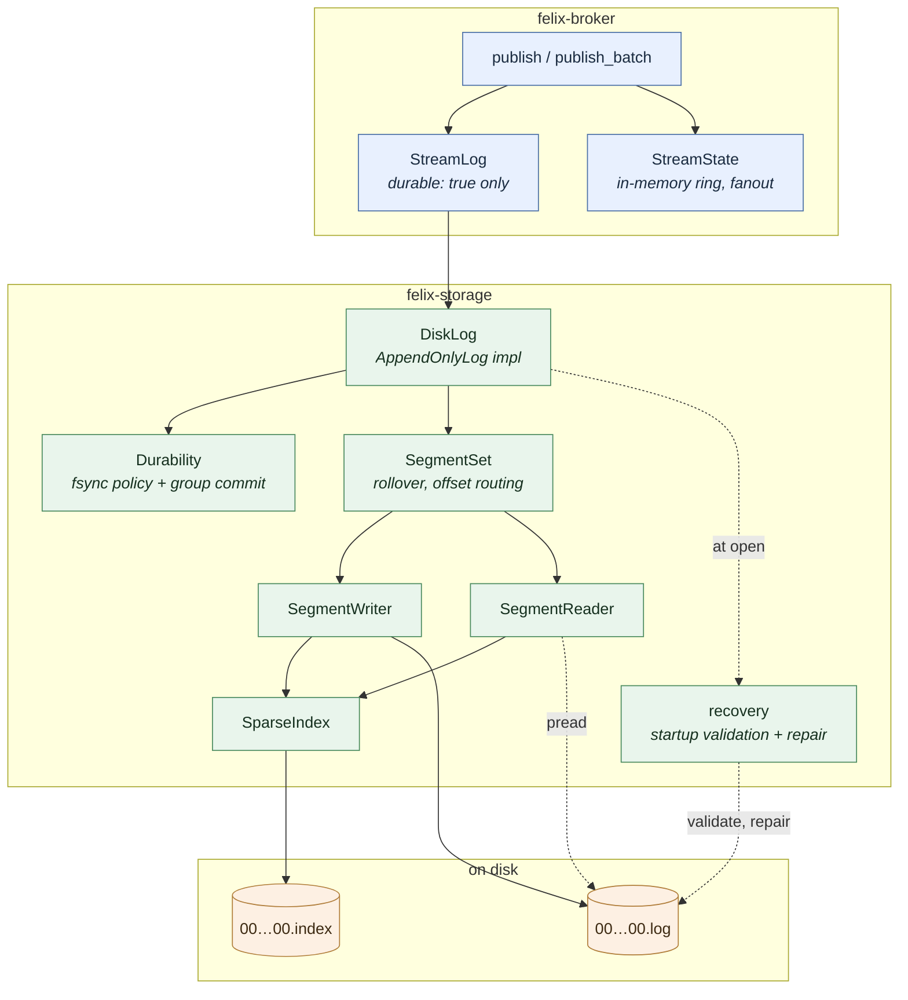
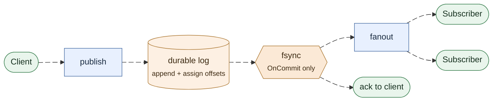
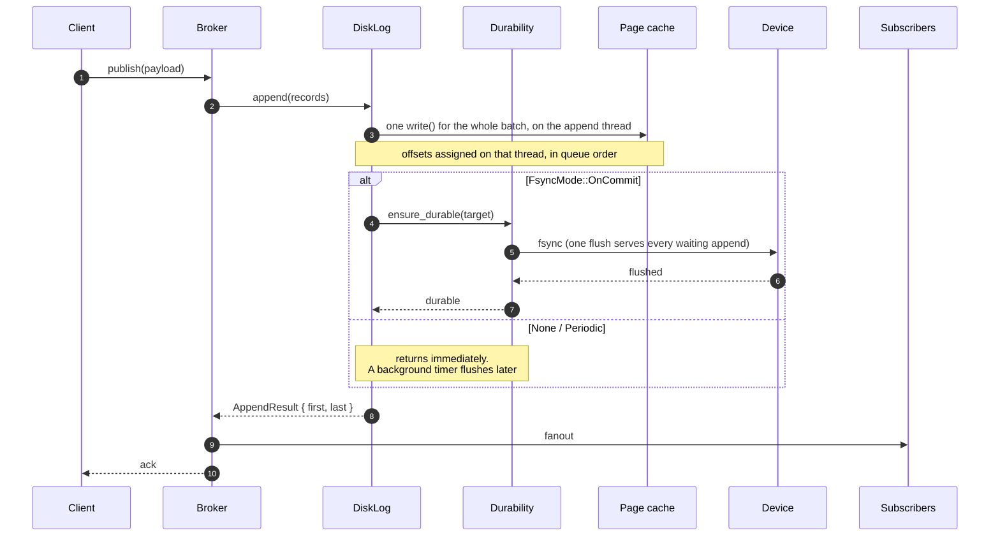
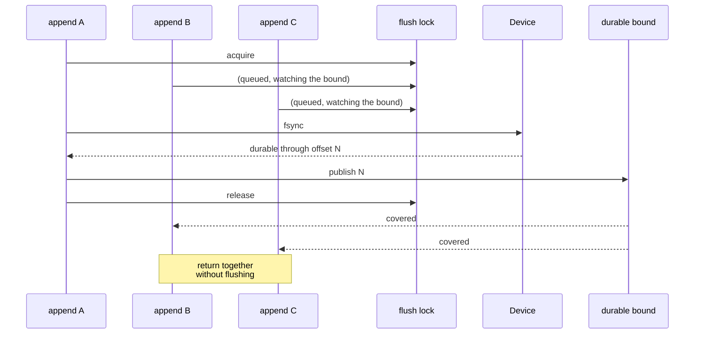
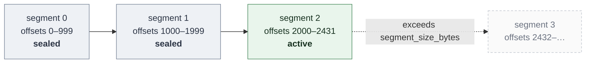
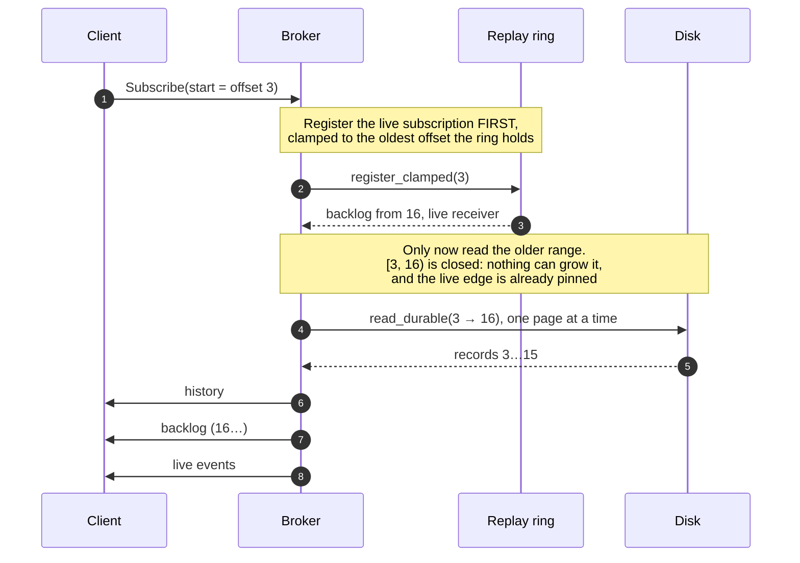
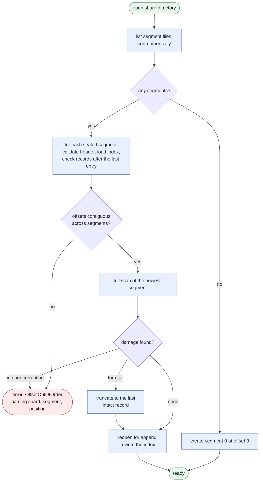

# Durable Storage

How a stream marked `durable: true` gets its records onto disk, keeps them there
across a crash, and reads them back.

Companion documents:

- [`storage-format.md`](storage-format.md): the byte layout, versioning rules,
  and exactly which corruption recovery may repair.
- [`storage-performance.md`](storage-performance.md): what durability costs,
  measured, and the regression budget.

## The guarantee

> A record that a durable publish acknowledged is readable after a restart,
> within the window the configured fsync policy allows.

Everything below exists to make that sentence true and to make its cost
explicit. The window is zero for `OnCommit`, one interval for `Periodic`, and
undefined for `None`.

## Layers



Each module owns one decision:

| Module | Owns |
| --- | --- |
| `segment/format` | the byte layout and every corruption verdict |
| `io` | positioned reads, preallocation, device flush |
| `segment/index` | the sparse index and how a seek position is chosen |
| `segment/writer` | appending to one file; nothing about rollover |
| `segment/scan` | validating scans, and whether damage is a repairable tail |
| `segment/reader` | bounded range reads |
| `disk_log/append` | the append path, and when it rolls a segment |
| `disk_log/segments` | rollover, which segment holds an offset, truncation |
| `disk_log/recovery` | startup discovery, validation, torn-tail repair |
| `disk_log/sync` | when a flush happens and who waits for it |
| `disk_log/layout` | `ShardKey` to a safe directory name |
| `broker/durable` | the ordering of append, fanout, and acknowledgement |

## The publish path



Nothing downstream of the log observes a record before it is durable: fanout
and the acknowledgement both hang off the flush, not off the append. Ordering
is the whole design, so the same path is worth spelling out step by step:



### One order, not three

Offsets are assigned on the log's append thread, one batch at a time, but the
fsync wait happens after the append returns, so two concurrent publishes can
resume from a shared group-commit flush in either order. Left alone, the log on disk could read `A, B` while a
cursor replay and a live subscriber both saw `B, A`.

A per-stream commit sequencer closes that gap. After its durable append, each
publisher waits until every lower offset has been applied, then appends to the
replay ring and fans out before releasing the next in line. Disk order is the
single source of truth for cursor order and delivery order alike.

This deliberately does not serialise the durable append: offsets are still
assigned concurrently and flushes are still shared, so group commit keeps its
fan-in. Only the cheap post-flush half is ordered.

Releasing a turn wakes exactly the publisher whose turn it now is, not every
publisher parked behind it. The distinction only shows up under concurrency, and
then it dominates: waking all of them makes the work per commit grow with the
number in flight, so throughput falls as load rises. Measured at
[storage-performance.md](storage-performance.md#8-releasing-a-commit-turn-wakes-one-publisher-not-all-of-them).

The append happens **before** fanout and **before** the acknowledgement. The
alternative is unrecoverable: a record delivered to subscribers and acknowledged
to the publisher but lost in a crash is a silent hole in a log that consumers
believe they have read. Paying the append latency first turns a failed write into
a failed publish, which the publisher can retry.

A storage error therefore never produces a success acknowledgement, and it never
reaches a subscriber.

## Durability policies

| Mode | Flush trigger | Acknowledged when | Loss window |
| --- | --- | --- | --- |
| `None` | seal, shutdown | bytes reach the page cache | unbounded (whatever the OS decides) |
| `Periodic { interval }` | background timer | bytes reach the page cache | one interval |
| `OnCommit` | the append itself | bytes reach the device | none |

Every open log has its own `Periodic` timer, and a tick with nothing to flush
does not flush: no unsynced bytes, no retired segment awaiting its seal, and the
durable offset already at the tail. A broker with hundreds of idle shard logs
therefore issues no fsyncs, and `felix_storage_sync_total` tracks the logs being
written rather than the number open.

`None` is not "no durability": the data survives a *process* crash, because the
page cache belongs to the kernel. It does not survive a machine crash or power
loss. That distinction is the reason it is a useful setting at all.

### Group commit

`OnCommit` would be unaffordable without it. An `fsync` flushes the whole file,
not one caller's bytes, so when N appends are in flight one flush can satisfy all
N:


The lock protocol behind that picture (who flushes, and what the others find
when they wake):



A waiter queues for the lock and watches the durable bound at the same time,
and stops at whichever comes first. One flush therefore wakes every append it
covered together; waiting on the lock alone would hand it down the queue and
wake them one after another.

Measured on a Mac Studio (Apple M4 Max, APFS): 253 durable appends/second at
concurrency 1,
14,387 at concurrency 64, a 57× gain from the same code path. The fan-in
actually achieved is reported as `felix_storage_sync_batch_appends`, the number
of records each flush covered. Records rather than appends, because the broker
merges publishes that queue on a shard into one append, and those share the
flush too. A client batch of N records counts N, so read it under
single-record publishes, or divide by the batch size. A value near 1 under load
means appends are serialising on the device instead of sharing a flush.

This is the same mechanism behind PostgreSQL's `commit_delay` and the WAL
group-commit paths in MySQL and RocksDB.

### Where the flush runs

The winner does not run the `fsync` itself: it would block a reactor thread.
Each log has a flush thread of its own, started on its first flush and stopped
after 10 s without one, and the winner hands the sync to it over a channel and
awaits the answer. The thread only ever runs that log's flushes, so a flush
does not queue behind reads, rollovers or other shards the way it would on
Tokio's shared blocking pool. The job owns the file handles it syncs, so a
caller that gives up (a disconnected publisher) cannot close a file under a
sync in progress, and the sync still completes for whoever flushes next. If a
thread cannot be started, the flush falls back to the blocking pool.
[storage-performance.md](storage-performance.md#9-each-log-flushes-on-its-own-thread)
has the measurements.

### Where the append runs

A `write` into the page cache normally takes microseconds, but once a process
dirties pages faster than the device takes them, Linux throttles it inside
`write()` for up to hundreds of milliseconds. A reactor thread caught there
stalls every task scheduled on it. So each log also has an append thread, with
the same lifecycle as its flush thread, and every append runs there in
submission order, which is offset order. The publisher awaits the result.
The thread polls for its next append for 20 µs before it parks, and a caller
alone in the queue polls as long for its result, so back-to-back appends do
not pay a wake-up on either side. The caller hears its result before the
thread writes any index entries, and frees its batch itself.

The batch is encoded and given its place under the segment lock, written with
the lock released, and made visible under the lock again. A reader or a flush
needs that lock only for pointer work, so neither waits on the disk behind an
append. Appends to one log run one at a time, and anything else that changes
the active segment (a background roll's install, truncation, reset, restore,
seal, close) takes the same append lock, so nothing moves the segment under a
write in flight. An inline rollover runs on the append thread with the append.

A flush takes its bound on the append thread too, behind the appends already
queued there, so one flush covers every append in flight. Taken on the caller,
it would miss the appends still queued, and each would wait for a flush of its
own. The cost is that a flush also waits for an append whose `write` the kernel
is holding.

An append whose caller gives up before the append thread starts on it is
skipped and spends no offsets. Once started, the batch is written and kept
whatever the caller does, as it was when the write ran in the caller's own
poll: cutting it back would free the blocks preallocated past it, and a flush
may already have covered it. A caller that orders batches by offset, such as
the broker's commit sequencer, passes its sequencer to
`DiskLog::append_claimed`, which claims the range on the append thread, so a
caller that gives up after its batch is kept still releases the range and the
writers behind it are not stranded.

A caller with work to do once its record is in the log runs the append and
that work to the end on a task of its own, so cancelling it only stops the
wait. A cache put or delete stages there (append, then the guard that applies
the write and tells the watchers), and a counter add appends and folds there.
The broker's publish executors are never cancelled mid-claim.

## Segments and rollover

A shard's log is one *active* segment plus any number of sealed ones, and the
whole of its life (filling, sealing, rolling, and eventually being trimmed away
by retention) looks like this:

<p align="center">
  
</p>



Rules that recovery depends on:

- Offsets are contiguous **within** a segment and **across** the boundary. A gap
  is corruption, not a shrug.
- A batch is never split across segments. Rollover is decided before the write,
  from the projected size, so one append is always one `write` call.
- A record larger than `segment_size_bytes` gets a segment to itself rather than
  being split or rejected.
- Sealing syncs the data and index, then trims any preallocated tail so the file
  on disk is exactly its contents.

## Reads

A read seeks through the sparse index rather than scanning from the head:

<p align="center">
  
</p>

The entry only says where to start. The forward scan over real records is what
answers, which is why a stale or missing index costs a rebuild rather than a
wrong answer.


Cost is `O(log n)` over index entries plus at most one `index_spacing_bytes`
interval of sequential decoding.

Bounds that hold regardless of log size:

- `max_bytes` caps the payload bytes returned, across every segment the read
  touches. It is one budget for the whole call, not one per file.
- `max_records_per_read` caps the record count, because payload bytes alone do
  not bound a response made of empty records.
- At least one record is always returned when the range has data, so a record
  larger than the caller's budget is still readable.
- Reading at or past the tail returns an empty vector. Reading *below* the base
  offset returns `StorageError::Trimmed { requested, oldest }`: those offsets
  existed and are gone, which is a different fact from "nothing here yet".

`read_range` returns every record, including a leader's generation-start
records (`docs/storage-format.md`). Only replication reads that way
(`StreamLog::read_log_from`), since it ships and compares the log exactly as
stored. Every other reader goes through `StreamLog::read_from`, which leaves
them out and reads on past them, so a page is empty only at the tail. Their
offsets stay taken: a reader sees the offset after one follow the offset before
it.

## Resuming a subscription

Durability is only half of a resume: records surviving a restart is worthless if
a reconnecting client cannot say where it got to. A subscriber asks for a start
position (`latest`, `earliest`, or an exact offset), and delivered events carry
their offsets so the client has something to checkpoint. See
[the protocol](protocol.md#subscribe).

The hard part is not reading history. It is joining history to live delivery
without losing a record in between, and the ordering that achieves it is not the
obvious one.

<p align="center">
  
</p>



Registering first is what makes the disk range `[requested, backlog_start)`
**closed**: every record from `backlog_start` onward is already captured, either
in the returned backlog or on the subscription's receiver. Nothing can be
evicted out of the range while it is being read, and nothing published during
the read can fall between the two halves.

Reading history first and subscribing after is the version that looks natural
and loses records: a publish landing between the read and the registration
reaches neither.

Two consequences worth stating plainly:

- **History is paged, never collected.** The broker reads one bounded page at a
  time and writes it before reading the next, so a client resuming from the
  start of a large stream costs one page of memory rather than the whole
  history. A slow client turns into slower reading rather than unbounded
  buffering, because the client queues history with backpressure whatever its
  overflow policy: a record below `live_offset` waits for room, which stops it
  reading the stream, and QUIC flow control holds the broker's next write. Only
  live records past `live_offset` are subject to `drop_new`. A client that
  stops reading mid-replay therefore holds up to one stream receive window of
  its event connection until it resumes or closes the subscription.
- **A discarded offset is an error, not a silent skip.** Asking for an offset
  below what retention still holds returns `CursorTooOld` naming the oldest
  available offset. Quietly restarting at the tail, which is what a client got
  before resume existed, is the failure this exists to remove, so it is not the
  fallback.

## Recovery



Four properties:

1. **A provably incomplete tail is repaired.** A crash mid-append leaves a
   partial record at the end of the newest segment: one cut short by end of
   file, or claiming a length that could not fit. Nothing could have
   acknowledged a record that was never finished, so it is truncated away.

   A *complete* trailing record that fails its checksum is a different case and
   is **not** repaired by default. A torn write and bit rot on an already
   acknowledged record produce identical bytes, and under `OnCommit` that record
   may have been fsynced and acknowledged before rotting. Recovery refuses to
   guess: it fails to start, naming the segment and position.
   `repair_checksum_tail` opts in to truncating it, which is defensible under
   `FsyncMode::None` and is not under `OnCommit`.
   The exception is a **zero-filled tail**, which power loss leaves when the
   file size reached disk and the data blocks did not. If everything from the
   damaged record to end of file is zero (or the zeros start at a sector
   boundary inside it), no later record exists that an fsync could have
   acknowledged, so it is repaired by default. Zeros with anything after them
   are still interior corruption. Bytes past the durable mark, an unfinished
   background roll, and an empty segment a lost roll race left mid-chain are
   repaired too, never below what the mark says was synced. See
   `docs/storage-format.md`, "What recovery may repair".
   A **failed fsync poisons the log**, whichever path issued it (the group
   commit flush, the io_uring flusher, a seal, a truncation): the durable bound
   never moves again, and every later append, commit, flush and shutdown on that
   log returns the error until the process restarts and recovery re-reads what
   actually reached the disk. Linux may drop the dirty pages a failed writeback
   could not write, so the *next* fsync returns success having flushed nothing
   ("fsyncgate"). Believing it would acknowledge records that are gone, which is
   the same silent loss the checksum rule above refuses to risk.
   Readers stop at the durable bound once the log is poisoned. The batch whose
   flush failed is still written past it, and its publish was refused, so a
   resumed subscription, a Kafka Fetch (and its high watermark) and a group
   poll all end at the last durable offset rather than at the tail. A `Quorum`
   stream's readers already stop at the quorum mark, which only counts
   records a majority holds.

   A **failed write does not poison the log.** A batch is one `write` into
   the page cache, and `ENOSPC` or `EIO` there can still leave a prefix of
   the batch in the file. The writer truncates the segment back to its last
   good byte and returns the error without consuming any offsets, so the
   publish is refused, nothing of it survives, and the next append lands
   where it would have. Nothing already written is in doubt, so the log
   carries on as soon as the disk does. If the truncation itself fails, the
   writer no longer knows the file's length and refuses every later append
   and flush until a restart, when recovery repairs the tail as a torn one.

2. **Committed data is never silently discarded.** Corruption anywhere else is a
   startup error naming the shard, segment and byte position. Refusing to start
   is better than losing acknowledged records quietly.
3. **Recovery is idempotent.** Reopening an already recovered log changes
   nothing, so a crash *during* recovery is safe.
4. **Indexes are derived, never trusted.** A missing, short, or mismatched index
   is rebuilt from its segment, and a rebuilt index is byte-identical to one
   written during append.

**Cutting a log back is crash-safe too.** Replication's truncation and
`reset_to` delete whole segments newest first, and sync the directory after
each unlink. A power loss partway through leaves a longer log that ends at a
segment boundary. The records past the cut are the ones the truncation was
discarding, and replication cuts them again, as it would after a crash before
the truncation began. It never leaves a gap. A reset deletes every
old segment before it creates the new one, so after a crash the directory
holds either a prefix of the old log or the new empty one. Retention and
compaction delete from the head, so they go oldest first under the same
rule.

> `a_power_loss_during_truncation_leaves_no_gap` and
> `a_power_loss_during_a_reset_leaves_old_or_new` stop the pass after each
> unlink and open crash images of every stop (Linux only).

**New directories are flushed into their parent.** A new directory entry is
only durable once its parent directory is synced. The store roots (streams,
`groups/`, `dead-letters/`, `caches/`, `counters/`) and each shard directory are
created with every new path component synced into its parent. Without that, a
power loss on a fresh node could drop a whole root, and the acknowledged records
in it, before anything else happened to sync the storage directory. Opening an
existing root syncs its parent again, so a root that an earlier run created but
never synced becomes durable then.

> `a_fresh_root_keeps_its_acknowledged_record_through_a_power_loss`,
> `a_created_directory_survives_a_power_loss` and
> `an_unflushed_directory_is_made_durable_when_opened` (Linux only).

**The power-loss suite checks all of this against simulated reboots.** A
workload runs against a real log while a test layer records what each flush made
durable, then builds the directory a reboot could find (unsynced pages dropped,
torn or zeroed, unsynced directory changes undone) and opens a log on it. Every
record acknowledged as durable must come back, and what recovery keeps must be a
gap-free prefix. The workload races a background roll against appends, so one
seed does not replay one interleaving, and a missing sync can hide behind a
handful of lucky seeds. Every pull request runs eight workload seeds per
scenario, from `0x5eed0001`, plus pinned seeds that caught a bug the range
missed: `0x5eed0009` is the first to fail with the directory sync after writing
`durable.mark` removed. The nightly `power-loss-nightly.yml` workflow runs 110
seeds per scenario from a random base, printed in the job summary; replay one
with `FELIX_POWER_LOSS_SEED=<seed> FELIX_POWER_LOSS_SEEDS=1`.

> `on_commit_survives_any_writeback`,
> `periodic_with_background_roll_survives_any_writeback` and
> `no_fsync_keeps_what_explicit_syncs_covered` in
> `crates/server/felix-storage/src/disk_log/tests/power_loss.rs` (Linux only).

Idempotent producers' state is derived the same way, before the log takes its
first append: each producer's place comes from the marks its records carry,
replayed from the `producers` snapshot saved at the last rollover. The marks
after the snapshot are in the active segment, which the full scan above has
already read, so a current snapshot adds nothing to startup. A missing or
stale one is replaced by reading the sealed segments' marks, which
`felix_storage_producer_state_rebuilt_total` counts. See
the producer snapshot section of `docs/storage-format.md`.

### What is validated at startup

Fully checksumming every segment is `O(bytes on disk)`: minutes for a large
shard, which is the difference between a rolling restart and an outage. By
default:

- The **active** segment is always scanned in full. It is the only one that can
  have a torn tail, and it is bounded by `segment_size_bytes`.
- **Sealed** segments get their header validated, their index loaded, and the
  records after the last index entry checked, which is bounded by one index interval.
  Everything else is verified lazily, because every read verifies the checksum of
  every record it returns.

Set `verify_all_on_open` to trade startup time for eager detection of bit rot in
cold data.

### A gap at the head left by an older build

Up to 0.6.0-preview, retention unlinked segments without syncing the
directory after each one. After a power loss, the device could keep a newer
unlink and lose an older one. The shard then fails to open with an error like
this:

```text
corruption detected: offset out of order (expected 6, found 12) (shard=t/ns/s/0, segment=4, position=0)
```

`segment=4` is the first segment after the gap, and `found` is its base
offset. Recovery does not repair this itself. A gap left by a deletion looks
the same on disk as a segment lost to damage, and dropping the segments below
the gap would silently discard acknowledged records if the cause was damage.

To repair a gap left by a deletion, by hand:

1. Check that this is a gap at the head. The shard's broker must have
   retention configured (`FELIX_DURABLE_RETENTION_BYTES` or
   `FELIX_DURABLE_RETENTION_SECONDS`). The segments below the gap must be the
   log's oldest, with no other gap among them. Anything else is damage: restore from
   a replica or a backup point instead.
2. Stop the broker and copy the shard directory somewhere safe.
3. Delete `<id>.log` and `<id>.index` for every segment id below the one named
   in the error. Names are zero-padded to 20 digits, for example
   `00000000000000000003.log`.
4. Start the broker. The log opens with its base at `found`, and a read below
   that offset returns `Trimmed`, just as if retention had finished.

The records you delete are ones the interrupted sweep was already removing.

## Configuration

Durability is opt-in. With `FELIX_DURABLE_STORAGE_DIR` unset the broker is
in-memory only, and a stream the control plane marks `durable: true` is **rejected
at registration** rather than silently downgraded to a guarantee the broker
cannot keep.

Durability is immutable while a stream is registered. Remove and recreate a
stream to change it between ephemeral and durable; this explicitly invalidates
old handles and prevents durable offsets from diverging from existing in-memory
cursors.

| Variable | Default | Meaning |
| --- | --- | --- |
| `FELIX_DURABLE_STORAGE_DIR` | unset | Root directory; setting it enables durable streams |
| `FELIX_DURABLE_FSYNC_MODE` | `periodic` | `none` \| `periodic` \| `on_commit` |
| `FELIX_DURABLE_FSYNC_INTERVAL_MS` | `250` | Interval for `periodic` |
| `FELIX_DURABLE_SEGMENT_BYTES` | `268435456` | Rollover size |
| `FELIX_DURABLE_INDEX_SPACING_BYTES` | `4096` | Sparse index interval |
| `FELIX_DURABLE_MAX_RECORDS_PER_READ` | `10000` | Record cap on one range read |
| `FELIX_DURABLE_PREALLOCATE` | `true` | Reserve segment blocks at creation |
| `FELIX_DURABLE_VERIFY_ALL_ON_OPEN` | `false` | Checksum every segment at startup |
| `FELIX_DURABLE_REPAIR_CHECKSUM_TAIL` | `false` | Truncate a complete trailing record that fails its checksum (see below) |
| `FELIX_STORAGE_IO_URING` | `0` | Submit device flushes to `io_uring` instead of the log's flush thread (Linux only) |
| `FELIX_STORAGE_COMPACTION_BYTES_PER_SEC` | `67108864` | I/O budget for cache and counter compaction, per store; `0` is unlimited |

Invalid combinations fail at startup, not at the first publish.

Sealed segments are opened lazily: an open reads only each sealed segment's
header and last index entry, and the first read that reaches a segment opens
its file and loads its sparse index into a cache shared per storage root,
bounded by `LogConfig::max_open_sealed_segments` (default 256, least recently
used evicted). Retention chooses segments and deletes their files outside the
segment lock; the lock is held only to drop them from the list.

### Opening and closing shards

The stream provider (`DiskLogProvider`), the cache (`LogCache`, which also
holds group cursors and dead letters) and the counters (`CounterStore`) each
keep one open log per shard. Two opens of the same shard coalesce into one,
because two writers over one directory would corrupt it. Opens of *different*
shards do not wait on each other: the store's map lock is held only to find a
shard's slot, and the open, including the scan of the active segment, runs
under that slot's own lock (`felix-storage/src/shard_slots.rs`).

A shard is closed when the assignment feed shows this broker has no role left
in it: not its leader, not one of its replicas, not the destination of a move
(`ShardLifecycle::relinquished`). The close runs after the shard's release in
the same pass, so its tail is already flushed and its readers ended. It closes
the stream log and the shard's group cursor and dead-letter logs, or a cache
shard's log and its counters, and drops the broker's in-memory `StreamState`.
`DiskLog::close` flushes, then fences the files:

- A handle given out earlier fails every read, append and flush with
  `StorageError::Closed`.
- An open of the shard while the close is running also fails with `Closed`
  rather than opening a second writer over files still being flushed. It is
  retryable: once the close finishes, the next open recovers the shard afresh
  from disk.
- A cache or counter operation that found the shard before the close and gets
  its lock after it is refused with `Closed`, and a compaction pass stops at
  its next step.
- A broker open racing the close either installs its state before the close
  clears it, or sees its log closed and fails instead of installing it.

The close runs on its own task, so a caller that stops waiting does not leave
the shard stuck half closed.

What this does not cover: a log opened while the broker has no role in the
shard stays open until the broker gains and then loses a role in it, or
restarts. Registration opens shard 0 of every stream, and replication working
from a route it read before a close can reopen the log just closed.

`FELIX_STORAGE_IO_URING=1` replaces the hand-off to the log's flush thread
with `IORING_OP_FSYNC` (with `DATASYNC`, like the thread's `fdatasync`) on one
process-wide ring. It is Linux-only and default off: a kernel too old for the
opcode, or a container that forbids the syscall, falls back to the flush thread
rather than failing, because durability must not depend on an optimisation
being available. If submitting to the ring fails (other than `EINTR`, `EAGAIN`
or `EBUSY`, which only delay it), every outstanding flush is failed with that
error, which poisons its log; the file stays open until the kernel reports the
operation done. The kernel runs the sync on a worker thread of its own, so a
single log's flush is not faster this way; see
[storage-performance.md](storage-performance.md#9-each-log-flushes-on-its-own-thread).

```sh
FELIX_DURABLE_STORAGE_DIR=/var/lib/felix/streams \
FELIX_DURABLE_FSYNC_MODE=on_commit \
  cargo run --release -p felix-broker-service --bin felix-broker
```

## Observability

| Metric | Answers |
| --- | --- |
| `felix_storage_append_duration_seconds` | how long a durable publish takes end to end |
| `felix_storage_sync_duration_seconds` | how much of that is the device |
| `felix_storage_sync_batch_appends` | group-commit fan-in in records per flush; near 1 under single-record load means no batching |
| `felix_storage_unsynced_bytes` | data a crash would lose right now |
| `felix_storage_sync_failures_total` | non-zero means acknowledged durability is in doubt |
| `felix_storage_segment_roll_total` | rollover rate |
| `felix_storage_recovery_duration_seconds` | startup cost |
| `felix_storage_recovery_truncated_bytes` | bytes discarded from a torn tail |
| `felix_storage_producer_state_rebuilt_total` | opens or truncations that read sealed segments to rebuild idempotent producers' state, because the snapshot was missing or out of date |

The first two together answer the question that actually comes up: *is durability
the bottleneck?* If sync dominates append, the fsync policy is the cost.

## Restoring to a backup point

A backup point (see
`docs-site/src/content/docs/deployment/backup-and-restore.md`) records one
committed offset per shard log. The shard's directories are copied while its
broker keeps writing, so the copy usually holds more than the point, and
`felix-broker restore-point` cuts it back with `DiskLog::restore_to`.

Copying a live shard is safe because **records are never rewritten**. Once a
record below the point is in a segment, those bytes are final: later appends
only add bytes past them, rollover seals and starts a new file, and
preallocation reserves blocks without moving the file size. A copy taken after
the point therefore holds every byte below it, and whatever it caught past it,
a torn last record included, is either repaired by recovery on open or cut by
the restore. The small files are copied before the segments (`durable.mark`,
`replica`, `epochs`, `producers`), so none of them claims more than the
segments copied after them hold; each is also rewritten or rebuilt by the cut.

`restore_to(offset)` is truncation with one difference. Ordinary truncation
refuses to cut below the commit offset (`StorageError::BelowCommit`), because
those records were acknowledged on a majority and this copy may be the last
one. A restore goes back in time on purpose, so it first lowers the commit
offset to `offset` and writes the `replica` file, then drops the suffix
through the same path truncation takes, which also cuts `epochs`, rewinds
`durable.mark` and rebuilds `producers`. It refuses a copy that ends before
`offset` (incomplete) or begins after it (retention or compaction dropped what
the point still had) with `StorageError::OutsideLog`, rather than padding or
emptying it. Lowering first makes an interrupted restore safe to run again, and
running it again on a restored log changes nothing.

## Tools

```sh
# Write, then verify what survived.
felix-log-tool write  --dir /var/lib/felix/streams/shard --records 100000 --fsync on_commit
felix-log-tool verify --dir /var/lib/felix/streams/shard --payload-bytes 128

# Measure one policy.
felix-log-tool bench  --dir /tmp/bench --records 20000 --concurrency 8 --fsync on_commit
```

The end-to-end demo (publish, crash, restart, recover) is:

```sh
cargo run --release -p felix-broker-service --bin durable-restart-demo
```

It verifies its own claims rather than narrating them, so a regression makes it
fail rather than print the wrong numbers.

## Testing

| Suite | Covers |
| --- | --- |
| `felix-storage` unit tests | format round-trips, golden vectors, rollover, index equivalence, every recovery verdict |
| `tests/crash_recovery.rs` | a real process `SIGKILL`ed mid-append, per fsync mode, including repeated crash cycles |
| `tests/format_fuzz.rs` | seeded mutation fuzzing: no panics, no unbounded allocation, no silent loss |
| `fuzz/` | libFuzzer targets exploring the same properties much further, plus the cache and counter records and the per-shard state files; run nightly (see `docs-site/src/content/docs/development/fuzzing.md`) |
| `felix-broker/tests/durable_streams.rs` | ordering, restart, rejection without storage, durable vs non-durable isolation |
| `felix-cluster --test backup` | a backup point taken under load is committed and misses nothing acknowledged before it (`a_point_under_load_is_committed_and_misses_nothing_acknowledged_before_it`), and a live copy restored to it keeps every earlier acknowledgement and nothing past it (`a_live_copy_restored_to_the_point_keeps_every_ack_before_it_and_nothing_after`) |
| `felix-cluster --test failures writes::` | a real broker whose segment writes fail with `ENOSPC` or `EIO`, every time or once, injected the same way: a refused write is never acknowledged, on a `Leader` or `Quorum` leader, a follower that refuses one is not counted toward a `Quorum` majority, and once the disk takes writes again the log holds exactly what was acknowledged |
| `felix-cluster --test failures fsync::` | a real broker whose fsyncs are slow, fail with `EIO`, or fail once and then succeed, injected through `FELIX_STORAGE_FAULT_FILE`: a failed flush is never acknowledged, nor is anything after it on that log (see `docs/cluster-harness.md`) |

## Limits today

- **Retention is off unless configured.** `retention_bytes` and `retention_age`
  are both unset by default, so an existing deployment keeps growing without
  bound exactly as before. Setting either bounds the log: whole sealed segments
  are deleted from the head, `base_offset` rises, and offsets below it report
  `Trimmed` (storage) or `CursorTooOld` (broker) rather than a short read. See
  [Retention](#retention) below.
- **No tiered storage.** [`tiered.rs`](../crates/server/felix-storage/src/tiered.rs) is
  still trait scaffolding: `TieredStore`, `OffloadedSegment`, `ColdCacheConfig`
  and `RetentionPolicy` are declared, and nothing implements them. There is no
  hot/cold split, no offload, and no cold-tier read path; every read comes from
  local segments. See [Tiered storage](#tiered-storage-what-is-already-in-place)
  below for what the log already provides for it.

## Retention

A durable log grows until something deletes from it. Two bounds, both optional
and both off by default:

| setting | meaning |
| --- | --- |
| `retention_bytes` | delete oldest sealed segments once the log exceeds this size |
| `retention_age` | delete sealed segments whose newest record is older than this |
| `retention_check_interval` | how often the bounds are evaluated (default 60s) |

Four properties are worth knowing, because each rules out a class of surprise:

- **Whole segments, from the head only.** Records are never rewritten, which is
  what lets recovery keep trusting "valid bytes end at EOF". A partial segment is
  never trimmed.
- **The active segment is never deleted.** A log therefore retains at least the
  records written since its last roll, no matter how small the bound. Setting
  `retention_bytes` below `segment_size_bytes` does not empty the log; it just
  cannot be satisfied.
- **Age comes from the records, not the filesystem.** `timestamp_micros` on the
  newest record in a segment decides, so restoring or copying a directory does
  not reset the clock. The *newest* record is the one that counts, which is the
  conservative end: a segment survives until everything in it has expired.
- **It runs on its own timer, never on an append.** Retention is bulk file
  deletion; putting it on the publish path would trade a bounded disk for an
  unbounded p999.
- **A power loss mid-sweep leaves a longer log, never a gap.** Segments are
  unlinked oldest first, and the directory is synced after each unlink.
  Without the syncs the device could keep a newer unlink and lose an older one.
  The surviving segments would then have an offset gap, and recovery treats a
  gap as corruption.

What a reader sees after a trim is the point of the feature. `read_range` below
`base_offset` returns `StorageError::Trimmed { requested, oldest }`, which the
broker translates to `BrokerError::CursorTooOld`. That distinction between "those
records existed and are gone" and "nothing here yet" is what lets a
resuming subscriber tell a real gap from an empty tail. A trim landing
*mid-replay* surfaces the same way rather than silently ending the history
early. `earliest` means the oldest record still retained, so it keeps working on
a trimmed stream instead of becoming an error.

An operator can force a pass with `StreamLog::enforce_retention_now` instead of
waiting out the interval.

> `a_power_loss_after_retention_leaves_no_gap`: every crash image built after a
> sweep under `FsyncMode::None` recovers without a gap (Linux only).

## Cache and counter compaction

The cache (`LogCache`) and the counters (`CounterStore`) are projections of
their own logs, and those logs collect superseded records: an overwritten key,
a deleted one, a counter's folded deltas. Compaction reclaims them. It runs on a
background task, never on a write, and follows the same rules as everything
else here: records are never rewritten, and the index is derived.

A pass starts when a write leaves the log more than four times its live bytes
(and past a floor: 1 MiB for a cache, 64 KiB for counters). One pass runs per
shard at a time. It:

1. **Seals the active segment.** Its base becomes the *cut*: every record below
   it is now in a sealed segment. The roll is the background rollover, so its
   flushes are off the append path.
2. **Copies the live records below the cut to the tail**, in batches of 64. A
   cache copy is an ordinary put of the same value and expiry; a counter copy
   is a checkpoint of the current sum. Each batch is staged under the shard lock
   like a write (claim offsets, reserve a commit turn), committed outside it,
   and applied in commit order. The shard lock is held only for staging; the
   reads of the old values and the flush are outside it.
3. **Flushes the log**, whatever the fsync mode, so every copy is on the device.
4. **Deletes the sealed segments below the cut**, oldest first, syncing the
   directory after each unlink.

Writers keep going throughout. A cache key with a write staged but not yet
applied is not copied: the copy would land after that write and bring the old
value back on replay, and the write itself lands above the cut anyway. A pass
that finds live records still below the cut after three rounds leaves the
segments alone and lets the next pass trim them.

**Crash safety.** A copy restates a value the log already holds, so a crash
after any number of copies replays to the same cache or sums. Nothing is
deleted until every live record has a copy above the cut and that copy has been
flushed. A crash partway through the deletes leaves a longer log, not a broken
one: the unlinks are synced one at a time, oldest first, so a power loss can
only bring back segments at the head of the chain, never leave a gap in it.
Recovery needs nothing compaction-specific.

**Offsets never rewind.** Copies are appended at the tail, so an offset names
the same record for the life of the shard, and replication ships copies like
any other record. After a pass the log's base is the cut; a reader below it
gets `StorageError::Trimmed`, exactly as after retention.

**The I/O budget.** Each store's passes share one pacer:
`FELIX_STORAGE_COMPACTION_BYTES_PER_SEC` (default 64 MiB/s, `0` for unlimited).
A cache copy costs twice its record's payload, one read and one write. The
budget bounds how hard compaction can lean on the device; it does not delay a
write, because a write never waits for compaction.

**Shutdown.** `LogCache::shutdown` and `CounterStore::shutdown` stop every
pass at its next step, including one waiting on the budget, and wait for them
before flushing. A pass cut short leaves only redundant copies, which the next
pass after a restart reclaims. Closing a shard stops its pass the same way.

> `writes_do_not_wait_on_a_slow_compaction` and
> `adds_do_not_wait_on_a_slow_compaction`: a held pass delays no write.
> `a_crash_mid_compaction_replays_to_the_same_cache`,
> `a_crash_mid_compaction_keeps_every_sum` and
> `a_crash_mid_trim_leaves_a_longer_log`: a crash anywhere in a pass recovers.
> `a_power_loss_anywhere_in_a_pass_keeps_every_live_value`: the same under a
> simulated power loss, with `FsyncMode::None` (Linux only).
> `a_key_with_a_write_in_flight_is_not_copied`: a copy never undoes a write.
> `shutdown_abandons_a_held_compaction`: shutdown does not wait on the budget.

**Upgrading from 0.6.0-preview or earlier.** Older builds compacted by
writing the live set into a sibling `<shard>.compacting` directory, renaming
the shard directory to `<shard>.retired`, renaming the compacted one into its
place, and deleting `<shard>.retired`. Each rename was followed by a sync of the
parent directory. A shard can therefore be found stopped anywhere in that
sequence. Opening a cache or counter shard settles it first, the same way the
old code did:

- If the shard directory is missing and `<shard>.retired` is present, the crash
  fell between the renames. `<shard>.retired` is the whole pre-compaction log,
  so it is renamed back. The compaction is lost and nothing else is.
- If the shard directory is present, any `<shard>.compacting` was never
  swapped in and any `<shard>.retired` was already replaced, so both are
  deleted.

Current builds never create either directory.

> `a_shard_left_mid_swap_by_an_older_build_opens_whole` and
> `a_shard_left_mid_swap_by_an_older_build_keeps_every_sum` run a port of the
> old swap, stop it after each step, and reopen.

## Tiered storage: what is already in place

Tiering is not built. The log is shaped so that adding it means adding a tier
rather than reworking the log:

- **Sealed segments are immutable and self-describing.** Once sealed, a segment
  is fsynced, trimmed to exactly its contents, and never written again, so it is
  safe to copy to object storage while the log keeps running.
- **`AppendOnlyLog::seal` already returns the offload unit.** `SealedSegment {
  descriptor, checksum }` maps directly onto `OffloadedSegment`: the descriptor
  carries the offset and byte ranges, and the CRC-32 over the whole file is what
  makes a round trip through a remote tier verifiable.
- **Reads already route per segment.** `SegmentSet::read` walks segments in
  offset order and asks each one for its share of the range, under a single
  shared budget. A cold tier slots in as another source at that seam; nothing
  above it needs to change: not `read_range`, the trimmed-offset error, or the
  byte and record bounds.
- **`StorageError::Trimmed` already distinguishes "gone" from "not yet".** A
  reader asking for an offset that has left local storage gets a distinct,
  actionable error rather than an empty range, which is exactly the signal a
  cold-tier fetch would hang off.

The open questions tiering still has to answer (when a segment becomes cold, how
much local cache to keep, and what a cold read costs in tail latency) are design
work, not refactoring. Tracked as
[#172](https://github.com/gabloe/felix/issues/172).
