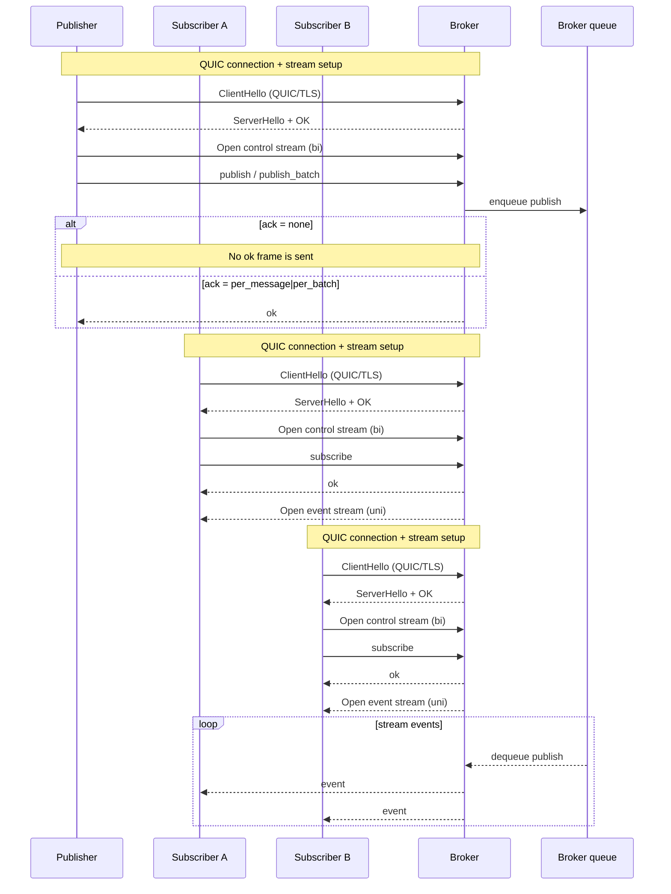
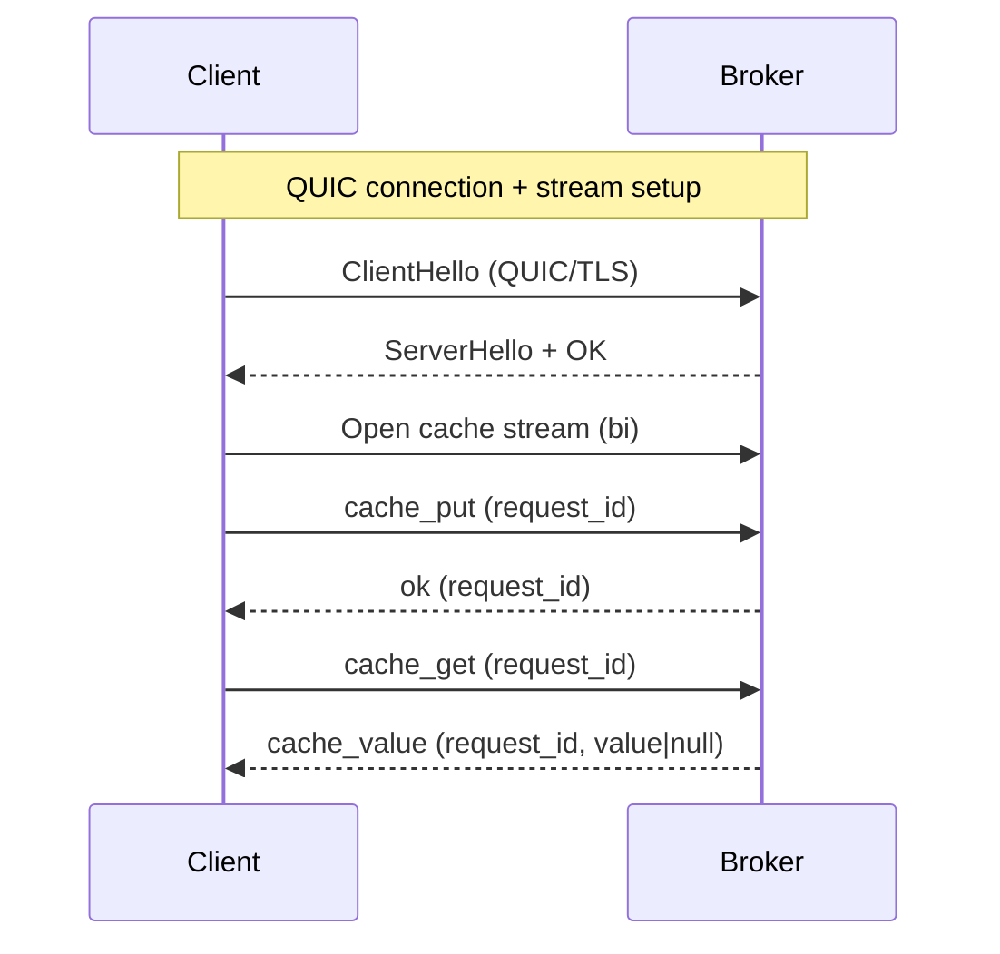
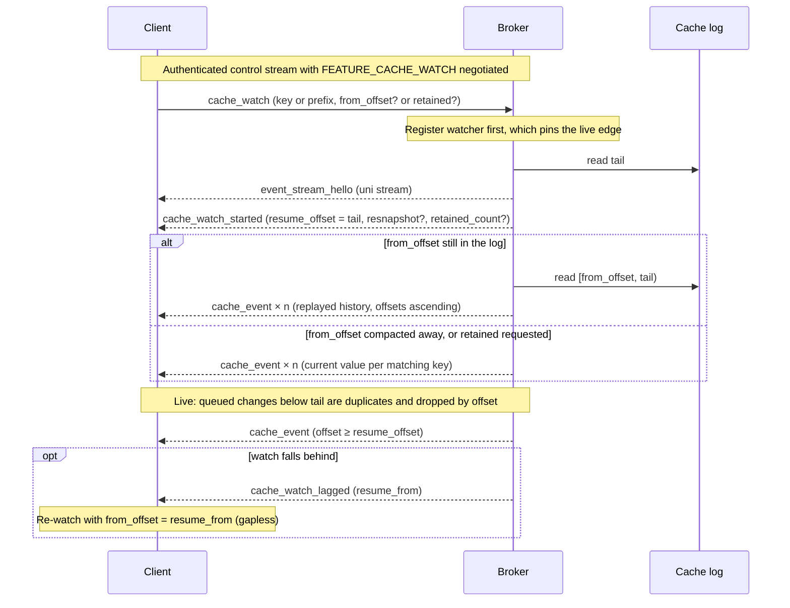

# Felix Wire Protocol (v1)

This document defines the language-neutral wire format for Felix. It is the
source of truth for all client implementations.

> Brokers speak a separate protocol to each other, with its own magic, version
> and message kinds. See [the broker-internal forwarding protocol](internal-protocol.md).

## Goals
- Stable, versioned envelope
- Minimal message set for v1
- No Rust-specific semantics
- Simple framing over QUIC (and future TCP+TLS)

## Transport
- QUIC over TLS 1.3 (IETF QUIC)
- Client-opened bidirectional streams carry request/response traffic: `auth`,
  publishes, cache and counter operations, group polls, and subscribe setup.
  Each stream authenticates on its own with `auth` before any other request.
- Broker-opened unidirectional streams carry events. The broker opens one per
  subscription (and per cache watch), starting with `event_stream_hello`.
- A client MAY also open a unidirectional stream for publish-only traffic. It
  must begin with `auth`, may carry only publishes, and the broker never replies
  on it; anything else closes the stream.
- Browsers cannot open QUIC connections to the broker. They reach it through a
  WebSocket gateway such as [felix-gateway](https://github.com/GetFelix/felix-gateway), which
  holds the Felix connection and a token narrowed to what the browser may use.

Before authentication. Every client stream starts with an `auth`, and until that
succeeds the broker limits what the stream may cost it:

- A frame on an unauthenticated stream may carry at most `preauth_max_frame_bytes`
  (64 KiB by default) of payload. A larger `length` ends the stream on the header
  alone.
- A connection that has authenticated no stream within `auth_timeout_ms`
  (10 s by default) is closed with QUIC application error code `1` and reason
  `authentication timeout`. A client that dials a connection it may not use for a
  while should authenticate a stream on it straight away.
- Connections past `max_client_connections` are refused during the QUIC
  handshake (`CONNECTION_REFUSED`).

Client connection close codes: `0` broker shutting down, `1` authentication
timeout.

## Frame Envelope
All messages are sent in a fixed header + payload frame.

```
 0                   1                   2                   3
 0 1 2 3 4 5 6 7 8 9 0 1 2 3 4 5 6 7 8 9 0 1 2 3 4 5 6 7 8 9 0 1
+---------------------------------------------------------------+
|                          magic (u32)                          |
+-------------------------------+-------------------------------+
|         version (u16)         |          flags (u16)          |
+-------------------------------+-------------------------------+
|                          length (u32)                         |
+---------------------------------------------------------------+
```

Each row above is 32 bits, so the 12-byte header occupies three rows.

| Offset | Size | Field | Type | Value |
| --- | --- | --- | --- | --- |
| 0 | 4 | `magic` | u32 | `0x464C5831` (`"FLX1"`) |
| 4 | 2 | `version` | u16 | `1` |
| 6 | 2 | `flags` | u16 | Bit field; see below |
| 8 | 4 | `length` | u32 | Payload length in bytes |

Field definitions:
- `magic` (u32, big-endian): `0x464C5831` ("FLX1")
- `version` (u16, big-endian): `1`
- `flags` (u16, big-endian): selects the payload layout. `0` means the payload is
  a JSON-encoded `Message`. Defined bits:

  | Bit | Name | Meaning |
  | --- | --- | --- |
  | `0x0001` | `BINARY_PUBLISH_BATCH` | Payload is a binary publish batch |
  | `0x0002` | `BINARY_EVENT_BATCH` | Payload is a binary event batch (legacy, per-subscriber) |
  | `0x0004` | `BINARY_EVENT_BATCH_SHARED` | Payload is a shared binary event batch |
  | `0x0008` | `BINARY_PUBLISH_ACKED` | Modifier on `0x0001`: the batch carries a `request_id` prefix and is owed an ack |
  | `0x0010` | `BINARY_PUBLISH_ACK` | Payload is a binary publish acknowledgement (broker → client) |
  | `0x0020` | `EVENT_BATCH_OFFSETS` | Modifier on `0x0002` or `0x0004`: the batch carries a `base_offset` |
  | `0x0040` | `BINARY_PUBLISH_KEYED` | Modifier on `0x0001`: the batch carries a routing key prefix |
  | `0x0080` | `BINARY_PUBLISH_ACK_OWNER` | Modifier on `0x0010`: the batch was forwarded, and the ack names the shard's owner |
  | `0x0100` | `BINARY_PUBLISH_IDEMPOTENT` | Modifier on `0x0008`: the batch carries an idempotent producer's id and sequence |
  | `0x0200` | `BINARY_PUBLISH_ACK_CODE` | Modifier on `0x0010`: a failed ack carries an error code and retry class |
  | `0x0400` | `BINARY_PUBLISH_ACK_DETAIL` | Modifier on `0x0200`: the code is followed by the error's `detail` (reason, suggested wait) |
  | `0x0800` | `EVENT_BATCH_SKIPPED` | Modifier on `0x0020`: the batch also carries a `skipped_before` count of offsets before it that hold no event |
  | `0x1000` | `BINARY_PUBLISH_ACK_OFFSET` | Modifier on `0x0010`: a successful ack ends with the offset of the batch's first record. Offered by a client, it also lets `publish_ok` carry `offset` |
  | `0x2000` | `EVENT_BATCH_PUBLISHER` | Modifier on `0x0002` or `0x0004`: the batch carries the principal that published its events. See [Event batch publisher](#event-batch-publisher) |
  | `0x4000` | `EVENT_BATCH_TIMESTAMPS` | Modifier on `0x0002` or `0x0004`: each event is preceded by its record's append time. See [Event batch timestamps](#event-batch-timestamps) |

  Because these bits change how the payload is parsed, a receiver MUST reject a
  frame carrying any bit it does not recognise rather than masking it off (see
  Future Compatibility).
- `length` (u32, big-endian): payload length in bytes

Payload:
- With `flags = 0`, the payload is a UTF-8 JSON object encoding a `Message` (see below).
  The binary layouts selected by the flag bits are described in their own sections.
- Encoders MUST NOT exceed `u32::MAX` bytes.

## Message Types (v1)
Message schemas below are the JSON objects carried in a `flags = 0` frame. Byte
fields such as `payload` are base64 strings.

### Publish / PublishBatch (compatibility only)
```
{ "type": "publish", "tenant_id": "<string>", "namespace": "<string>", "stream": "<string>", "payload": "<base64>", "ack": "<none|per_message>" }
{ "type": "publish_batch", "tenant_id": "<string>", "namespace": "<string>", "stream": "<string>", "payloads": ["<base64>", ...], "ack": "<none|per_batch>" }
```

**These are not the data path.** A publish travels as a binary frame (see
[Binary PublishBatch](#binary-publishbatch) and
[Binary keyed PublishBatch](#binary-keyed-publishbatch)), and a routing key has
ridden in that frame since `0x0040`. The JSON forms measured **645.8 MB/s
against 917** for the same keyed workload on the same rig, with user CPU up from
20% to 28%, and they now buy nothing the binary frames do not cover.

They are still accepted, and will be: `ORIGINAL_V1_FLAGS` is frozen, so a client
older than `0x0008` or `0x0040` is entitled to keep sending them and must keep
working. What changed is that **no current Felix client emits one except as a
fallback** it chooses itself, against a broker that did not advertise the frame
it wanted. Brokers count what still arrives on this path as
`felix_broker_json_publishes_total{frame="publish"|"publish_batch"}`, which is
the evidence a deployment would need before this arm could ever be dropped.

`publish_idempotent` is unaffected: it is the form a client sends to a broker
that did not advertise `0x0100`, which carries the producer id and sequence in a
binary frame (see [Binary idempotent PublishBatch](#binary-idempotent-publishbatch)).

### ProducerInit
```
{ "type": "producer_init", "request_id": <u64> }
```
Asks the broker for a producer id. Only sent to a broker that advertised
`FEATURE_IDEMPOTENT_PRODUCER`; see [idempotent producers](#idempotent-producers).

### ProducerInitOk (server -> client)
```
{ "type": "producer_init_ok", "request_id": <u64>, "producer_id": <u64> }
```

### PublishIdempotent
```
{ "type": "publish_idempotent", "tenant_id": "<string>", "namespace": "<string>", "stream": "<string>", "payloads": ["<base64>", ...], "key": "<base64, optional>", "request_id": <u64>, "producer_id": <u64>, "sequence": <u64> }
```
A batch the broker appends once however many times it arrives. Always
acknowledged, with `publish_ok` or `publish_refused`. `sequence` counts this
producer's batches on the shard from zero, one per batch whatever its size.

### PublishIf
```
{ "type": "publish_if", "tenant_id": "<string>", "namespace": "<string>", "stream": "<string>", "payloads": ["<base64>", ...], "key": "<base64, optional>", "expected_offset": <u64>, "request_id": <u64> }
```
A batch appended only if it would start at exactly `expected_offset`, the next
offset of the shard `key` routes to (shard 0 without a key). The check is made
where the broker assigns offsets, under the same lock, so of two `publish_if`
expecting the same offset exactly one is written. Answered with `publish_ok`
carrying the batch's first offset once it is durable (on a majority for a
`Quorum` stream), or `publish_refused` with `offset_mismatch` and nothing
written. Always acknowledged.

A refused batch consumes no offset and holds up no later publish. The tail is
the raw log tail, so it counts the generation-start record a new leader
writes: after a failover a writer's expected offset is stale even with no
rival, and the refusal tells it where to resume. An empty batch and a stream
with no log are refused with `error` (`invalid_request`).

Not forwarded: a broker that does not lead the shard answers `not_leader` to a
client that offered `FEATURE_REDIRECT`, as it does for `commit`. Sent on its
own bidirectional stream, outside the publish pipeline, and only to a broker
that advertised `FEATURE_PUBLISH_CONDITIONAL`. It is a message of its own
rather than a field on `publish_batch` because an older broker ignores unknown
fields and would append unconditionally.

An answer lost in transit cannot be retried blindly: the retry is refused by
the write it repeats. The writer reads the shard at `expected_offset` to learn
whether its batch landed. See [Conditional writes](semantics.md#conditional-writes).

### PublishRefused (server -> client)
```
{ "type": "publish_refused", "request_id": <u64>, "reason": <reason>, "message": "<string>" }
```
Where `reason` is one of `{"sequence_gap": {"expected": <u64>}}`,
`"unknown_producer"`, `"sequence_expired"`, `"sequence_reused"`,
`{"offset_mismatch": {"tail": <u64>}}`, or
`{"not_leader": {"node_id": "<string>", "addr": "<host:port, optional>"}}`.
Sent in answer to a `publish_idempotent`, a `publish_if`, or a `commit` that
carried `expected_offset`. `"sequence_reused"` goes only to a client that
offered `FEATURE_SEQUENCE_REUSED`, and `offset_mismatch` only in answer to a
conditional write. `tail` is the shard's next offset as the broker checked it.

### Subscribe
```
{ "type": "subscribe", "tenant_id": "<string>", "namespace": "<string>", "stream": "<string>", "start": <"latest"|"earliest"|{"offset": <number>}> }
```

`start` is optional. Omitting it means `latest`, which is what every client sent
before the field existed, so an old client and a new broker exchange exactly the
frames they always did.

- `latest`: deliver only what is published from now on.
- `earliest`: the oldest record still retained. Deliberately not "offset 0":
  for a stream whose head has been trimmed, offset 0 is gone, and `earliest`
  means "as far back as you can" rather than an error.
- `{"offset": n}`: resume at exactly offset `n`, the first record the client has
  *not* seen. A client that checkpoints the offset it last handled resumes at
  that offset plus one.

Requesting an offset the broker cannot serve returns `subscribe_cursor_error`
rather than a silent restart at the tail:

```
{ "type": "subscribe_cursor_error", "reason": "<too_old|in_future>", "requested": <number>, "available": <number> }
```

`too_old` means retention has discarded the offset and `available` is the oldest
still retained. `in_future` means the offset is past the end of the stream and
`available` is the current tail. The two have opposite remedies, which is why
they are distinguishable in code rather than only in prose.

The `shard` field selects which shard of the stream to read, defaulting to 0. A
subscription reads **one** shard, so consuming a whole multi-shard stream means
one subscription per shard; `stream_shards` says how many there are.

`queue_capacity` (optional, `u32`) asks for this subscriber's broker-side queue
to hold that many envelopes instead of the stream's default. An envelope is one
published batch, not one record. The broker clamps it to
`1..=FELIX_SUBSCRIBER_QUEUE_CAPACITY_MAX` and answers with the granted value
on `subscribed`. A client sends it only to a broker that advertised
`FEATURE_SUBSCRIBE_QUEUE`, since an older broker ignores the field. There is
no matching field for the overflow policy: under `block` a subscriber's full
queue makes every publisher on the shard wait, so it stays an operator setting
for the stream. A reader that cannot tolerate gaps relies on
`subscription_lagged` and a resume from the log instead.

### Subscribed (server -> client)
```
{ "type": "subscribed", "subscription_id": <number>,
  "start_offset": <u64>?, "live_offset": <u64>?, "queue_capacity": <u32>? }
```

`queue_capacity` is the capacity the broker granted, present only when the
subscribe asked for one, so a subscribe without it gets the frame it always
did.

Confirms a subscription and carries the id the broker assigned it. The same id
opens the event stream that carries its deliveries:

```
{ "type": "event_stream_hello", "subscription_id": <number> }
```

which is the first message on the unidirectional stream the broker opens back,
and is how a client matches an event stream to the subscription that asked for
it.

`start_offset` is the first offset the subscription delivers. `live_offset` is
the stream's tail when the subscriber was registered: anything below it was
already in the stream, anything from it on was written after, and nothing falls
between. It leaves out generation-start records the log ends with (they hold an
offset but never an event, so a reader waiting for the raw tail would wait
forever), but is never below `start_offset`. For `latest` the two are equal. Both are sent on a durable stream to a client
that negotiated `FLAG_EVENT_BATCH_OFFSETS`, and from such a client a subscribe
with no `start` is `latest`, so it reports them too. To any other client the
frame is unchanged.

Because it is `latest`, such a plain subscribe can be refused the way an
explicit `latest` is. On a `Quorum` shard whose readable bound is still
settling after a promotion it is `shard_unavailable` with reason `not_ready`,
and on one that refuses reads it is `fenced`; both are retryable. A client
that sent no offsets flag still takes the tail-only path and is never refused
this way.

A `ClusterSubscription` that loses its connection resubscribes from an exact
offset: the one after the last event it delivered, or, if it delivered
nothing yet, the `start_offset` this frame reported. So an idle plain
subscription resumes without a gap too. It can then fail with a cursor error
(`too_old`) if retention removed that offset while it was disconnected.

### Event (server -> client)
```
{ "type": "event", "tenant_id": "<string>", "namespace": "<string>", "stream": "<string>", "payload": "<base64>", "offset": <number|absent> }
```

`offset` is present for durable streams and absent for in-memory ones, which
have no durable position to checkpoint against.

### ShardMoved (server -> client)
```
{ "type": "shard_moved", "subscription_id": <u64>, "resume_from": <u64|absent>, "node_id": "<string|absent>", "addr": "<string|absent>", "generation": <u64> }
```

The last frame on the event stream of a subscription or cache watch whose shard
this broker stopped serving, because the shard moved. Everything already queued
for the reader is delivered first; the broker finishes the stream after this.
Sent only to a client that offered `FEATURE_SHARD_MOVED`: any other client sees
the stream end after its last event, byte for byte as before. See
[Shard moves](#shard-moves).

### SubscriptionLagged (server -> client)
```
{ "type": "subscription_lagged", "subscription_id": <u64>, "resume_from": <u64> }
```

The last frame on the event stream of a durable-stream subscription whose queue
on the broker dropped records. `resume_from` is the first offset that queue
dropped, or where a resumed subscription's catch-up ended when the drops before
that were filled from disk. Nothing at or above it was sent. Below it, a frame
can still have been dropped after the queue, by the connection writer's queue
for this subscription (`felix_sub_queue_dropped_total`), which ends nothing and
is not reported. So a client resumes after the last event it received, and
from `resume_from` only when it received none; felix-client's
`ClusterSubscription` and `ShardedSubscription` do that. The broker sends it as
soon as the events queued before the drop are written, not when the next
publish arrives, and finishes the stream after it.

Sent only to a client that offered `FEATURE_SUBSCRIPTION_LAGGED` and negotiated
`FLAG_EVENT_BATCH_OFFSETS`. Any other client keeps its subscription after a drop
and sees it only as a jump in offsets on a later event. When the shard also
moved, this frame is sent rather than `shard_moved`, since resuming where the
move says would skip the dropped records.

### CachePut
```
{ "type": "cache_put", "key": "<string>", "value": "<base64>", "ttl_ms": <number|null> }
```

### CacheGet
```
{ "type": "cache_get", "key": "<string>" }
```

### GroupPoll
```
{ "type": "group_poll", "tenant_id": "<string>", "namespace": "<string>",
  "stream": "<string>", "shard": <number>, "group": "<string>",
  "max_records": <number>, "wait_ms": <number>, "request_id": <number>,
  "consumer": "<string>"?, "reclaim": <bool>?, "visibility_ms": <number>? }
```

`consumer` names the member polling, stable across its restarts, and the broker
records the claims it hands out as that member's. A member is the name together
with the principal the connection authenticated as, so one principal's name
never reaches another's claims. A name must be 1 to 128 bytes; anything else is
refused with `invalid_request`.

With `reclaim: true`, the broker reserves for this connection every claim the
member holds from an older connection: the claims a process that restarted left
behind. They go to this connection ahead of everything else, records owed to
the group included, lowest offset first, over as many polls as `max_records`
takes; other members do not get them meanwhile. Each counts as another attempt,
so one at the attempt bound is dead-lettered instead. A reserved claim that
lapses before it is taken back is owed to the whole group, like any lapsed
claim. The reservation is made once per connection: later polls on it that set
`reclaim` again are ordinary polls, as is any `reclaim` from a connection older
than the last one that reclaimed. So a client that always sets it, or two live
processes under one name, cannot keep taking claims still being worked on. Two
live processes under one name are still a mistake: the newer one takes what
the older held when it first reclaimed.

Claims and members live in the shard leader's memory, so after a failover there
is nothing to reclaim: the group resumes from its durable position anyway.

Both fields are optional and left out when unused, so an older broker reads the
request it always did. Only a broker that advertised `FEATURE_GROUP_CONSUMER`
honours them; an older one ignores them, so a client refuses a named poll to it.

Sent only to a broker that advertised `FEATURE_CONSUMER_GROUP`, and only to the
broker that leads the shard.

`wait_ms` is how long the broker may hold the request open waiting for work.
Omitted or `0` answers immediately, which is what a broker that predates
long-polling does with the field, so an older peer degrades to a plain poll
rather than misreading the request. The broker caps it at
`FELIX_GROUP_MAX_WAIT_MS`, so a client cannot hold a stream open indefinitely.
The wait bounds how long the broker looks, not whether it answers: an empty
`group_records` after the wait still means nothing was available.

The broker hands out at most 1,000 records per poll, and stops early once it has
read about 4 MiB of payload, whatever `max_records` asks for. A group also has
at most `FELIX_GROUP_MAX_IN_FLIGHT` records handed out and unsettled on a shard;
a poll at that cap is answered empty (after its wait) until acknowledgements,
hand-backs or lapsed claims free room.

`visibility_ms` is how long this poll's claims stand before the records are
owed to the group again. Omitted or `0` is the broker's
`FELIX_GROUP_VISIBILITY_TIMEOUT_MS`, and the broker caps it at
`FELIX_GROUP_MAX_VISIBILITY_MS`. Only a broker that advertised
`FEATURE_GROUP_CLAIM_CONTROL` honours it. An older one ignores the field and
claims for its own timeout, so a client sends it only after checking the bit.

### GroupRecords (server -> client)
```
{ "type": "group_records",
  "records": [{ "offset": <number>, "payload": "<base64>", "attempts": <number>,
                "skipped_before": <number>?, "publisher": "<principal>"?,
                "timestamp_micros": <number>? }],
  "request_id": <number> }
```

`attempts` counts deliveries including this one, so `1` is a first attempt and
anything higher is a redelivery. Absent means the broker did not report it,
which is not the same as a first attempt, and a consumer should not treat it as
one.

`skipped_before` is how many offsets directly below this record the broker
settled without delivering: generation-start records, which are not a client's,
and records retention removed before the group reached them. A gap in the
offsets a consumer receives that this count covers will never fill, and one it
does not cover is a record still to come. It is sent only to a client that
offered `FEATURE_GROUP_SKIPPED` in `Auth`, and left out when it is `0`, so any
other client gets the frame it always did. A broker that advertises the bit
reports it, so for that client an absent field means `0`.

`publisher` is the principal that published the record, when the broker
stored one (see [Event batch publisher](#event-batch-publisher)). It is sent
only to a client that offered `FEATURE_GROUP_PUBLISHER`, and left out when the
record has none.

`timestamp_micros` is when the record was appended, in microseconds since the
Unix epoch (see [Event batch timestamps](#event-batch-timestamps)). It is sent
only to a client that offered `FEATURE_RECORD_TIMESTAMPS`.

### GroupDeadLetters / GroupDiscard / GroupRedrive
```
{ "type": "group_dead_letters", "tenant_id": "...", "namespace": "...",
  "stream": "...", "shard": <number>, "group": "<string>", "request_id": <number> }
{ "type": "group_discard", ..., "offset": <number>, "request_id": <number> }
{ "type": "group_redrive", ..., "offset": <number>, "request_id": <number> }
```

Sent only to a broker that advertised `FEATURE_GROUP_DEAD_LETTERS`.

### GroupDeadLetterList (server -> client)
```
{ "type": "group_dead_letter_list", "offsets": [<number>], "request_id": <number> }
```

### GroupSeek / GroupDescribe / GroupDelete
```
{ "type": "group_seek", "tenant_id": "...", "namespace": "...", "stream": "...",
  "shard": <number>, "group": "<string>",
  "start": "earliest" | "latest" | { "offset": <number> },
  "if_new": <bool>?, "request_id": <number> }
{ "type": "group_describe", ..., "request_id": <number> }
{ "type": "group_delete", ..., "request_id": <number> }
```

A group's lifecycle on one shard. Sent only to a broker that advertised
`FEATURE_GROUP_ADMIN`, and only to the shard's leader. A stream with several
shards needs one request per shard; nothing cuts across them.

`group_seek` moves the group's cursor, backwards or forwards. `earliest` is the
oldest record the shard still holds, `latest` its committed tail when the seek
lands (held to the quorum mark on a `Quorum` stream, as a poll is), and an
`offset` outside those two is refused with `invalid_request`. With `if_new` the
group is moved only if it does not exist yet: it has no cursor and nothing has
been handed out from it. That is how a group is created somewhere other than
offset 0, and it is safe to send on every start of a consumer. `if_new` is left
out when false. Answered with `group_position`.

A seek voids every claim standing when it lands. The group's in-flight state is
replaced, and the new state takes no settle from a claim made before it: an ack
or nack for an offset at or above the new position is refused with
`stale_claim`, and the record is delivered again from there. One below it is a
duplicate and is taken. A seek keeps the group's dead letters.

`group_describe` is answered with `group_info`. `group_delete` removes the
group's cursor and dead letters and drops its in-flight state, and is answered
with `group_deleted`. A consumer that polls the group again starts it afresh at
offset 0, as with any new group.

`group_seek` and `group_delete` need `group.manage`; `group_describe` needs
`group.consume`, like the dead-letter list. Both writes are made under the
shard's write fence and acknowledged under the same rule as a group ack, and the
cursor and dead-letter logs they write ship with the shard.

### GroupPosition / GroupInfo / GroupDeleted (server -> client)
```
{ "type": "group_position", "offset": <number>, "moved": <bool>, "request_id": <number> }
{ "type": "group_info", "committed": <number>?, "tail": <number>,
  "in_flight": <number>, "owed": <number>, "dead_letters": <number>,
  "request_id": <number> }
{ "type": "group_deleted", "existed": <bool>, "request_id": <number> }
```

`moved` is false when `if_new` found the group already there; `offset` is then
where it stands. In `group_info`, `committed` is left out for a group with no
cursor, `tail` is the shard's committed tail, so `tail - committed` is how far
behind the group is, and `owed` counts records owed again after a nack or a
lapsed claim. `in_flight` and `owed` are the leader's memory: a snapshot that
starts again from zero when the shard changes leader.

### GroupAck / GroupNack
```
{ "type": "group_ack",  "tenant_id": "...", "namespace": "...", "stream": "...",
  "shard": <number>, "group": "<string>", "offset": <number>, "request_id": <number> }
{ "type": "group_nack", ... }
```

An offset at or past the shard's log tail was never handed out and is refused
with `invalid_request`. The group's in-flight state is kept in memory, so
after it is evicted (idle for 10 minutes) or the shard moves or fails over, a
fresh one is built. It takes a settle for any offset below the log tail it
first saw, since a claim made before it could be any of those. An offset
written after that and not yet handed out is refused with `stale_claim`
(`retry`): nothing was applied and the record will be delivered. An offset below the group's position is a harmless
duplicate and answered `ok`.

`group_nack` takes an optional `delay_ms`: the record is owed again only that
many milliseconds from now, rather than at once, so a consumer can back off a
retry without holding the record itself. Until then it keeps its place in
flight, counted against `FELIX_GROUP_MAX_IN_FLIGHT`, and nobody holds it, so it
cannot be extended. The redelivery counts as the next attempt as usual. The
broker caps the delay at `FELIX_GROUP_MAX_VISIBILITY_MS`. Omitted or `0` is at
once, so the frame is the one a nack always was. Only a broker that advertised
`FEATURE_GROUP_CLAIM_CONTROL` honours it; an older one ignores the field and
redelivers at once, so a client sends it only after checking the bit.

`group_nack` also takes an optional `attempts`, naming the delivery being
handed back as `attempts` does on `group_extend`. When it is set, the nack is
refused with `stale_claim` (`fatal`) once that claim no longer stands, for the
same reasons an extension is: otherwise a nack arriving after the record went
out again would take it from whoever holds it now and, with a delay, hold it
back from everyone. A delayed nack is not a claim, so a second nack naming the
same delivery is refused too. Omitted or `0` hands back whatever claim stands,
as a nack always did. Sent only to a broker that advertised
`FEATURE_GROUP_CLAIM_CONTROL`; felix-client sends it with every nack, delayed
or not, and so do the Python and Node bindings. A broker released before the field ignores
it and hands back whatever claim stands, which is no worse than a nack that
leaves it out.

### GroupExtend / GroupExtended
```
{ "type": "group_extend", "tenant_id": "...", "namespace": "...", "stream": "...",
  "shard": <number>, "group": "<string>", "offset": <number>,
  "attempts": <number>, "extend_ms": <number>, "request_id": <number> }
{ "type": "group_extended", "visible_ms": <number>, "request_id": <number> }
```

Keeps a claim standing for `extend_ms` from when the broker takes the request,
for a consumer still working on the record. Sent only to a broker that
advertised `FEATURE_GROUP_CLAIM_CONTROL`. The broker caps `extend_ms` at
`FELIX_GROUP_MAX_VISIBILITY_MS`, and `visible_ms` in the answer is what it
granted. `extend_ms` of `0` is refused with `invalid_request`.

`attempts` is the count the record was delivered with, and names that one
delivery. The extension is refused with `stale_claim` (`fatal`: retrying cannot
bring the claim back) once that claim no longer stands: it lapsed, the record
was handed out again, which counted another attempt, or a seek, failover or
eviction rebuilt the group's in-flight state. Without the check, a consumer
that lost a record could extend the claim of whoever holds it now, and keep it
from the group should that consumer die. A record nacked with a delay is not a
claim and cannot be extended either.

An extension is the leader's memory, like every claim. A failover redelivers the
record from the group's durable position, sooner than the extension said. A
group's in-flight state is not evicted while a claim stands, however long.

### GroupDeadLetter
```
{ "type": "group_dead_letter", "tenant_id": "...", "namespace": "...",
  "stream": "...", "shard": <number>, "group": "<string>", "offset": <number>,
  "request_id": <number> }
```

Gives up on one record for the consumer: the broker lists it as a dead letter of
the group, then finishes it, the same order it uses when a record runs out of
attempts, so a crash between the two leaves it listed and owed rather than
finished without a trace. `group_redrive` puts it back, and `group_discard`
drops it. Answered with `cache_ok`. Sent only to a broker that advertised
`FEATURE_GROUP_CLAIM_CONTROL`.

Like an ack, it is taken for any record the group has in play, whoever holds
the claim. A record already finished is refused with `invalid_request` and not
listed. An offset never handed out, or one from before a seek that the group
now owes, is refused as for an ack.

`group_extend`, `group_dead_letter` and a delayed `group_nack` need
`group.consume`, like an ack.

### CacheDelete
```
{ "type": "cache_delete", "tenant_id": "<string>", "namespace": "<string>",
  "cache": "<string>", "key": "<string>", "request_id": <u64|absent> }
```

Sent only to a broker that advertised `FEATURE_CACHE_DELETE`.

Answered with `cache_value` carrying the value that was removed, or a null value
if the key was not there, so a caller can tell a delete that did something from
one that did not.

### CachePutIf
```
{ "type": "cache_put_if", "tenant_id": "<string>", "namespace": "<string>",
  "cache": "<string>", "key": "<string>", "value": "<base64>",
  "ttl_ms": <u64|absent>, "condition": "absent" | { "version": <u64> },
  "request_id": <u64> }
```

Sent only to a broker that advertised `FEATURE_CACHE_CONDITIONAL`. Stores the
value only if the key's current entry meets `condition`: `"absent"` means the
key has no live entry (never written, deleted, or expired), and `{"version": n}`
means its live entry has version `n`. Answered with `cache_condition_result`.

The check and the write are one step on the key's owner: no other write to the
key lands between them. A write already accepted for the key but not yet
durable is waited for before the condition is checked, so two racing
`"absent"` puts cannot both apply. The answer waits on the same durability and
quorum as a plain `cache_put`, applied or not.

A key's version is the log offset of the put that wrote its value. It is
unique within the shard, only grows, and is kept when compaction moves the
value, so the same version read twice means nothing was written in between.
It says nothing about order across shards. A broker with no durable storage
keeps its cache in memory and has no log; there a version is a counter that
starts each run at the wall-clock time in microseconds, so a version read
before a restart does not match a value written after it.

This is a new request rather than a field on `cache_put` because a broker that
predates it ignores unknown fields, and would make the write unconditionally
and report success.

### CacheDeleteIf
```
{ "type": "cache_delete_if", "tenant_id": "<string>", "namespace": "<string>",
  "cache": "<string>", "key": "<string>", "version": <u64>, "request_id": <u64> }
```

Sent only to a broker that advertised `FEATURE_CACHE_CONDITIONAL`. Removes the
key only if its live entry has `version`, checked as `cache_put_if` checks.
Answered with `cache_condition_result`. This is how a lease holder releases a
lease without removing one someone else has since taken.

### CacheConditionResult (server -> client)
```
{ "type": "cache_condition_result", "applied": <bool>,
  "version": <u64|absent>, "request_id": <u64> }
```

`applied` says whether the write was made; a refusal is an answer, not an
error. After an applied `cache_put_if`, `version` is the version it wrote.
Otherwise it is the key's current version, and absent when the key has no live
entry (including after an applied `cache_delete_if`).

A broker that cannot route the request answers `error` as for any cache
request. A conditional write is never retried for the client after an
indeterminate forward: a retry of a put that applied would be refused by the
version it wrote.

### CacheWatch
```
{ "type": "cache_watch", "tenant_id": "<string>", "namespace": "<string>",
  "cache": "<string>", "key": "<string>|absent", "prefix": "<string>|absent",
  "shard": <u32|absent>, "from_offset": <u64|absent>,
  "retained": <bool|absent>, "subscription_id": <u64|absent> }
```

Sent only to a broker that advertised `FEATURE_CACHE_WATCH`. Subscribes to
changes for one cache key (`key`) or key prefix (`prefix`). Exactly one of the
two must be present; both or neither is refused rather than guessed at. An
empty `prefix` is every key in the shard.

A watch reads **one** shard, exactly as a stream subscription does. A `key`
watch resolves its own shard by hashing (the same resolution a `cache_get`
uses) and ignores `shard`. A `prefix` watch reads `shard`, because keys
sharing a prefix hash to different shards; a whole multi-shard cache is one
watch per shard. Absent means 0 on a single-shard cache and is refused with an
`Error` on a multi-shard one: reading shard 0 there would cover only the keys
that hash to it while looking like a complete prefix watch. `cache_shards` says
how many shards to watch.

`from_offset` is where to resume: the first change the client has *not* seen,
so a client checkpoints the offset it last handled plus one. Absent means from
now: live changes only. An offset past the tail is refused with
`subscribe_cursor_error` rather than silently reinterpreted. Watches are served
by the shard's owner and redirected (`not_leader`) elsewhere, like subscribes.

`retained` asks for current state first: each matching key's current value
(MQTT's retained message), then live changes. Sent only to a broker that
advertised `FEATURE_CACHE_WATCH_RETAINED`: an older watch-capable broker would
ignore the unknown field and serve a live-only watch, the client silently
missing exactly the state it joined for. Refused alongside `from_offset`:
the replay already reconstructs the state a retained start shortcuts, and
serving both would hand over every value twice.

### CacheWatchStarted (server -> client)
```
{ "type": "cache_watch_started", "subscription_id": <u64>,
  "resume_offset": <u64>, "resnapshot": <bool|absent>,
  "retained_count": <u64|absent> }
```

Confirms the watch. The same `subscription_id` arrives in the
`event_stream_hello` that opens the unidirectional stream carrying the watch's
changes. The binding is identical to a stream subscription's.

`resume_offset` is the offset live delivery begins at: every change at or past
it is delivered, and everything before it was covered by the replay or the
snapshot. `resnapshot` (absent means false) is true when `from_offset` named
history that compaction has already collapsed; the watch then begins with each
matching key's **current value** instead of the collapsed history. This is the same
snapshot-plus-changes contract the control plane's assignment watch uses, and
never a silent gap.

`retained_count` is how many retained values follow before live delivery, and
is present exactly when the watch asked for retained delivery. `0` is the
defined "no retained value" answer: joining an empty key is an answer, not a
silence indistinguishable from a slow key. Once this many changes have
arrived, the client holds the current state. A key whose newest write raced
past `resume_offset` during establishment can be absent from the retained set;
its change is already queued and arrives as the first live event, folding to
the same state.

### CacheEvent (server -> client)
```
{ "type": "cache_event", "key": "<string>", "value": "<base64|absent>",
  "offset": <u64>, "expires_at_millis": <u64|absent> }
```

One change on the watch's event stream. An absent `value` means the key was
deleted. `offset` is the change's cache-log offset, the resume anchor.
`expires_at_millis` is absolute Unix milliseconds, `0` or absent meaning never.

Offsets on a filtered watch are naturally sparse (other keys' changes consume
them), so a gap between consecutive offsets is **not** a drop signal here, the
way it is for a stream subscription. `cache_watch_lagged` is.

### CacheWatchLagged (server -> client)
```
{ "type": "cache_watch_lagged", "resume_from": <u64> }
```

The watch fell behind and its queue dropped changes; the broker delivers
everything already queued, sends this, and finishes the event stream.
`resume_from` is the offset of the first missed change: re-watching with
`from_offset = resume_from` is gapless. Loss is loud by construction, because
sparse offsets would otherwise hide it.

### CounterAdd
```
{ "type": "counter_add", "tenant_id": "<string>", "namespace": "<string>",
  "cache": "<string>", "key": "<string>", "delta": <i64>, "request_id": <u64> }
```

Sent only to a broker that advertised `FEATURE_COUNTERS`. Applies a signed
delta (negative to subtract) and is answered with `counter_value` carrying
the sum *including* this delta, so incrementing and learning where you stand
is one round trip.

A counter is scoped exactly as a cache key is: the same registered cache
scope, the same key-to-shard hash, the same owner, the same forwarding from a
non-owner. It lives beside the cache, not in it: a counter and a cache value
may share a key and are unrelated, and a cache watch does not see counter
changes.

**Delivery is at least once.** A client that retries an add after a lost
acknowledgement counts twice: deltas carry no dedupe identity. An application
that cannot tolerate a double-count keeps its own idempotency key outside the
counter. See `docs/projections.md` for the decision.

### CounterGet
```
{ "type": "counter_get", "tenant_id": "<string>", "namespace": "<string>",
  "cache": "<string>", "key": "<string>", "request_id": <u64> }
```

Answered with `counter_value`.

### CounterValue (server -> client)
```
{ "type": "counter_value", "value": <i64|absent>, "request_id": <u64> }
```

An absent `value` means the counter has never been written, a different
answer from a sum of zero, exactly as a cache miss differs from a stored
empty value.

### Commit
```
{ "type": "commit", "tenant_id": "<string>", "namespace": "<string>",
  "stream": "<string>", "entity_key": "<base64>", "event": "<base64>",
  "changes": [ { "op": "put", "key": "<string>", "value": "<base64>" },
               { "op": "delete", "key": "<string>" } ],
  "request_id": <u64>, "expected_offset": <u64, optional> }
```

Appends `event` and applies `changes` to the shard of `stream` that
`entity_key` routes to, as one record. Every reader sees all of it or none of
it. Answered with `commit_ok`, or with `error`; a broker that does not lead
the shard answers `not_leader` to a client that offered `FEATURE_REDIRECT`,
and never forwards a commit. A cluster member refuses one until the fleet has
finalized `atomic_commit`. Sent only to a broker that advertised
`FEATURE_ATOMIC_COMMIT`. Semantics in [`atomic-commit.md`](atomic-commit.md).

`expected_offset` makes the commit conditional, the same check `publish_if`
makes: it is written only if it would land at exactly that offset, so nothing
was appended to the shard since the writer saw its tail. Refused, it is
answered with `publish_refused` and `offset_mismatch`, and neither its event
nor its state is written. The check is on the whole shard, not on the keys the
commit writes. Sent only to a broker that advertised
`FEATURE_PUBLISH_CONDITIONAL`: an older one ignores the field and would commit
unconditionally. Absent, the frame is the one every client sent before.

### CommitOk (server -> client)
```
{ "type": "commit_ok", "request_id": <u64>, "offset": <u64> }
```

The commit is durable, on a majority for a `Quorum` stream. `offset` is where
its event is read and the version of every key it wrote.

### StateGet
```
{ "type": "state_get", "tenant_id": "<string>", "namespace": "<string>",
  "stream": "<string>", "entity_key": "<base64>", "key": "<string>",
  "request_id": <u64> }
```

Reads `key` in the state of the shard `entity_key` routes to. Answered with
`state_value`. Sent only to a broker that advertised `FEATURE_ATOMIC_COMMIT`.

### StateValue (server -> client)
```
{ "type": "state_value", "value": "<base64>|null", "version": <u64|absent>,
  "as_of": <u64|absent>, "request_id": <u64> }
```

`version` is the offset of the commit that wrote `value`. `as_of` is the
offset of the last commit the answer reflects: every commit at or below it,
and none after. A null `value` is a key never written or deleted.

### OffsetForTime
```
{ "type": "offset_for_time", "tenant_id": "<string>", "namespace": "<string>",
  "stream": "<string>", "shard": <u32>, "at_micros": <u64>, "request_id": <u64> }
```

Asks for the first offset on one shard of a durable stream whose record was
appended at or after `at_micros` (microseconds since the Unix epoch). Answered
with `offset_value`. Needs `stream.subscribe`, since the answer is a place to
subscribe from. Only the shard's leader answers; any other broker answers
`not_leader` to a client that offered `FEATURE_REDIRECT`, and an error
otherwise. An in-memory stream stores no times and is answered with an error.
Sent only to a broker that advertised `FEATURE_RECORD_TIMESTAMPS`.

The broker binary-searches the shard's append times below the point a
subscriber may read to, the committed mark on a `Quorum` stream. That assumes
times rise with the offset. They are the leading broker's clock at append, so
if that clock steps back, or a new leader's clock is behind the old one's, the
answer is near the first such record rather than exactly it. Kafka's
`ListOffsets` by time has the same caveat, and the Kafka listener uses the same
search.

### OffsetValue (server -> client)
```
{ "type": "offset_value", "offset": <u64|absent>, "request_id": <u64> }
```

`offset` is left out when no readable record is that recent: subscribe at
`latest` to wait for one. A time older than every record the shard still holds
answers with the oldest.

### StreamRead
```
{ "type": "stream_read", "tenant_id": "<string>", "namespace": "<string>",
  "stream": "<string>", "shard": <u32>, "from": <u64>, "end": <u64>?,
  "max_records": <u32>?, "max_bytes": <u64>?, "request_id": <u64> }
```

Reads one page of a durable stream shard's records, from `from` and stopping
before `end`, and answers with `stream_records`. Unlike `subscribe`, it
registers no subscriber and never runs on into live delivery, so it suits
loading a known slice of history: a match's events up to a snapshot offset, a
page in a UI, a single record at a known offset. A longer range is read page by
page, each one from the last answer's `next_offset`.

- `end` left out lets the page run to the committed tail.
- `max_records` and `max_bytes` left out, or `0`, take the broker's caps. The
  broker caps both anyway: records at `FELIX_DURABLE_MAX_RECORDS_PER_READ`,
  payload at 4 MiB. A single record larger than the byte budget still comes
  back, alone.
- The page holds only records that will stay: on a `Quorum` stream nothing at
  or past the committed mark, and under `FsyncMode::OnCommit` nothing not yet
  synced. It never waits for more. A page that reaches that point comes back
  short or empty, and asking again later from `next_offset` picks up what has
  been committed since.
- `from` below the oldest retained offset is answered with
  `subscribe_cursor_error` and `too_old`, and `from` past the shard's tail with
  `in_future`, the same as a subscribe. `end` at or below `from` is an empty
  page.

Needs `stream.subscribe` on the stream, since it reads what a subscription
would. Only the shard's leader answers; any other broker answers `not_leader`
to a client that offered `FEATURE_REDIRECT`, and an error otherwise. An
in-memory stream has no log to read and is answered with an error. Sent only
to a broker that advertised `FEATURE_STREAM_READ`.

### StreamRecords (server -> client)
```
{ "type": "stream_records",
  "records": [{ "offset": <u64>, "payload": "<base64>",
                "publisher": "<principal>"?, "timestamp_micros": <u64> }],
  "next_offset": <u64>, "request_id": <u64> }
```

Records come in offset order. `next_offset` is where the next page starts. It
is not always the last record's offset plus one: offsets that hold no record a
client is given, such as a leader's generation-start records, are passed over.
Once it reaches `end`, the range is done. An empty page with `next_offset`
unchanged means nothing committed lies there yet.

`publisher` is the principal that published the record, when the broker
recorded one (see [Event batch publisher](#event-batch-publisher)).
`timestamp_micros` is when it was appended (see
[Event batch timestamps](#event-batch-timestamps)). Both are sent to every
client that reads, since the message is new.

### StreamShards
```
{ "type": "stream_shards", "tenant_id": "<string>", "namespace": "<string>",
  "stream": "<string>", "request_id": <u64> }
```

Sent only to a broker that advertised `FEATURE_STREAM_SHARDS`.

A subscription reads one shard, so a client consuming a whole stream needs to
know how many there are; nothing else on the wire says. Scoped to the client's
own tenant, and answered from the broker's routing snapshot, so it can be stale
in exactly the way any routing answer can.

### StreamShardsView (server -> client)
```
{ "type": "stream_shards_view", "shards": <u32>, "request_id": <u64>,
  "routing": "jump_hash" }
```

`0` means this broker knows nothing of that stream, which is **not** the same as
one shard. A client that rounded it up would read shard 0 and call it the
stream.

`routing` says how the stream maps routing keys to shards: `modulo` or
`jump_hash`, computed by `felix_wire::routing::shard_for_routing`. It is sent
only for a `jump_hash` stream; absent means `modulo`, so a modulo stream's
answer is byte-identical to what a broker sent before the field existed. A
client that routes keyed publishes itself must use it, or it computes a
different shard than the broker does.

### CacheShards
```
{ "type": "cache_shards", "tenant_id": "<string>", "namespace": "<string>",
  "cache": "<string>", "request_id": <u64> }
```

Sent only to a broker that advertised `FEATURE_CACHE_SHARDS`.

How many shards a cache has, so a client knows how many prefix watches to
open. It's a separate request rather than a field on `stream_shards` because
an older broker would ignore the field and answer for a stream with the same
name. Scoped to the client's tenant and answered from the routing snapshot.

### CacheShardsView (server -> client)
```
{ "type": "cache_shards_view", "shards": <u32>, "request_id": <u64> }
```

`0` means the broker doesn't know the cache. A registered cache that hasn't
been placed yet counts as one shard, as it does for `cache_watch`.

### ShardOwners
```
{ "type": "shard_owners", "tenant_id": "<string>", "namespace": "<string>",
  "name": "<string>", "kind": "stream|cache", "request_id": <u64> }
```

Sent only to a broker that advertised `FEATURE_SHARD_OWNERS`.

Which broker owns each shard of a stream or cache. Without it a client learns
an owner only by sending something to the shard and being redirected or
forwarded. `kind` is required because a stream and a cache may share a name.
Scoped to the client's tenant and answered from the routing snapshot, the same
one `stream_shards` and `cache_shards` read, so the shard counts agree.

### ShardOwnersView (server -> client)
```
{ "type": "shard_owners_view", "request_id": <u64>,
  "owners": [ { "shard": <u32>, "node_id": "<string>", "addr": "host:port",
                "generation": <u64>, "unavailable": "<reason>" } ] }
```

One entry per shard, in shard order. Empty means the broker knows nothing of
the name. Each entry is what a request for that shard would be dispatched to:

- An owned shard has `node_id`, `generation`, and `addr` when the cluster has
  been told where clients reach that broker.
- A shard nobody can serve right now has no `node_id` and gives the
  `shard_unavailable` reason in `unavailable` (`not_assigned`,
  `owner_unavailable`, `not_ready`, `moving`, ...).
- A broker not in a cluster answers one shard with no `node_id` and
  `generation` 0: it serves everything itself.

Absent fields are left out rather than sent as `null`.

### ShardInspect
```
{ "type": "shard_inspect", "tenant_id": "<string>", "namespace": "<string>",
  "name": "<string>", "kind": "stream|cache", "shard": <u32>,
  "request_id": <u64> }
```

Sent only to a broker that advertised `FEATURE_INSPECT` in its extended
feature word.

An operator's question: this broker's own view of one shard. It needs
`node.view:cluster:*` and nothing else. Only a grant spelled exactly
`cluster:*` counts; a wildcard such as `node.view:*` does not, so no grant a
tenant admin can write reaches it. The request may name any tenant, because
the cluster scope is no tenant's. A token without the grant gets
`error` with code `forbidden` and the stream stays open.

The broker answers from snapshots its shard lifecycle and replication driver
publish. It never forwards the request, never opens a log that is not open
already, and never changes anything. To see a shard from several brokers, ask
each of them.

### ShardInspectInfo (server -> client)
```
{ "type": "shard_inspect_info", "request_id": <u64>,
  "view": {
    "node_id": "<string>", "shards": <u32>,
    "role": "leader|follower|none", "phase": "<phase>", "serving": <bool>,
    "reason": "<reason>", "detail": "<sentence>", "generation": <u64>,
    "assignment": { "generation": <u64>, "leader": "<node>",
                    "replicas": ["<node>"], "draining": true,
                    "successor": "<node>" },
    "fence": { "took": ["<node>"], "pending": ["<node>"], "attempts": <u32>,
               "retry_in_ms": <u64> },
    "lease": { "held": <bool>, "remaining_ms": <u64> },
    "tail": <u64>, "committed": <u64>, "accepted_generation": <u64>,
    "replicas": [ { "node_id": "<node>", "role": "follower|learner",
                    "next_offset": <u64>, "lag": <u64>, "fence": <bool>,
                    "state": "<state>", "halted": "<reason>" } ] } }
```

Every field after `serving` is left out when it does not apply. The words are
strings rather than a closed set, so a later broker can add one without an
older reader failing to decode the answer.

- `shards` is how many shards the stream or cache has by this broker's
  routing, `0` when it knows nothing of it. A client inspecting a whole
  stream asks shard 0 first and learns the count from it.
- `role` is this broker's place in the assignment its routing holds.
  `phase` is its shard lifecycle phase: `unassigned`, `opening`, `fencing`,
  `active`, `draining`, `closed` or `failed`.
- `serving` is false with a `reason` whenever this broker does not take writes
  for the shard: `not_assigned_here` (another broker leads it), `opening`,
  `fencing`, `failed` (`detail` carries the error the open hit), `draining`,
  `lease_lapsed`, or `behind_generation` (it serves an older generation than
  the assignment names).
- `fence` is present while a promoted leader waits for its replicas to take
  its generation: who took it in the latest attempt, who has not, how many
  attempts in a row left the shard closed, and when the next one starts.
- `committed` is a leader's commit mark: every record below it is held by a
  majority. Only the leader of a `Quorum` shard has one.
- `tail` and `accepted_generation` come from this broker's copy of the log,
  and only when that log is open here.
- `replicas` is a leader's view of every other replica: the next offset it
  ships, how far behind the tail that is, and `state`, one of `shipping`,
  `stalled`, `copying` (a move's destination), `rebuilding`, `halted` (with the
  reason, as `/replication/halted` names it) or `fencing`. A follower answers
  with none.

The answer is bounded by the shard's replica set. A broker not in a cluster
answers `role` `leader` and `phase` `active` for a stream or cache it holds,
with no generation, assignment or replicas.

### SubscriptionsList
```
{ "type": "subscriptions_list", "request_id": <u64>,
  "filter": { "tenant_id": "<string>", "namespace": "<string>",
              "stream": "<string>", "shard": <u32>,
              "principal": "<string>", "dropping": true },
  "limit": <u32>,
  "cursor": { "tenant_id": "<string>", "namespace": "<string>",
              "stream": "<string>", "shard": <u32>, "subscriber_id": <u64> } }
```

Sent only to a broker that advertised `FEATURE_INSPECT`. Same permission as
`shard_inspect`: `node.view:cluster:*`, exactly, and a token without it gets
`error` with code `forbidden` while the stream stays open. The answer names
principals and client addresses across every tenant, which is why a tenant
grant does not reach it.

An operator's question: one page of the subscriptions this broker serves.
Every filter field is optional and each one set narrows the list. `principal`
matches the `sub` of the token the subscribing connection authenticated with;
`dropping` keeps only subscriptions whose queue has dropped records. `filter`
may be left out entirely.

`limit` defaults to 100 and is capped at 1000. Subscriptions are listed by
shard (tenant, namespace, stream, shard) and then by subscriber id. `cursor`
is the `next_cursor` of the previous page, and the next page starts after it.
A subscriber id is never reused within a shard, so a subscriber that leaves or
joins between pages neither repeats nor shifts what follows.

The broker answers from each shard's fanout snapshot, the list a publish
already reads without a lock. It never forwards the request and never touches
a subscriber's queue.

### SubscriptionsListInfo (server -> client)
```
{ "type": "subscriptions_list_info", "request_id": <u64>,
  "node_id": "<string>",
  "subscriptions": [
    { "tenant_id": "<string>", "namespace": "<string>", "stream": "<string>",
      "shard": <u32>, "subscriber_id": <u64>, "subscription_id": <u64>,
      "connection": <u64>, "peer": "<ip:port>", "principal": "<string>",
      "policy": "block|drop_new|drop_old", "depth": <u64>, "capacity": <u64>,
      "dropped": <u64>, "position": <u64>, "tail": <u64>, "age_ms": <u64> } ],
  "next_cursor": { ... } }
```

- `node_id` is the answering broker, empty outside a cluster.
- `subscriber_id` is the shard's own id for the subscriber.
  `subscription_id` is the id the client sees on its `event_stream_hello`.
- `connection` is the broker's id for the QUIC connection, `peer` its remote
  address, and `principal` the token's `sub`. All three are left out for a
  subscriber with no client connection, and for a moment while a new one is
  set up.
- `policy` is the stream's overflow policy. `depth` and `capacity` count
  batches in the subscriber's queue, not records. With `drop_new` or
  `drop_old`, a publish that finds the queue full drops that batch for this
  subscriber only.
- `dropped` counts records dropped since the subscription started.
- `position` is one past the last offset taken from the queue to be written
  to the client. It is left out on a stream without offsets (in memory), and
  until the first live batch after a replay. `tail` is the shard's next
  offset, so `tail - position` is how far behind the subscriber is.
- `next_cursor` is left out on the last page.


### CacheValue (server -> client)
```
{ "type": "cache_value", "key": "<string>", "value": "<base64|null>",
  "version": <u64|absent> }
```

`version` is the value's version, for a `cache_put_if` or `cache_delete_if` to
compare against. It is sent only on a get's answer, only on a hit, and only to
a client that offered `FEATURE_CACHE_CONDITIONAL`, so any other client's frame
is byte-identical to the one it always got. A broker forwarding the get to an
owner that predates versions answers without one.

### Ok
```
{ "type": "ok" }
```

### Error
```
{ "type": "error", "message": "<string>",
  "code": "<error code>", "retry": "<retry class>",
  "detail": { "reason": "<string>", "retry_after_ms": <u64> } }
```

A request failed. `message` is prose for people. `code`, `retry` and `detail`
are sent only to a client that offered `FEATURE_ERROR_CODES`; without them the
frame is byte-identical to the one a broker that predates codes sends. Every
field of `detail` is optional. See [Error codes](#error-codes).

`publish_error` carries the same three optional fields next to its
`request_id` and `message`, under the same negotiation.

## Semantics (v1)
- Subscribe starts at the tail unless `start` asks otherwise; a durable stream
  can be replayed from any retained offset. History read from disk joins live
  delivery with no gap and no duplicate; see
  [durable storage](durable-storage.md#resuming-a-subscription).
- A subscription has no end: replay runs on into live delivery. To read a
  bounded range and stop, use [`stream_read`](#streamread).
- Publish returns `ok` when accepted by the broker unless `ack` is `none`.
- PublishBatch returns `ok` once for the batch unless `ack` is `none`.
- A stream may carry several acked publishes before any is answered. Answers
  come back in completion order, matched by `request_id`, unless the client
  negotiated [pipelining](#pipelined-publishes), in which case they come back
  in the order the stream carried the publishes.
- CachePut returns `ok` when stored (TTL is optional).
- CacheGet returns `cache_value` with `null` when missing/expired.
- CacheDelete returns `cache_value` carrying whatever was removed, and `null`
  when the key was not there. Removing a key that does not exist is an answer,
  not an error.
- CachePutIf and CacheDeleteIf return `cache_condition_result`: whether the
  write was made, and the version that answers it. The condition check and the
  write are atomic per key.
- CacheWatch delivers each applied write for its key or prefix (a put with its
  value, a delete as a change with none) in the cache shard's write order,
  each carrying its log offset. Resume by offset replays `[from_offset, tail)`
  from the cache's log before live delivery, joined without a gap or a
  duplicate by the same register-before-read discipline a stream resume uses. A
  resume whose history compaction collapsed is answered with `resnapshot: true`
  and current values; a watch that falls behind is ended with
  `cache_watch_lagged` naming the offset to re-watch from. TTL expiry is a
  change: the shard's leader writes a delete for an entry after its TTL passes,
  and watchers receive it as a delete. The leader's expiry pass runs once a
  second and writes at most 1024 deletes per shard per pass, so under a mass
  expiry the deletes lag. An expiry is permanent once written, even if the
  leader's clock had jumped forward.
- A `retained` CacheWatch delivers current state first: each matching key's
  current value at the offset of the write that produced it, then live changes
  from `resume_offset`, so a client joins and immediately holds the state
  without waiting for the next write. `retained_count` in the confirmation
  bounds the state phase, `0` meaning the key or prefix held nothing, which is
  an answer rather than a silence. The join is gapless and unambiguous: the
  same register-before-read discipline as a resume, with duplicates detectable
  by offset.
- CounterAdd folds a signed delta into a durable running sum and answers with
  the sum including it; CounterGet reads the current one, with never-written
  distinct from zero. The sum survives restart, compaction (which collapses
  applied deltas into a checkpoint without renumbering the log), and leader
  failover (the counter log replicates beside its cache shard). At-least-once:
  a retried add double-counts, stated where the semantics are.
- GroupPoll returns `group_records`, which may be empty: nothing was available
  is an answer, not an error. Each record is claimed until the broker's
  visibility timeout lapses, after which it is handed to whoever polls next.
- GroupAck and GroupNack return `cache_ok`. An ack finishes a record; a nack
  hands it back for immediate redelivery rather than after the timeout.
- **Only the broker leading a shard serves its groups.** Any other refuses with
  `error` rather than an empty batch, because the claim and the acknowledgement
  have to reach the same in-flight state; two brokers each keeping their own
  would hand out the same records.
- Backpressure: v1 is best-effort; subscribers may miss events if they fall
  behind. With event offsets negotiated a client can *detect* that loss: a gap
  between consecutive delivered offsets is a drop unless the batch's
  `skipped_before` (bit `0x0800`, see Event batch offsets) accounts for it. A
  client that did not negotiate `0x0800` also sees a gap at every
  generation-start record, which is not a drop.

### Idempotent producers

A publish whose acknowledgement never arrived is ambiguous: the record may be
on the broker, and re-sending it would land it twice. `publish_idempotent`
removes the ambiguity. A producer takes an id from the broker
(`producer_init`), numbers its batches on each shard from zero, and sends the
number with each batch. The shard's leader knows, per producer, the next
sequence it expects and where the last 64 it appended landed:

| The batch's sequence is | The leader |
| --- | --- |
| the next expected | appends it, remembers it, answers `publish_ok` |
| one it remembers, with the same payloads | answers `publish_ok` and appends nothing: the same answer the first send got, including the `Quorum` wait on the same offsets |
| one it remembers, with different payloads | refuses with `sequence_reused` and appends nothing, for a client that offered `FEATURE_SEQUENCE_REUSED`; any other client gets `publish_ok` as for a re-send, and the batch is not written |
| past the next expected | refuses with `sequence_gap` naming the expected one; what was skipped is not here, and continuing would leave a hole the producer believes is filled |
| older than it remembers | refuses with `sequence_expired`; whether it was appended cannot be told |
| from a producer it does not know, and not zero | refuses with `unknown_producer`; there is nothing to check against, and the producer must start again under a new id |
| the rest of a batch it holds only the start of | appends the records it is missing, and answers with the whole batch's offsets; a batch whose start differs from what it holds is refused with `sequence_reused`, as above |

So a producer re-sends a batch it got no answer for under the *same* sequence,
never sends a different batch under that sequence, advances only on
`publish_ok`, and stops on any refusal but `not_leader`.

**A reused sequence is caught by a payload digest.** The leader keeps, with
each batch it remembers, a CRC-64 digest of the batch's payloads (on a durable
stream it is derived from the log, so it survives a restart and a failover;
see `docs/storage-format.md`). A batch under a remembered sequence whose
digest differs is not a re-send. A client that offered `FEATURE_SEQUENCE_REUSED`
is refused with `sequence_reused`; the Rust client offers it and surfaces the
refusal as `PublishRefused` with `PublishRefusalReason::SequenceReused`. A
client that did not offer it cannot decode the reason, so it gets what it always
got: `publish_ok`, and the batch is silently not written. That gap is why a
client must never reuse a sequence whose outcome it does not know. A batch held
without a digest, known only from a producer snapshot written before digests
were kept, is treated as matching. The Kafka listener does not check digests:
Kafka answers a duplicate sequence by its numbers alone and has no error for
"same sequence, different records".

**Only the leader takes them.** A `publish_idempotent` that arrives at a broker
that does not lead the shard is refused with `not_leader`, naming the leader
and where clients reach it, rather than forwarded: forwarded, one batch could
reach the leader from two ingress brokers with nothing to tell the second
from the first. A client sends it to the broker named.

**On a durable stream the sequences are in the log.** Each record of a
producer's batch is stored with the producer id and sequence, and replicated
with them, and a broker derives every producer's place from its own log. So a
leader promoted after a failover, the destination of a planned move, and a
leader that restarted all answer a re-send the way the leader that took it
would have, and the producer carries on. A batch whose leader stopped partway
through it is finished by the re-send rather than written twice.

A producer is known while any of its batches is in the log. One whose batches
retention has removed entirely is forgotten, as is the one whose newest batch
is oldest once a shard has more than 4096, and either answers
`unknown_producer`. After a leader change that now means the producer's history
is gone, not that the leader changed; whether the batch in flight landed cannot
be told, so the client reports it rather than starting again by itself.

**On an in-memory stream the sequences live in the leader's memory**, and a
new leader answers `unknown_producer`: such a stream loses its records with its
leader too.

The id is 64 random bits, chosen by the broker, so producers from different
brokers and across a restart cannot collide with each other's sequences.

### Pipelined publishes

A client that offers `FEATURE_PUBLISH_PIPELINE` in `auth` may be granted a
publish window, answered in `auth_ok`:

```json
{"type":"auth_ok","server_flags":2047,"server_features":196132,"publish_window":256}
```

The grant is two promises about every acked publish on that connection
(`publish` or `publish_batch` with a `request_id` and an ack, any binary frame
with `FLAG_BINARY_PUBLISH_ACKED`, and every `publish_idempotent`):

- **Answers keep request order per stream.** The broker holds an answer back
  until every publish the stream carried before it has been answered. Nothing
  else changes: each publish gets the answer it would have got, only later.
  Other responses on the stream (`cache_value`, `subscribed`, and so on) are
  not held back.
- **At most `publish_window` are unanswered per stream.** At that depth the
  broker stops reading that stream's publishes until one of its answers is
  written. Each stream has its own window, so a stream whose publishes wait
  on a stalled shard holds only its own slots, and the connection's other
  streams keep publishing. The Rust `ClusterClient` puts each shard on a
  stream of its own (see below), which makes that true per shard. A broker says so by advertising
  `FEATURE_STREAM_PUBLISH_WINDOW` with the grant. A broker that predates that
  bit counts the window across the whole connection, and a client must share
  one window between its streams there. A client that sends more is slowed by QUIC flow
  control, not refused; the frames wait in the transport rather than in the
  tenant's share of the publish queue, which is what keeps a pipelining client
  to its fair share.

Because the window is per stream, what one connection can have outstanding
grows with its streams: up to streams × `publish_window` unanswered publishes,
each a batch, rather than one `publish_window` for the whole connection. Two
limits bound it. QUIC caps a connection at 1024 concurrent streams each way,
and the broker admits at most `FELIX_BROKER_PUBLISH_CONN_INFLIGHT_BYTES`
(16 MiB) of one connection's publish payloads at a time, so publishes past
that wait in QUIC flow control. A client should bound its own side the same
way: the Rust client counts every unanswered publish's bytes against one
`publish_inflight_bytes` budget (4 MiB by default) across all its streams.

`publish_window` is present only when the client offered the bit and the broker
grants it; a broker configured with `publish_window = 0`
(`FELIX_BROKER_PUBLISH_WINDOW=0`) neither advertises the bits nor grants a
window. A client that did not offer it, and one that predates negotiation, get
exactly the frames they always got: completion-order answers and no window. A
client reads a window without the bit as no window.

It is a feature bit rather than a frame flag because no payload changes shape:
the same frames go both ways, and only their timing and order differ.

A broker that loses an answer it owes a pipelining stream would hold every
answer behind it forever. Every publish is answered within its enqueue wait
plus its ack wait, so a broker whose oldest held answer is overdue by twice
that closes the stream instead; the client sees the stream fail and every
unanswered publish on it as failed.

**One stream per shard.** Request order and the window are both per stream,
so shards that share a stream share a fate: a shard stuck on a quorum wait
holds back answers the others have committed, then fills the window and stops
the stream. The Rust `ClusterClient` therefore sends each publish on a stream
that carries only its shard, opened on the shard's first publish on the same
connection. It can, because it computes the shard of every publish to pick
the owner: keyed, unkeyed (shard 0) and idempotent alike. Which shard stream
a keyed publish rides is worked out from the width the client connection
keeps for the stream, asked for (`StreamShards`) on its first keyed publish
to it, never from a caller's own idea of the shard, so every path through
one client (plain publishes, a `ClusterClient`, an idempotent producer) puts
a key on one writer. The width is kept until a publish is refused with
`not_found`, since only a deleted stream can come back with another width;
if it cannot be learned, every keyed publish to that stream goes on shard 0's
stream. Each shard stream is placed on the least-loaded connection, so
one hot stream's shards spread over the client's connections and the
broker's listeners. A client keeps at most `publish_shard_streams` such
streams per broker (16 by default); shards past that share the hashed pool,
and a shard never changes stream while its writer lives, so its publishes
stay in order. Nothing on the wire changes: the broker cannot tell these
streams from any other.

**Why the order matters to an idempotent producer.** With answers in request
order, the first failure a producer reads is the earliest one, never a
consequence of it: a batch refused with `sequence_gap` because the batch before
it failed is answered after that failure, not before. So a producer can keep
several batches unanswered and, when one fails, treat it and everything behind
it as in doubt and re-send them in order under the same sequences. The leader
answers the ones it already holds from memory and appends the rest. The Rust
client keeps at most 64 in flight, since the leader remembers 64 sequences per
producer and a re-send has to find its batch remembered.

## Protocol Flows (v1)

### 1) Publish/Subscribe flow (handshake + control + events)


### 2) Client wants to put/get data to/from cache (handshake + request/response)


### 3) Client watches a cache key (establish + resume + live)


## Binary PublishBatch
When `flags & 0x0001 != 0`, the frame payload is a binary publish batch:

```
u16 tenant_len
u8[tenant_len] tenant_id
u16 namespace_len
u8[namespace_len] namespace
u16 stream_len
u8[stream_len] stream
u32 count
repeated count times:
  u32 payload_len
  u8[payload_len] payload
```

This is the encoding for client publishes. JSON is reached only as the
compatibility fallback described under
[Publish / PublishBatch](#publish--publishbatch-compatibility-only). A client
does not choose it; it falls back to it.

## Forwarded publish acks

A publish for a shard the receiving broker does not own is **forwarded** to the
owner and acknowledged once the owner has written it. That is correct, and it
used to be invisible, so a client kept publishing to the same entry broker
forever while every record was decrypted, re-encrypted and decrypted again on
the way. A perf session put the cost at roughly half the throughput per core:
~250 MB/s per busy vCPU direct against ~140 forwarded (#536).

When `flags & 0x0080 != 0` (always together with `0x0010`), the ack names the
owner, appended after the fields above:

```
u16 node_id_len
u8[node_id_len] node_id
u16 addr_len      (0 when the owner's client address is not published)
u8[addr_len] addr
u64 generation
```

The bit's **presence** is the signal that forwarding happened; the payload says
where to send instead. It is a hint and not a refusal: the publish already
succeeded, so a client that ignores it is exactly as correct as before, only as
slow. That is what makes it safe to add: nothing depends on the client acting
on it.

An empty `addr` decodes as *absent*, not as an empty address. It means the
cluster has not been told where clients reach that broker. It is the same gap
`NotLeader` has, with the same consequence: the client learns who owns the shard
but has nowhere to route to.

`generation` is the ownership generation the answer was true for, so a client
holding a cached owner can tell a newer answer from an older one rather than
letting two brokers mid-rebalance overwrite each other.

**Compatibility:** `0x0080` is only ever set for a client that advertised it in
`Auth.client_flags`. A client that did not would reject the whole frame (an
unknown flag bit is refused rather than masked off), and the frame it rejects
acknowledges a publish that *succeeded*. An ack with no owner is byte-identical
to one from before the bit existed.

The JSON `PublishOk` carries no owner. It has nowhere to put one without
changing a message every client parses, and the JSON path is compatibility
traffic that is not worth optimising: a client on it is already paying more
than forwarding costs.

## Binary keyed PublishBatch
When `flags & 0x0040 != 0` (always together with `0x0001`), the publish batch body
is prefixed with a routing key:

```
u16 key_len
u8[key_len] key
... then the Binary PublishBatch body exactly as above
```

The key decides the shard, and therefore which broker owns the batch. Every record
in a batch shares one key: a batch is acknowledged as a unit, so splitting it across
shards would make it several batches.

An empty key is a key. It hashes to a shard like any other, and is not the same as
an unkeyed frame, which always resolves to shard 0.

With `0x0008` set as well, the correlation prefix comes first and the key prefix
follows it, so `request_id` stays readable at offset 0 whether or not a key follows.

**Compatibility:** `0x0040` was added after `0x0008`. A broker predating it matches
on `0x0001`, knows nothing of the key prefix, and would misparse `key_len` as
`tenant_len`. Clients therefore MUST NOT send `0x0040` unless the broker has
advertised it (see Capability negotiation below). A client talking to such a broker
sends a keyed publish with the JSON encoding instead.

## Binary acked PublishBatch
When `flags & 0x0008 != 0` (always together with `0x0001`), the publish batch above
is prefixed with a correlation header:

```
u64 request_id
u8  ack_mode        1 = per_message, 2 = per_batch
... then the Binary PublishBatch body exactly as above
```

The prefix comes first so a receiver can read `request_id` without parsing the rest
of the frame; that is what lets the broker answer a malformed body with an error the
client can still correlate to its pending request.

`ack_mode` has no encoding for "none": an unacknowledged publish uses the plain
`0x0001` frame with no prefix, so each mode has exactly one representation on the
wire.

## Binary idempotent PublishBatch
When `flags & 0x0100 != 0` (always together with `0x0001` and `0x0008`), the batch
belongs to an idempotent producer, and its id and sequence follow the correlation
header:

```
u64 request_id
u8  ack_mode        always 2 (per_batch)
u64 producer_id
u64 sequence
... then the key prefix if 0x0040 is set, then the Binary PublishBatch body
```

It means the same as `publish_idempotent` and is answered the same way: JSON
`publish_ok`, `publish_error` or `publish_refused` on the same stream, so a refusal
keeps its typed reason. A frame with `0x0100` but not `0x0008` is refused.

**Compatibility:** clients MUST NOT send `0x0100` unless the broker advertised it.
A client talking to an older broker sends `publish_idempotent` instead.

## Binary PublishAck
When `flags & 0x0010 != 0`, the frame payload is a publish acknowledgement:

```
u8  status          0 = ok, 1 = error
u64 request_id
u16 message_len     0 when status = ok
u8[message_len] message   UTF-8, error text
```

With `0x0200` (`BINARY_PUBLISH_ACK_CODE`), set only on a failed ack and only for a
client that offered the bit in `client_flags`, the error's code follows the
message:

```
u16 code            see the table in Error codes
u8  retry           1 retry, 2 retry_after, 3 redirect, 4 outcome_unknown, 5 fatal
```

A code number the client does not know is kept as unknown and its retry class
still applies; a retry byte it does not know is read as `fatal`.

With `0x0400` (`BINARY_PUBLISH_ACK_DETAIL`) as well, set only alongside `0x0200`
and only for a client that offered it, the error's `detail` follows the code:

```
u16 reason_len      0 when there is no reason
u8[reason_len] reason     UTF-8, e.g. "moving" for shard_unavailable
u64 retry_after_ms  0 when the broker suggests no wait
```

It is `publish_error.detail` in binary: without it a binary publisher is told
`shard_unavailable` but not whether the shard is moving, fenced or still opening,
nor how long a move suggests waiting.

With `0x1000` (`BINARY_PUBLISH_ACK_OFFSET`), set only on a successful ack and only
for a client that offered the bit, the offset of the batch's first record comes
last, after the owner if `0x0080` is set too:

```
u64 offset
```

A batch's offsets are contiguous, so the record at index `i` is at `offset + i`.

An ack carries an offset only if the broker sent it after the batch was
written. The broker leaves the bit off when it has no offset to give: the stream
has no log, or the broker acknowledged the batch when it was queued. It does
that only for a `Leader` stream whose shard it owns, with `ack_on_commit` off
(the default), and not when the publish was admitted too close to the end of
the shard's lease (see `docs/semantics.md`). Every other acked publish is
answered after the write and carries its offset:

- with `ack_on_commit` on;
- on a `Quorum` stream, once a majority holds the batch, at the offset it was
  committed at;
- an idempotent batch; a duplicate is answered with the offset of the batch
  already in the log, which the log's producer marks keep;
- a forwarded batch, which the entry broker answers only once the owner has,
  with the offset the owner wrote it at when the owner is recent enough to say
  (see `FORWARD_OFFSETS` in `docs/internal-protocol.md`).

So whether an ack has an offset depends on the ack, not on the stream. With
`ack_on_commit` off, the same publish to the same stream comes back without an
offset from the shard's owner and with one through a broker that forwards it.
A client that needs the offset of every record publishes idempotently, or needs
brokers that run with `ack_on_commit` on.

The broker never makes up an offset for a batch it has only queued. A queued
batch has no offset yet: offsets are taken when the batch is appended. And
until the write is durable, a crash can lose the batch and give its offsets to
a later record, so an early offset could end up naming a different record.
An offset in an ack is as durable as the write it reports. Under
`FELIX_DURABLE_FSYNC_MODE=on_commit` the record is on disk. Under the other
fsync modes a machine crash can still lose it, along with its offset.

The same offer adds `offset` to the JSON `publish_ok`, under the same rules:

```json
{"type":"publish_ok","request_id":7,"offset":42}
```

A client that did not offer `0x1000` gets exactly the frames it always got: no
flag bit and no `offset` field.

This is the response to a `0x0008` publish. It carries exactly the information the
JSON `publish_ok` / `publish_error` messages do; a client that published with the
JSON encoding still receives those JSON messages instead.

**Compatibility:** `0x0008` and `0x0010` were added after the initial v1 release. A
broker predating them matches on `0x0001`, does not know about the prefix, and would
misparse `request_id` as `tenant_len`. Clients therefore MUST NOT send `0x0008`
unless the broker has advertised it (see Capability negotiation below).

## Capability negotiation

Flag bits change how a payload is parsed, so a peer must never guess which ones the
other side understands. The supported set is exchanged on the `auth` handshake,
which is already the first round trip on every control stream and therefore costs
no extra latency.

A client that implements negotiation includes its own set:

```json
{"type":"auth","tenant_id":"t1","token":"...","client_flags":25}
```

A broker that implements negotiation replies with its own:

```json
{"type":"auth_ok","server_flags":25}
```

The client MUST use the advertised value to decide which encodings it may send, and
MUST NOT assume its own set is supported.

Both directions degrade without a version check, because serde-style decoders ignore
unknown fields:

| Client | Broker | Outcome |
| --- | --- | --- |
| negotiating | negotiating | `auth_ok`; client uses any advertised bit |
| negotiating | legacy | `client_flags` ignored, plain `ok` returned; client assumes `ORIGINAL_V1_FLAGS` and falls back to the JSON encoding for acked publishes |
| legacy | negotiating | no `client_flags` offered, so the broker replies with a plain `ok` and never sends a message the client cannot parse |
| legacy | legacy | unchanged |

`ORIGINAL_V1_FLAGS` is `0x0001 | 0x0002 | 0x0004`, the bits that existed before
negotiation. It is the only safe reading of an absent advertisement, and it is
frozen: adding a bit to it would make clients assume support that older brokers
do not have.

A broker MUST only send `auth_ok` in response to an `auth` that offered
`client_flags`. A client old enough not to know the variant can then never receive
it.

## Feature negotiation

A *feature* bit says a request exists. A *flag* bit says how a payload is laid
out. They are numbered in separate spaces and MUST NOT be mixed: a feature never
appears on a frame, and offering one as a frame flag would have a client claim it
can receive a shape it has no decoder for.

Features are advertised in the same handshake, in an optional field:

```json
{"type":"auth_ok","server_flags":63,"server_features":1}
```

| Bit | Name | Meaning |
| --- | --- | --- |
| `0x0001` | `FEATURE_TOPOLOGY` | The broker answers `topology` |
| `0x0002` | `FEATURE_REDIRECT` | The peer understands `not_leader` |
| `0x0004` | `FEATURE_CACHE_DELETE` | The broker accepts `cache_delete` |
| `0x0008` | `FEATURE_CONSUMER_GROUP` | The broker serves `group_poll`, `group_ack`, `group_nack` |
| `0x0010` | `FEATURE_GROUP_DEAD_LETTERS` | The broker serves `group_dead_letters`, `group_discard`, `group_redrive` |
| `0x0020` | `FEATURE_STREAM_SHARDS` | The broker answers `stream_shards` |
| `0x0040` | `FEATURE_CACHE_WATCH` | The broker accepts `cache_watch` |
| `0x0080` | `FEATURE_CACHE_WATCH_RETAINED` | The broker serves `retained` delivery on a `cache_watch` |
| `0x0100` | `FEATURE_COUNTERS` | The broker serves `counter_add` and `counter_get` |
| `0x0200` | `FEATURE_IDEMPOTENT_PRODUCER` | The broker serves `producer_init` and `publish_idempotent`, and answers the latter's refusals as `publish_refused` |
| `0x0400` | `FEATURE_CACHE_SHARDS` | The broker answers `cache_shards` |
| `0x0800` | `FEATURE_ERROR_CODES` | The client reads `code`, `retry` and `detail` on `error` and `publish_error` |
| `0x1000` | `FEATURE_SHARD_MOVED` | The client reads `shard_moved` at the end of an event stream |
| `0x2000` | `FEATURE_UNSUPPORTED` | The peer answers an unknown request with `unsupported` (see below) |
| `0x4000` | `FEATURE_SEQUENCE_REUSED` | The client reads `publish_refused` with `sequence_reused`; see [idempotent producers](#idempotent-producers) |
| `0x8000` | `FEATURE_PUBLISH_PIPELINE` | The client pipelines acked publishes; the broker grants a `publish_window` and answers each stream's publishes in request order. See [pipelined publishes](#pipelined-publishes) |
| `0x1_0000` | `FEATURE_ATOMIC_COMMIT` | The broker accepts `commit` and `state_get`. See [atomic commits](atomic-commit.md) |
| `0x2_0000` | `FEATURE_STREAM_PUBLISH_WINDOW` | The broker's `publish_window` is per stream, so each pipelining stream has its own. See [pipelined publishes](#pipelined-publishes) |
| `0x4_0000` | `FEATURE_SHARD_OWNERS` | The broker answers `shard_owners` |
| `0x8_0000` | `FEATURE_ACK_ON_COMMIT` | Offered by a client that wants this connection's acked publishes answered after the write, with their offsets, as `FELIX_ACK_ON_COMMIT=true` does for every client. Advertised by a broker that honours it. A client offers it only when asked to (`ClientConfig::ack_on_commit`) |
| `0x10_0000` | `FEATURE_GROUP_CONSUMER` | The broker records which member holds each claim when `group_poll` names a `consumer`, scoped to the principal, and on a connection's first `reclaim` hands that member's claims from older connections back to it first. See [GroupPoll](#grouppoll) |
| `0x20_0000` | `FEATURE_SUBSCRIPTION_LAGGED` | The client reads `subscription_lagged`, and the broker ends a durable-stream subscription at its first queue drop with it |
| `0x40_0000` | `FEATURE_GROUP_SKIPPED` | Offered by a client that reads `skipped_before` on a `GroupRecord`. Advertised by a broker with consumer groups. The field is sent only to a client that offered it |
| `0x80_0000` | `FEATURE_GROUP_PUBLISHER` | Offered by a client that reads `publisher` on a `GroupRecord`. Advertised by a broker with consumer groups. The field is sent only to a client that offered it. See [Event batch publisher](#event-batch-publisher) |
| `0x100_0000` | `FEATURE_GROUP_ADMIN` | The broker serves `group_seek`, `group_describe` and `group_delete`. See [GroupSeek](#groupseek--groupdescribe--groupdelete) |
| `0x200_0000` | `FEATURE_CACHE_CONDITIONAL` | The broker accepts `cache_put_if` and `cache_delete_if`. Offered by a client that reads `version` on a `cache_value`; the field is sent only to a client that offered it. See [CachePutIf](#cacheputif) |
| `0x400_0000` | `FEATURE_RECORD_TIMESTAMPS` | The broker answers `offset_for_time`. Offered by a client that reads `timestamp_micros` on a `GroupRecord`; the field is sent only to a client that offered it. See [Event batch timestamps](#event-batch-timestamps) |
| `0x800_0000` | `FEATURE_GROUP_CLAIM_CONTROL` | The broker serves `group_extend` and `group_dead_letter`, and honours `delay_ms` and `attempts` on `group_nack` and `visibility_ms` on `group_poll`. See [GroupExtend](#groupextend--groupextended) |
| `0x1000_0000` | `FEATURE_PUBLISH_CONDITIONAL` | The broker serves `publish_if` and honours `expected_offset` on `commit`, refusing a write whose expected offset is not the shard's next with `publish_refused` and `offset_mismatch`. See [PublishIf](#publishif) |
| `0x2000_0000` | `FEATURE_STREAM_READ` | The broker answers `stream_read` with `stream_records`: a bounded page of a durable stream shard, read without subscribing. See [StreamRead](#streamread) |
| `0x4000_0000` | `FEATURE_SUBSCRIBE_QUEUE` | The broker honours `queue_capacity` on `subscribe` and echoes the granted value on `subscribed`. See [Subscribe](#subscribe) |

Bits in the extended word (see [Extended feature word](#extended-feature-word)):

| Bit (`_hi` word) | Name | Meaning |
|---|---|---|
| `0x1` | `FEATURE_INSPECT` | The broker answers `shard_inspect` with `shard_inspect_info` and `subscriptions_list` with `subscriptions_list_info`, for a token holding `node.view:cluster:*`. See [ShardInspect](#shardinspect) and [SubscriptionsList](#subscriptionslist) |

Features are advertised in **both** directions. A client offers its own in the
`auth` it already sends:

```json
{"type":"auth","tenant_id":"t1","token":"...","client_flags":63,"client_features":3}
```

The client's set matters for exactly the same reason as the broker's: a broker
must not send a client a message type it cannot decode. `not_leader` travels
broker to client, so the broker sends it only to a client that offered
`FEATURE_REDIRECT`, and answers everyone else with an ordinary `error`.

`FEATURE_CACHE_DELETE` runs the other way, because `cache_delete` is a request:
a client sends it only to a broker that advertised the bit. So does
`FEATURE_ATOMIC_COMMIT`, which is a feature bit and not a frame flag for the
same reason: `commit` is a new request in the JSON codec, and no existing
frame changes shape, so a peer that never sends one exchanges byte-identical
frames with a broker that has it. Getting that
backwards is worse than a refused request: an unrecognised message type ends
the broker's control loop, so probing costs the connection.

Note which features depend on what. `FEATURE_TOPOLOGY` and `FEATURE_REDIRECT`
describe a cluster, so a standalone broker advertises neither.
`FEATURE_CACHE_DELETE` works the same on one node as on twenty, and is
advertised by both, as are `FEATURE_STREAM_SHARDS` and `FEATURE_CACHE_SHARDS`;
a standalone broker has one shard per stream and per cache and can say so. `FEATURE_CONSUMER_GROUP`, `FEATURE_GROUP_DEAD_LETTERS`, `FEATURE_GROUP_ADMIN` and `FEATURE_GROUP_CLAIM_CONTROL` depend on durable
storage rather than on clustering: without it a group's position is lost on
every restart, so a broker with none offers none of them. `FEATURE_CACHE_WATCH`
depends on the cache being log-backed, for the same shape of reason: a watch's
contract (resume, duplicate detection, the lag signal) is built on log
offsets, and a broker whose cache is the in-memory fallback has none to offer.
`FEATURE_CACHE_WATCH_RETAINED` travels with it, and is a bit of its own for
the reason the dead-letter bit is not folded into the consumer-group bit: a
broker built when the watch bit meant live-and-resume only would ignore the
request's `retained` field and serve a live-only watch. That is silent misdelivery,
which is worse than the refused request a missing bit produces.
`FEATURE_COUNTERS` depends on durable storage, like the group features: a
counter is a fold over a log, and a sum that any restart resets is worse than
refusing to count at all.

They are two bits rather than one because a bit says which requests exist, and
widening what an existing bit promises is the one change that cannot be made
safely: a broker built when `FEATURE_CONSUMER_GROUP` meant only poll, ack and
nack would advertise it and then meet a request it has no arm for.

An absent `server_features` or `client_features` means that peer implements
none. This is not a
formality. An unrecognised message `type` is a **fatal** protocol error to the
broker's control loop (it closes the connection rather than answering), so a
client MUST NOT send a featured request speculatively to find out whether it is
supported. Silence means no.

A broker advertises a feature only when it can actually answer it. A broker with
no cluster behind it has no topology to report, and advertises `0`.

### Extended feature word

The feature set is a `u32`. Its last bit, `0x8000_0000` (`FEATURE_EXTENDED`),
is not a feature: it says a second word follows. Features past the first word travel in `client_features_hi` on `auth`
and `server_features_hi` on `auth_ok`, both `u32`, bit 0 of the second word
being bit 32 of the set:

```json
{"type":"auth","tenant_id":"t1","token":"...","client_flags":25,"client_features":2147483649,"client_features_hi":1}
{"type":"auth_ok","server_flags":25,"server_features":2147483649,"server_features_hi":1}
```

The rules:

- A peer sets `FEATURE_EXTENDED` and sends its `_hi` word only when that word
  is non-zero. A client offers every extended bit it knows, so setting the
  marker also says it reads `server_features_hi`.
- A broker sends `server_features_hi`, with `FEATURE_EXTENDED` in
  `server_features`, only to a client that set `FEATURE_EXTENDED`, and only
  when it serves an extended feature.
- A reader counts a `_hi` word only when the first word carries
  `FEATURE_EXTENDED`. Absent means none, as for the first word.

So a peer that knows no extended feature exchanges the frames it always did.
A second field, rather than a wider `client_features`, is what keeps an old
broker working: it decodes the field as a `u32`, and a value past `2^32 - 1`
would fail the whole `auth`, which a client cannot avoid because it does not
know the broker's age until the answer comes back. An unknown field it simply
ignores.

`FEATURE_INSPECT` is the first feature in the second word. The Rust constants are
`FEATURE_EXTENDED` and `KNOWN_FEATURES_HI` in `felix-wire`, with
`offer_features`, `answer_features` and `peer_features_hi` applying the rules
above.

## Error codes

A client that offers `FEATURE_ERROR_CODES` in `auth` gets a typed `code` and a
`retry` class on every `error` and `publish_error` the broker sends it, and on a
failed binary ack if it also offered `BINARY_PUBLISH_ACK_CODE` (and the `detail`
there too if it offered `BINARY_PUBLISH_ACK_DETAIL`). A client that did not offer
the bit gets the same frames as before, with no new fields. The broker
advertises the bit too, so a client can tell "no code applies" from "this broker
predates codes". That includes a refused `auth`: the broker reads the offer
before answering it.

Some refusals end the stream, such as a forbidden request or a cache request
naming a cache the broker does not have. The broker writes the `error` before
it finishes the stream, so a client reading the stream gets the error and then
the end. A stream that ends with no answer is a broker that went away, not a
refusal.

The code says what happened; the retry class says what the client may do. They
travel separately so that a code the client does not know is still actionable:
unlike an unknown frame flag, an unknown code MUST NOT fail the frame. A client
keeps it as an unknown code and follows its retry class. An unknown retry class
is read as `fatal`, the one reading that cannot duplicate a write.

| Retry class | Meaning |
| --- | --- |
| `retry` | Nothing was applied; sending the request again is safe. |
| `retry_after` | Nothing was applied; wait before sending again. `detail.retry_after_ms`, when present, says how long. |
| `redirect` | Nothing was applied; send it to the broker that owns the shard. |
| `outcome_unknown` | It may have been applied. Only an idempotent request is safe to send again. |
| `fatal` | Sending it again will fail the same way. |

The retry class in the table is the one the broker sends unless noted; a broker
may send a different class for a particular failure when it knows better, and a
client MUST act on the class it received, not on this table.

| Code | Retry class | Number | Meaning | When sent |
| --- | --- | --- | --- | --- |
| `unauthenticated` | `fatal` | 1 | The stream has not authenticated, or the credential was refused. | A request before `auth`; a token that does not verify. |
| `forbidden` | `fatal` | 2 | The credential does not grant this operation. | A missing permission, or a tenant other than the token's. Also a forward the owner refused on the client's credential. |
| `not_found` | `retry_after` | 3 | The tenant, namespace, stream or cache does not exist on this broker. | An unknown stream or cache. Retryable because a broker learns streams from the control plane, and one promoted a moment ago says "not found" for a stream it is about to serve. A publish refused for any other reason keeps that reason's own code and text: an unservable shard is `shard_unavailable`, never "stream not found". |
| `invalid_request` | `fatal` | 4 | The request can never succeed as sent. | A malformed frame or batch, unknown frame flags, a missing `request_id`, a second `auth`, a bad watch filter or shard. |
| `shard_unavailable` | `retry` | 5 | Nobody can serve the shard right now. `detail.reason` says why: `not_assigned`, `owner_unavailable`, `not_ready`, `stale`, `fenced`, `moving` or `region_not_routable`. | The shard is unassigned, its owner unreachable, still opening, or the routing view is behind; `fenced` when this broker's lease lapsed, the owner's epoch was superseded, or the shard stopped serving here between admitting a write and claiming its place in the log (nothing was written). `moving` when the shard is being moved to another broker and the move had not cut over within `FELIX_SHARD_MOVE_HOLD_MS`, or too many publishes were already waiting on moving shards; `detail.retry_after_ms` then suggests when to try again. `region_not_routable` when the leader is in a region this broker has no `FELIX_REGION_BRIDGES` bridge to, so it will not forward there; a client routing to the leader directly is not refused. An older client sees the reason as text and treats the error like any other `shard_unavailable`. |
| `not_leader` | `redirect` | 6 | Another broker owns the shard. | Only where the `not_leader` message cannot be sent: to a client without `FEATURE_REDIRECT`, or a publish this broker cannot forward. |
| `quorum_timeout` | `outcome_unknown` | 7 | The leader wrote the batch; a majority did not confirm it in time. It may survive. | A write to a `Quorum` stream or cache. |
| `leadership_lost` | `outcome_unknown` | 8 | Leadership moved after the leader wrote the batch and before a majority held it. | A write to a `Quorum` stream or cache during a move. |
| `unacknowledged` | `outcome_unknown` | 9 | The broker stopped waiting for the write's outcome. | A forwarded batch whose answer never came; a commit that outlasted the ack wait; a publish whose shard's log was reset (the broker became a follower, or the log was rebuilt) while it waited behind earlier publishes. That publish reached no reader or subscriber. |
| `overloaded` | `retry_after` | 10 | The broker is shedding load. | A full ingress queue or ack path, or a full disk under durable storage, where nothing was written. Sent as `outcome_unknown` when the batch was already queued before the broker ran out of room to track its ack. With `detail.reason = "publish_queue_full"` when the broker's publish queue had no room for the publish's tenant (`FELIX_BROKER_PUB_QUEUE_DEPTH`); nothing was queued, the message still reads "publish queue full", and `detail.retry_after_ms` suggests a short wait. No new code or flag: a client that predates the reason retries it like any other `overloaded`. With `detail.reason = "tenant_quota"` when the publish's tenant is over its publish quota (`FELIX_TENANT_PUBLISH_*`); nothing was queued, and `detail.retry_after_ms` says when the tenant is back under. An older client sees the reason as text and backs off as for any other overload. |
| `limit_exceeded` | `fatal` | 11 | The request exceeds a configured limit. | Too many subscriptions on one connection. |
| `draining` | `retry` | 12 | The broker is shutting down and takes no new work. | In answer to `auth` on a control stream opened while the connection drains. Connect to another broker. |
| `internal` | `outcome_unknown` | 13 | Something failed inside the broker. | Anything not covered above. Sent as `retry` for reads and failures before any write, `fatal` for configuration the request cannot change. |
| `storage` | `outcome_unknown` | 14 | The storage layer failed. | A durable write, a group's state, or a cache log that could not be read. `retry` for reads. |
| `stale_claim` | `retry` | 15 | The group has no record of handing this offset out. Nothing was applied; the record will be delivered again. | A `group_ack` or `group_nack` for an offset the log holds that was written after the group's in-flight state was last rebuilt and not yet handed out. Also sent as `fatal` to a `group_extend`, or a `group_nack` naming `attempts`, whose claim no longer stands. A client that does not know the code sees an unknown code with `retry`. |

`Number` is the `u16` the binary ack carries. `0` is never sent.

A publish that reaches a broker while its shard is moving is not refused at
once. Between a move's fence and its cut-over nobody serves the shard, so the
broker holds the publish, before accepting it, until its routes show where the
shard went and then sends it there, forwarded if that is another broker. A
client sees a slower acknowledgement, not an error. Only a move that takes
longer than `FELIX_SHARD_MOVE_HOLD_MS` (2 s by default), or a burst beyond
`FELIX_SHARD_MOVE_HOLD_MAX` held publishes, is answered with
`shard_unavailable` / `moving`. A client without `FEATURE_ERROR_CODES` gets
only the `publish_error` text, which names the stream and the reason, such as
`publish to t1/ns/orders refused: shard is moving to another broker`. Cache
and counter operations are held and forwarded the same way, under the same
bounds. A write that reaches the new owner while it is still opening or
fencing the shard is held the same way until it serves. A consumer-group operation is held too, and once the move cuts over is
answered with `NotLeader` naming the new owner (an error with code
`not_leader` to a client without `FEATURE_REDIRECT`), because group operations
are served only by the shard's leader and never forwarded. A group poll that
is waiting for records when its shard moves away answers with no records.

`quorum_timeout`, `leadership_lost` and `unacknowledged` are what separate "the
broker refused this" from "the broker cannot say": a client resending a
non-idempotent publish after one of them may write it twice. An idempotent
producer can resend safely, which is what it is for.

A client without `FEATURE_ERROR_CODES` that the broker is draining still gets no
answer on a new stream until the connection closes, as it always did.

A forwarded write that the owner refused because its epoch was fenced reaches
the client as `shard_unavailable` with reason `not_ready`, not `fenced`: the
broker-to-broker answer does not say which. The class, `retry`, is the same.

How the Rust `ClusterClient` acts on each class, including what it does with a
peer that sends no code, is in `docs/multi-node-client.md` under "Retries".

## Not-leader redirects

A subscribe for a shard the broker does not own is answered with `not_leader`,
naming the broker that does. So is every consumer-group request (`group_poll`,
`group_ack`, `group_nack`, `group_dead_letters`, `group_discard`,
`group_redrive`, `group_seek`, `group_describe`, `group_delete`,
`group_extend` and `group_dead_letter`), since only
the shard's leader holds its groups. Each group
request has a stream of its own, so the answer needs no `request_id`: it answers
the one request on that stream.

```json
{"type":"not_leader","node_id":"broker-b","addr":"10.0.0.5:5000","generation":7}
```

`addr` is the owner's **client-facing** listener, and is omitted when the
cluster has not been told one. It is given for a draining owner too: a broker
being drained is left out of `topology`, which lists where new clients should
connect, but it still leads the shards it has not handed off, and a redirect to
one of those has to say where it is. The same holds for the owner hint on a
forwarded publish's ack: a client is then given the owner's name alone,
which is still usable if it knows that broker from `topology`. Dialling the
broker-internal listener instead would be refused, so no address is better than
the wrong one.

`generation` is the assignment epoch the answer describes. A client holding a
newer one has already moved on and should ignore the redirect.

Only a client that offered `FEATURE_REDIRECT` receives `not_leader`. One that
did not gets the `error` it always did, naming the owner in prose.

A client following a redirect MUST bound its hops. A cluster mid-rebalance can
name an owner that names another, and two brokers that disagree would otherwise
bounce a client between them indefinitely. The Rust `ClusterClient` caps this at
three hops and refuses to visit the same broker twice within one attempt. It
follows redirects for subscribes, cache watches and every group request; the
Python and TypeScript clients' group calls go through it. The single-broker Rust
`Client` returns the redirect as `NotLeaderError` and does not follow it.

**Publish is forwarded, not redirected.** The two paths made opposite
choices deliberately: `docs/subscribe-routing.md` records the measurements
behind redirecting subscribes, and `docs/internal-protocol.md` the forwarding
of publishes. A client should not expect `not_leader` in answer to a publish.

## Shard moves

A broker that stops serving a shard, because a rebalance or a drain moved it,
ends every subscription and cache watch it was serving on that shard. It waits
(briefly) for the writes already inside the shard's write fence to land and fan
out, so each reader first receives everything this broker committed. To a client
that offered `FEATURE_SHARD_MOVED` it then sends `shard_moved` and finishes the
stream. A subscribe or cache watch that reaches it after that, while its
routes have not yet caught up, is answered `shard_unavailable` with reason
`moving` rather than registered, since nothing would end it.

- `resume_from` is the first offset this broker did not offer the reader. For a
  stream subscription every record below it was sent to the subscriber or dropped
  by the subscriber's own queue, and none at or above it was. It is the stream's
  position, not the subscriber's: a queue that dropped records does not move it.
  Absent for an in-memory stream, whose sequence means nothing on another broker.
  For a cache watch it is the shard log's tail, and absent if writes were still
  in flight when the watch ended; resume after the last offset seen then.
- `node_id` and `addr` name the broker taking the shard, when this one knows:
  the successor while the move is in progress, the new leader after. They are a
  hint. The shard may not be served there yet (the frame goes out at the fence,
  before the cut-over), or may have moved again, and a subscribe there is then
  answered like any other: `not_leader`, or `shard_unavailable` to retry.
- `generation` is the assignment generation that moved the shard.

A client resumes a durable subscription at `max(last delivered offset + 1,
resume_from)`. The `max` matters in both directions. A record fanned out just
before the move can still reach the subscriber, so the last offset it saw may be
past `resume_from`; and records its queue dropped stay dropped, exactly as they
would have without the move. Resumed that way, nothing is repeated and nothing
is skipped that the subscriber would otherwise have received.

The Rust `ClusterClient` does this on its own: a subscription from
`ClusterClient::subscribe` and a cache watch from `ClusterClient::watch_cache`
follow their shard, and sharded subscriptions and watches report
`ShardEvent::ShardMoved` and `ShardedCacheWatchItem::ShardMoved` and resume the
shard. A cache watch resumes at `max(offset after the last change it
delivered, resume_from)`. `Client` surfaces the frame as
`Subscription::shard_moved` and `CacheWatchItem::ShardMoved` and leaves the
resume to the caller.

## Topology

`topology` asks a broker which brokers a client may connect to. It is sent on an
authenticated control stream, and only to a broker that advertised
`FEATURE_TOPOLOGY`.

```json
{"type":"topology"}
```

```json
{"type":"topology_view","brokers":[
  {"node_id":"broker-a","addr":"10.0.0.4:5000"},
  {"node_id":"broker-b","addr":"10.0.0.5:5000"}
]}
```

`addr` is the broker's **client-facing** listener, which is a different listener
from the one brokers forward to each other on. A broker is listed only when the
cluster considers it able to serve and it has advertised where clients reach it;
one that has not is omitted rather than reported at an address that would refuse
the connection.

An empty list is a valid answer, not an error: it means the cluster has named no
client-reachable broker. A client MUST treat the answer as additive and keep the
endpoints it was configured with, so that a wrong or stale answer can never leave
it with fewer ways in than it started with.

The response carries no placement, capacity, or liveness detail. Those are the
cluster's business, and a tenant's client has no standing to read them.

## Shared Binary EventBatch
When `flags & 0x0004 != 0`, the event-stream frame payload is:

```
u32 count
repeated count times:
  u32 payload_len
  u8[payload_len] payload
```

The subscription is identified by the preceding `EventStreamHello`, so event
batches carry no per-subscriber identifier and the broker can share one encoded
frame across subscribers. The legacy `0x0002` format remains decodable.

## Event batch offsets

When `flags & 0x0020 != 0`, a `u64 base_offset` precedes the `u32 count`, after
the `u64 subscription_id` on the `0x0002` form, and at the very start of the
payload on the shared `0x0004` form:

```
u64 base_offset          # offset of the first payload
u32 count
repeated count times:
  u32 payload_len
  u8[payload_len] payload
```

A batch's offsets are contiguous, so one `u64` per *batch* is enough: payload
`i` sits at `base_offset + i`. That is what keeps offsets off the per-event cost
model: 8 bytes per batch, not per event.

Offsets belong to the **stream**, not to the subscriber, so the shared
encode-once frame still serves every subscriber that negotiated the bit. A
subscriber that did not negotiate it receives the frame without the field, so
the broker encodes at most one extra variant per batch regardless of how many
subscribers there are.

Two uses:

- **Checkpointing.** A client records the offset it last handled and resumes at
  that offset plus one after a reconnect.
- **Detecting loss.** Subscriber queues drop under `DropNew`, so consecutive
  delivered batches can have a gap. Without offsets that loss is invisible; with
  them it is a discontinuity the client can see and act on. Not every offset
  holds an event, though (below), so the number of events dropped between an
  event at `previous` and the next at `offset` is
  `offset - previous - 1 - skipped_before`.

### Offsets that hold no event

A durable stream's log also holds records that are not events. Once the fleet
has finalized `generation_start`, a leader appends a **generation-start**
record whenever it starts serving a shard at a new generation, so its quorum
mark can cover the records it inherited: after a promotion, at either end of a
move, and when a cancelled move hands the shard back. Each step of a move is a
new generation, so a move can leave several in a row. A record takes the next
offset like any other and is never delivered, not to a subscription, a
consumer group, or a Kafka fetch. A subscriber therefore sees `N-1` and then
`N+1` across a generation start at `N`.

When `flags & 0x0800 != 0` (only ever alongside `0x0020`), a `u64 skipped_before`
follows `base_offset`:

```
u64 base_offset          # offset of the first payload
u64 skipped_before       # offsets just below base_offset that hold no event
u32 count
...
```

The broker sets it only on the batch whose first event follows such offsets, so
every other batch is byte-identical to the `0x0020` form. Like the offsets it is
a property of the stream, so it rides the shared frame as one more rare
variant. A client opts in by offering `0x0800` in `client_flags`; the broker
sends the bit only to a client that offered it. A frame with `0x0800` and not
`0x0020` is rejected.

It counts only the offsets *immediately* before the batch. If the batch carrying
it is itself dropped, the next gap includes those offsets and overstates the
drop by them. A drop is still reported, only its size is off.

A client that did not offer `0x0800` gets the frames it always got, and reads
the gap at generation starts as a drop. That is a false drop signal, once per
leader change or move, and only after `generation_start` is finalized.

## Event batch publisher

When `flags & 0x2000 != 0`, the batch names the principal that published its
events: the `sub` of the token the broker accepted the write from. It follows
the offset fields, or the subscription id when there are none, and precedes
the count:

```
u64 base_offset          # with 0x0020
u64 skipped_before       # with 0x0800
u8  publisher_len
u8[publisher_len] publisher
u32 count
...
```

One per batch: a publish batch comes from one connection, and a broker starts
a new frame where the publisher changes, as it does where offsets break. The
bit is independent of `0x0020`, so an in-memory stream's batch can carry a
publisher and no offset. A client opts in by offering `0x2000` in
`client_flags`; the broker sends the bit only to a client that offered it, and
only on a batch that has a publisher, so every other batch is byte-identical to
the frame without it. The JSON `event` and `event_batch` messages never carry
one. Consumer groups report the same value as `publisher` on a `GroupRecord`,
under `FEATURE_GROUP_PUBLISHER`.

What it proves: that this broker, or the broker that owns the shard, accepted
the write from a connection authenticated as that principal, and checked that
principal's permission to publish to the stream. It does not say who produced
the payload's contents, which a principal allowed to publish can set to
anything, and it is only as trustworthy as the broker and the token issuer.
A publish forwarded between brokers records the principal the owner verified
from the forwarded credential, not one the forwarding broker supplies.

Where the publisher comes from:

- **In-memory streams** report the principal of the publishing connection.
  Nothing is stored, so a replay from the ring reports what live delivery did.
- **Durable streams** report only what was stored with the record, so live
  delivery, a replay from any offset, a follower promoted to leader and a
  consumer group all see the same value. The record stores the principal id,
  at most 255 bytes, never the token. A subject longer than that is not
  recorded. Storing it needs storage format v6 (see
  [`storage-format.md`](storage-format.md)), which an older build refuses to
  open, so it is off until enabled: in a cluster by finalizing the
  `publisher_principal` fleet feature, and on a broker outside a cluster with
  `FELIX_RECORD_PUBLISHERS=true`. Records written before then have no
  publisher, and neither do records from a connection with no principal.

## Event batch timestamps

When `flags & 0x4000 != 0`, every event in the batch is preceded by the time
its record was appended, a `u64` of microseconds since the Unix epoch, before
the event's length:

```
...                      # subscription id, offset, skip and publisher fields
u32 count
repeat count times:
  u64 timestamp_micros   # with 0x4000
  u32 len
  u8[len] payload
```

One per event rather than one per batch, because a batch read from history can
hold records of several publishes. The broker stamps one time per publish
batch, at append, so every record of a publish has the same time and live
delivery reports exactly what a replay reads back. The bit is independent of
`0x0020`.

A client opts in by offering `0x4000` in `client_flags`. The broker sets it
only for a client that offered it, and only on a batch whose records have
stored times: in-memory streams store none, so their batches never carry it.
Every other batch is byte-identical to the frame without the bit. The JSON
`event` and `event_batch` messages never carry a time. Consumer groups report
the same value as `timestamp_micros` on a `GroupRecord`, under
`FEATURE_RECORD_TIMESTAMPS`, and `offset_for_time` searches the same values.

The time is the clock of the broker that led the shard when the record was
written, not the publisher's. A follower stores that time with each record it
replicates, so a new leader reports the same times for the records it
inherited as the old leader did. Brokers carry it under the `RECORD_TIMES`
peer capability (`docs/internal-protocol.md`); a record replicated to or from
a broker that predates it is stamped with the follower's own clock, normally
later than the leader's by the replication delay.

## ALPN

Client listeners use the ALPN id `felix/1` (`felix_wire::CLIENT_ALPN`). A
client offering it gets it; a client offering only other ids (for example a
broker's `felix-internal/1`) fails the handshake. A client offering no ALPN is
still accepted, because QUIC's strict ALPN rule would otherwise lock out every
client built before the id existed: the broker reads the ALPN extension from
the ClientHello and starts the handshake on a config with or without ALPN to
match. `FELIX_TLS_REQUIRE_ALPN=true` removes that compatibility path. A client
should offer `felix/1` only to brokers that have it; an older broker lists no
ALPN and refuses any client that offers one.

For that reason the shipped clients offer `felix/1` only when asked:
`felix_client::quic_client_config(roots, true)` in Rust, `offer_alpn=True` in
Python, and `offerAlpn` in TypeScript. Turn it on in every client before
setting `FELIX_TLS_REQUIRE_ALPN` on the brokers.

## Unknown requests and the extension area

A broker that advertises `FEATURE_UNSUPPORTED` (0x2000) answers a request whose
`type` it does not know with
`{"type":"unsupported","request_type":...,"request_id":...}` and keeps serving
the stream, provided the client offered the same bit. A client that did not
gets the old behaviour: the stream is closed. `{"type":"extension","name":...,
"request_id":...,"body":...}` is a reserved area for requests named by string
rather than by a new variant; today's broker implements none and answers every
one with `unsupported` (with `extension` set to the name). Decoders map an
unknown `type` to `Message::Unknown` rather than failing, so a new request no
longer needs its own feature bit before a client can try it.

`stream_shards_view` may carry `routing` (`modulo` or `jump_hash`); absent means
`modulo`. The broker sends it for a stream created with `jump_hash` routing and
omits it otherwise.

## Future Compatibility
- Undefined `flags` bits are reserved. Receivers MUST reject frames carrying an
  unrecognised bit instead of ignoring it: flag bits select the payload layout, so
  masking an unknown bit off means confidently misparsing the body rather than
  failing. `0x0008` is the cautionary case; see Binary acked PublishBatch.
- Future message types must be version-gated.

## Test Vectors
Client implementations MUST validate against shared vectors in:
`crates/protocol/felix-wire/tests/vectors/`

## Conformance
All clients SHOULD pass the shared conformance suite (felix-conformance).
