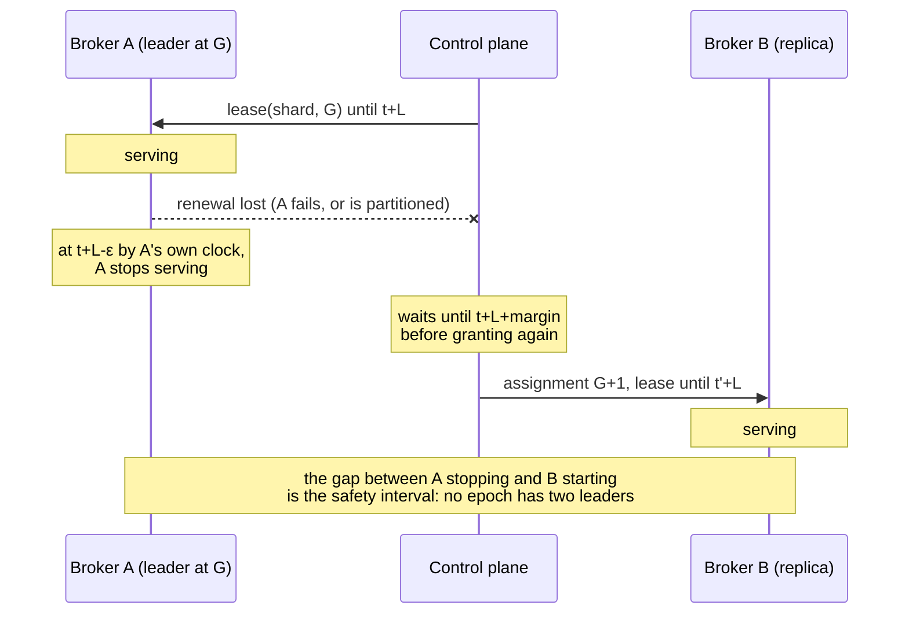

# Shard replication and leader failover

**Decision: leadership is a time-bounded lease issued by the control plane, and
replication is log shipping from the leader to its followers. Per-shard Raft is
rejected.**

Recorded for M5.1 (#110). The rejected alternative and what would overturn the
decision are both below.

## What has to be true

Constraints first, because the comparison is only meaningful against them.

**Safety.** At most one broker may commit writes for a shard at a given epoch,
under any combination of partition, pause, and clock error the failure model
admits. A record acknowledged under `Quorum` must survive any failure the
configured majority tolerates.

**Availability.** A shard survives its leader failing. It also survives the
control plane being briefly unreachable: a broker must not stop serving because
a metadata service restarted.

**Write latency.** A publish already crosses ingress, offset assignment,
durability, and fanout in a fixed order. Replication adds one network round trip
for `Quorum` and none for `Leader`. It must not add a *consensus* round trip to
the common path.

**Operational.** A broker holds many shards. Whatever runs per shard runs
hundreds or thousands of times per broker.

**Dependency.** The storage layer is fixed. Its invariants are load-bearing and
documented, and a replication design that violates them is not a replication
design, it is a storage rewrite.

## The constraint that decides it

`docs/storage-format.md` and `docs/durable-storage.md` state it plainly:

> **Records are never rewritten**, which is what lets recovery keep trusting
> "valid bytes end at EOF".

That single property is why torn-tail repair is sound, why a missing index can
be rebuilt, and why preallocation reserves blocks without changing `st_size`.

**The invariant is narrower than "never rewritten", and it has to be.**

An earlier version of this document argued that Felix avoids truncation
entirely, because a leader only ships records it has committed. That is false
under `Quorum`, where shipping is what *produces* the commit: a follower stores
a record before any majority holds it, so a leader that dies mid-flight leaves
that record on some followers and not others. The next leader may legitimately
reuse the offset. Every leader-change scheme has to reconcile that, and Felix is
not an exception. `Divergence::Conflict` exists precisely because it happens.

The invariant that actually holds, and that recovery depends on, is:

> **No record at or below the high-water mark is ever rewritten.**

Below the mark a record is on a majority and can never be un-committed. Above it
a record is a proposal, and discarding a proposal the cluster did not adopt is
not the same act as rewriting history. Torn-tail repair and interior-corruption
detection rest on the *committed* prefix being immutable, which this gives them.

So the case against per-shard Raft is not about truncation, because truncation
is required either way. It is:

1. **Election and clock trade-offs.** Raft elects by term and majority vote,
   which needs no clock assumption but adds a round of voting to every failover
   and a second failure detector beside the one the control plane already runs.
   Leases reuse the heartbeat the broker already sends, and pay for it with the
   safety interval described below.
2. **Two logs, or one.** Raft over the stream log means either the segment log
   *is* the Raft log (with Raft's index and term bookkeeping in the record
   format), or every record is written twice and the two can disagree after a
   crash. The second is a durability path the storage design deliberately does
   not have.

Neither is a tuning problem. Both are a different storage layer.

The storage layer was in fact built anticipating the other answer:
`docs/durable-storage.md` says "Replication (M5) is what `seal`'s checksum and
`read_range`'s bounded paging exist to serve." Sealed-segment checksums and
bounded range reads are the primitives of *shipping*, not of consensus.

## Why the control plane being Raft-backed does not settle this

M7 makes control-plane metadata highly available, and Raft is the right tool
there. It does not follow that payload replication should use Raft, and the
issue asks for this to be said explicitly.

The two have opposite cost profiles:

| | Control-plane metadata | Stream payload |
| --- | --- | --- |
| Volume | Assignments, tenants, streams: kilobytes, changing rarely | The entire data plane |
| Groups | One, for the cluster | One per shard: hundreds or thousands per broker |
| What consistency buys | Linearizable reads of small state everyone must agree on | Durability of records already ordered by a single writer |
| Cost of a round trip | Paid once per metadata change | Paid on every publish |

A stream's records are already totally ordered by their leader. Consensus is not
being asked to *establish* an order; the log has one. It is being asked to
replicate an existing order durably. That is a weaker requirement than Raft
solves, and paying Raft's price for it is paying for agreement that has already
happened.

## The selected design

### Leases

The control plane grants a **lease** on `(shard, generation)` to one broker for a
bounded duration `L`. The lease is the authority to serve; the assignment alone
is not.

A lease is bound to the generation. A new generation is a new lease, never a
renewal of the old one, which is what makes generation the epoch that fences
writes.

The leader renews through the heartbeat it already sends. A renewal that does not
arrive before expiry means the lease lapses; nothing revokes it explicitly,
because a revocation cannot be delivered to a partitioned broker, which is
precisely the case that matters.

### The exact condition under which a broker may accept a write

A broker may accept a write for shard `S` if and only if **all** of:

1. It holds a lease for `S` at generation `G`.
2. Its own monotonic clock reads earlier than `expiry(G) − ε`, where `ε` covers
   clock drift and the time between this check and the record reaching disk.
3. Its local shard state for `S` is open at exactly generation `G`, the check
   `IngressRouter::dispatch` already performs.
4. For a `Quorum` stream, a majority of the replica set for `G` **including the
   leader** has durably stored the record. For a `Leader` stream, the leader's
   own configured durable commit point has been reached.

Conditions 1–3 are checked **twice**: once when the request is admitted, and
again immediately before the record is committed to the log. The second check is
not redundant. Everything between them can take arbitrarily long (a full ingress
queue, a slow fsync, a VM pause), and a lease that was valid on admission may
have expired by the time the bytes reach the disk. Fencing only at the routing
boundary leaves exactly the window this design exists to close.

**As built, the commit check is one gate.** Every write path already enters the
shard's write fence right before it claims its place in the log: a direct or
idempotent publish, a forwarded publish on the owner, a cache put or delete, a
counter add, a consumer-group ack, nack or dead-letter change, and a Kafka
produce. The fence checks the generation (condition 3) and reads the lease
against the clock (conditions 1 and 2), so no path can skip either. A write
that took its place at admission and waited in a queue has the lease read
again when it claims its offsets. While the lease has lapsed the fence refuses
everything, retryably, and serves again once a heartbeat renews it.

For a `Quorum` write, condition 4 is followed by the lease once more, when the
mark releases the acknowledgement: a broker whose lease lapsed while it waited
answers "unknown" rather than acknowledging, which is `AckChecksLease` in
`FelixShard.tla`. The model says that check is not what keeps an acknowledged
record: `FelixShardAckWithoutLease.cfg` drops it, lets the leader act on its
report's answer as the code does, and with clocks drifting under the real
margins TLC finds leaders acknowledging on a lapsed lease, and after being
replaced, and no acknowledged record lost. What does keep it is the report:
a leader acknowledges only on a report stored for its own generation, and
promotion reads that generation's report.

Once the fleet finalizes `majority_ack`, a `Quorum` stream shard takes the
clock out of this altogether: a promoted leader fences a majority and takes
any tail ahead of its own before it serves, and a write is acknowledged once a
majority has answered that it holds it at the current generation, with no
lease at admission, at the commit or at the acknowledgement, and no report.
See [Acknowledging by the followers](#acknowledging-by-the-followers).
`FelixShardFencedAck.cfg` keeps every acknowledged record with no margin on
either side of the lease; `FelixShardUnfencedAck.cfg`, the same without the
fence, loses one. See [`docs/formal/README.md`](formal/README.md). A `Leader`
stream, a cache, and every shard in a fleet that has not finalized
`majority_ack` keep the lease and the report exactly as above.

The commit check refuses a publish even when it was acknowledged on enqueue
(`ack_on_commit` off), since writing it would be the split brain. So admission
reads the clock for such a publish and, with little lease left, waits for the
write instead of acknowledging the enqueue. A pause after the ack can still
strand one; it is counted in `felix_broker_acked_publishes_dropped_total`. See
`docs/semantics.md`, "Consistency".

### Failover

1. The lease lapses (no renewal within `L`).
2. The control plane selects an eligible replica: one whose durable high-water
   mark is within the configured catch-up bound of the last known committed
   offset.
3. It publishes assignment generation `G+1` naming that replica as leader, and
   grants it a lease.

The control plane must not publish `G+1` before it is certain no broker can still
believe it holds `G`. With lease duration `L` granted at control-plane time `t`,
`G+1` may be granted no earlier than `t + L + margin`, where `margin` covers
clock drift between the two parties and the network delay of the grant itself.
The leader stops at `t + L − ε` by its own clock. The gap between those two
instants is the safety interval, and it is why leases are safe without
synchronized clocks.

The broker cannot observe `t`, so it anchors at the instant it **sent** the
heartbeat. That is always at or before `t`, so the round trip comes out of its own
lease rather than out of the margin. Anchoring at the instant the *response* was
handled runs the other way: a buffered read or a VM pause in between would push
the lease past `t + L`, which is the safety interval being spent by the same
kind of stall the twice-checked conditions above exist to survive.

The safety interval is the whole mechanism, so it is worth seeing:

  

Nothing in that sequence requires A and CP to agree on the time. It requires only
that neither clock runs more than `ρ` faster or slower than real time, so the two
instants cannot cross.

As built, `L` is the control plane's `expiry_timeout_ms`, which every heartbeat
response carries. The broker gives up `ε = L/4`. The control plane marks a
silent broker down, which is what lets placement hand its shards on, only after
`L + margin`, where the margin is `FELIX_NODE_REGRANT_MARGIN_MS` and defaults to
`L/4` (it may not be set lower). Silence is measured twice and both have to
agree: against the store's clock, which stamps heartbeats, and by the sweeping
instance's own monotonic clock, which starts over whenever it sees the stamp
change and whenever the instance starts watching (a restart, a Raft election, or
the store coming back). The store's clock is a wall clock, and after an election
or a database failover a different machine's, so a step forward alone could
otherwise expire a broker still inside its lease. `FelixShardRealMarginsLease.cfg`
checks these margins, a quarter each side against clocks that drift by a
quarter, and passes; with the control plane's margin at zero it finds two
brokers serving. `FelixShardRealMargins.cfg` adds a `Quorum` write carried
across a promotion under the same margins and drift, and every acknowledged
record survives.

### Failover on the followers' word

The lease decides when failover happens: a dead leader is replaced only once
it is marked down, `L + margin` after its last heartbeat, and a leader that
still heartbeats is never replaced at all, even when none of its followers
can reach it. Once a deposed leader is kept out by the fence instead of the
clock, the wait buys nothing. So the followers say when the leader is gone,
and the control plane acts on that.

**Which shards.** A durable `Quorum` stream, once the fleet has finalized
both `majority_ack` and `lease_free_reads`. With `majority_ack` a deposed
leader cannot get a write acknowledged once its successor has fenced a
majority, and with `lease_free_reads` it cannot serve a read or a group
commit without a round of fences either. Without the second it still serves
reads on its lease, and replacing it before that runs out would let it hand
out values its successor has since overwritten. `Leader` streams and caches
keep the lease. `FelixShardSuspicion.cfg` lets placement promote on any read
before the lease lapses, the old leader alive and renewing, and loses
nothing and opens no second leader at a generation; `FelixShardSuspicionLease.cfg`, the same where the lease still
decides who serves, finds two brokers serving.

**The followers' half.** Every broker pings each broker that leads a shard
it follows, four times per `FELIX_LEADER_SUSPECT_AFTER_MS` (5 s by default),
with `Ping` on the peer connection's control lane, answered from the
leader's serving runtime (`docs/internal-protocol.md`, "Pinging a leader").
A leader that has not answered for the whole window is named in the
follower's next heartbeat, which goes at once rather than an interval later.
A leader first watched gets a whole window, and a peer that did not offer
`PING` is not watched, so an upgrade does not read as a death.

**The control plane's half.** It keeps the names as soft state, like a
heartbeat: in the store under the memory and Postgres backends, and in the
Raft leader's memory under Raft. A name counts for two heartbeat intervals,
since a broker that still suspects says so on every beat and one that has
stopped says nothing. Placement then treats a live leader as gone when the
followers naming it are a majority of the set, the leader counted in the set
but not among them, and a reported follower can take over
(`deposed_by_followers` in `placement/plan.rs`). From there it is an
ordinary `Quorum` promotion: the follower furthest ahead in the last report,
the set kept with the old leader in it, and the new leader fencing a
majority before it serves. Not while a move or a replacement is under way,
since those change the set the fence counts and end through their own steps.
With no reported follower the leader keeps the shard, since it is alive and
may be the one the rest can still reach.

A majority is the right number from both sides. A leader that a majority of
its set cannot reach cannot get a write acknowledged anyway, so replacing it
costs nothing that was working. And those followers are a majority that can
answer the new leader's fence. One follower cut off alone moves nothing.

**Failover time** is then the replica set's own: the suspect window, plus
the heartbeat that carries it, which goes as soon as the window ends, plus
the placement pass it wakes on the instance it reaches (or the next pass,
`FELIX_SHARD_RECONCILE_INTERVAL_MS`, on another), plus the fence. With the
defaults that is a little over 5 s, against at least `L + margin` (15 s plus
3.75 s) for a lease lapse, and it does not depend on the control plane's
expiry timeout. A leader partitioned from its followers but not from the
control plane, which the lease never replaced, is replaced the same way.

A detector that is wrong costs availability, never safety: the replaced
leader rejoins as a follower. A slow leader that misses a whole window of
pings from a majority is replaced, which is the trade a shorter window makes.

**What it does not change.** The control plane still makes the decision, so
with the control plane down a dead leader is not replaced. Replicas electing
a leader among themselves is the rest of issue #1009, and needs the set
check `FelixShardElectStaleSet.cfg` shows missing.

Evidence: `a_leader_a_majority_cannot_reach_is_replaced_while_it_heartbeats`,
`one_follower_alone_does_not_move_the_shard`,
`a_leader_stream_is_not_moved_on_the_followers_word`,
`with_nobody_caught_up_the_leader_keeps_the_shard` (placement);
`a_suspicion_counts_only_with_both_features`,
`a_suspicion_counts_for_two_heartbeats`; `a_leader_silent_for_the_window_is_suspected_until_it_answers`,
`a_ping_is_answered_and_an_older_broker_is_not_pinged` (the follower);
`a_suspicion_is_sent_without_waiting_for_the_next_beat` (the heartbeat);
and the cluster test
`a_leader_its_followers_cannot_reach_is_replaced_while_it_heartbeats`.

### Fencing a promotion

The lease keeps a deposed leader out only while clocks drift within the bound
the margins assume. The fence is the part of the modelled design that does not
need that: a promoted leader asks each replica to take its generation before it
opens for writes, and a replica that has taken it refuses every older leader.
Any majority that could acknowledge a record overlaps the majority that took
the fence, so the deposed leader cannot find one. `FelixShardFencedAck.cfg`
checks the design with no margin on either side of the lease.

The replica's side is `AnswerFence` in the model. It persists the generation,
fsynced, in the same file that keeps the highest generation it accepted a
leader at, before it answers. From then on it refuses the older leader's
records, bootstraps, rebuilds, and gap answers, restarts included, whatever its
routing view says. The shard's cursor, dead-letter and counter logs check the
shard's own log as well as their own. It answers with how far its log reaches,
its commit offset, and the generation its last record was written at, which is
how the model orders logs (`Ahead`).

It is negotiated, not assumed. A broker offers the `FENCE` capability in the
peer handshake, and a peer that did not offer it is never sent `Fence`
(`docs/internal-protocol.md`, "Capabilities"). `FELIX_INTERNAL_FENCE=false`
withdraws the offer.

**The leader's side** is `OpenForWrites`. A broker promoted to lead a stream
shard opens its log, persists its own generation, and then waits in a
`fencing` phase: the shard is routed to it but not servable, so writes are
refused retryably and nothing ships. Replication sends `Fence` to every
replica at once and opens the shard on the first majority, the leader
counted. Before it opens, the leader takes the log of the answer furthest
ahead by (generation of the last record, length), when that is ahead of its
own: it reads it with `ReplicateFetch` from where the two may disagree (the
later of its commit offset and the start of its own last generation), drops
its own records past the first disagreement and any past the end of that log,
and appends the rest. Its requests have a stream of their own on each peer
connection, so they never queue behind a forwarded publish waiting on a
quorum. Where this
leadership begins is recorded only then, so the records it took keep their
own generation. Answers that arrive after the majority are not waited for,
as in the model.

What makes the deposed leader harmless is the majority, not the clock. The
follower it can still reach may never have heard of the promotion from the
control plane, and its routing view would take the batch; the fence it took
refuses it (`a_partitioned_leader_is_refused_by_the_majority_its_successor_fenced`,
with the old leader cut off past its lease and its clock slowed a
hundredfold, and the same frozen).

When the fence applies:

- On every change of leader, not only a promotion: whenever a broker starts
  leading a shard at a generation it was not serving it at, the shard opens
  in `fencing` (`begin_open` in `shards/lifecycle.rs`). That covers a
  promotion, a fresh placement, a move's cut-over, a failover that names a
  move's destination, a cancelled move's hand-back, and a generation of a
  shard the broker serves that skips one, which a promotion of someone else
  that this broker saw only coalesced away gives it. Each of these is a
  generation the control plane picked from its own view, and the fence is
  what keeps out a leader it did not know about, while the catch-up takes
  what that leader acknowledged. Two opens are not fenced: the old leader's
  end of a move, which reopens the log to ship it, not to serve, and the
  generation right after one the broker is serving, which a move's staging or
  a follower replacement step gives it. Every assignment write raises the
  generation by one, so nobody led in between, and fencing it would close a
  serving shard at each step; a leader cut off from a majority of the new set
  would then stop reporting, and placement waits on that report to finish the
  step. See [Every change of leader](#every-change-of-leader).
- For stream shards and cache shards. A cache shard fences its cache log, which
  holds the shard's one promise per replica, then its counter log, and takes
  the furthest ahead of each by the same order
  (`the_counter_log_furthest_ahead_is_taken_too`). A follower refuses an older
  leader on both logs once it took the cache log's fence
  (`a_counter_fence_older_than_the_cache_fence_is_refused`). Taking another
  log drops the cache's index or the counter sums above the cut, so the
  shard serves what its log now holds (`a_superseded_put_is_gone_from_the_index`).
  A cache kept in memory has no log to fence and opens on the lease. A cache
  or counter log this broker has but cannot open (the shard is closing, out of
  file descriptors, a failed recovery) is not the same: under `fenced_caches`
  the shard stays closed and the next pass tries again
  (`a_cache_log_that_fails_to_open_keeps_the_shard_closed`,
  `a_counter_log_that_fails_to_open_keeps_the_shard_closed`); before it, the
  shard opens on the lease.
- Only when every replica in the new set offers both `FENCE` and
  `TAIL_FETCH`, and for a cache shard `CACHE_FENCE` too, as its latest
  handshake with this broker in either direction says, and this broker offers
  them too. Otherwise the shard opens at once
  on the lease, exactly as before (`a_mixed_fleet_fails_over_on_the_lease`),
  and a peer that did not offer them is never sent either message.
  `felix_broker_promotions_opened_total{path}` says which path each new
  leadership took, promoted or not.

The cost is availability. A promoted leader that cannot reach a majority of
its replicas does not serve, where on the lease alone it would have opened;
it retries after 200 ms (`FENCE_RETRY`), doubling the wait with each failed
attempt up to 2 s (`FENCE_RETRY_MAX`). Every other change of leader pays a round trip to a
majority before it serves; a write that reaches the broker meanwhile waits
for it, within the move hold's window (`FELIX_SHARD_MOVE_HOLD_MS`), instead of
being refused. So does one that arrives while the shard's log is still
opening, or in the moment between the fence settling and the broker
publishing that it serves the shard (#1085). It could not have acknowledged a `Quorum` write
without that majority anyway, but a `Leader` write it would have.

**What this does not change on its own.** Until the fleet finalizes
`majority_ack`, acknowledgements still come from the report and the lease, so
a deposed leader's `Quorum` write is kept unacknowledged by the report gate as
before; the fence adds the followers' refusal on top.
`FelixShardFencedPromotion.cfg` checks this configuration, the fence with the
report and the lease, under the real margins. Once `majority_ack` is
finalized, see [Acknowledging by the followers](#acknowledging-by-the-followers).
A `Leader` stream acknowledges on the leader's own commit, which no follower
sees, so its deposed leader is kept out by the lease alone either way.

### Ballots

A replica remembers whom it accepted a generation from, not only the
generation. The control plane issues each generation once, so today two nodes
never claim one, and a replica could treat a fence at its accepted generation
as the leader confirming it still leads. That stops holding once anything other
than the control plane picks a generation: two control-plane instances working
from a stale read, or replicas electing a leader without it, which is what
issue #1009 builds toward. Two candidates at one generation could then each
fence a majority, and followers would take batches from both.

So the promise is a ballot, `(generation, leader)`. At the generation it
accepted, a replica answers a fence, a batch, a bootstrap, a rebuild or a tail
fetch only from the leader it accepted it from, and refuses any other node with
`FencedEpoch`. A newer generation is a new ballot, whoever asks. The leader is
the node id the peer gave in its `Hello`, which mTLS checks against its
certificate. The shard's cursor, dead-letter and counter logs check the
shard's own log's ballot as they check its generation. A broker leading a
generation takes the ballot for itself first, and refuses to lead a
generation it already accepted from another node.

The ballot is on disk before the replica answers: `DiskLog::accept_generation`
writes the shard's `ballot` file, fsynced and renamed into place with the
directory synced, then raises the generation in `replica`, and only then
returns. A crash between the two leaves a ballot ahead of `replica`, and the
open takes the higher generation from it; nothing was answered at that
generation yet, and taking it only refuses more. A ballot behind `replica`, or
none, names no leader, and the first leader to ask at the accepted generation
is written down as it. That is the state after an upgrade, and with
`FELIX_INTERNAL_FENCE=false`, which keeps no ballots. The file sits beside
`replica` rather than inside it so that a build without ballots still opens
the shard.

It is negotiated like the fence. A broker that keeps ballots offers the
`BALLOTS` capability (`docs/internal-protocol.md`, "Capabilities"), and only
with the fence. Nothing reads the offer yet: a broker without it answers as
before, and a later change that lets replicas elect will need every replica to
offer it.

The model has it as `Ballots` and `Elections` in `docs/formal/FelixShard.tla`
(`docs/formal/README.md`, "Ballots: one leader per generation").
`FelixShardElect.cfg` lets replicas elect themselves and passes with ballots;
`FelixShardElectNoBallot.cfg` finds two leaders opening at one generation
without them. `FelixShardElectStaleSet.cfg` shows what ballots do not cover: a
replica that left the set can still stand on the old one, which self-election
will have to refuse first.

Evidence: `a_second_leader_at_an_accepted_generation_is_refused`,
`a_ballot_survives_a_crash_before_anything_is_acknowledged` and
`a_ballot_written_before_a_crash_is_taken_at_open` (storage);
`a_fence_from_a_second_leader_at_the_same_generation_is_refused`,
`a_ballot_is_on_disk_before_the_fence_is_answered` and
`the_ballot_names_the_peer_that_said_hello` (replica);
`a_generation_promised_to_another_node_is_not_led` (the leader's side).

### Every change of leader

Ballots keep one leader per generation only if every leader asks for the
ballot. Before this, a move's cut-over and a cancel's hand-back opened at
once at the generation the control plane named, as did a generation of a
shard the leader served that skipped one. With only the control plane picking
generations that was safe. With a second source of generations, a candidate
electing itself or a planner working from an old read, it is not: the
control plane can name the destination at a generation a candidate already
took, and the destination opens there too. `FelixShardElectHandoffUnfenced.cfg`
finds exactly that (`OneLeaderPerGeneration`).

So every leadership a broker takes goes through the fence, the same one a
promotion does. The new leader persists its own ballot first, which it cannot
do at a generation it already promised to another node, then fences a
majority of its set and takes the answer furthest ahead. A majority that
promised another leader that generation refuses it, and it stays closed. The
lease fallback is unchanged: when some replica does not offer the fence, the
shard opens on the lease, as before, and
`felix_broker_promotions_opened_total{path}` counts every new leadership, not
only promotions.

The cost is the promotion's cost on more paths. A new leader that cannot
reach a majority retries the fence, backing off as a promotion does, and does not
serve or report until it gets one; it does not give up or step down. The
shard is unavailable until the leader reaches a majority, or dies and
placement promotes from the last report, which waits for a broker holding
the log if that report names no follower that does. A move's destination cut
off from its followers at the cut-over is now in that position, where before
it served unfenced. `FelixShardElectHandoff.cfg` checks the cut-over and the
hand-back fenced, with replicas electing themselves (`FenceEveryChange` in the
model); it runs nightly, and `FelixShardElectHandoffLeaders.cfg`, without the
write, runs on every pull request.

Evidence, each a leader from before the change sending a batch after it to a
replica the new leader fenced: `after_a_cut_over_the_drained_leader_is_refused`,
`after_a_failover_to_the_destination_the_old_leader_is_refused`,
`after_a_hand_back_an_older_leader_is_refused` and
`after_a_new_generation_of_a_served_shard_the_leader_between_is_refused`
(`services/felix-broker-service/src/shards/lifecycle/tests/every_change.rs`);
`a_write_to_a_shard_still_fencing_waits_for_the_fence` (the write hold).

### The generation-start record

A leader must not count a record it inherited toward its quorum mark on the
strength of a majority holding that record alone. This is Raft's Figure 8, and
the fence's catch-up is how it reaches Felix (`FelixShardFigure8NoStartRecord.cfg`):

1. a writes x at generation 1 and ships it nowhere. b, promoted at 2, writes y
   and ships it nowhere.
2. c is promoted at 3, fences a, takes x in the catch-up, and ships it back to
   a. With x on a and c, c's mark covers it and a client is told x is stored.
3. c dies and a is promoted at 4. Its fence compares a's log, whose last record
   is from generation 1, with b's, whose last is from 2. b's is ahead, so a
   takes y in place of the acknowledged x.

Raft's answer is to count only a majority holding a record of the leader's own
generation, which carries everything before it along, and to write a no-op at
the start of each term so that happens without waiting for a client. Felix does
the same:

- **The record.** A leader appends a generation-start record at the offset
  where its generation begins, its first record at the generation, and only
  then serves. A promoted leader does it after its fence and catch-up; if the
  append fails the shard stays closed, and the driver fences and tries again
  after a back-off that starts at 200 ms (`FENCE_RETRY`) and doubles with each
  attempt at the same generation that leaves the shard closed, up to 2 s
  (`FENCE_RETRY_MAX`). The record ships like any other and is labelled with the leader's
  generation, so a replica holding it answers a later fence with that
  generation as its last. The format is in `docs/storage-format.md`.
- **The mark.** A stream leader's mark counts a majority only once it reaches a
  record of the leader's own generation (`quorum::counted_offset`, used for
  the mark and for the report that releases it); until then the mark is zero,
  as it is before any generation's first mark. The start record is the first
  such record. In step 2 above, x is acknowledged only once a holds the record
  too, and a's log then ends at generation 3 and wins the fence.
- **Liveness.** Records a leader inherited, including ones the previous leader
  acknowledged, are readable at the new leader's mark as soon as its record is
  on a majority, one replication pass after it opens, whether or not a client
  writes. The same holds for an idempotent producer's re-send answered from an
  inherited batch.
- **Readers never see it.** It occupies a log offset, which subscriptions,
  replay, Kafka fetch, consumer groups and backups skip. How a subscriber tells
  that offset from a dropped record is in `docs/protocol.md`. A subscription's
  `live_offset` stops short of any such records the log ends with, so a reader
  that waits to reach it does not wait on an offset that never delivers an
  event, which is every new leadership until a client writes.

**Every leadership change, not only a promotion.** A move's cut-over hands the
destination a log whose tail it did not write, and a cancelled move hands the
old leader back its own log at a new generation. Either can inherit a record a
promoted leader took in its fence and never got acknowledged, and counting it
is the same Figure 8 one step later (`FelixShardFigure8CutOverNoStartRecord.cfg`
finds it; `FelixShardFigure8CutOver.cfg` checks the move and the hand-back
with the record). So the record is written whenever a broker starts leading a
stream shard at a new generation and its log is not empty: after a promotion,
at a fresh placement over an existing log, at either end of a move, and on a
hand-back. The control plane bumps the generation at each step of a move, so
the leader that stays writes one at the staging and the fence too; they cost
an offset each and nothing else. A reopen that finds the generation already
has records writes none, fenced or not: the leader led at this generation
before and comes back to it after a restart or a lost lease, the mark already
counts from the generation's recorded start, and every record past that start
is the generation's own, so there is nothing inherited to cover. This is also
how a shard whose generation began before the fleet finalized
`generation_start` keeps serving: it has records at that generation and no
start record, and it gets its first one at its next leadership change. A cache
shard writes one on its cache log and one on its counter log, at the same
points, since its fence can take a longer log on either; each mark counts only
past its own log's record (`a_cache_leader_counts_only_its_own_generation`).
Cache replay, watches and counter sums skip the record.

An in-memory stream writes none either. Its publishes never reach the shard's
log: they take no offsets, nothing ships, the fence has nothing to take, and a
`Quorum` publish has no offset to wait on a mark for (`await_quorum`). With no
inherited record there is nothing for a start record to cover, and the broker
has no log to append one to, so a promoted in-memory shard opens as soon as
its fence settles.

**Across versions: the `generation_start` fleet feature.** The record and the
counting rule switch on together, when an operator finalizes
`generation_start` (see the upgrades page in the docs site). Until then a
leader writes no record and counts inherited records as before, with the
exposure above, and segments stay at format v3, so any broker can still be
rolled back. The control plane refuses the finalize while a serving broker
lacks the feature and refuses such a broker after it, so every replica can
decode the record before one is written. Finalizing is one-way: the first
record rolls a log onto a v4 segment, which an older build refuses to open.

### Acknowledging by the followers

With `majority_ack` finalized, a `Quorum` stream shard acknowledges a write
(and with `fenced_caches` too, a replicated `Quorum` cache a put, delete or
counter add) once a majority of its replica set, the leader included, has answered that it
holds the write at the leader's generation. That is `AckByFollowers` in
`docs/formal/FelixShard.tla`, `HeldAtGen` and `quorum::held_at_generation` in
code. The report and the lease leave the write's path:

- **Counting.** A follower counts up to the offset its own `ReplicateOk` at
  this generation confirmed (`FollowerCursor::confirmed`), never to where it
  asked shipping to resume, which nobody compared. A follower that refuses the
  leader as fenced is halted and counts for nothing from then on; one that
  answered before it took a newer leader's fence keeps counting, because that
  fence's answer carries what it confirmed. The leader counts its own tail only
  while its log has accepted no newer generation, read after the tail: once it
  has answered a newer leader's fence, what it writes next is in no fence
  answer. The generation-start rule still applies on top, so the mark moves
  only once the majority reaches a record of the leader's own generation.
- **The mark moves first.** The report still goes to the control plane every
  pass, for placement and promotion, but it is sent behind the mark and
  nothing waits for it to land.
- **No lease on the write's path.** The shard's write fence admits and claims
  its writes without the lease, and the acknowledgement is released without
  re-reading it. Consumer-group state on the same shard is acknowledged on the
  leader alone and still needs the lease.
- **No promotion on the lease alone.** A promoted leader never opens a stream
  shard, or under `fenced_caches` a cache shard, on the lease: a replica that does not offer the fence, or cannot be
  asked, is one that has not answered, and the shard waits for a majority that
  has. An old leader no longer stops at its lease, so a new one must fence.

Why this is safe without a clock: a newer leader serves only after a majority
took its generation, and every majority the old leader could count shares a
replica with it. That replica either confirmed the write before it took the
fence, and its answer carries the write into the new leader's catch-up, or
refuses the old leader from then on. So a leader cut off from the control
plane goes on acknowledging what its followers hold, past its lease, until its
successor's fence reaches them, and nothing it acknowledged is lost
(`majority_ack` in the cluster tests). `FelixShardFencedAck.cfg` checks this
with drifting clocks and no margin, `FelixShardUnfencedAck.cfg` loses a record
without the fence, and `FelixShardFigure8FollowerAcksNoStartRecord.cfg` loses
one without the own-generation rule.

What still needs the lease, and why:

- **`Leader` streams.** They acknowledge on the leader's own commit, which no
  follower sees, so only the lease keeps a deposed leader from acknowledging.
- **Caches and their counters, until the fleet finalizes `fenced_caches`.**
  Before that an older broker may be promoted to a cache shard without
  fencing it, so a deposed cache leader has to stop at its lease. A `Leader`
  cache, and a cache kept in memory, stay on the lease regardless.
- **Reads, until the fleet finalizes `lease_free_reads`.** Then a `Quorum`
  cache read confirms leadership by a round instead; see below.
- **A fleet that has not finalized `majority_ack`,** or has not finalized
  `generation_start`: both are needed.

**Across versions: the `majority_ack` fleet feature.** A broker reports it only
when it fences on promotion, so one running with `FELIX_INTERNAL_FENCE=false`
never does and the feature cannot be finalized while it serves. Once
finalized the control plane refuses such a broker, which is what lets an old
leader stop honouring its lease: every broker that could be promoted fences.
Nothing on the wire changes; the followers' answers are the `ReplicateOk`
they already send. The runbook is on the upgrades page in the docs site.

**Across versions: the `fenced_caches` fleet feature.** The same rule for
cache shards. A broker reports it when it fences (`FELIX_INTERNAL_FENCE` not
`false`) and its build fences cache shards, which no earlier build does; it
takes effect alongside `majority_ack` and `generation_start`
(`cache_follower_acks_need_fenced_caches_too`). Until then a cache shard is
fenced on promotion whenever every replica offers `CACHE_FENCE`, and falls
back to the lease otherwise, but its writes are still acknowledged on the
report and the lease. `FelixShardFencedCache.cfg` checks the cache log and
the counter log together; `FelixShardFencedCacheNoCounterCatchUp.cfg` loses
a counter update when the fence takes only the cache log.

The cost is that a leader cut off from the control plane keeps taking writes
until its successor's fence reaches its followers. Those writes then time out
as unknown rather than being refused up front for the lease, and a client
retries them against the new leader.

### Reads without the lease

A read has its own question: has a newer leader acknowledged a write this
broker never saw? The lease answered it by the clock. With `lease_free_reads`
finalized (alongside `majority_ack` and `generation_start`), a read of a
replicated `Quorum` cache (get and counter get, local or forwarded to the
owner) answers it read-index style, with one round and no clock:

1. The read takes its value, and waits for the quorum mark to pass the tail
   it read, as before.
2. The broker then sends the promotion fence (`Fence`) at its own generation
   to every replica of the shard. A replica that has accepted no newer
   generation takes it, which at a generation it already had writes nothing,
   and answers `FenceOk`. One that has refuses with `FencedEpoch`. A cache
   replica also refuses when its counter log has accepted a newer leader,
   since a new cache leader that has only written counters reached it there
   and nowhere else.
3. The read is answered once a majority, the broker included, has taken the
   fence. The broker counts itself only while its own log (and for a cache its
   counter log) has accepted no newer generation, as `held_at_generation` does.

Why it is enough: any write a newer leader acknowledges is held by a majority
that accepted its generation. The promotion fence gets there before the leader
serves. Where a cache shard opened on the lease in a mixed fleet, a
replica persists a newer leader's generation before it stores anything that
leader sends (`accept_sender` in `replica.rs`), so every replica holding the
successor's write has accepted its generation all the same. Every majority the
round could reach shares a replica with that majority, and that replica refuses
the round from then on. A round that started after
the value was taken and reached a majority therefore proves no newer leader
had acknowledged anything before the read began, so the value holds every
write acknowledged before it. `ReadIndex` in
`crates/server/felix-replication/src/leadership.rs` is the code;
`docs/formal/FelixShardReads.tla` the model, where `FelixShardReadsRound.cfg`
passes `NoStaleRead` with drifting clocks and no margin, and
`FelixShardReadsNoRound.cfg` and `FelixShardReadsLease.cfg` find the stale
read.

The round confirms leadership, not the value, so the value must hold every
write the leader acknowledged. A put or delete the leader's own cache store
refuses (a failed fsync poisons the shard's log, and every later write fails
until the shard reopens) is answered as a storage error. Were it acknowledged,
the quorum wait would pass on the unchanged tail and the round would then
confirm reads that lack it. `store_failure` in
`services/felix-broker-service/src/serving/cache_routing/tests.rs` and
`a_forwarded_cache_op_the_store_refused_is_an_error` cover both paths.

Concurrent reads of a shard share rounds, but only forward in time: a read
that arrives while a round is in flight waits for the next one, because the
one in flight may have been answered before the read took its value. So a
shard has at most one round running and one queued, whatever the read rate.
The cost is a round trip to the nearest majority per batch of reads, and in
exchange a leader cut off from the control plane goes on serving reads its
replicas confirm, while one cut off from its replicas stops at once rather
than at its lease's expiry.

What is left on the lease:

- **`FELIX_QUORUM_READS=lease`** keeps a broker's reads on the lease, the
  faster path that is only as safe as the clocks and margins
  (`FelixShardRealMarginsLease.cfg`).
- **An unreplicated shard**, which has no majority to ask, and `Leader`
  caches, whose writes are only as good as the lease anyway.
- **Stream readers** (subscriptions, replay, group polls, Kafka fetches) and
  cache watches still stop at the lease. They never see a record past the
  quorum mark, so what they deliver is never taken back; the lease is what
  moves them off a leader that has lost the shard. The next section is the
  design for taking them, and consumer-group writes, off the lease.

**Across versions: the `lease_free_reads` fleet feature.** The round is the
existing `Fence`, so nothing on the wire changes. A broker reports the
feature only when it fences (`FELIX_INTERNAL_FENCE` not `false`), because the
argument rests on every newer leader fencing before it serves; and only this
build refuses a cache round on its counter log's generation. Until the
feature is finalized every read is on the lease, as before.

### Readers and group sessions without the lease

Built once the fleet finalizes `lease_free_reads` (#885), for replicated
`Quorum` shards, and not for a broker started with `FELIX_QUORUM_READS=lease`.

On the lease, a lapse ends every subscription and cache watch on the broker,
refuses new ones (`redirect_for`), makes the committed mark answer `Refused`
to every reader (`committed_bound`), and refuses every consumer-group write
(`require_lease`). A leader cut off from the control plane but not from its
replicas would keep its writes and its `Quorum` reads and still drop all its
readers and group consumers. On a lease-free shard none of that happens.

The replication driver marks such a shard in its write fence on each pass
(`WriteFence::sessions_without_lease`), and the broker reads that mark in
`redirect_for`, in the group path and in `ShardReaders::watch_leadership`.
`committed_bound` decides the same from the marks: the fleet reads by round,
and the stream's mark was decided by its followers, or the shard is a cache.

**What a subscriber needs.** It must never see a record that is later lost,
it must see records in offset order, and a record it misses must show up as
a gap in the offsets. The last two hold without any leader check, because
delivery is by offset. The first is what the committed mark gives. A `Quorum`
shard hands out nothing past it (`CommitHold`), and under follower acks the
mark covers only records a majority held at the leader's generation, which
every later leader holds at the same offsets. That is as true on a deposed
leader as on a current one. A deposed leader's mark stops moving because no
majority answers it any more, so its readers see less, never something
wrong. A reader's safety needs neither the lease nor a round.

A cache's mark is not decided by its followers: it moves only once the control
plane has stored a report naming who holds the records, and promotion picks
from those reports. A deposed cache leader cannot move it without the control
plane, so its watches get the same promise. The model covers the stream case.

For readers the lease only provides liveness: it moves them off a leader that
has lost the shard. Without it the broker learns another way:

- A replica that accepted a newer generation refuses the leader's ships with
  `FencedEpoch`, and the follower's cursor halts (`Halt::Fenced`). The driver
  reports it (`WriteFence::deposed`), and the first report at a generation
  ends the shard's readers the way a move does: each gets the offset to resume
  from and no named owner, and the client finds the shard again. From then on
  the shard's readers need the lease again, so a broker that has lost it
  refuses new ones.
- The new assignment reaching the broker does the same, as it always has.
- A leader that hears from no majority for a lease duration ends its readers
  too. A shard with nothing to ship exchanges nothing with its followers, so
  while the lease is lapsed the broker runs a round for each such shard every
  quarter lease, and treats a lease duration without a confirmed round as a
  deposal. That is the only clock left, and it decides only when a quiet feed
  gives up, never what it delivers. While the lease holds no rounds run: a new
  assignment reaches the broker the usual way.

A `Latest` subscription on a deposed leader starts at that leader's mark,
which may be behind the real tail. That errs on the safe side: the reader may
see records it could have skipped, and misses none. No round is taken at
subscribe time.

**What a group write needs.** Group state (a poll's claims, acks, nacks,
dead-letter changes) is acknowledged on the leader's own durability and
replicated behind it. A failover that loses the unshipped tail redelivers
those records, and that stays as it is. What must not happen is a coordinator
acknowledging a group write after a newer coordinator has opened, because
then two coordinators of one group are both handing out claims and taking
acks. The lease prevents that only while the clocks keep their margins.

So each group write is confirmed the way a `Quorum` read is. Once the write
is durable here, the broker runs the same `ReadIndex` round at the shard's
generation, and answers the client only once a majority has taken it
(`Owned::confirm` in `serving/group_ops.rs`). Concurrent group writes of a
shard share rounds, as reads do. A refused round answers the client with
`leadership_lost`. It does not end the readers by itself, because a round
that timed out looks the same as one that was refused; the ship refusal or
the silence above does that. A deposal does not put group writes back on the
lease either: they keep going to the round, which is what refuses them.

A poll whose round is refused has already recorded its claims. They were never
handed out, so they lapse and are delivered again, as after any failover.

The alternative was to acknowledge group state on a majority. That would stop
the redelivery after a failover, but the promotion fence catches up only the
stream's own log, so a new leader could open without a group write a majority
held. The fence would have to carry the group logs' tails too, which is a
separate change.

**What the lease still does**:

- It gates `Leader` shards and unreplicated shards, which have no majority to
  ask.
- It gates reads under `FELIX_QUORUM_READS=lease`.
- It gates writes to caches, and cache watches only where the fleet does not
  read by round. Kafka produce goes through the shard fence like a native
  publish, so a `majority_ack` shard takes Kafka writes without the lease.
- It sets the control plane's wait before it promotes, which decides how soon
  a failover starts but not whether it is safe.

**The model.** `docs/formal/FelixShardSessions.tla` extends
`FelixShardReads.tla` with a subscriber and a group write, on
`FelixShardReadsRound.cfg`'s writes and clocks: follower acks, the promotion
fence, the start record, drifting clocks and no margin. The subscriber reads
in offset order from any broker that believes it leads, and resumes at its
next offset when it moves. `NoLostDelivery` says every record it was handed
is at its offset in the current leader's log. `NoStaleGroupCommit` says no
group write is acknowledged at a generation older than one that had opened
before the write began. `FelixShardSessionsSubscriber.cfg` and
`FelixShardSessionsGroupRound.cfg` pass. `FelixShardSessionsPastMark.cfg`
delivers past the mark, `FelixShardSessionsGroupNoRound.cfg` acknowledges on
belief alone and `FelixShardSessionsGroupLease.cfg` on the lease, and TLC
finds the violation in each.

### The clock assumption, stated precisely

Safety requires a bound on clock **drift rate**, not synchronized clocks. For any
two nodes, over a real interval `T`, each monotonic clock advances by between
`T(1−ρ)` and `T(1+ρ)` for a known `ρ`.

This is a real assumption and it can be violated. The realistic violation is not
NTP error. It is **process suspension**: a VM migration, a stop-the-world pause,
a throttled container. A broker suspended past its expiry wakes believing it
still holds a lease.

Host or VM suspend is the worst case, because it can stop the clock itself:
`CLOCK_MONOTONIC` does not advance while the system is suspended, so a lease
timed on it would wake with its whole remainder intact. On Linux the lease
therefore reads `CLOCK_BOOTTIME`, which counts suspended time
(`cluster/lease/clock.rs`); other platforms fall back to `std::time::Instant`.
Timers that only schedule work stay on tokio's clock; every validity check reads
the lease clock.

That is exactly why condition 2 is re-checked at the durable-append boundary
rather than only at admission. A suspended broker's next check is after it wakes,
and it sees an expired lease before its bytes reach disk. A suspension *between*
that check and the write completing is bounded by `ε`, which is the parameter to
tune, and the residual risk to state honestly rather than claim away.

### Replication

The leader ships records to followers over the internal transport that already
exists (#105). Under `Quorum` it ships them *before* they are committed (that
is what makes the majority), so a follower can hold a record no majority ever
acknowledged, from a leader that then died.

A follower therefore truncates, but only **above** the high-water mark. Below it
a record is on a majority and is never discarded: it was ordered by a leader
holding an unexpired lease, and the safety interval means no other leader existed
at that generation. The follower learns the mark from the leader: under `Quorum`
every batch carries the leader's quorum mark (`ReplicateRecords.commit_offset`),
and the follower keeps the lower of it and the end of what the batch left level
with the leader. The leader keeps its own mark the same way, so a deposed leader
is held to it when it follows.

A follower also refuses a leader older than one it has already accepted. The
routing view answers that while it is current, but it is rebuilt after a restart
and may lag; so each shard log keeps the highest generation it accepted a leader
at, written and fsynced before the first batch at a new generation is stored or
acknowledged, and a leader claiming a shard records its own generation the same
way. The commit offset is kept in the same small file (`replica`, beside the
segments). Under `FsyncMode::OnCommit` it is on disk before the batch that
carried it is acknowledged. Under `Periodic` and `None` it is written at most once
a second, and after a crash it may read back behind, which weakens the guard:
truncation may cut into records committed since, until the next batch carries
the offset again. Above it, a record is a proposal that the cluster may not
have adopted, and a new leader reusing the offset is ordinary rather than
alarming.

Reconciling that needs the two sides to agree on where their histories diverge,
which is what the generation of each record establishes; see
[Divergence and truncation](#divergence-and-truncation) (#406).

Catch-up for a new or lagging follower is a bounded `read_range` from the leader,
with sealed-segment checksums to verify wholesale rather than record by record,
the primitives the storage layer already exposes for this purpose.

**This works only while the leader still holds what the follower is missing.**
Once retention has trimmed past a follower's position, shipping cannot reach it:
the records are not on the leader to send, and starting the follower at the
surviving base offset would leave its log with a hole nothing downstream could
detect. Such a follower is offered a log that *begins* at the leader's oldest surviving
offset (`ReplicateBootstrap`). A replica holding nothing takes it and replication
resumes; one holding records of its own refuses, because a log placed over them
would have a hole nothing downstream could detect, and it is halted. The leader
then rebuilds it under the policy below, or leaves it to an operator when the
policy says so.

**Retention and the quorum mark.** A follower bootstrapped or rebuilt at the
leader's base answers as holding everything below its tail, and the mark counts
it that way. That is only true if every record below the base was already on a
majority. So on a `Quorum` shard, retention and compaction never delete at or
above the log's commit offset, on the leader or on a follower. The leader's
commit offset is the quorum mark written through after each pass, so it never
runs ahead of the mark. Without the floor, a stream with a small retention
bound and both followers down lost records: retention deleted what the leader
alone held, the followers came back below the new base and were rebuilt
there, and their answers carried the mark over the gap, acknowledging the
publishes that were waiting on it for records no broker held (#1094).

The leader also refuses to bootstrap or rebuild a follower at a base above
both the mark and its own commit offset. With the floor in place that does not
happen; if a log reaches that state some other way, the follower waits and the
publishes time out rather than being acknowledged.

A `Leader` stream acknowledges before shipping, so it has no mark to protect
and retention applies in full. An RF 1 `Quorum` stream is its own majority:
its mark follows its tail, and the floor costs nothing.

> `retention_and_rebuilds_never_carry_the_mark_over_a_lost_record`,
> `a_quorum_follower_keeps_what_is_above_its_commit_offset`,
> `a_bootstrap_above_the_commit_offset_is_not_offered`,
> `a_rebuild_above_the_commit_offset_is_not_requested`, and in the cluster
> suite `retention_waits_for_the_followers_of_a_quorum_stream`.

**A batch shipped again never winds the commit order back.** A follower
answers a batch it already holds with that batch's end, and a broker moves its
stream's commit order to what it was answered, so the first publish it takes as
leader claims the offset after the log's end. A leader that loses its lease
while batches are held for the quorum drops them, but they stay in its log and
the commit order stays past them, while the stream's own position does not.
When the next leader ships the first of them again, the answer lands below the
log's end. Moving the commit order back to it left a turn below the tail that
no publish would take, so once the shard came back to this broker every publish
on it timed out (issue 881). The commit order now moves only forward
(`a_batch_shipped_again_after_the_hold_was_dropped_does_not_wedge_publishes`).
Lease-free brokers were not affected, because a leader's generation-start record
resets the order when it opens.

### Idempotent producers across a leader change

An idempotent producer's sequence has to be wherever the shard's leader is, or
a re-send after a failover or a move lands a second time, or is refused as
`unknown_producer` with the producer left not knowing whether its batch
landed. It is not state beside the log: each record of a producer's batch is
stored with a mark naming the producer and the sequence (see
`docs/storage-format.md`, "Producer marks"), and the marks are shipped with
the records (`ReplicateMarkedRecords` in `docs/internal-protocol.md`). A
broker's producer state is derived from its own log, on every append and on
every open, so it is the same on any replica that holds the same records:

- **A promoted replica or a move's destination** knows every batch it was
  shipped. A re-send of one is answered with where it landed; the next
  sequence is appended. Nothing is sent at promotion, because there is nothing
  to send.
- **A restarted broker** rebuilds the state as it opens the shard, before the
  shard takes a write, from a snapshot saved at each rollover plus the active
  segment that recovery scans anyway.
- **A batch cut short** (its leader died while writing or shipping it, so the
  replica holds only its first records) is finished by the re-send: the
  missing records are appended, and the batch is not written twice. If
  anything else was appended after it first, it can never be finished, and the
  re-send is appended whole.
- **A replica that disagrees with the leader** about a record's mark has
  diverged, and is repaired or halted like one that disagrees about its bytes.
- **Truncation** takes the batches it removes out of the state with them.

What is remembered is a function of the log. A producer is known while any of
its batches is in the log; once retention removes the last of them it is
forgotten on every replica, and its next batch is refused as
`unknown_producer`. So is one evicted as the least recently written of more
than 4096 on a shard, and one whose batches all precede the base a follower
was bootstrapped or rebuilt at. `unknown_producer` after a leader change now
means the history is genuinely gone, not that the leader changed. The client
ends the producer on that stream and reports it rather than starting again
under a new id, because whether the batch in flight landed is exactly what
nobody can say any more.

An in-memory stream has no log and keeps sequences in its leader's memory, so
they last as long as the leader.

`FelixShardIdempotentFailover.cfg` and `FelixShardIdempotentHandoff.cfg` check
that a re-send never stores a write twice across a failover or a move;
`FelixShardIdempotentFailoverMemory.cfg` and
`FelixShardIdempotentHandoffMemory.cfg`, with the sequences in the leader's
memory, find the promoted broker storing it again.

### The `Leader` loss window, precisely

For `ConsistencyLevel::Leader`, a record is acknowledged once it is durable on
the leader alone. Records acknowledged but not yet shipped are lost at **any**
failover, not only when the leader's storage is lost: the promoted replica
writes new records at those offsets, and when the old leader returns as a
follower its unshipped suffix belongs to a previous generation and disagrees
with the new leader, so it is truncated (see
[Divergence and truncation](#divergence-and-truncation)). Losing the disk is
one way to reach that; a lease lapse is another.

The window is bounded by the leader's **replication lag**: the byte range between
its durable high-water mark and the lowest follower's acknowledged mark. It must
be exported as a metric, because a bound nobody can observe is not a bound. An
operator choosing `Leader` is choosing this window, and must be able to see how
large it currently is.

`Quorum` has no such window: a majority including the leader holds every
acknowledged record, so any failure within the configured majority preserves it.

### Replica reports and the committed mark

A `Quorum` acknowledgement is only as good as the report failover will read, so
the leader moves its quorum mark only once the control plane has **stored** a
report naming the replicas that hold the records. The report endpoint answers
each shard separately, in request order: `accepted`, `stale`, `not_leader`,
`unassigned` or `future_generation`. The status is 200 when every shard was
accepted and 409 when any was not. The leader moves a shard's mark only when
that shard's entry says `accepted` and names the shard and generation it sent.

Stored reports only move forward. A report replaces the held one at a later
generation, or at the same generation with a leader tail at least as far along
(`ReplicaReport::supersedes`, applied the same way by the memory, Postgres and
Raft stores). A slow request can otherwise land after a newer one and put back
a view in which a follower that has since fallen behind still looks caught up.
A report from a generation older than the assignment's is refused as stale.

A restarted leader whose unsynced tail was lost can report a lower tail than
the one held for the same generation; those reports are refused until its tail
passes the old one, and its `Quorum` publishes wait meanwhile. That is a
liveness cost, not a safety one: the held report describes records the
followers do have.

**A follower counts only for what it has answered.** The mark and the report
count each follower up to the last offset it answered holding at the leader's
generation. A new leader starts its cursor for a follower it has not heard
from one record below where its own generation begins, so that the first batch
overlaps a record the follower holds. That start is a guess, and it used to be
counted as if the follower had said it. A leader that could reach none of its
followers, such as a move's destination cut off as it took over, or the move's
source at its draining generation, then published a mark over records it had
inherited and no follower held. Its commit offset rose to the mark, and
readers could be handed those records as committed. Once a follower without
them was promoted, the broker came back holding them below its commit offset,
refused to drop them, and refused every rebuild, so it never rejoined (issue
878, `a_move_cut_short_by_kills_leaves_no_replica_halted`). A leader that has
heard from nobody now moves no mark. A publish waiting on the mark was never
acknowledged this way, because a generation change drops it.

Across versions: a broker that predates per-shard answers treats 409 as the
whole batch failing and holds every mark in it for a pass, which is safe. A
new broker talking to a control plane that predates them gets 204 and treats
the batch as stored, which is the old behaviour and the old exposure, until
the control plane is upgraded.

**Readers stop at the committed mark.** On a `Quorum` shard with replicas, the
quorum mark at the leader's generation is the committed high-water mark:
consumer-group polls hand out nothing at or past it, Kafka `Fetch` returns
nothing past it and reports it as the high watermark and last stable offset,
and `ListOffsets` latest is the mark. Before the first mark of a generation it
is zero. `Leader` streams, shards placed without replicas and single-node
brokers are unbounded, as their commit point is local durability.

QUIC subscriptions are gated too. A durable batch past the mark joins a
per-stream hold under its commit turn, so the hold is in offset order; when the
mark moves, the driver releases what it covers, appending to the replay ring
and fanning out together, with one shared envelope as an unheld publish does.
The bound also depends on the shard's route and lease, which can change with
no mark moving, so while anything is held the release also looks again every
250 ms. Otherwise a batch whose last mark arrived while the bound was
`Refused` or `Settling` stays held for good: readable from disk, never
delivered live. The ring therefore holds only committed records. A restart keeps that: a
`Quorum` ring is refilled from disk only when the commit offset reaches the
tail, and otherwise starts empty, since a ring stopping at the commit offset
would leave a hole before the tail. `Latest` and `cursor_tail`
are the mark, and resumed history is read with `Broker::read_committed`, which
stops at the mark and waits for it. Registration still happens before any
history is read. A broker that just took a shard has no mark for its
generation yet (`Settling`): a `Latest` subscribe is refused as retryable until
the first mark. Held batches are dropped when the shard is released (never
delivered as committed); subscribers are ended with where to resume and pick
up on the next leader. While the lease is lapsed the bound is `Refused`: new
subscribes, watches and cache reads are refused (`felix_broker_lease_refusals_total{boundary="read"}`),
and the readers of every led shard are ended as for a move.

### Divergence and truncation

Two brokers can hold different records at the same offset. It takes a leader
dying mid-flight under `Quorum`: the record reached some followers, no majority
acknowledged it, and the next leader reuses the offset for its own. Nothing is
wrong with either broker.

Finding it is the easy half and is done: a batch's overlap with what a follower
already holds is compared byte for byte, and a mismatch is
`Divergence::Conflict`. A follower answers with the end of the batch it was sent
rather than its own tail, so the leader cannot resume past records neither side
has compared (#406).

Repairing it needs the two to agree on where their histories part, and offsets
alone do not say: both logs have an offset 100, and being told "they differ at
100" does not say how far back the agreement goes. The generation does say,
because a generation belongs to exactly one leader: the highest generation both
brokers hold is the last one they cannot disagree within, and its end offset on
the leader is the furthest point the follower can keep.

So a follower records where each generation began in its log, as a small map
beside the segments. It then repairs itself, with no exchange at all: a
conflict is droppable when the batch that found it comes from a **newer**
generation than the one this follower last accepted, and the divergence sits at
or after where that older generation began. Both conditions matter. A leader
disagreeing with *itself* is an inconsistency rather than a predecessor's
leftovers, and repairing that would let a leader rewrite its own history.

**Each record keeps the generation it was written at.** The map is also what
a fence answer's last generation and promotion by log order read, and those
orderings are only safe when a label says who *wrote* the record. A leader
ships a follower records it inherited as well as its own, so "the generation
of the leader that sent it" is the wrong answer for the first kind. Labelled
that way, a follower's copy of an inherited record looks newer than it is: a
leader at 1 acknowledges x1 and x2 on a and b; b is promoted at 2, ships x1 to
c, and dies; c is promoted at 3, and its fence finds a's log (generation 1,
two records) behind its own (generation 2, one record), so x2 is never taken
(`FelixShardFollowerLabels.cfg`, and
`a_follower_keeps_the_generation_a_record_was_written_at`).

So a stream shard's batch carries the labels, and so do a cache shard's cache
and counter batches to a follower that offers `CACHE_FENCE`, since its fence
compares those logs the same way. The shard's other logs are not compared by a
fence, so their batches carry only the sender's generation.

**Every leader records where its generation began.** A stream leader does it
when its shard opens or its fence completes. A cache leader records it on the
cache log and the counter log when the shard opens or its fence completes, and
accepts the generation on both. Without that record, a cache leader
that died holding a record no majority had came back as a follower with no
history at all. Its divergence at that record then looked like one that could
reach anywhere, so it halted instead of dropping the record, and it refused the
rebuild that followed because the rebuild would have discarded its committed
records too (#863). A cache log written before this change still has no
history; the rebuild below keeps its committed records, so it rejoins that way
instead.
`ReplicateLabelledRecords` is a replication batch with the sender's history
over its records: the generation the first
record belongs to, and every later one that starts by the batch's end, which
includes the sender's own start once the batch reaches it. The follower
records exactly those for the records the batch appended, and first drops any
generation of its own that starts at or past them: one it led without
writing anything describes no record, and left in place it would label the
records that arrive after it. A leader taking a replica's tail in its fence
asks for the same labels (`ReplicateLabelledFetch`), so what it took keeps
its generation on the leader too, and on every follower it ships to. Once its
records past the end of that log are dropped, their labels with them, the
leader puts the replica's labels over everything it compared, including
records it already held and so never appended.

The labels are negotiated with the `GENERATION_LABELS` capability, offered
whatever `FELIX_INTERNAL_FENCE` says. A follower that did not offer it is sent
the batch it reads, and labels the records as before: the sender's
generation, from where the batch appended. That fallback is the overclaim
above, so a cluster is only as safe as its oldest broker until every one
offers the capability.

Each record's append time travels the same way, as a time per record on a
labelled batch, to a follower that offered `RECORD_TIMES`, and a fence's tail
fetch asks for them too. The follower stores the leader's times rather than
its own clock's, so a promoted replica reports the times readers already saw
and answers `offset_for_time` the same. Nothing about safety rests on them:
they are not compared, and a follower that did not get them stamps the records
itself, which only shifts those records' times by the replication delay.

Correct labels are not the whole of it. A promoted leader's quorum mark counts
the records it inherited as it counts its own, so it can acknowledge one on a
majority that a later leader's fence then replaces with a newer generation's
log: Raft's Figure 8, which `docs/formal/FelixShardFigure8.cfg` reaches from a
seeded history. Raft counts only records of the leader's own generation, and
appends one at the start of each term so the inherited ones are carried along;
Felix has no such record yet, and until it does this is an open gap.

Dropping a suffix also resets the stream's in-memory tail: the replay ring,
its next offset and the commit order. Storing the new leader's records only
moves that tail forward, so when they end below where the dropped ones did, the
ring kept the dropped records, and a reader of this broker once promoted was
handed them next to the records that replaced them. A rebuild resets it the
same way.

Anything else halts, as before. That is the same shape Kafka arrived at without
Raft (KIP-101, KIP-279), reached without adding a message: the generation is
already on every batch, and the follower's own history supplies the rest.

Not exchanging it is deliberate, and the reason has since narrowed. It used to
be that a new kind could not be sent to a peer that might not understand it: an
unknown kind ended the stream, and those streams are long-lived lanes carrying
every in-flight request, so a probe cost far more than it learned. A peer now
steps over a kind it does not know and refuses that one frame, so the cost is no
longer prohibitive, but it is still a round trip, and repairing from what a
follower already knows needs none, along with no negotiation and no
rolling-upgrade order. An older peer predating that change still drops the
stream, so a probe would also have to wait out a deployment.

What it gives up is the case where the follower's history is absent or does not
reach back far enough. Those halt, which is exactly today's behaviour.

The same map answers a second question, on the leader's side: **where a fresh
cursor starts.**

A cursor is a belief about a follower's position under one leadership, so a
generation change discards it. What replaced it was offset zero, which meant
every follower of every shard the failed broker led byte-compared the whole log
before anything new could move, the leader reading its own log off disk and
pushing records the follower already had. On a log of any size that turns a
failover into an outage, and it happened for every shard at once.

The leader records where *its own* generation begins, which until then only
followers did, leaving a broker's history with a hole over exactly the stretch
it led. It is recorded when the shard is taken, while it is still `Opening`:
that is the one moment the tail *is* the generation's start, because the phase
exists precisely to hold writes back until recovery finishes.

Below that offset, this broker's records were taken from earlier leaders while
it was a follower, and so were the follower's, and two prefixes of the same log
agree. At or above it is where they can differ: what this leadership wrote, and
what a predecessor left on the follower alone. So comparison starts one record
below the boundary, so the first batch overlaps something the follower already
holds and the boundary is checked rather than assumed. It is the same check Raft
makes at `prevLogIndex`. A follower further behind than that still says so with
a `LogGap`, and the leader rewinds in that one exchange.

The follower holds the other end of that check, because the leader's starting
point is only a guess about the follower: a batch can still begin at the
follower's tail with records it wrote under an older generation sitting just
below. Accepting it would leave those records uncompared, and one of them may
be a dead leader's unacknowledged write at an offset the new leader filled
differently: two brokers disagreeing at a committed offset. So a batch from a newer generation that begins past them is
answered with a `LogGap` naming the first uncompared record: the later of
where the older generation began here and the commit offset. The leader rewinds
and the overlap is compared like any other, so a conflict is found and repaired
as above. When that takes several batches, the follower remembers in memory how
far it has got. The newest generation it holds stays older than the leader's
until the batches reach where the leader's own began: before that it holds only
records the leader inherited, labelled with the generations that wrote them.
Until then a conflict below how far it has got is the leader disagreeing with
itself and halts, while one past it is still the older generation's suffix and
repairable. A restart forgets the progress and costs a re-compare, not
correctness.

Without a history entry for the generation it falls back to zero, which is slow
rather than wrong. A shard's consumer-group cursors, dead letters and counters
still start there: those logs are written only when group state changes, so the
comparison is over almost nothing, and the leader does not open them at takeover
to record against.

Three things this deliberately does not do:

- **It does not go in the record format.** A generation per record would mean a
  segment format bump, and `SegmentHeader::decode` rejects an unknown version
  outright rather than guess. That is by design, since a moved field produces a
  plausible mis-parse. The map is derived state that can be rebuilt or absent.
- **It does not truncate below the high-water mark.** Everything there is on a
  majority. A truncation point computed below it is a bug, not a repair, and
  refuses rather than proceeds: the follower keeps the records, answers with
  the conflict, and counts `felix_broker_replicated_total{outcome="below_commit"}`.
  The storage layer refuses the cut on its own as well
  (`StorageError::BelowCommit`), so no caller can get round it.
- **It does not make a halted follower repair itself.** Truncating a divergent
  suffix is a decision with a policy attached (how many followers may rebuild
  at once, and at what bandwidth), so the repair is the leader's, under that
  policy, and described in "Rebuilding a halted follower" below.

### Who may be promoted

A leader reports, on every replication pass, which of its followers hold every
record it may have acknowledged. The leader is the only party that can say: it
knows both its own tail and how far each follower has acknowledged, where a
follower knows only where it is.

The bound is **zero**: a follower is caught up when it is missing nothing a
client was promised. What that covers depends on the stream. Under `Leader` a
write is acknowledged before it ships, so it is the leader's whole log. Under
`Quorum` it is the log up to the offset a majority holds, which is the most the
mark sent with the report can release; the mark already out is a floor. The
tail would be wrong there: a publish landing between shipping and the report
leaves every follower one record short of it, the report names nobody, and a
leader that dies right then can never be replaced, because nothing else will
report on the shard again. During a move the leader reports against its tail
under either level, since the cut-over hands over an exact copy.

A bound above zero is a bound on how much a promotion may silently lose, and
there is no honest value for it that is not a policy decision; zero needs no
such decision, and a follower reaches it constantly on a healthy shard.

Reports expire, after twice the node expiry timeout plus one heartbeat
(`report_ttl_millis` in `placement/replica_positions.rs`). A report says a
follower *was* caught up; the leader kept writing afterwards, and promoting on a
stale report loses whatever was written since. The window is derived from the
liveness settings rather than configured separately, because it has to outlive
exactly one thing: the time it takes to notice the leader is gone.

A leader that dies before its first report at its generation leaves no report
to promote on, and the shard is `NoCaughtUpReplica` until that broker returns.
Placement does not guess in that case. At a later generation the acknowledged
records may be on the dead leader alone, and with no report a caught-up replica
cannot be told from a lagging one. The window runs from the assignment, through
the promotion fence, to the first replication pass.

A halted follower is never reported as a candidate, however close its last
position was. It has stopped rather than fallen behind. The report names it
separately, with the reason, so placement can keep copies off it (see "Halted
replicas in placement" below).

**A new leader names nobody short of the log it inherited.** At a new
generation nothing is counted until a majority holds a record of that
generation, so the offset a majority holds is 0 and says nothing about the
records the leader inherited. An earlier leader may have acknowledged any of
them. Measured against 0, the first report named every follower, including
ones that had not answered yet and ones that lacked those records. Two
failovers in quick succession could then lose an acknowledged record: A
acknowledges a record on A and B while C lags, A dies and B is promoted, B
reports before C answers and names C, B dies, and C is promoted without the
record. So wherever promotion trusts the report, the bound is never below
where the leader's generation begins in its own log, or its whole log if no
start was recorded. A cache's counter log gets the same floor. A stream shard
that acknowledges by its followers skips it, and so does a cache shard under
`fenced_caches`, for both its logs, because its promoted leader
fences a majority and takes the furthest log before it serves.

The cost is availability. Right after a failover no follower is named until
one has copied everything the new leader inherited, including a tail the old
leader wrote but never acknowledged. A new leader that dies in that window
leaves the shard unplaced until a broker holding the log returns, where
before a follower could have been promoted at once. In issue 878 broker-2 held
every acknowledged record but not the old leader's unacknowledged tail, and
with the floor it would not have been named until it had copied that tail.
`FelixShardReportFromAnswers.cfg` counts followers by their answers without
the floor and loses the record, and `FelixShardReportFloor.cfg` passes
(`a_new_leader_names_no_follower_before_it_answers`,
`a_new_cache_leader_names_no_follower_missing_inherited_counters`). The
cluster test `a_move_cut_short_by_kills_promotes_no_follower_short_of_the_log`
replays issue 878 in lease mode: no follower is promoted until the destination
returns. With `majority_ack` finalized the cut-over is fenced with no lease
fallback, so the destination, cut off from every follower, never serves or
reports, and `a_move_cut_short_by_kills_leaves_no_replica_halted` checks that
the shard waits the same way and that every replica rejoins with nothing
halted once the destination and the old leader return.

The last report is the one promotion reads, so a leader that stops on purpose
has to make it a good one. A stopping broker stops taking forwarded writes,
ships until each shard it leads has a follower level with it, and only then
stops replicating and closes its peer connections
(`node/shutdown.rs`, `Replication::caught_up`). The other way round, a record
written after the connections closed, or not yet shipped when they did, left a
last report naming no follower, and the shard never failed over.

**The report cannot be allowed to trail the acknowledgement.** On its own this
rule is not enough, and a model check shows why: if the report travels after the
acknowledgements it describes, a leader that reports two followers level, then
acknowledges a `Quorum` write held by only one of them, then dies, leaves the
control plane a fresh report naming the other, and promoting it loses the
acknowledged record. Report expiry does not close it; the report is recent, it
is just older than the acknowledgement.

What closes it is ordering. The leader reports who holds the record and waits
for that report to land *before* moving the quorum mark, and the mark is what
releases the acknowledgement, so the control plane cannot be behind a client.
A report that does not land leaves the mark where it was, and the publish waits
rather than being acknowledged on a report nobody received.

With `majority_ack` finalized a `Quorum` stream shard drops this ordering: the
report may trail the acknowledgement, and whichever replica is promoted fences
a majority and takes the furthest log before it serves, which carries every
acknowledged record ([Acknowledging by the followers](#acknowledging-by-the-followers)).
Promotion still reads the report, and a report older than its freshness window
still leaves the shard unplaced, so a leader cut off from the control plane for
longer than that can only be replaced once it reports again.

**A `Quorum` promotion keeps the replica set.** The fence's overlap argument
only works if the majority that takes the fence and the majority that
acknowledged are majorities of the same set. On a durable `Quorum` stream,
failover names the new leader and keeps every other member of the previous
set, the dead leader included, and drops only a copy a move was still staging,
which no acknowledgement counted (`keep_replicas` in `placement/plan.rs`). A
move's destination that was already a replica is not such a copy and stays;
dropped, a three-broker set would leave the dead leader holding the only other
vote, and the new leader could never finish its fence.
Rebuilding the set with `choose_replicas`, as other shards do, swaps the dead
leader for a node that has never held the shard whenever there are more
brokers than the replication factor: {A, B, C} becomes {B, C, N}. A fresh
broker answers a fence with an empty log, so C and N are a majority on their
own, and C opens without a record acknowledged on A and B if B is out of
reach (`a_failover_onto_a_spare_broker_keeps_what_the_old_set_acknowledged`).
With nobody live to add, the rebuilt set is empty and C fences nobody: A and B
acknowledge, both die, and C opens alone without the record
(`a_promotion_waits_while_a_majority_of_the_old_set_is_down`, where C now
waits for B to come back). And with the control plane on the minority side of
a partition, {A, B} | {C, N, control plane}, C would open on {C, N} while A
goes on acknowledging on {A, B}, two leaders at once
(`a_partitioned_minority_with_the_control_plane_does_not_open`). Each of these
tests loses the record, or both sides acknowledge, without the fix. `FelixShardFencedAckAnyReplaced.cfg` finds the record lost,
and `FelixShardFencedAckAnyKept.cfg`, the same promotion keeping the set,
passes.

The dead leader stays a follower like any follower that goes down. It rejoins
when it comes back. If it stays gone past the restore delay, placement replaces
it through the joining path, which copies the new member in before the old one
leaves (see "Restoring the replication factor" below); a drain replaces it the
same way. Until then the shard runs with one copy fewer, and a `Quorum` write
needs every live member of an RF 3 set. `Leader` streams and caches, which the
fence does not decide, get a fresh follower in the dead leader's place when a
live broker is free, and are topped up later when none is.

**Replacing a follower waits for what the old set holds.** A drain replaces a
follower in two steps, each a new generation: the new member joins beside the
one leaving, and counts toward the quorum from then on, so a write needs three
of the four; then the one leaving goes. That second step shrinks the set the
next fence counts. A record acknowledged before the newcomer joined may be on
the leader and the leaving follower alone. If the newcomer is seated before it
holds that record, and the leader then dies, the newcomer and the lagging
follower are a majority of the new set and the next leader opens without it.
Placement used to seat once the newcomer was within the move lag bound, or once
a report named it caught up, and a leader acknowledging by its followers names
every follower caught up at a new generation until something is counted there.
So on a durable `Quorum`
stream the seat now waits, on a report at the joining generation, until the
newcomer holds at least what a majority of the set it joined holds, counting a
member the report leaves out as level with the leader
(`holds_what_the_set_held` in `placement/moves.rs`). A record acknowledged
before the join is then on the newcomer too, and one acknowledged since is on
three of the four, so either survives dropping one.
`seating_a_replacement_keeps_what_the_old_set_acknowledged` loses the record
without this. `FelixShardFencedAckSeatEarly.cfg` finds the same loss and
`FelixShardFencedAckSeat.cfg`, with the wait, passes. `Leader` streams and
caches keep the lag bound alone.

**Restoring the replication factor.** A shard can end up with fewer copies than
its replication factor in two ways. A follower's broker dies and stays dead, or
a failover had too few live brokers to fill the set. The second is how a cache
or a `Leader` stream ends up after its leader dies in a three-broker cluster:
the promoted leader and the one other live broker are all there is. Placement
restores both on its own. A follower whose broker has been down or gone for
`FELIX_SHARD_RESTORE_AFTER_MS` (five minutes by default) is lost, and so is one
its leader has reported halted for that long. A set with fewer seated members
than the factor is short. For either, placement picks a
live broker outside the set (widening the zone spread where it can, never a
down or draining broker) and adds it as `joining` with the move reason
`restore`. From there the restore is the replacement above: the copy counts
toward the quorum, and it is seated once it is within the lag bound. On a
durable `Quorum` stream it must also hold what a majority of the old set holds.
The seat drops the lost follower in the same write, or drops nobody when the
set was short. A short set is grown before any lost follower in it is
replaced, for the reason given two paragraphs down: beside a set of two, a
newcomer and the leader are a majority on their own. Nothing starts until the
leader has reported at its current generation, which it does only once its
promotion fence is done. A set written while it is still fencing becomes the
set it fences, and a set of two grown to three would let it open on itself
and an empty newcomer. The model's `Regenerate` has the same guard. The delay is there because a restart is not a loss. A rolling
restart takes every broker down in turn, and copying each shard once per
restart would cost far more than waiting.

The restore is stored in the assignment like any move, so a control plane that
restarts, or another instance that takes the placement lease, carries on from
where it was. If the broker being copied to goes down, the copy is dropped and
the next pass picks another live broker. If the lost broker comes back first,
the copy is dropped too, because the returning broker still holds the shard. A
copy that cannot catch up within the move timeout is dropped and waits behind
other moves. Restores use the move slots, after drains and before rebalancing,
and a pause stops them from starting. Leadership never changes during a
restore, and it never happens inside a promotion. A failover writes the set
first, and the restore is a later write at its own generation.

A failover in the middle of a restore usually ends it: the joining copy is
dropped from the set, as for a drain's replacement, and the restore starts
again from the new leader's set. The exception is a copy joining a set with an
even number of members, which is what topping up a set of two looks like. The
leader counts the newcomer, and with three members the leader and the
newcomer alone are a majority, so a record can be acknowledged without the
other follower. Dropping the newcomer then would leave that record on the dead
leader alone among the set the next leader fences. So a failover keeps a
copy that joined an even set, as a member (`keep_replicas` in
`placement/plan.rs`). Beside an odd set, every majority of the larger set still
holds a majority of the old one, and dropping the copy loses nothing. The TLA+
model's `GrowSet` action adds a spare with nobody leaving, and `Counted` is the
set plus a copy joining an even set. Leaving the copy out of the set until it
is seated, TLC finds a record acknowledged on the leader and the newcomer that
is on no majority of the set a failover would keep (`AckedOnMajority`).
`FelixShardFencedAckGrow.cfg`, with the copy kept, passes.

The placement side is `placement/restore.rs`.
`a_lost_follower_is_restored_even_when_its_first_replacement_dies` kills a
follower of an RF 3 `Quorum` stream on five brokers, then kills the first
broker the shard is copied to before it is seated. It checks that the set gets
back to three live members and that the new copy holds every acknowledged
record.

The replication factor of a stream cannot be changed once it is created, and a
planned move hands the shard to a destination that holds the stopped leader's
whole log, so neither shrinks the set a fence counts below a majority that
acknowledged.

Both halves are checked. `docs/formal/FelixShard.tla` explores 5.38M distinct
states of the implemented design without violating `AckedSurvive`, and
`FelixShardNoReportOrder.cfg`, the same design with the ordering removed,
loses an acknowledged record in a second (`task tla:check`). Promotion then
prefers the replica furthest ahead among those reported, with score only
breaking ties. See [`docs/formal/README.md`](formal/README.md).

**If no replica qualifies, the shard is left unplaced.** The alternative is what
the code used to do: fall back to ordinary scoring and hand the shard to
whichever node scores highest, which may never have seen it. That broker then
serves an empty log at a newer generation while the records sit on replicas that
were not chosen: a failover that *is* the data loss, and one nothing downstream
reports as one. Unavailable is visible and recoverable; silently empty is
neither.

The same holds for a durable stream that never asked for replication. Its
leader holds the only copy, so the shard stays assigned to it, unplaced, until
it returns (`Unplaceable::OwnerUnavailable`). Placing it elsewhere would be the
same silent empty log. An operator who would rather lose the records than wait
abandons them explicitly (`POST /v1/placement/abandon/...`, see
[control-plane.md](control-plane.md#operator-controls)); that is the only path
by which a durable shard is placed on a broker that does not hold its log. An
in-memory stream has no log to lose and is placed again at once.

Positions are held in the control plane's memory. They change constantly, are
advisory, and expire in about a second, so persisting them would cost a write
per report for data that is worthless by the time it could be read back. The
consequence is that a second control-plane instance starts knowing nothing and
cannot promote until leaders have reported to it, which matters for M7's
multi-instance work and not before.

## Failure model

| Situation | Behaviour |
| --- | --- |
| Leader fails | Lease lapses; a caught-up replica is promoted at `G+1` after the safety interval. Unavailable for at most `L + margin + promotion`. A durable `Quorum` stream, once `majority_ack` and `lease_free_reads` are finalized, is promoted as soon as a majority of its set has gone `FELIX_LEADER_SUSPECT_AFTER_MS` without an answer from the leader, about 5 s with the defaults (see [Failover on the followers' word](#failover-on-the-followers-word)). |
| Leader of a `Quorum` stream or cache fails | The promoted replica keeps the previous replica set, the dead leader in it, so its fence needs a majority of the set that acknowledged. A spare broker with an empty log cannot make up that majority, and with a majority of the set down the new leader waits rather than opening alone. The dead leader rejoins as a follower, or a drain replaces it. `Leader` streams and caches get a fresh follower in its place. |
| A follower of a `Quorum` stream is replaced | The newcomer joins beside the follower leaving and counts toward the quorum. The one leaving goes only once a report at the joining generation shows the newcomer holding what a majority of the set holds, so a leader that dies right after still has a record acknowledged before the join on the next leader's fence. Until then the shard waits with four copies, and the replacement times out like a move. |
| A follower is lost | Once its broker has been down or gone for `FELIX_SHARD_RESTORE_AFTER_MS`, placement copies the shard to a live broker outside the set and seats that copy by the replacement rule above, dropping the lost one. A set a failover left short of the factor is topped up the same way as soon as a live broker is free. `felix_shards_under_replicated` counts the shards short of their factor meanwhile, and `GET /v1/placement/replication` lists them. |
| Leader fails before its first replica report | No report names a caught-up replica, so none is promoted. The shard is unavailable until that broker returns, or until an operator abandons the log. |
| New leader, no client write since | Its log ends in its generation-start record, which never reaches a subscriber. A subscription's `live_offset` stops short of it, so a reader catching up to `live_offset` finishes instead of waiting for the next write. |
| Leader partitioned from the control plane | Keeps serving until its lease expires, then stops. The lease runs from the last accepted heartbeat, so with the defaults that is 5 to 11 s into the partition; a partition shorter than that costs nothing, a longer one costs availability, not safety. Serving resumes on the first heartbeat accepted afterwards. Silent past the expiry window, the broker is marked down and registers again once it can reach the control plane. With `majority_ack` finalized, a `Quorum` stream keeps taking and acknowledging writes its followers hold until a promoted successor's fence reaches them, and so does a `Quorum` cache with `fenced_caches` too; with `lease_free_reads` too, `Quorum` cache reads its replicas confirm keep being served, and other reads stop with the lease. |
| Leader partitioned from followers | `Quorum` writes fail, correctly: the majority is unreachable. `Leader` writes succeed and accumulate loss-window exposure, which the lag metric shows. The leader still heartbeats, so the lease never replaces it; a durable `Quorum` stream with `majority_ack` and `lease_free_reads` finalized is failed over on its followers' word instead. |
| Control plane unavailable | No new leases are granted. Existing leases run to expiry (5 to 11 s with the defaults), then shards go unavailable. Deliberate: granting without a functioning authority is how split-brain happens. When it comes back, brokers renew within about 3 s. The expiry sweep waits one expiry window after a restart, a Raft leader change, or regaining its store, so the outage does not mark the fleet down. With `majority_ack` finalized, `Quorum` streams go on acknowledging writes a majority of their replicas holds, since nothing on that path asks the control plane, and with `fenced_caches` so do `Quorum` caches; `Leader` streams and caches stop as described, and reads too unless `lease_free_reads` is finalized, when `Quorum` cache reads go on as long as a majority of the shard's replicas answers. A leader that dies meanwhile is not replaced until the control plane is back, whatever its followers say (issue #1009). |
| Broker suspended past expiry | Refused at the durable-append check on waking. |
| Stale broker after reassignment | Its lease has expired, so it refuses. This is what closes #239 by construction rather than by racing a watch. |

## What is implemented so far

`#111` builds the leadership half:

- **Leases**, renewed by the heartbeat, with the duration taken from the control
  plane's expiry window. Checked at admission (cheap, cached) and again at commit
  (authoritative, reads the clock).
- **Replica sets**, chosen by the same score as leadership so the whole set is a
  deterministic function of the shard and the cluster. `replication_factor`
  defaults to 1, so a stream that never asked for replication is unchanged.
- **Promotion**, gated on a caught-up follower.

The gate matters more than the promotion. A replica that holds no log can be
promoted perfectly well and will then serve an empty shard. The failover *is*
the data loss. So promotion requires a follower within the catch-up bound.

Leaders now report which followers hold everything they do, so the gate has real
input and promotion fires: a lost leader is replaced by a replica that holds the
log, in around a second on a local three-node cluster.

Failover works: a lost leader is replaced by a replica that holds the log, and a
quorum-acknowledged record is readable from the replacement.

Getting there needed five separate fixes, and the common thread is worth
recording. A `Quorum` acknowledgement is a promise about *which brokers hold a
record*, and every one of these was a way for the cluster's own account of that
to drift from the truth:

- the commit order was not rebased when records arrived by replication, so the
  first write a promoted broker accepted never completed
- a stream raised to `Quorum` kept acknowledging on the leader alone until the
  broker restarted, because the live stream state was never updated
- the leader's tail was read before shipping and used after, so a follower level
  with the *old* tail was reported caught up for a record it did not have
- the acknowledgement was released before the control plane was told who held
  the record, so a leader could die having promised a client something the
  cluster could not act on
- promotion chose by placement score rather than by how much a replica held

Both halves of this are implemented (#112). The follower's side is the exchange,
the append rule, and the fence at the storing end. The leader's side keeps one
cursor per follower, ships bounded batches from its own log, and moves the
cursor only on the follower's answer, so a follower that has fallen behind or
been rebuilt is caught up by its own `LogGap`, with no separate negotiation and
nothing kept on disk.

Replication to a follower stops on `LogConflict` or `FencedEpoch`. Neither
converges by retrying: the first means the two logs disagree about bytes both
sides hold, the second that this broker is no longer the leader.

`Stream.consistency` is now wired into the acknowledgement path (#113). A
`Leader` publish is acknowledged once the leader's own durability policy is
satisfied, exactly as before. A `Quorum` publish is held until a majority of the
replica set *of the generation it was written at* holds its records durably.

The majority always counts the leader, so `replication_factor: 1` (the default)
makes `Quorum` behave exactly like `Leader` rather than never acknowledging.
A halted follower counts for nothing: it has stopped rather than fallen behind,
and letting its last position count would make an acknowledgement mean less than
it says.

The mark that releases such a publish advances **at the majority, not at the
last follower**. A pass ships to every follower at once and moves the mark as
soon as enough of them have answered to make one: with three replicas, the
moment the first follower has the records. Waiting for all of them put one dead
or slow replica's whole timeout in front of every acknowledgement on the shard,
every pass, which is the failure `Quorum` exists to tolerate rather than be
stalled by (#411). The rest of the set is still shipped to; what changed is when
the acknowledgement is released, not who gets the records.

**Nor does the next mark wait for a slow peer.** Releasing the first mark at
the majority was not enough while a pass still ended with its slowest follower
and every shard's pass ended together: the next record's mark waited for the
next pass, so one paused peer held every `Quorum` publish on the broker for a
dial timeout, even a move's destination that counts toward no quorum. So each
shard passes on its own, starting again as soon as its last pass ends. Once its
mark and report are out, a pass keeps waiting on the followers still answering
only until the shard's next pass is wanted, by an append or anything else that
wakes the driver; then it hands their exchanges to the driver. A shard being
handed over waits for everyone, since its fence already holds the writes and the
drained report needs the destination's answer. Until such an exchange ends,
its follower is not shipped to again and counts at the position it had when
the exchange began, a floor like any follower that has not answered yet. That
busy follower may be the one a majority needs: with three replicas, one
follower still answering an earlier pass and the other unreachable, the pass
has shipped to nobody who can answer. So a pass with a busy follower that
counts also stops waiting for a majority once the next pass is wanted, and an
exchange that ends while a pass runs asks for the next one, which counts the
busy follower's answer instead of waiting out the unreachable one (#1080).
Its auxiliary logs wait too, so they do not
dial the same slow peer again. When the exchange ends, the cursor goes back and
the shard passes again if the follower moved; one that failed waits for the
next wake, so a peer that fails fast is not redialled in a loop. The report
still lands before the mark moves, and a shard promoted here still ships
nothing and moves no mark until a majority has taken its fence, so nothing here
changes what an acknowledgement rests on.

The replica report goes to the control plane **before** the mark is published,
and is awaited. Releasing the publish first leaves a window in which a leader
has told a client its record is on a majority and has told the control plane
nothing about which replica holds it, and a leader that dies in that window is
replaced by whichever replica scores highest, which may be the one that does not
have it. A report that did not land leaves the mark where it was, for the same
reason: the argument rests on the control plane knowing who holds the record, so
releasing on a failed report reaches the same window by another route.

The report is written to the control plane's **store**, not kept by the
instance that received it. That is the other half of the same argument: with
several instances over one database, the instance a report reaches and the
instance that later promotes need not be the same process, and a report held
only in memory was a position no other promoter could use: an
acknowledgement resting on it could not be made good at failover. See
[control-plane.md](control-plane.md#replica-reports).

That costs a control-plane round trip on the path of a quorum publish, which is
the price of the acknowledgement meaning what it says. One report per shard per
pass in the healthy case: the majority report already describes every follower,
because they finish together. A follower that answers late enough to move after
that report sends a second one, so a replica that is level does not look behind
(and so out of promotion) until the next pass.

**Reports are not one round trip each.** A flush takes every report queued at
that moment and sends them as one request, which the endpoint has always
accepted; reports arriving while that request is in flight go together in the
next one. So a pass shipping sixteen shards concurrently costs round trips
proportional to how long the control plane takes to answer, not to how many
shards this broker leads.

Group commit rather than a window, and for the reason `disk_log/sync.rs` makes
the same choice: a timer would add its own wait to a pass with a single shard to
report, which is the deployment least able to spare it on a `Quorum` publish.
Batches grow under load, which is when they are worth having, and an idle broker
waits for nothing. `felix_broker_replica_reports_per_request` says how well it
is working. One, on a broker leading hundreds of shards, means it is not.

A wait that runs out is reported as a failure, and the distinction matters: the
records *are* durable on the leader and may yet reach a majority. The broker is
not saying the write failed, it is saying it cannot vouch for it at the level the
stream asked for. `FELIX_PUBLISH_QUORUM_TIMEOUT_MS` sets the budget. Leadership
moving mid-wait ends it the same way, immediately, rather than running the clock
out on an answer that can no longer come.

A control plane that sends a consistency level this broker does not recognise is
refused rather than defaulted. Falling back to `Leader` would serve a stream the
operator asked to be quorum-replicated at the weaker guarantee, silently.

The `Leader` loss window is exported as `felix_broker_replication_lag_records`:
how far the slowest follower is behind, across every shard this broker leads. A
halted follower is excluded from it, because it has stopped rather than fallen behind,
and `felix_broker_replication_halted` is where that shows.

That gauge is a bare **count**, and has to stay one: a label per shard is a
label per stream per tenant, which is unbounded by design in a multi-tenant
broker. So it answers "is replication healthy here" and nothing more, and the
only way to learn *which* replica had stopped was to grep for the warning
logged at the halt.

A halt does not resolve on its own (the follower is out of every quorum until
someone acts), so the broker also serves a listing beside the metrics, at
`GET /replication/halted` on `FELIX_BROKER_METRICS_BIND`. It names the shard,
the node, the generation, how far the follower had got, why it stopped, and
what to do about it, because the reason alone does not say whether the
follower's data is wrong or merely incomplete. It is a listing rather than a
metric, which is what lets it carry an identity: it is read on demand and its
size is the number of halted replicas, normally zero. A healthy broker answers
`[]` rather than 404: "nothing is halted" and "this broker does not answer
that question" are different things to a dashboard.

Read-only, deliberately. That listener has no authentication of its own, so it
carries what is worth knowing and nothing worth doing. The rebuild is the
leader's, below, and an entry here clears once it has begun.

The rule and its refusals are in `docs/internal-protocol.md`.

### Halted replicas in placement

The broker's listing is only on the broker, and placement decides from the
control plane's reports. Before the reports carried halts, a drain could pick a
halted follower as its destination, since it was already a replica, and the
move then waited out its whole timeout for a copy that would never catch up
(#863). So a leader's replica report also lists the followers it has stopped
shipping to, each with its reason (`diverged` or `needs_bootstrap`). A fenced
halt is left out: it means the reporting broker is no longer the leader, and
the control plane refuses a superseded leader's report anyway. The field is
omitted when nothing is halted, so a broker with nothing halted sends the bytes
it always sent, and a control plane that predates the field ignores it.

The control plane stores the halts with the report, in every backend: in
memory, in the Raft log (metadata level 4, so a group with an older member
records the rest of the report and drops the halts until every member is
upgraded), and in Postgres (`replica_reports.halted`, migration 0023). Stored,
a halt gains two things the broker does not send:

- **When it began**, on the store's clock. A report that names the same node
  halted again keeps the first time, so placement can tell how long a copy has
  been stuck.
- **A short memory.** Every assignment write is a new generation, and the
  leader's cursors start over at each one, so the first reports at a new
  generation can show a halted follower answering before the leader finds it
  halted again. A halt therefore stays listed for up to two generations after
  the last report that named it, unless a report has that node caught up. The
  same memory keeps a node that was just dropped for a halt from being picked
  again by the pass that replaces it.

Placement uses them this way:

- **Never a destination.** A drain, a rebalance, a follower replacement and a
  restore all skip a node whose copy of that shard is listed halted. An
  operator's move to one is refused with `destination_halted`. When the only
  nodes that could take a draining leader's shard are halted, the drain waits
  and the plan says so: `no live node can take this shard: the copy on <node>
  is halted (<reason>)`.
- **A destination that halts is given up.** A move's destination, or a copy
  being added, that its leader reports halted at the current generation is
  dropped with the same write that drops one whose broker died, and the next
  pass picks somewhere else. The step is `halted`, and the report that names
  the halt wakes placement, as a report a move is waiting for does.
- **Not a live copy.** A halted follower is in no quorum, so it is not counted
  in the shard's copies, and the shard shows as under-replicated at once.
- **Replaced after the restore delay.** A follower halted for
  `FELIX_SHARD_RESTORE_AFTER_MS` is replaced as a lost one is: a copy joins
  elsewhere and the halted one leaves when it is seated. The delay gives the
  leader's own rebuild, below, the chance to bring it back first. If the halt
  clears during the restore, the restore is undone, as for a lost broker that
  comes back.

A new copy of a shard whose leader has already trimmed its log needs a
bootstrap: the leader's first batch opens an empty log at 0 on the new broker,
and the leader then offers its surviving base. An empty log has nothing to
keep, so it takes the offered base. It used to refuse, like a log holding
records, and the copy then waited for a rebuild slot, or for ever with
`FELIX_REPLICATION_REBUILD_MAX_CONCURRENT=0`.

`GET /v1/placement/replication` (and `felix-controlplane admin replication`)
lists each shard's halted copies with the reason, the generation and the time
the halt began, and `felix_shard_replicas_halted` counts them.
`a_halted_follower_is_shown_and_replaced` in the cluster suite leaves a
follower down while retention trims the leader past it, with rebuilds turned
off, so the follower halts as `needs_bootstrap` when it returns. It checks that
the halt shows in the control plane, and that placement copies the shard onto
the spare and drops the halted copy.

### Rebuilding a halted follower

A halted follower is out of every quorum, and stays out until its copy of the
shard is discarded and rebuilt from the leader's. The leader does that itself,
because it is the only party that can: it knows the follower is halted, holds
the copy the majority agrees on, and already has the shipping path to send it.

The rebuild is one message. `ReplicateRebuild` names the shard, which of its
logs, and the leader's oldest surviving offset; a follower of that shard at
that generation discards the log (records, index, and generation history)
and answers that its new copy begins at the offset it was given. From there it
is an ordinary follower that far behind: shipping resumes at the base, and the
follower is counted as caught up when it reaches the tail, like any other. The
same fence applies as to storing records: a superseded leader cannot make a
follower discard anything, which is the most damage a stale leader could do and
the one thing the check most has to stop.

**A rebuild never discards a record below the follower's commit offset.**
Those records were acknowledged on a majority; a leader asking to replace them
may not hold them, and this copy may be the last. So when the leader's base is
below the follower's commit offset, the follower keeps everything below the
commit offset, drops only what lies past it, and answers with the base as
usual. The leader then ships from the base, and every kept record is compared
byte for byte with the leader's before anything lands after it. When they
agree, which is the normal case, the follower is level and was never at risk.
When a committed record disagrees, that is a real fault: the follower halts
with an error and counts it as `below_commit`, and refuses any further rebuild
from that generation's leader with the same error and count, rather than
repeating the transfer. Records below the leader's base are gone from the
leader already, so a follower that is merely too far behind
(`needs_bootstrap`) is rebuilt as before.

**A refused rebuild is asked again after a backoff**, not left for the rest of
the generation: 5 seconds after the first refusal, doubling with each refusal
in a row, up to 5 minutes. A refusal can stop being true: the follower may have
been upgraded, or have an operator's repair behind it. Asking again is safe
because a rebuild either keeps the follower's committed records or refuses.
The backoff lives on the leader's cursor for the follower, so a leader restart
or a new generation starts it over, which costs one early request.

It happens under a policy, because a rebuild is a full transfer of the shard,
and every halted follower at once, across every shard a failed broker led, is
how a recovery becomes an outage:

| Variable | Default | Meaning |
| --- | --- | --- |
| `FELIX_REPLICATION_REBUILD_MAX_CONCURRENT` | `1` | Rebuilds in flight at once, across every shard this broker leads. `0` rebuilds nothing: every halt is an operator's, as before. |
| `FELIX_REPLICATION_REBUILD_BYTES_PER_SEC` | `0` | Bytes per second a rebuilding follower is shipped at, per follower. `0` is unlimited. |

The cap is counted per leader rather than per cluster: a broker leading a shard
can only see its own followers. A slot is held from the follower's acceptance
until the leader finds it level, and given back if the follower refuses or the
shard changes generation under it. The rate paces only followers being rebuilt;
a follower merely behind is shipped at full speed, as before.

Only a `diverged` or `needs_bootstrap` halt is rebuilt. A `fenced` halt says
this broker is no longer the leader, and nothing it ships is authoritative. A
follower that predates the message answers with an error, and stays halted
until it is upgraded or an operator acts.

`felix_broker_replication_rebuilds_total{outcome}` counts rebuilds `started`,
`completed`, and `refused`; `felix_broker_replication_rebuilding` is how many
this broker has in flight. The halted listing drops an entry when its rebuild
begins, since the follower is shipping again.

### Planned handoff

Everything above is about a leader that is *gone*. A leader that is alive and
must give a shard up (its node is draining, or it holds more than its share)
needs a different fence. The lease cannot be it: the lease is per node, the
node keeps heartbeating, and a revocation that has to reach the old leader is
the thing the lease design exists to avoid depending on.

The fence is the assignment itself. The control plane writes the shard
`draining` at a new generation, and the broker's rule for a draining
assignment is that it never serves it: a shard already active at that
generation is released in place, one that arrives draining is opened only so
the log is recovered, and either way it lands `closed` and stays there however
often the assignment is re-delivered. The next assignment, the one that names
the successor, is not written until the old leader has said it stopped.

Saying so rides the replica report. The leader keeps leading for replication
while draining (the followers are caught up from it, and the successor is
one of them) and reports `drained` once no write can land any more. That
needs more than closing admission. Admission checks ownership, and a write it
lets in can then wait in a publish queue for as long as the queue is deep;
a tail that has not moved for a while says nothing about a write still
queued. So every write (a publish, a forwarded publish, a cache put or
delete, a counter add, a consumer group's poll, ack, nack or dead-letter
change) enters a per-shard write fence at the moment it claims its place in
the log, and stays counted until it is durable and fanned out. The shard
lifecycle closes the fence as soon as it sees the move, whether the move
arrives as a draining copy of the served generation or as a new, draining
generation, and before the new servable set is published. A write that
reaches its claim after that is refused, the same way a publish to a shard
this broker does not serve is refused. A publish acknowledged when it is
queued rather than when it is written (the default, `ack_on_commit` off)
cannot be refused later, because the client already holds the ack. So a
publish enters the fence earlier still, when it is routed, and holds its place
until it is written: the move waits for it rather than losing it, whichever
ack it asked for. The leader reports `drained` when the
fence is closed with nothing inside it, and reads the tail it reports only
after seeing that, so the tail is final. The fence lives in
`shards/lifecycle/fence.rs`.

The control plane cuts over on that report and no earlier one: a report from
before the fence, at the previous generation, describes a leader that was
still writing.

The report covers the logs that ride the shard as well as the shard's own. A
stream shard carries its consumer groups' cursors and dead letters, a cache
shard its counters; they are written through the same fence and shipped to
the same replicas. Normally they go after the report and never hold it up,
since no publish waits on group state. The drained pass is the exception: it
ships them first, and reports `drained` only once the move's successor holds
the shard's log and each of them. A dead letter or counter add the new leader
lacks is lost at the cut-over: a dead-lettered record past the group's
cursor is skipped, and an acknowledged add is gone from the sum. Any other
follower still behind on one of them is left out of the report's `caught_up`,
so it is not promoted, but it does not hold the move. A move that has lost
its successor cuts over to whichever follower is level, so there every
follower level on the shard's log must hold them too.

A successor that cannot take them holds the move at `Draining`: the control
plane shows it waiting on the leader,
`felix_broker_replication_drain_withheld_total{log}` counts each pass held,
and the leader logs the shard and the follower. The report carries no
positions for these logs; the leader gates on them, so the control plane has
nothing more to check. The broker learns the successor from the assignment's
`successor` field.

The successor does not have to be exactly level for the fence. A busy
shard's successor almost never is at the instant a report is made, so the
control plane fences once it is within `FELIX_SHARD_MOVE_FENCE_MAX_LAG_RECORDS`
of the leader's tail, which the report carries as `leader_offset`. That is
safe for any bound, because the drained report above waits for the successor
to hold everything to the final tail; the bound only limits how long the
switch-over waits on the copy. A follower whose last batch did not reach it
is left out of the report's offsets, so an unreachable successor is never
fenced on the position it had before it went quiet. While a fenced shard has not
reported drained, the leader runs that shard's next pass 10 ms later rather
than on the next wake, so the remainder, and a destination that has not yet seen the
new generation, cost milliseconds rather than a sync interval.

The copy to the successor can be held to `FELIX_SHARD_MOVE_BYTES_PER_SEC`,
one token bucket per leader across every shard it leads. Only a successor the
quorum does not need is paced: one still copying, which the leader leaves out
of the quorum, or one the rest of the replica set can make a majority
without. So a `Quorum` publish never waits on the limit. The remainder after
the fence is not paced at all, since the shard is not being served. A pass
waits at most 50 ms on the limit for a successor before leaving the rest to
the next pass. `felix_broker_replication_move_throttled_bytes_total` counts
what was shipped under it.

So the ordering is the same shape as report-before-mark. The successor is
staged as a replica and caught up *before* the fence; the leader stops
*before* it reports; the control plane names the successor *after* the
report; and every step is an assignment the next pass reads back, so a
control-plane restart resumes the move where it was. Between the fence and
the successor opening, nobody serves the shard. That window is the cost of the
fence, the same way the safety interval is the cost of the lease.

A publish that lands in the window is held rather than refused. Routing sees
the shard's leader fenced (this broker, or the one it would forward to) and
waits, before admitting the publish, for the routes to change; then it
dispatches again, to the new owner. A publish routed a moment before the fence
closed finds the fence shut when it tries to enter and waits the same way. A
forwarded publish that reaches the old leader, or reaches the new one before
its own routes have caught up with the requester's, waits on that broker until
they settle, and is then applied or redirected. Nothing held has been
acknowledged, so a hold that runs out (`FELIX_SHARD_MOVE_HOLD_MS`, 2 s) or
finds too many already waiting (`FELIX_SHARD_MOVE_HOLD_MAX`) is a plain refusal,
`shard_unavailable` with reason `moving`, and the client retries. Holding lives
in `shards/routing/hold.rs`. Cache and counter operations are held and
forwarded the same way. Group operations are held at the broker they reached
and then redirected to the new owner with `NotLeader`: they are not forwarded,
and the new owner has the group's cursors and dead letters before it leads,
because the drained report waits for them.

Readers leave at the fence too. The old leader ends each subscription and
cache watch on the shard once the writes inside its fence have fanned out, and
its last frame, `shard_moved`, names the successor and the offset to resume
from, so a client resumes there with nothing repeated or skipped
(`docs/protocol.md`, "Shard moves"). An operator can cancel a fenced move: the
old leader serves again at a new generation, and because nobody has led since
the fence its log holds every write it accepted
([control-plane.md](control-plane.md#operator-controls)).

While it copies, the destination is not counted toward the quorum. A leader
that saw the destination added to the replica set (it was not a follower of
the previous generation) computes the quorum mark over the set without it,
the set the stream asked for. Counting it made every `Quorum` publish on a
one-replica stream wait for the whole copy, and made one on a larger stream
wait for it whenever a replica was down. Leaving it out loses nothing: a
promotion picks only a replica the last report names caught up, and the
cut-over waits for the destination to be level. A destination that was
already a replica keeps counting, and a leader with no earlier pass to compare
against counts it too: slower, never weaker. The copy is also shipped in
slices of 50 ms, with the shard's next pass run as each slice ends, so the
copy is not slowed by waiting for a wake.
`FelixShardStagedMoveVotes` in `docs/formal/` shows the wait without this, and
`FelixShardStagedMove` and `FelixShardStagedMoveSingle` that safety holds with
it.

Staging the destination starts a generation under the same leader, and a mark
belongs to one generation, so the new one has none until its first pass
reports. A `Quorum` publish that finds no mark for the generation its broker
leads waits for one instead of reading the gap as lost leadership, and one
already waiting when the generation changes carries over to the new mark,
which counts a majority of the new replica set holding the log up to it. Only
the broker ceasing to lead the shard ends the wait early.

The window is kept short by waking each step rather than polling for it. The
broker long-polls the assignment feed, so the fence and the cut-over reach it
as they are written. Its assignment watch wakes the routing feed, and the feed
wakes replication once it has acted on the change, so the drained report goes
out on the pass right after the fence. The control plane runs placement when
that report lands. The destination sees itself named as `successor` from the
stage onward and opens the shard's log and in-memory state while still
copying, so taking over only records the new generation. The feed then
publishes the routes and the set of shards it serves in one swap, so no
publish sees one updated and the other not. On a local cluster with every
broker on the default 2 s interval the switch-over is tens of milliseconds;
the destination records it as `felix_broker_shard_switchover_seconds`.

A destination that dies before it leads is passed over: another caught-up
replica, or the old leader itself, takes the shard at a new generation. If it
dies after the fence but before it is level, the drained report would wait
for it forever, so the control plane first drops it at a new generation that
is still fenced; the leader then reports drained against the followers it
has, and reports even when that is none. A
leader that dies mid-move is a failover, and the successor is a candidate
there like any other replica. Neither path can name a broker holding less
than the report said, because the report is the only input either reads.
On a durable `Quorum` stream that is not enough: the leader acknowledges on
its followers' answers without waiting for the report, so the last report
can predate a record the followers hold. A promoted follower fences a
majority and takes that record, but a move's destination on a broker from
before every change of leader was fenced opens the shard as its cut-over,
without the fence, so failover on such a stream never promotes the
destination.

> `a_move_switches_over_in_well_under_a_second`: with every broker on the
> default sync interval and placement on a slow timer, the destination accepts
> a publish well under a second after the fence, and nothing acknowledged
> before the move is lost.
>
> `a_drained_broker_hands_its_shard_over_with_every_record`: an unreplicated
> durable shard moves off a draining broker and every record acknowledged
> before the drain is readable from the new owner.
>
> `continuous_publishing_through_a_move_is_never_refused`: two publishers,
> one through the old owner and one through the destination, run through a
> whole move: none is refused, and every acknowledged record is on the new
> owner exactly once.
>
> `a_subscription_follows_its_shard_to_the_new_owner`: a subscriber reading
> from the start while a publisher writes through the move receives every
> offset once, in order, including every acknowledged record.
>
> `cancelling_a_fenced_move_loses_no_acknowledged_write`: a fenced move is
> cancelled with a publisher and a following subscriber running; the old
> leader takes the shard back and every acknowledged record is delivered once.
>
> `a_quorum_publish_during_a_copy_is_not_held_by_it`: a one-replica `Quorum`
> stream keeps acknowledging while its destination is stalled mid-copy.
>
> `a_move_completes_while_a_publisher_keeps_writing`: four writers keep the
> log growing between every two reports; the move still fences, cuts over,
> and every acknowledged write is on the new owner.
>
> `a_move_that_cannot_copy_is_abandoned_after_its_timeout`: the leader
> cannot reach a live destination; the staging is undone in one write at the
> move timeout, the leader serves throughout, and the move finishes once the
> destination is reachable.
>
> `records_acknowledged_during_a_move_survive_it`: publishes arriving through
> the staging, fence and cut-over are either acknowledged and on the new owner,
> or refused.
>
> `a_destination_that_dies_mid_transfer_does_not_take_the_shard`: the
> staged successor is killed before the cut-over; the shard lands on a broker
> that holds the log.
>
> `a_draining_shard_reports_drained_once_its_fence_is_quiet`: the broker
> side of the fence: no drained report while a write is inside it, however
> still the tail looks, and the report that follows includes that write.
>
> `a_draining_shard_withholds_drained_until_its_dead_letters_are_shipped`,
> `a_draining_cache_withholds_drained_until_its_counters_are_shipped`: no
> drained report while the successor has the shard's log but not its dead
> letters or counters; the report follows once they are shipped.
> `a_lagging_replica_other_than_the_successor_is_left_out_not_waited_for`:
> another replica missing a dead letter does not hold the report, and is not
> in its `caught_up`.
>
> `a_moved_shard_keeps_its_group_state_and_counters`: group acks and counter
> adds keep arriving while a shard and a cache move off a live broker; on the
> new owner no acknowledged record is handed out again, the dead-letter list
> is unchanged, and the counter holds every acknowledged add.
>
> `a_durable_publish_claimed_after_the_fence_is_refused`: a publish admitted
> before the fence and claimed after it is refused and never written; the
> same holds for cache, counter, consumer-group and forwarded writes
> (`cache_writes_after_the_fence_are_refused`,
> `a_counter_add_after_the_fence_is_refused`,
> `an_ack_after_the_fence_is_refused`,
> `a_forwarded_publish_after_the_fence_is_refused`).

Both halves are model-checked. `docs/formal/FelixShardHandoff.cfg` explores
the move as implemented without a violation;
`FelixShardHandoffNoWait.cfg`, the same move cutting over as soon as the
fence is written, finds two brokers serving the shard at once in seven
steps, because the old leader has not seen the fence yet. The lease does not
close that: it has not lapsed, and the leader is alive and meant to keep it.
Only the leader's own word that it stopped does. And
`FelixShardHandoffNoClaimFence.cfg`, the fence checked at admission only,
finds a write admitted before the fence, claimed after the drained report,
and acknowledged by the old leader after the successor took over, which the
successor does not hold.

The steps, their triggers and the policy that bounds them are in
[control-plane.md](control-plane.md#moving-a-shard).

## What this does to the other M5 issues

- **#111 (fenced leadership)**: this is now specific: the epoch is the
  assignment generation, the fence is the lease, and it is enforced at both the
  routing and durable-append boundaries. **#239 is subsumed**: a stale ex-owner is
  a broker without a valid lease, and the same check refuses it.
- **#112 (replicate records)**: append-only shipping, not a consensus log. The
  catch-up path is `read_range` plus sealed-segment checksums. **Done**, both
  halves. Catch-up currently re-reads from the offset the follower names rather
  than verifying whole sealed segments by checksum; that is an optimisation for
  #114, not a change to the rule.
- **#113 (Leader and Quorum)**: the majority is over the replica set *of the
  current generation*, and an acknowledgement from a replica at an older
  generation does not count toward it.
- **#114 (bootstrap followers)**: bounded range reads from the leader; no
  snapshot-install protocol is needed, because the log is the snapshot.
- **#115 (failure injection)**: needs lease expiry, clock skew, and suspension
  as injectable faults, not just process kills. The harness can stop and move a
  broker today (#108); it cannot yet pause one or skew its clock.
- **#116 (semantics)**: must document the `Leader` loss window in terms of the
  lag metric, and state that `Quorum` is majority-including-leader.

## What would overturn this

Stated because a decision without one is an opinion.

**Raft's real advantage is that it needs no clock assumption for safety.** Leases
trade that for a simpler data path. If Felix ever needs to run where drift rate
cannot be bounded, or where process suspension is common enough that `ε` cannot
be chosen, that trade stops being worth it.

The other trigger is the storage layer changing. The argument above rests on
"no committed record is ever rewritten." If that invariant is ever relaxed for another
reason, Raft's cost drops sharply and this should be revisited rather than
inherited.

What is *not* a reason to revisit: throughput. Leases were not chosen because
they are faster in the common case. `Quorum` pays one round trip either way, and
the difference between designs is at failover and in the storage layer, not in
steady-state publish latency.
