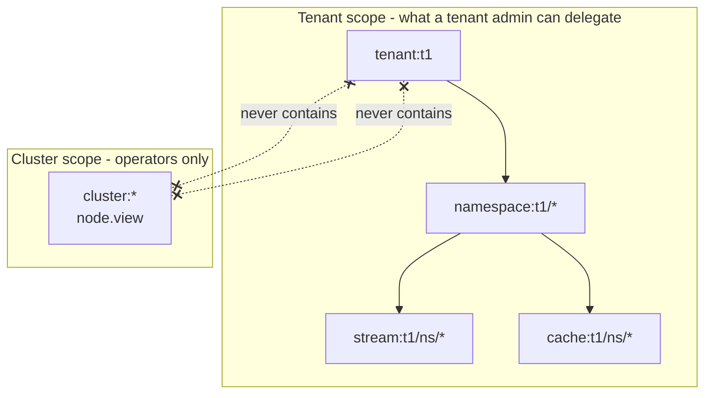

# RBAC Model (Control Plane)

This document describes Felix RBAC mutation and delegation semantics.

## Security Goals

- Keep policy evaluation simple and predictable (allow rules only).
- Prevent privilege escalation by enforcing scope containment at write time.
- Separate RBAC-administration permissions from resource-operation permissions.
- Keep tenant boundaries explicit in every object string.

## Actions

Canonical actions:
- `rbac.view`
- `rbac.policy.manage`
- `rbac.assignment.manage`
- `tenant.manage`
- `ns.manage`
- `stream.manage`
- `cache.manage`
- `stream.publish`
- `stream.subscribe`
- `cache.read`
- `cache.write`
- `group.consume`
- `group.manage`
- `node.view`: cluster-scoped only; see [Cluster scope](#cluster-scope)
- `node.manage`: over `node:{node_id}` or `cluster:*`
- `token.delegate`: over `tenant:{tenant_id}`, to exchange a user's broker
  token for one naming the caller as its actor (`/token/delegate`); not
  implied by `tenant.manage`, and never put in a broker token. See
  [What `token.delegate` allows](#what-tokendelegate-allows)

### What `token.delegate` allows

Grant `token.delegate` only to gateways, and treat its holder as able to act
as any user of the tenant whose broker token reaches it. The holder can turn
such a token into one bound to its own certificate, and then present it over
its own connections with all of the user's permissions until it expires. It
cannot widen a token or make one up: the result is never wider or longer-lived
than the token it came from.

What limits it is which tokens it can delegate. By default only a broker token
whose `may_act` names the caller qualifies, and a token gets `may_act` only
when the exchange that minted it carried that same caller's own
`felix-controlplane` token as `actor_token`. So a gateway can delegate the
tokens minted for it, and not a token taken from a browser, a log or another
gateway. `FELIX_CONTROLPLANE_DELEGATE_UNBOUND_TOKENS=true` lifts that for
tokens with no `may_act`, which lets every holder of `token.delegate` delegate
any such token of the tenant it gets hold of. See
[Delegated tokens](../auth.md#delegated-tokens).

Consumer groups have two actions, granted over the stream's object
(`stream:{tenant_id}/{namespace}/{stream}`) or one group's object
(`group:{tenant_id}/{namespace}/{stream}/{group}`):

- **`group.consume`**: poll, acknowledge, hand back, and list dead letters.
  `stream.subscribe` also grants it.
- **`group.manage`**: redrive or discard a dead letter. `stream.manage` also
  grants it; `stream.subscribe` does not.

The broker applies those implied grants when it checks a request
(`Action::is_granted_by` in `felix-authz`); they are not expanded into tokens,
so they hold for every existing policy. A consumer holding `stream.subscribe`
keeps working its groups. An operator who redrives or discards now needs
`group.manage` or `stream.manage`.

Worth knowing: because `stream.subscribe` implies `group.consume`, a principal
that can read a stream can still poll a group and acknowledge records, which
advances a cursor other consumers share. Making that grant separate would break
every deployment that relies on `stream.subscribe` today, so it is not.

A broker refuses a token carrying an action it does not know, so upgrade brokers
before writing policies that use the group actions.

### Granting one group

To let a principal work only some groups of a stream, grant the action on the
group objects. The broker decides a group action `A` on group `G` of stream `S`
like this (`PermissionMatcher::allows_group` in `felix-authz`):

1. Allowed if a grant of `A`, or of an action that implies it, matches
   `group:{tenant}/{namespace}/{S}/{G}`.
2. Otherwise allowed if such a grant matches `stream:{tenant}/{namespace}/{S}`,
   **unless** the principal holds any grant of `A` (or an action implying it)
   on a `group:` object that could match some group of `S`. Then the principal
   has been scoped to particular groups on `S`, and its stream grants no longer
   reach the other groups there.

So a token with `stream.subscribe:stream:t1/ns/*` and
`group.consume:group:t1/ns/orders/workers` may consume `workers` on `orders`,
may not consume `billing` on `orders`, and may still consume any group of any
other stream in `ns`. Narrowing is per action: that consume grant does not stop
a `stream.manage` grant from covering `group.manage` on every group of `orders`.
A principal with no `group:` grants is unaffected, so existing policies behave
as before.

A group object follows the stream wildcard rule: a `*` only in the last
positions (`group:t1/ns/orders/*`, `group:t1/ns/*/*`), never
`group:t1/ns/*/workers`. A group name containing `/`, `*` or `:` cannot be
named on its own; grant it through the stream or `group:…/{stream}/*`.
A stream, namespace or tenant scope contains the groups under it, so a
delegated admin can grant groups inside what they administer.

### Granting cache keys

A cache grant can name some of a cache's keys instead of the whole cache, by
adding the key as a fourth segment:

- `cache:{tenant}/{namespace}/{cache}/{key}`: exactly that key.
- `cache:{tenant}/{namespace}/{cache}/{prefix}*`: every key starting with
  `prefix`.

A prefix is a literal string prefix with no separator rule. `user:1*` covers
`user:1`, `user:10` and `user:1/x`; to keep `user:10` out, grant `user:1/*` and
key the data that way. Cache names cannot contain `/`, so everything after the
third `/` is the key, and a key may itself contain `/` or `:`.

The broker checks every cache request against its key
(`PermissionMatcher::allows_cache_keys` in `felix-authz`). A request is allowed
if a grant matches the whole cache, as before, or a key grant covers what it
touches:

| Request | Checked against |
| --- | --- |
| get, counter get | its key, with `cache.read` |
| put, delete, conditional put/delete, counter add | its key, with `cache.write` |
| watch on a key | that key, with `cache.read` |
| watch on a prefix | the prefix, with `cache.read`: allowed only by a prefix grant that the watched prefix starts with |

An exact-key grant never allows a prefix watch, even on the same string, since
the watch reads every longer key too. A forwarded cache op is re-checked with
its key at the owning broker.

Rules the control plane enforces on writes:

- The key part is a literal, optionally ending in one `*`. A `*` anywhere else
  is refused, so a key name can never become a pattern. A key that itself
  contains `*` can still be stored and read; it can only be granted through a
  shorter prefix or the whole cache.
- `cache:t1/ns/c/*` and an empty key are refused. That is the whole cache,
  which is spelled `cache:t1/ns/c`.
- The namespace and cache must be named. `cache:t1/ns/*/room1*` is refused for
  the same reason as `stream:t1/*/orders`.
- Only `cache.read` and `cache.write` take a key object.

A whole-cache scope contains every key scope of that cache, and a prefix scope
contains the keys and longer prefixes under it, so a delegated admin can grant
keys inside what they administer, and token exchange narrows a whole-cache
grant to a key or prefix hint (`resources: ["cache:t1/ns/rooms/room1/*"]`).

Key grants do not narrow anything: unlike a group grant, a principal that also
holds a whole-cache grant keeps it.

Mixed versions fail closed. A broker from before key grants checks only
`cache:{tenant}/{namespace}/{cache}`, which a key grant does not match, so it
refuses the request; an older control plane refuses to parse the object.

## Object Grammar

Valid canonical objects:
- `tenant:{tenant_id}`
- `namespace:{tenant_id}/{namespace}`
- `stream:{tenant_id}/{namespace}/{stream}`
- `cache:{tenant_id}/{namespace}/{cache}`
- `cache:{tenant_id}/{namespace}/{cache}/{key}` or `.../{key_prefix}*` (see
  [Granting cache keys](#granting-cache-keys))
- `group:{tenant_id}/{namespace}/{stream}/{group}` (see
  [Granting one group](#granting-one-group))

Allowed wildcards:
- `namespace:{tenant_id}/*`
- `stream:{tenant_id}/{namespace}/*`
- `cache:{tenant_id}/{namespace}/*`
- `stream:{tenant_id}/*/*` and `cache:{tenant_id}/*/*`: every stream or
  cache in the tenant, which is what token exchange expands a tenant-wide
  grant to. A wildcard namespace under a *named* leaf (`stream:t1/*/orders`)
  is refused: a grant across namespaces should not look like a single-stream
  grant.

### Cluster scope

A permission is only writable when its object already sits inside the writer's
own scope. The two crossed links are the whole security property: because no
arrow runs between them, a tenant admin cannot write themselves `cluster:*`, and
cluster scope cannot read tenant data.

One object sits outside the tenant hierarchy:

- Cluster: `cluster:*`, covering broker membership, liveness, and placement standing.

It is an island in both directions, and that is the whole security property:

- **No tenant scope contains it.** A policy write is admitted only when its
  object is already inside the caller's scope, so a tenant admin cannot grant
  themselves `cluster:*`. Nothing in the bootstrap seed grants it either.
- **It contains no tenant object.** Cluster scope confers nothing inside a
  tenant, so it is not a backdoor into tenant data.

`node.view:cluster:*` is required by `GET /v1/nodes` and `GET /v1/nodes/{node_id}`.
The tenant comes from the token's own `tid` claim rather than a path segment,
because the cluster is not a tenant resource; that claim only selects which
tenant's signing keys to verify against, exactly as `kid` selects a key without
conferring one.

`cluster:*` is the only accepted spelling. `cluster:nodes` and a bare `cluster:`
are rejected, so a typo is refused rather than silently scoped.

Rejected on writes:
- `tenant:*`
- `stream:*` / `stream:*/*`
- `cache:*` / `cache:*/*`
- any malformed or cross-tenant object

HTTP semantics:
- `400` invalid grammar/action/payload
- `401` missing or invalid bearer token
- `403` caller authenticated but lacks required scope/action

## Delegated RBAC Admin

RBAC endpoints are authorized only by RBAC admin actions:
- list policies/groupings: `rbac.view`
- mutate policies: `rbac.policy.manage`
- mutate assignments: `rbac.assignment.manage`

Delegation safety rule:
- Caller can only mutate policies/assignments whose target objects are within the caller's scope.
- Caller cannot assign a role if any policy on that role exceeds caller scope.

Admin scope examples:
- `rbac.policy.manage:tenant:t1`
  - can create `namespace:t1/*`, `stream:t1/payments/*`, `cache:t1/payments/sessions`
  - cannot create `tenant:*` or any `t2` object
- `rbac.policy.manage:namespace:t1/payments`
  - can create stream/cache policies only under `payments`
  - cannot create `namespace:t1/orders` or `tenant:t1`
- `rbac.policy.manage:stream:t1/payments/orders`
  - can only manage that single stream object
  - cannot create `stream:t1/payments/*`

Examples:
- `rbac.policy.manage:namespace:t1/payments` can manage rules in `payments` only.
- `rbac.policy.manage:stream:t1/payments/orders` cannot grant `stream:t1/payments/*`.
- `rbac.policy.manage:tenant:t1` can manage tenant `t1` RBAC, but still cannot use `tenant:*`.

## Notes

- Strict grammar is enforced for RBAC evaluation and writes.
- Group-claim RBAC is evaluated at token exchange by materializing transient
  `principal -> group:<issuer>#<claim value>` links before Casbin permission
  expansion. The issuer is the validated token's `iss`, so one IdP cannot
  assert another's groups, and a tenant admin who registers an IdP cannot
  claim the operators' groups. The prefix is always added, so a claim value
  that itself starts with `group:` cannot stand in for the bare group of the
  same name. Migrating bare `group:<name>` groupings is covered in
  [auth.md](../auth.md#upgrading-to-scoped-groups-and-audiences).
- A token exchange can narrow what these rules grant but never add to it.
  Its `permissions` pairs use the same `action:object` grammar as a rule, and
  each is cut down to the grants with exactly its action. See
  [auth.md](../auth.md#narrowing-by-pairs).
- Rules can be removed as well as added (`DELETE .../rbac/policies`,
  `DELETE .../rbac/groupings`), under the same scope rules as adding them.
- `felixctl rbac policy|grouping ls|add|rm` wraps these endpoints, and checks
  a policy object against the grammar above before sending it.
